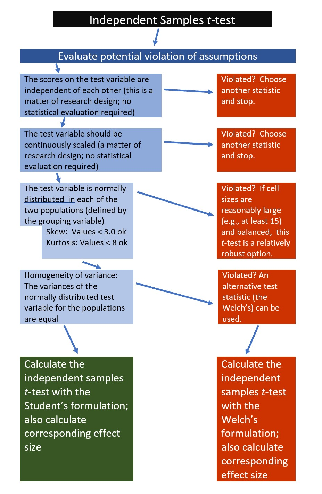

# Independent Samples *t* test {#tIndSample}

[Screencasted Lecture Link](https://spu.hosted.panopto.com/Panopto/Pages/Viewer.aspx?pid=844ba297-e9ce-48cc-a49f-af01012b7900) 
 
```{r  include=FALSE, tidy=TRUE, tidy.opts=list(width.cutoff=70)}
knitr::opts_chunk$set(echo = TRUE)
knitr::opts_chunk$set(comment = NA) #keeps out the hashtags in the knits
```

```{r tidy=TRUE, tidy.opts=list(width.cutoff=70)}
options(scipen=999)#eliminates scientific notation
```

Researchers may wish to know if there are differences on a given outcome variable as a result of a dichotomous grouping variable. For example, during the COVID-19 pandemic, my research team asked if there were differences in the percentage of time that individuals wore facemasks as a result of 2020 Presidential voting trends (Republican or Democratic) of their county of residence. In these simple designs, the independent samples *t* test could be used to test the researchers' hypotheses.

## Navigating this Lesson

There is just less than one hour of lecture.  If you work through the materials with me, plan for an additional hour

While the majority of R objects and data you will need are created within the R script that sources the chapter, occasionally there are some that cannot be created from within the R framework. Additionally, sometimes links fail.  All original materials are provided at the [Github site](https://github.com/lhbikos/ReCenterPsychStats) that hosts the book. More detailed guidelines for ways to access all these materials are provided in the OER's [introduction](#ReCintro)

### Learning Objectives

Learning objectives from this lecture include the following:

* Recognize the research questions for which utilization of the independent samples *t* test would be appropriate.
* Narrate the steps in conducting an independent samples *t* test, beginning with testing the statistical assumptions through writing up an APA style results section.
* Calculate an independent samples *t* test in R (including effect sizes and 95%CIs).
* Interpret a 95% confidence interval around a mean difference score.
* Produce an APA style results for an independent samples *t* test.
* Determine a sample size that (given a set of parameters) would likely result in a statistically significant effect, if there was one. 

### Planning for Practice

The suggestions for homework vary in degree of complexity. The more complete descriptions at the end of the chapter follow these suggestions.

* Rework the independent samples *t* test in the lesson by changing the random seed in the code that simulates the data.  This should provide minor changes to the data, but the results will likely be very similar.
* Rework the independent samples *t* test in the lesson by changing something else about the simulation. For example, if you are interested in power, consider changing the sample size.
* Use the simulated data that is provided, but use the nonverbal variable, instead.
* Conduct  an independent samples *t* test with data to which you have access and permission to use. This could include data you simulate on your own or from a published article.

### Readings & Resources

In preparing this chapter, I drew heavily from the following resource(s). Other resources are cited (when possible, linked) in the text with complete citations in the reference list.

* Navarro, D. (2020). Chapter 13: Comparing two means. In [Learning Statistics with R - A tutorial for Psychology Students and other Beginners](https://learningstatisticswithr.com/). Retrieved from https://stats.libretexts.org/Bookshelves/Applied_Statistics/Book%3A_Learning_Statistics_with_R_-_A_tutorial_for_Psychology_Students_and_other_Beginners_(Navarro)
  - Navarro's OER includes a good mix of conceptual information about *t* tests as well as R code. My lesson integrates her approach as well as considering information from Field's [-@field_discovering_2012] and Green and Salkind's [-@green_using_2014] texts (as well as searching around on the internet).
* Elliott, A. M., Alexander, S. C., Mescher, C. A., Mohan, D., & Barnato, A. E. (2016). Differences in Physicians’ Verbal and Nonverbal Communication With Black and White Patients at the End of Life. *Journal of Pain and Symptom Management, 51*(1), 1–8. https://doi.org/10.1016/j.jpainsymman.2015.07.008
  - The source of our research vignette.

### Packages

The script below will (a) check to see if the following packages are installed on your computer and, if not (b) install them.
```{r  tidy=TRUE, tidy.opts=list(width.cutoff=70)}
#will install the package if not already installed
#if(!require(psych)){install.packages("psych")}
#if(!require(tidyverse)){install.packages("tidyverse")}
#if(!require(dplyr)){install.packages("dplyr")}
#if(!require(lsr)){install.packages("lsr")}
#if(!require(ggpubr)){install.packages("ggpubr")}
#if(!require(pwr)){install.packages("pwr")}
#if(!require(car)){install.packages("car")}
#if(!require(apaTables)){install.packages("apaTables")}
#if(!require(knitr)){install.packages("knitr")}
```

## Introducing the Independent Samples *t* Test

The independent samples *t*-test assesses whether the population mean of the test variable for one group differs from the population mean of the test variable for a second group. This *t* test can only accommodate two levels of a grouping variable (e.g., teachers/students, volunteers/employees, treatment/control) and the participants must be different in each group.    


The comparison of two means is especially evident in the numerator of the formula. In the denominator we can see that the mean difference is adjusted by the standard error. At the outset, you should know that the formula in the denominator gets messy, but the formula, alone, provides an important conceptual map. 

$$t = \frac{\bar{X}_1 - \bar{X}_2}{\mbox{SE}}$$
If the researcher is interested in comparing the same participants' experiences across time or in different groups, they should consider using a [paired samples *t*-test](#tPaired). Further, the independent samples *t*-test is limited to a grouping variable with only two levels. If the researcher is interested in three or more levels, they should consider using a [one-way ANOVA](#oneway).

### Workflow for Independent Samples *t* test

The following is a proposed workflow for conducting a independent samples *t*-test.

 
If the data meets the assumptions associated with the research design (e.g., independence of observations and a continuously scaled metric), these are the steps for the analysis of an independent samples *t* test:

1. Prepare (upload) data.
2. Explore data with
   - graphs
   - descriptive statistics
3. Assess normality via skew and kurtosis
4. Consider the homogeneity of variance assumption and decide whether to use the Student's or Welch's formulation.
5. Compute the independent samples *t*-test
6. Compute an effect size (frequently the *d* or *eta* statistic)
7. Manage Type I error
8. Sample size/power analysis (which you should think about first, but in the context of teaching statistics, it's more pedagogically sensible, here).

## Research Vignette

Empirically published articles where *t* tests are the primary statistic are difficult to locate. Having exhausted the psychology archives, I located this article in an interdisciplinary journal focused on palliative medicine. The research vignette for this lesson examined differences in physician's verbal and nonverbal communication with Black and White patients at the end of life [@elliott_differences_2016]. 

Elliott and colleagues [-@elliott_differences_2016] were curious to know if hospital-based physicians (56% White, 26% Asian, 7.4% each Black and Hispanic) engaged in verbal and nonverbal communication differently with Black and White patients. Black and White patient participants were matched on characteristics deemed important to the researchers (e.g., critically and terminally ill, prognostically similar, expressed similar treatment preferences). Interactions in the intensive care unit were audio and video recorded and then coded on dimensions of verbal and nonverbal communication.

Because each physician saw a pair of patients (i.e., one Black patient and one White patient), the researchers utilized a paired samples, or dependent *t*-test. This statistical choice was consistent with the element of the research design that controlled for physician effects through matching. Below are the primary findings of the study.


|                |Black Patients |White Patients |         |
|:---------------|:--------------|:--------------|:--------|
|Category        |*Mean*(*SD*)   |*Mean*(*SD*)      |*p*-value|
|Verbal skill score (range 0 - 27)|8.37(3.36) | 8.41(3.21) |0.958|
|Nonverbal skill score (range 0 - 5) |2.68(.84) | 2.93(.77)|0.014|


Although their design was more sophisticated (and, therefore, required the paired samples *t*-test), Elliott et al. [-@elliott_differences_2016] could have simply compared the outcome variables (e.g., verbal and nonverbal communication) as a function of their dichotomous variable, patient race (Black, White). 

In the data below, I have simulated the verbal and non-verbal communication variables using the means and standard deviations listed in the article. Further, I truncated them to fit within the assigned range. I created 33 sets each and assigned them to the Black or White level of the grouping variable.

```{r tidy=TRUE, tidy.opts=list(width.cutoff=70)}
set.seed(220815)
#sample size, M, and SD for Black then White patients
Verbal <- c(rnorm(33, mean=8.37, sd=3.36), rnorm(33, mean = 8.41, sd=3.21))
#set upper bound 
Verbal[Verbal>27]<-27
#set lower bound 
Verbal[Verbal<0]<-0
#sample size, M, and SD for Black then White patients
Nonverbal <- c(rnorm(33, mean=2.68, sd=.84), rnorm(33, mean = 2.93, sd=.77))
#set upper bound 
Nonverbal[Nonverbal>5]<-5
#set lower bound 
Nonverbal[Nonverbal<0]<-0

ID<-factor(seq(1,66)) 
#name factors and identify how many in each group; should be in same order as first row of script
PatientRace<-c(rep("Black", 33), rep("White", 33))
#groups the 3 variables into a single df:  ID#, DV, condition
dfIndSamples <-data.frame(ID, PatientRace, Verbal, Nonverbal) 
```

With our data in hand, let's inspect its structure (i.e., the measurement scales for the variables) to see if they are appropriate.

```{r tidy=TRUE, tidy.opts=list(width.cutoff=70)}
str(dfIndSamples)
```
The verbal and nonverbal variables are quasi-interval scale variables. Therefore, the numerical scale is correctly assigned by R.  In contrast, patient race is a nominal variable and should be a factor. In their article, Elliot et al. [-@elliott_differences_2016] assigned Black as the baseline variable and White as the comparison variable. Because R orders factors alphabetically, and "Black" precedes "White", this would happen automatically. Because creating ordered factors is a useful skill, I will write out the full code.

```{r tidy=TRUE, tidy.opts=list(width.cutoff=70)}
dfIndSamples$PatientRace <- factor(dfIndSamples$PatientRace, levels = c("Black", "White"))
```

Let's again check the formatting of the variables:

```{r tidy=TRUE, tidy.opts=list(width.cutoff=70)}
str(dfIndSamples)
```
The four variables of interest are now correctly formatted as *num* and *factor*. 

Below is code for saving (and then importing) the data in .csv or .rds files. I make choices about saving data based on what I wish to do with the data. If I want to manipulate the data outside of R, I will save it as a .csv file. It is easy to open .csv files in Excel. A limitation of the .csv format is that it does not save any restructuring or reformatting of variables. For this lesson, this is not an issue. 

Here is code for saving the data as a .csv and then reading it back into R. I have hashtagged these out, so you will need to remove the hashtags if you wish to run any of these operations.
```{r tidy=TRUE, tidy.opts=list(width.cutoff=70)}
#writing the simulated data as a .csv 
#write.table(dfIndSamples, file = "dfIndSamples.csv", sep = ',', col.names=TRUE, row.names=FALSE) 
#at this point you could clear your environment and then bring the data back in as a .csv
#reading the data back in as a .csv file
#dfIndSamples<- read.csv ('dfIndSamples.csv', header = TRUE)
```

The .rds form of saving variables preserves any formatting (e.g., creating ordered factors) of the data. A limitation is that these files are not easily opened in Excel. Here is the hashtagged code (remove hashtags if you wish to do this) for writing (and then reading) this data as an .rds file.

```{r tidy=TRUE, tidy.opts=list(width.cutoff=70)}
#saveRDS(dfIndSamples, 'dfIndSamples.rds')
#dfIndSamples <- readRDS('dfIndSamples.rds')
#str(dfIndSamples)
```

## Working the Problem

### Stating the Hypothesis

In this lesson, I will focus on differences in the verbal communication variable. Specifically, I hypothesize that physician verbal communication scores for Black and White patients will differ. In the hypotheses below, the null hypothesis ($H_0$) states that the two means are equal; the alternative hypothesis ($H_A$) states that the two means are not equal.

$$
\begin{array}{ll}
H_0: & \mu_1 = \mu_2  \\
H_A: & \mu_1 \neq \mu_2
\end{array}
$$

### Preliminary Exploration

Plotting the data is a helpful early step in any data analysis. The *ggpubr* package is one of my go-to-tools for quick and easy plots of data. Boxplots are terrific for data that is grouped. A helpful [tutorial](https://rpkgs.datanovia.com/ggpubr/) for boxplots (and related plots) can be found at datanovia.

In the code below I introduced the colors by identifying the grouping variable and assigning colors. Those color codes are the "Hex" codes you find in the custom color palette in your word processing program.

I am also fond of plotting each case with the command, *add = "jitter"*. To increase your comfort and confidence in creating figures (and with other tools) try deleting and adding back in different commands. This is how to distinguish between the essential and the elective.

```{r tidy=TRUE, tidy.opts=list(width.cutoff=70)}
ggpubr::ggboxplot(dfIndSamples, x = "PatientRace", y = "Verbal", color = "PatientRace", palette =c("#00AFBB", "#FC4E07"), add = "jitter")
```
The box of the boxplot covers the middle 50% (the interquartile range). The horizontal line is the median. The whiskers represent three standard deviations above and below the mean. Any dots are outliers.

We can begin to evaluate the assumption of normality by obtaining the descriptive statistics with the *describe()* function from the *psych* package.
```{r tidy=TRUE, tidy.opts=list(width.cutoff=70)}
psych::describe(dfIndSamples$Verbal)
```

From this, we learn that the overall verbal mean is 8.25 with a standard deviation of 3.14. The values for skew (0.43) and kurtosis (1.21) fall below the areas of concern (below the absolute value of 3 for skew; below the absolute values of 8 for kurtosis) identified by Kline [-@kline_principles_2016].

Recall that one of the assumptions for independent samples *t*-test is that the variable of interest is normally distributed within each level of the grouping variable.  The *describeBy()* function in the *psych* package allows us to obtain these values for each level of the grouping variable.

If we feed the function the entire df, it will give us results for each level of PatientRace for each variable, including variables for which such disaggregation is nonsensible (i.e., physID, PatientRace). If we had a large df, we might want to create a tiny df that only includes our variable(s) of interest. For now, it is not problematic to include all the variables.

```{r tidy=TRUE, tidy.opts=list(width.cutoff=70)}
psych::describeBy(dfIndSamples, group="PatientRace", mat=TRUE)
```
In this analysis we are interested in the verbal variable. We see that patients who are Black received verbal interactions from physicians that were quantified by a mean score of 7.61 (*SD* = 2.99); physicians' scores for White patients were 8.89 (*SD* = 3.20). Skew and kurtosis values for the verbal ratings with Black patients were -.35 and -.31, respectively. They were 1.02 and 1.27 for White patients. As before, these fall well below the absolute values of 3 (skew) and 8 (kurtosis) that are considered to be concerning.

One of the assumptions of the independent samples *t*-test is that the variances of the dependent variable are similar for both levels of the grouping factor. We can use the Levene's test to do this. We want this value to be non-significant ($p$ > .05). If violated, we we can use the Welch's test because it is "robust to the violation of the homogeneity of variance."

In R, Levene's test is found in the *car* package.

```{r tidy=TRUE, tidy.opts=list(width.cutoff=70)}
car::leveneTest (Verbal ~ PatientRace, dfIndSamples, center=mean)
```
The results of the Levene's test are presented as an *F* statistic. We'll get to *F* distributions in the next chapter. For now, it is just important to know how to report and interpret them: 

* Degrees of freedom are 1 and 64 
* The value of the *F* statistic is 0.142
* We want our *p* value to be > .05

Happily, our Levene's result is (*F*[1, 64] = 0.142, *p* = .707) not significant. Because *p* is greater than 05, we have not violated the homogeneity of variance assumption. That is to say, the variance in each of the patient race groups is not statistically significantly different. we can use the regular (Student's) formulation of the *t* test for independent samples.

### Hand-Calculations

Earlier I presented a formula for the independent samples *t*-test.

$$t = \frac{\bar{X}_1 - \bar{X}_2}{\mbox{SE}}$$
There are actually two formulations of the *t*-test. Student's version can be used when there is no violation of the homogeneity of variance assumption; Welch's can be used when the homogeneity of variance assumption is violated. For the hand-calculation demonstration, I will only demonstrate the formula in the most ideal of circumstances, that is: there is no violation of the homogeneity of variance assumption and sample sizes are equal.

Even so, while the formula seems straightforward enough, calculating the SE in the denominator gets a little spicy:

$$t = \frac{\bar{X_{1}} -\bar{X_{2}}}{\sqrt{\frac{s_{1}^{2}}{N_{1}}+\frac{s_{2}^{2}}{N_{2}}}}$$
Let's first calculate the SE -- the value of the denominator. For this, we need the standard deviations for the dependent variable (verbal) for both levels of patient race. We obtained these earlier when we used the *describeBy()* function in the *psych* package.

The standard deviation of the verbal variable for the levels in the patient race group were 2.99 for Black patients and 3.20 for White patients; the *N* in both our groups is 33. We can do the denominator math right in an R chunk:
```{r tidy=TRUE, tidy.opts=list(width.cutoff=70)}
sqrt((2.985^2/33) + (3.203^2/33))
```
Our *SE* = 0.762

With the simplification of the denominator, we can easily calculate the independent sample *t*-test.

$$t = \frac{\bar{X_{1}} -\bar{X_{2}}}{SE}$$
```{r tidy=TRUE, tidy.opts=list(width.cutoff=70)}
(7.615 - 8.891)/0.762
```
Hopefully, this hand-calculation provided an indication of how the means, standard deviation, and sample sizes contribute to the estimate of this *t* test value.  Now we ask, "But it is statistically significant?"

#### Statistical Significance

The question of statistical significance testing invokes NHST (null hypothesis significance testing). In the case of the independent samples *t*-test, the null hypothesis is that the two means are equal; the alternative is that they are not equal. Our test is of the null hypothesis. When the probability (*p*) is less than the value we specify (usually .05), we are 95% certain that the two means are not equal. Thus, we reject the null hypothesis (the one we tested) in favor of the alternative (that the means are not equal).

$$
\begin{array}{ll}
H_0: & \mu_1 = \mu_2  \\
H_A: & \mu_1 \neq \mu_2
\end{array}
$$
Although still used, NHST has its critiques. Among the critiques are the layers of logic and confusing language as we interpret the results.

Our *t*-value was -1.675. We compare this value to the test critical value in a table of *t* critical values. In-so-doing we must know our degrees of freedom. In the test that involves two levels of a grouping value, we will use $N -1$ as the value for degrees of freedom. We must also specify the *p* value (in our case .05) and whether-or-not our hypothesis is unidirectional or bi-directional. Our question only asked, "Are the verbal communication levels different?" In this case, the test is two-tailed, or bi-directional.

Let's return to the [table of critical values](https://www.statology.org/t-distribution-table/) for the *t* distribution to compare our *t*-value (-1.675) to the column that is appropriate for our:

* Degrees of freedom (in this case $N-2$ or 64)
  - We have two levels of a grouping value; for each our df is $N-1$
* Alpha, as represented by $p < .05$
* Specification as a one-tailed or two-tailed test
  - Our alternative hypothesis made no prediction about the direction of the difference; therefore we will use a two-tailed test
  
In the linked table, when the degrees of freedom reaches 30, there larger intervals. We will use the row representing degrees of freedom of 60. If our *t* test value is lower than an absolute value of -2 or greater than the absolute value of 2, then our means are statistically significantly different from each other. In our case, we have not achieved statistical significance and we cannot say that the means are different. The *t* string would look like this:  $t(64) = -1.675, p > .05$

We can also use the *qt()* function in base R. In the script below, I have indicated an alpha of .05. The "2" that follows indicates I want a two-tailed test. The 64 represents my degrees of freedom ($N-2$). In a two-tailed test, the regions of rejection will be below the lowerbound (lower.tail=TRUE) and above the upperbound (lower.tail=FALSE).

```{r tidy=TRUE, tidy.opts=list(width.cutoff=70)}
qt(.05/2, 64, lower.tail=TRUE)
qt(.05/2, 64, lower.tail=FALSE)
```
Given the large intervals, it makes sense that this test critical value is slightly different than the one from the table.

#### Confidence Intervals

How confident are we in our result? With independent samples *t*-tests, it is common to report an interval in which we are 95% confident that our true mean difference exists. Below is the formula, which involves:

* $\bar{X_{1}}-\bar{X_{2}}$ the difference in the means
* $t_{cv}$ the test critical value for a two-tailed model (even if the hypothesis was one-tailed) where $\alpha = .05$ and the degrees of freedom are $N-2$
* $SE$ the standard error used in the denominator of the test statistic

$$(\bar{X_{1}} -\bar{X_{2})} \pm  t_{cv}(SE)$$
Let's calculate it:

First, let's get the proper *t* critical value. Even though these are identical to the one above, I am including them again. Why? Because if the original hypothesis had been one-tailed, we would need to calculate a two-tailed confidence interval; this is a placeholder to remind us.

```{r tidy=TRUE, tidy.opts=list(width.cutoff=70)}
qt(.05/2, 64, lower.tail=TRUE)
qt(.05/2, 64, lower.tail=FALSE)
```
With this in hand, let's calculate the confidence intervals.

```{r tidy=TRUE, tidy.opts=list(width.cutoff=70)}
(7.614-8.891)- (1.99773*0.762)
(7.614-8.891)+(1.99773*0.762)
```
These values indicate the range of scores in which we are 95% confident that our true mean difference ($\bar{X_{1}}-\bar{X_{2}}$) lies. Stated another way, we are 95% confident that the true mean difference lies between -2.80 and 0.25 Because this interval crosses zero, we cannot rule out that the true mean difference is 0.00. This result is consistent with our non-significant *p* value. For these types of statistics, the 95% confidence interval and *p* value will always be yoked together. 


#### Effect Size

Whereas *p* values address statistical significance, effect sizes address the magnitude of difference. There are two common effect sizes that are used with the independent samples *t*-test.  The first is the *d* statistic, which measures, in standard deviation units, the distance between the two means.  The simplest formula involves the *t* value and sample sizes:

$$d = t\sqrt{\frac{N_{1}+N_{2}}{N_{1}N_{2}}}$$

With a *t* value of -1.675 and sample sizes at 33 each, we can easily calculate this. Small, medium, and large sizes for the *d* statistic are .2, .5, and .8, respectively (irrespective of sign).

```{r tidy=TRUE, tidy.opts=list(width.cutoff=70)}
-1.675*(sqrt((33+33)/(33*33)))
```
Our value, -0.412 suggests a small-to-medium effect size. We might wonder why it wasn't statistically significant? Later we will discuss power and the relationship between sample size, one vs. two-tailed hypotheses, and effect sizes.

Eta square, $\eta^2$ is the proportion of variance of a test variable that is a function of the grouping variable. A value of 0 indicates that the difference in the mean scores is equal to 0, where a value of 1 indicates that the sample means differ, and the test scores do not differ within each group. The following equation can be used to compute $\eta^2$. Conventionally, values of .01, .06, and .14 are considered to be small, medium, and large effect sizes, respectively.

$$\eta^{2} =\frac{t^{2}}{{t^{2}+(N_{1}+N_{2}-2)}}$$
Let's calculate it:

```{r tidy=TRUE, tidy.opts=list(width.cutoff=70)}
(-1.6745*-1.6745)/((-1.6745*-1.6745)+(33 + 33 -2))
```
Similarly, the $\eta^2$ is small-to-medium.


## Computation in R

Navarro's *lsr* package makes the computation of the independent *t*-test easy and produces output that is commonly used in psychological science.

```{r tidy=TRUE, tidy.opts=list(width.cutoff=70)}
lsr::independentSamplesTTest(
  formula = Verbal ~PatientRace,
  data = dfIndSamples,
  var.equal=TRUE
)
```
This well-organized output has everything we need for an APA style presentation of results. Identical to all the information we hand-calculated, we would write the *t* string this way:  $t(64) = -1.675, p = .099, d = 0.412$. The *lsr* output also includes confidence intervals. These represent the 95% confidence interval of the true difference between the means. That is, we are 95% confident that the true difference between means could be as large as -2.799 or as (small/medium/large) as 0.246. What is critically important is that this confidence interval crosses zero. There is an important link between the CI95% and statistical significance. When the CI95% includes zero, *p* will not be lower than 0.05.  

### What if we had violated the homogeneity of variance assumption?

Earlier we used the Levene's test to examine the homogeneity of variance assumption. If we had violated it, the Welch's formulation of the independent sample *t* test is available to us. Navarro's *lsr* package makes this easy. We simply change the *var.equal* to *FALSE*. This will produce the Welch's alternative, which takes into consideration violations of the homogeneity of variance assumption. Conveniently, "Student's" or "Welch's" will serve as the first row of the output.

```{r tidy=TRUE, tidy.opts=list(width.cutoff=70)}
lsr::independentSamplesTTest(
  formula = Verbal ~PatientRace,
  data = dfIndSamples,
  var.equal=FALSE
)
```
Likely because of the similarity of the standard deviations associated with each level of patient race and our equal cell sizes, this changes nothing about our conclusion. Note that the degrees of freedom in the Student's *t*-test analysis (the first one) was 64; in the Welch's version, the degrees of freedom is 63.685. It is this change that, when the homogeneity of variance assumption is violated, can make the Welch's results more conservative (i.e., less likely to have a statistically significant result).

## APA Style Results

>An independent samples *t*-test was conducted to evaluate the hypothesis that there would be differences between the quality of physicians' verbal communication depending on whether the patient's race (Black, White). Although the independent samples *t*-test was nonsignificant, *t*(64) = -1.675, *p* = .099, the effect size (*d* = 0.412) was somewhat moderate in size. The 95% confidence interval for the difference in means ranged from -2.799 to 0.246. Means and standard deviations are presented in Table 1; the results are illustrated in Figure 1.

```{r tidy=TRUE, tidy.opts=list(width.cutoff=70)}
apaTables::apa.1way.table(PatientRace, Verbal, dfIndSamples)
```
```{r tidy=TRUE, tidy.opts=list(width.cutoff=70)}
ggpubr::ggboxplot(dfIndSamples, x = "PatientRace", y = "Verbal", color = "PatientRace", palette =c("#00AFBB", "#FC4E07"), add = "jitter", title = "Figure 1. Physician Verbal Engagement as a Function of Patient Race")
```

## Power in Independent Samples *t* tests

Researchers often use power analysis packages to estimate the sample size needed to detect a statistically significant effect, if, in fact, there is one. Utilized another way, these tools allows us to determine the probability of detecting an effect of a given size with a given level of confidence. If the probability is unacceptably low, we may want to revise or stop. A helpful overview of power as well as guidelines for how to use the *pwr* package can be found at a [Quick-R website](https://www.statmethods.net/stats/power.html) [@kabacoff_power_2017].

In Champely's *pwr* package, we can conduct a power analysis for a variety of designs, including the independent samples *t* test that we worked in this lesson. There are a number of interrelating elements of power:

* Sample size, *n* refers to the number of observations in each group; our vignette had 33
* *d* refers to the difference between means divided by the pooled standard deviation; we can add the final number or the elements required (and have R do the math for us)
* *power* refers to the power of a statistical test; conventionally it is set at .80
* *sig.level* refers to our desired alpha level; conventionally it is set at .05
* *type* indicates the type of test we ran; this was "two.sample"
* *alternative* refers to whether the hypothesis is non-directional/two-tailed ("two.sided") or directional/one-tailed("less" or "greater")
 
In this script, we must specify *all-but-one* parameter; the remaining parameter must be defined as NULL. R will calculate the value for the missing parameter.

When we conduct a "power analysis" (i.e., the likelihood of a hypothesis test detecting an effect if there is one), we specify, "power=NULL". Using the data from our results, we learn from this first run, that our statistical power was 0.99. That is, given the value of the mean difference (1.276) we had a 99% chance of detecting a statistically significant effect if there was one.


```{r tidy=TRUE, tidy.opts=list(width.cutoff=70)}
pwr::pwr.t.test(d= (7.615 - 8.891)/0.762,n = 33, power=NULL,sig.level=0.05,type="two.sample",alternative="two.sided")
```
Researchers frequently use these tools to estimate the sample size required to obtain a statistically significant effect. In these scenarios we set *n* to *NULL*. Using the results from the simulation of our research vignette, you can see that we would have needed 7 individuals (per group; 14 total) for the *p* value to be < .05.

```{r tidy=TRUE, tidy.opts=list(width.cutoff=70)}
pwr::pwr.t.test(d= ((7.615 - 8.891)/0.762),n = NULL, power=0.8,sig.level=0.05,type="two.sample",alternative="two.sided")
```
Given that we had a non-significant result, this is surprising. None-the-less, let's try it again. Below I will re-simulate the data for the verbal scores and change only the sample size:

```{r tidy=TRUE, tidy.opts=list(width.cutoff=70)}
set.seed(220821)
#sample size, M, and SD for Black then White patients
rVerbal <- c(rnorm(7, mean=8.37, sd=3.36), rnorm(7, mean = 8.41, sd=3.21))
#set upper bound 
rVerbal[rVerbal>27]<-3
#set lower bound 
rVerbal[rVerbal<0]<-0
#sample size, M, and SD for Black then White patients
rNonverbal <- c(rnorm(7, mean=2.68, sd=.84), rnorm(7, mean = 2.93, sd=.77))
#set upper bound 
rNonverbal[rNonverbal>5]<-5
#set lower bound 
rNonverbal[rNonverbal<0]<-0

rID<-factor(seq(1,14)) 
#name factors and identify how many in each group; should be in same order as first row of script
rPatientRace<-c(rep("Black", 7), rep("White", 7))
#groups the 3 variables into a single df:  ID#, DV, condition
rdfIndSamples <-data.frame(rID, rPatientRace, rVerbal, rNonverbal) 

rdfIndSamples$rPatientRace <- factor(rdfIndSamples$rPatientRace, levels = c("Black", "White"))
```

```{r tidy=TRUE, tidy.opts=list(width.cutoff=70)}
lsr::independentSamplesTTest(
  formula = rVerbal ~rPatientRace,
  data = rdfIndSamples,
  var.equal=TRUE
)
```
Not surprisingly, this did not result in a statistically significant result:  $t(12) = 0.095, p = 0.9267, d = 0.051, CI95%[-4.696, 5.123]$. It does show us, though, how power is infuenced by sample size. Holding all else equal, the larger the sample, the more likely we are to have a statistically significant result.

## Practice Problems

The suggestions for homework differ in degree of complexity. I encourage you to start with a problem that feels "do-able" and then try at least one more problem that challenges you in some way. Regardless, your choices should meet you where you are (e.g., in terms of your self-efficacy for statistics, your learning goals, and competing life demands).

### Problem #1: Rework the research vignette as demonstrated, but change the random seed

If this topic feels a bit overwhelming, simply change the random seed in the data simulation of the research vignette, then rework the problem. This should provide minor changes to the data (maybe even in the second or third decimal point), but the results will likely be very similar. That said, don't be alarmed if what was non-significant in my working of the problem becomes significant. Our selection of *p* < .05 (and the corresponding 95% confidence interval) means that 5% of the time there could be a difference in statistical significance.

### Problem #2:  Rework the research vignette, but change something about the simulation

Rework the independent samples *t* test in the lesson by changing something else about the simulation. You might have noticed that my re-simulation of a smaller sample size did not produce a statistically significant result. You may wish to pick a value in between the primary lecture *N* and the re-simulation to see what it takes to achieve statistical significance. Alternatively, you could specify different means and/or standard deviations.

### Problem #3:  Rework the research vignette, but swap one or more variables

Use the simulated data, but select the nonverbal communication variables that were evaluated in the Elliott et al. [-@elliott_differences_2016]study.  Compare your results to those reported in the mansucript.

### Problem #4:  Use other data that is available to you

Using data for which you have permission and access (e.g.,  IRB approved data you have collected or from your lab; data you simulate from a published article; data from an open science repository; data from other chapters in this OER), complete an independent samples *t* test. 

Regardless which option(s) you chose, use the elements in the grading rubric to guide you through the practice.

|Assignment Component                    | Points Possible   | Points Earned|
|:-------------------------------------- |:----------------: |:------------:|
|1. Narrate the research vignette, describing the variables and their role in the analysis | 5 |_____  |
|2. Simulate (or import) and format data |      5            |_____  |           
|3. Evaluate statistical assumptions     |      5            |_____  |
|4. Conduct an independent samples *t* test (with an effect size and 95%CIs) |5 | _____  |  
|5. APA style results with table(s) and figure  |    5  |_____  |       
|6 Explanation to grader                 |      5        |_____  |
|**Totals**                              |      30      |_____  |          

```{r include=FALSE}
sessionInfo()
```


