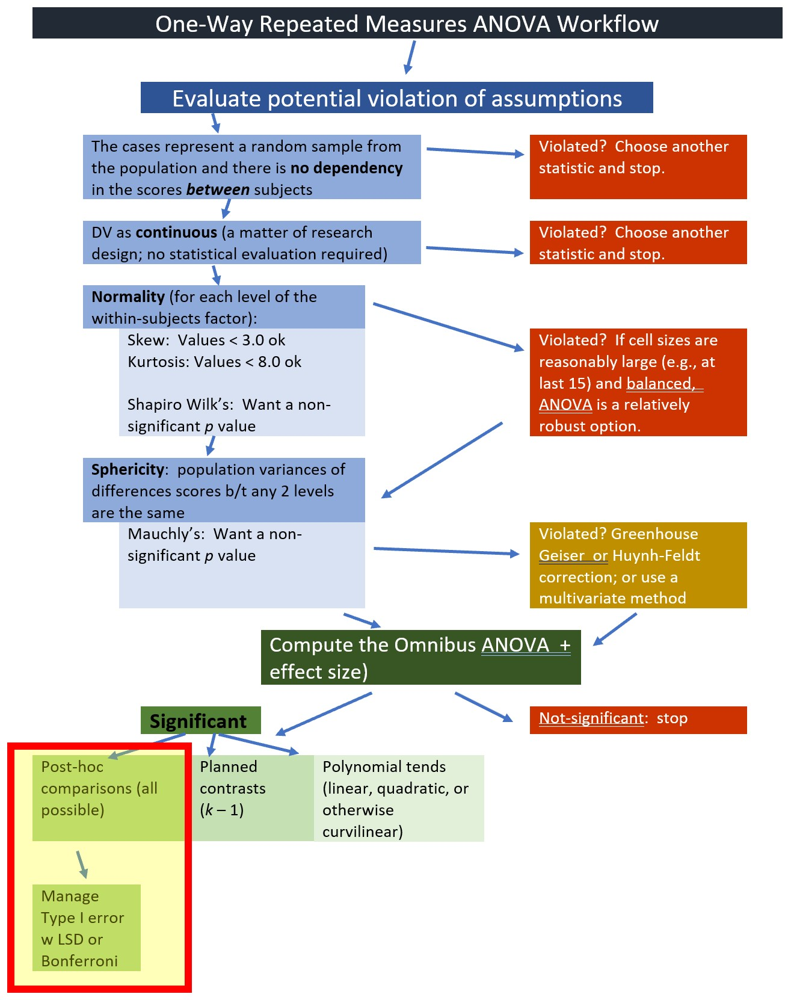

# One-Way Repeated Measures ANOVA {#Repeated}

 [Screencasted Lecture Link](https://spu.hosted.panopto.com/Panopto/Pages/Viewer.aspx?pid=c8f5737f-d00d-4fa4-ba3c-ad8b01762258) 
 
```{r include=FALSE}
knitr::opts_chunk$set(echo = TRUE)
knitr::opts_chunk$set(comment = NA) #keeps out the hashtags in the knits
options(scipen=999)#eliminates scientific notation
```

In the prior lessons, a critical assumption is that the observations must be "independent." That is, related people (partners, parent/child, manager/employee) cannot comprise the data and there cannot be multiple waves of data for the same person. Repeated measures ANOVA is created specifically for this *dependent* purpose. This lessons focuses on the one-way repeated measures ANOVA, where we measure changes across time.

## Navigating this Lesson

There is just over one hour of lecture. If you work through the materials with me plan for an additional two hours

While the majority of R objects and data you will need are created within the R script that sources the chapter, occasionally there are some that cannot be created from within the R framework. Additionally, sometimes links fail. All original materials are provided at the [Github site](https://github.com/lhbikos/ReCenterPsychStats) that hosts the book. More detailed guidelines for ways to access all these materials are provided in the OER's [introduction](#ReCintro)

### Learning Objectives

Learning objectives from this lecture include the following:

* Evaluate the suitability of a research design/question and dataset for conducting a one-way repeated measures ANOVA; identify alternatives if the data is not suitable.
* Hand-calculate a one-way repeated measures ANOVAs
  - describing the partitioning of variance as it relates to model/residual; within/between.
* Test the assumptions for one-way repeated measures ANOVA.
* Conduct a one-way repeated measures ANOVA (omnibus and follow-up) in R.
* Interpret output from the one-way repeated measures ANOVA (and follow-up). 
* Prepare an APA style results section of the one-way repeated measures ANOVA output.
* Demonstrate how an increased sample size increases the power of a statistical test.

### Planning for Practice

The suggestions for homework are graded in complexity with more complete descriptions at the end of the chapter follow these suggestions.

* Rework the problem in the chapter by changing the random seed in the code that simulates the data. This should provide minor changes to the data, but the results will likely be very similar. 
* There were no additional variables in this example. However, you'll see we do have an issue with statistical power. Perhaps change the sample size to see if it changes (maybe stabilizes?) the results.
* Conduct a one-way repeated measures ANOVA with data to which you have access. This could include data you simulate on your own or from a published article.

### Readings & Resources

In preparing this chapter, I drew heavily from the following resource(s). Other resources are cited (when possible, linked) in the text with complete citations in the reference list.

* *Repeated Measures ANOVA in R: The Ultimate Guide*. (n.d.). Datanovia. Retrieved October 19, 2020, from https://www.datanovia.com/en/lessons/repeated-measures-anova-in-r 
  - This website is an excellent guide for both one-way repeated measures and mixed design ANOVA. A great resource for both the conceptual and procedural. This is the guide I have used for the basis of the lecture. Working through their example would be great additional practice.
* Green, S. B., & Salkind, N. J. (2014). One-Way Repeated Measures Analysis of Variance (Lesson 29). In *Using SPSS for Windows and Macintosh: Analyzing and understanding data* (Seventh edition., pp. 209–217). Pearson.
  - For years I taught from the Green and Salkind text. Even though it was written for SPSS, the authors do a terrific job of walking the reader through the one-way repeated measures logic and process.
* Amodeo, A. L., Picariello, S., Valerio, P., & Scandurra, C. (2018). Empowering transgender youths: Promoting resilience through a group training program. *Journal of Gay & Lesbian Mental Health, 22*(1), 3–19.
  - This mixed methods (qualitative and quantitative) includes a one-way repeated measures example. 

### Packages

The packages used in this lesson are embedded in this code. When the hashtags are removed, the script below will (a) check to see if the following packages are installed on your computer and, if not (b) install them.
```{r  tidy=TRUE, tidy.opts=list(width.cutoff=70)}
#will install the package if not already installed
#if(!require(knitr)){install.packages("knitr")}
#if(!require(tidyverse)){install.packages("tidyverse")} #manipulate data
#if(!require(psych)){install.packages("psych")} 
#if(!require(ggpubr)){install.packages("ggpubr")} #easy plots
#if(!require(rstatix)){install.packages("rstatix")} #pipe-friendly R functions
#if(!require(data.table)){install.packages("data.table")} #pipe-friendly R functions
#if(!require(reshape2)){install.packages("reshape2")} #pipe-friendly R functions
#if(!require(effectsize)){install.packages("effectsize")} #converts effect sizes for use in power analysis
#if(!require(WebPower)){install.packages("WebPower")} #power analysis tools for repeated measures
#if(!require(MASS)){install.packages("MASS")} #power analysis tools for repeated measures
```

## Introducing One-way Repeated Measures ANOVA

There are a couple of typical use cases for one-way repeated measures ANOVA. In the first, the research participant is assessed in multiple conditions -- with no interested in change-over-time.

An example of a research design using this approach occurred in the Green and Salkind [-@green_using_2014] statistics text, the one-way repeated measures vignette compared teachers' perception of stress when responding to parents, teachers, and school administrators.


Another common use case is about time. The classic design is a pre-test, an intervention, a post-test, and a follow up. In designs like these researchers often hope that there is a positive change from pre-to-post and that that change either stays constant (from post-to-follow-up) or, perhaps, increases even further. The research vignette for this lesson is interested in change-over-time.


### Workflow for Oneway Repeated Measures ANOVA

The following is a proposed workflow for conducting a one-way repeated measures ANOVA. 


Steps involved in analyzing the data include:

1. Preparing and importing the data.
2. Exploring the data
     + graphs
     + descriptive statistics
3. Checking distributional assumptions
     + assessing normality via skew, kurtosis, Shapiro Wilks
     + checking or violation of the *sphericity* assumption with Mauchly's test; if violated interpret the corrected output or use a multivariate approach for the analysis
4. Computing the omnibus ANOVA 
5. Computing post-hoc comparisons, planned contrasts, or polynomial trends
6. Managing Type I error
7. Sample size/power analysis (which you should think about first -- but in the context of teaching ANOVA, it's more pedagogically sensible, here)

## Research Vignette

Amodeo [@amodeo_empowering_2018] and colleagues conducted a mixed methods study (qualitative and quantitative) to evaluate the effectiveness of an empowerment, peer-group-based, intervention with participants (*N* = 8) who experienced transphobic episodes. Focus groups used qualitative methods to summarize emergent themes from the program (identity affirmation, self-acceptance, group as support) and a one-way, repeated measures ANOVA provided evidence of increased resilience from pre to three-month followup.

Eight participants (seven transgender women and one genderqueer person) participated in the intervention. The mean age was 28.5 (*SD* = 5.85). All participants were located in Italy.

The within-subjects condition was wave, represented by T1, T2, and T3:

* T1, beginning of training
* Training, three 8-hour days, 
  - content included identity and heterosexism, sociopolitical issues and minority stress, resilience and empowerment
* T2, at the conclusion of the 3-day training
* Follow-up session 3 months later
* T3, at the conclusion of the +3 month follow-up session

The dependent variable (assessed at each wave) was a 14-item resilience scale [@wagnild_development_1993]. Items were assessed on a 7-point scale ranging from *strongly disagree* to *strongly agree* with higher scores indicating higher levels of resilience. An example items was, "I usually manage one way or another."

{#id .class width=1000 height=100px}

### Code for simulating the data used today.

Below is the code I used to simulate data. The following code assumes 8 participants who each participated in 3 waves (pre, post, followup).
```{r tidy=TRUE, tidy.opts=list(width.cutoff=70)}
set.seed(2022)
#gives me 8 numbers, assigning each number 3 consecutive spots, in sequence
ID<-factor(c(rep(seq(1,8),each=3)))
#gives me a column of 24 numbers with the specified Ms and SD
Resilience<-rnorm(24,mean=c(5.7,6.21,6.26),sd=c(.88,.79,.37)) 
#repeats pre, post, follow-up once each, 8 times
Wave<-rep(c("Pre","Post", "FollowUp"),each=1,8) 
Amodeo_long<-data.frame(ID, Wave, Resilience)
```

Let's take a look at the structure of our variables. We want ID to be a factor, Resilience to be numeric, and Wave to be an ordered factor (Pre, Post, FollowUp).

```{r}
str(Amodeo_long)
```
We just need to change Wave to be an ordered factor. Because R's default is to order factors alphabetically, we can use the levels command and identify our preferred order.

```{r tidy=TRUE, tidy.opts=list(width.cutoff=70)}
Amodeo_long$Wave <- factor(Amodeo_long$Wave, levels = c("Pre", "Post", "FollowUp"))
```

We check the structure again.
```{r}
str(Amodeo_long)
```

**Shape Shifters**

The form of our data matters. The simulation created a *long* form (formally called the *person-period* form) of data. That is, each observation for each person is listed in its own row. In this dataset where we have 8 people with 3 observation (pre, post, follow-up) each, we have 24 rows. This is convenient, because this is the form we need for repeated measures ANOVA. 

However, for some of the calculations (particularly those we will do by hand), we need the data to be in its more familiar wide form (formally called the *person level* form). We can do this with the *data.table* and *reshape2*()* packages. 

```{r tidy=TRUE, tidy.opts=list(width.cutoff=70)}
# Create a new df (Amodeo_wide)
# Identify the original df
# We are telling it to connect the values of the Resilience variable its respective Wave designation
Amodeo_wide <- reshape2::dcast(data = Amodeo_long, formula =ID~Wave, value.var = "Resilience")
#doublecheck to see if they did what you think
str(Amodeo_wide)
Amodeo_wide$ID <- factor(Amodeo_wide$ID)

```
In this reshape script, I asked for a quick structure check. The format of the variables looks correct.

If you want to export these data as files to your computer, remove the hashtags to save (and re-import) them as .rds (R object) or .csv ("Excel lite") files. This is not a necessary step to continue working the problem in this lesson. 

The code for the .rds file will retain the formatting of the variables, but is not easy to view outside of R. I would choose this option.
```{r tidy=TRUE, tidy.opts=list(width.cutoff=70)}
#to save the df as an .rds (think "R object") file on your computer; 
#it should save in the same file as the .rmd file you are working with
#saveRDS(Amodeo_long, "Amodeo_longRDS.rds")
#saveRDS(Amodeo_wide, "Amodeo_wideRDS.rds")
#bring back the simulated dat from an .rds file
#Amodeo_long <- readRDS("Amodeo_longRDS.rds")
#Amodeo_wide <- readRDS("Amodeo_wideRDS.rds")
```

Another option is to write them as .csv files. The code for .csv will likely lose any variable formatting, but the .csv file is easy to view and manipulate in Excel. If you choose this option, you will probably need to re-run the prior code to reformat Wave as an ordered factor
```{r tidy=TRUE, tidy.opts=list(width.cutoff=70)}
#write the simulated data as a .csv
#write.table(Amodeo_long, file="Amodeo_longCSV.csv", sep=",", col.names=TRUE, row.names=FALSE)
#write.table(Amodeo_wide, file="Amodeo_wideCSV.csv", sep=",", col.names=TRUE, row.names=FALSE)
#bring back the simulated dat from a .csv file
#Amodeo_long <- read.csv ("Amodeo_longCSV.csv", header = TRUE)
#Amodeo_wide <- read.csv ("Amodeo_wideCSV.csv", header = TRUE)
```

### Quick peek at the data

As we work the problem we will switch between long and wide formats.Before we get into the statistic let's inspect our data. We can start with the long form.
```{r}
str(Amodeo_long)
```
In the following output, note the order of presentation of the grouping variable (i.e., FollowUp, Post, Pre). Even though we have ordered our factor so that "Pre" is first, the *describeBy()* function seems to be ordering them alphabetically.

```{r tidy=TRUE, tidy.opts=list(width.cutoff=70)}
psych::describeBy(Amodeo_long$Resilience, Wave, mat = TRUE, data = Amodeo_long, digits = 3)
#Note. Recently my students and I have been having intermittent struggles with the describeBy function in the psych package. We have noticed that it is problematic when using .rds files and when using data directly imported from Qualtrics. If you are having similar difficulties, try uploading the .csv file and making the appropriate formatting changes.
```

Another view (if we use the wide file).

```{r }
psych::describe(Amodeo_wide)
```
Our means suggest that resilience increases from pre to post, then declines a bit. We use one-way repeated measures ANOVA to learn if there are statistically significant differences between the pairs of means and over time.

Let's also take a quick look at a boxplot of our data. 

```{r tidy=TRUE, tidy.opts=list(width.cutoff=70)}
boxplot (Resilience ~ Wave, data = Amodeo_long, xlab = "Wave", ylab = "Resilience", n.label = TRUE)
```

## Working the One-Way Repeated Measures ANOVA (by hand)

Before working our problem in R, let's gain a conceptual understanding by partitioning the variance by hand.

In repeated measures ANOVA: $SS_T = SS_B + SS_W$, where

*  B = between-subjects variance
*  W = within-subjects variance
   - $SS_W = SS_M + SS_R$

What differs is that $SS_M$ and $SS_R$ (model and residual) are located in $SS_W$

*  $SS_T = SS_B + (SS_M + SS_R)$


### Sums of Squares Total

Our formulas for $SS_{T}$ are the same as they were for one-way and factorial ANOVA:

$$SS_{T}= \sum (x_{i}-\bar{x}_{grand})^{2}$$
$$SS_{T}= s_{grand}^{2}(n-1)$$
Degrees of freedom for $SS_T$ is *N* - 1, where *N* is the total number of cells.

Let's take a moment to *hand-calculate* $SS_{T}$ (but using R).

Our grand (i.e., overall) mean is 
```{r }
mean(Amodeo_long$Resilience)
```

Subtracting the grand mean from each resilience score yields a mean difference.
```{r message=FALSE, warning = FALSE}
library(tidyverse)

Amodeo_long <- Amodeo_long %>% 
  mutate(m_dev = Resilience-mean(Resilience))

head(Amodeo_long)
```
**Pop quiz**: What's the sum of our new *m_dev* variable?

```{r }
sum(Amodeo_long$m_dev)
```

If we square those mean deviations:
```{r }
Amodeo_long <- Amodeo_long %>% 
  mutate(m_devSQ = m_dev^2)

head(Amodeo_long)
```

If we sum the squared mean deviations:
```{r }
sum(Amodeo_long$m_devSQ)
```
This value, the sum of squared deviations around the grand mean, is our $SS_T$; the associated *degrees of freedom* is 23 (24 - 1; *N* - 1).

### Sums of Squares Within for Repated Measures ANOVA

The format of the formula is parallel to the formulae for $SS$ we have seen before. In this case each person serves as its own grouping factor.

$$SS_W = s_{person1}^{2}(n_{1}-1)+s_{person2}^{2}(n_{2}-1)+s_{person3}^{2}(n_{3}-1)+...+s_{personk}^{2}(n_{k}-1)$$
The degrees of freedom (df) within is *N - k*; or the summation of the df for each of the persons.

```{r tidy=TRUE, tidy.opts=list(width.cutoff=70)}
psych::describeBy(Resilience ~ ID, data = Amodeo_long, mat = TRUE, digits = 3)
```
With 8 people, there will be 8 chunks of the analysis, in each:

* SD squared (to get the variance)
* multiplied by the number of observations less 1

```{r tidy=TRUE, tidy.opts=list(width.cutoff=70)}
(.605^2*(3-1)) + (.760^2*(3-1)) + (.992^2*(3-1))+ (.568^2*(3-1))+ (.824^2*(3-1))+ (.146^2*(3-1))+ (.248^2*(3-1)) + (.553^2*(3-1))
```

### Sums of Squares Model -- Effect of Time

The $SS_{M}$ conceptualizes the within-persons (or repeated measures) element as the grouping factor. In our case these are the pre, post, and follow-up clusters.

$$SS_{M}= \sum n_{k}(\bar{x}_{k}-\bar{x}_{grand})^{2}$$
The degrees of freedom will be *k* - 1 (number of levels, minus one).

```{r }
psych::describe(Amodeo_wide)
```
In this case, we are interested in change in resilience over time. Hence, *time* is our factor. In our equation, we have three chunks representing the pre, post, and follow-up *conditions* (waves). From each, we subtract the grand mean, square it, and multiply by the *n* observed in each wave.

The degrees of freedom (df) for $SS_M$ is *k* - 1

Let's calculate grand mean; that is the resilience score for all participants across all waves.
```{r}
mean(Amodeo_long$Resilience)
```

Now we can calculate the $SS_M$.
```{r tidy=TRUE, tidy.opts=list(width.cutoff=70)}
(8*(6.14 - 6.017)^2) + (8*(6.33 - 6.017)^2) + (8*(5.59 - 6.017)^2) 
#df is 3-1 = 2
```

### Sums of Squares Residual

Because $SS_W = SS_M + SS_R$ we can caluclate $SS_R$ with simple subtraction:

* $SS_w$ = 6.636
* $SS_M$ = 2.363

```{r }
6.636 - 2.363
```
Correspondingly, the degrees of freedom (also taking the easy way out) is calculated by subtracting (the associated degrees of freedom) $SS_M$ from $SS_W$.
```{r }
16-2
```

### Sums of Squares Between

The $SS_B$ is not used in our calculations today, but also calculated easily. Given that $SS_T$ = $SS_W$ + $SS_B$:

* $SS_T$ = 11.66; *df* = 23
* $SS_W$ = 6.64; *df* = 16

```{r  }
11.66 - 6.64
23-16
```
$SS_B$ = 5.02, *df* = 7


Looking again at our sourcetable, we can move through the steps to calculate our *F* statistic.

### Mean Squares Model & Residual

Now that we have the Sums of Squares, we can calculate the mean squares (we need these for our $F$ statistic). Here is the formula for the mean square model.

$$MS_M = \frac{SS_{M}}{df^{_{M}}}$$
```{r }
#mean squares for the model
2.36/2
```
HEre is the formula for mean square residual.

And $MS_R=$
$$MS_R = \frac{SS_{R}}{df^{_{R}}}$$
Recall, degrees of freedom for the residual is $N - k$. In our case that is 90 - 3.

```{r }
#mean squares for the residual
4.27 / 14
```

### *F* ratio

The *F* ratio is calculated with $MS_M$ and $MS_R=$.

$$F = \frac{MS_{M}}{MS_{R}}$$
```{r }
1.18 / .305
```

To find the $F_{CV}$ we can use an [F distribution table](https://www.statology.org/f-distribution-table/). Or use a look-up function in R, which follows this general form: qf(p, df1, df2. lower.tail=FALSE)
```{r}
qf(.05, 2, 14, lower.tail=FALSE)
```

Our example has 2 (numerator) and 14 (denominator) degrees of freedom. If we use a table we find the corresponding degrees of freedom combinations for the column where $\alpha = .05$. We observe that any $F$ value > 3.73 will be statistically significant. Our $F$ = 3.87, so we have (just barely) exceeded the threshold. This is our *omnibus F*. We know there is at least 1 statistically significant difference between our pre, post, and follow-up conditions.

## Working the One-Way ANOVA with R packages

### Testing the assumptions

We will start by testing the assumptions. Highlighting in the figure notes our place in the one-way ANOVA workflow:


There are several different ways to conduct a repeated measures ANOVA. Each has different assumptions/requirements. These include:

* univariate statistics
  - This is what we will use today.
* multivariate statistics
  - Functionally similar to univariate, except the underlying algorithm does not require the sphericity assumption.
* multi-level modeling/hierarchical linear modeling
  - This a different statistic altogether and is addressed in the [multilevel modeling OER](https://lhbikos.github.io/MultilevelModeling).

#### Univariate assumptions for repeated measures ANOVA

* The cases represent a random sample from the population.
* There is no dependency in the scores *between* participants.
  - Of course there is intentional dependency in the repeated measures (or within-subjects) factor.
* There are no significant outliers in any cell of the design
  - Check by visualizing the data using box plots. The *identify_outliers()* function in the *rstatix* package identifies extreme outliers.
* The dependent variable is normally distributed in the population for each level of the within-subjects factor.
  - Conduct a Shapiro-Wilk test of normality for each of the levels of the DV.
  - Visually examine Q-Q plots.
* The population variance of difference scores computed between any two levels of a within-subjects factor is the same value regardless of which two levels are chosen; termed the **sphericity assumption**. This assumption is
  - akin to compound symmetry (both variances across conditions are equal).
  - akin to the homogeneity of variance assumption in between-group designs. 
  - sometimes called the homogeneity-of-variance-of-differences assumption. 
  - statistically evaluated with *Mauchly's test.* If Mauchly's *p* < .05, there are statistically significant differences. The *anova_test()* function in the *rstatix* package reports Mauchly's and two alternatives to the traditional *F* that correct the values by the degree to which the sphericity assumption is violated. 

#### Demonstrating sphericity

Using the data from our motivating example, I calculated differences for each of the time variables. These are the three columns (in green shading) on the right. The variance for each is reported at the bottom of the column.  

When we get into the analysis, we will use *Mauchly's test* in hopes that there are non-significant differences in variances between all three of the comparisons.

We are only concerned with the sphericity assumption if there are three or more groups.

$$variance_{A-B} \approx variance_{A-C}\approx variance_{B-C}$$

{#id .class width=500 height=250px}

#### Any outliers?

The boxplot is one common way for identifying outliers. The boxplot uses the median and the lower (25th percentile) and upper (75th percentile) quartiles. The difference bewteen Q3 and Q1 is the *interquartile range* (IQR). Outliers are generally identified when values fall outside these lower and upper boundaries:

* Q1 - 1.5xIQR
* Q3 + 1.5xIQR

Extreme values occur when values fall outside these boundaries:

* Q1 - 3xIQR
* Q3 + 3xIQR

Let's take a look at a boxplot.
```{r tidy=TRUE, tidy.opts=list(width.cutoff=70)}
#Note that we are creating an object (bxp) from our work. 
#This script creates the basic boxplot, we will add to it (by using the object) later.
bxp <- ggpubr::ggboxplot(Amodeo_long, x = "Wave", y = "Resilience", add = "point", xlab = "Assessment Wave", ylab = "Self-Perception of Resilience")
bxp
```
The package *rstatix* has features that allow us to identify outliers.
```{r }
Amodeo_long %>%
  group_by(Wave)%>%
  rstatix::identify_outliers(Resilience)

#?identify_outliers
```

The output, "0 rows" indicates there are no outliers.

This is consistent with the visual inspection of boxplots (above), where all observed scores fell within the 1.5x the interquartile range. 

#### Assessing normality 

We can obtain skew and kurtosis values for each cell in our model with the *psych::describeBy()* function.

```{r tidy=TRUE, tidy.opts=list(width.cutoff=70)}
psych::describeBy(Resilience ~ Wave, mat=TRUE, data = Amodeo_long)
```

Our skew and kurtosis values fall below the thresholds of concern [@kline_principles_2016]:

* < 3 for skew
* 8 - 20 indicates extreme skew for kurtosis

We can use the Shapiro-Wilk test for a formal detection of normality. When *p* < .05, it indicates that the distribution is statistically significantly different than a normal one. Therefore, *p* > .05 indicates we did not violate the normal distribution assumption. The code below groups the DV by wave so that we can test normality for each cell in the model.

```{r }
Amodeo_long %>%
  group_by(Wave) %>%
  rstatix::shapiro_test(Resilience)
```

The *p* value is > .05 for each of the cells. This provides some assurance that we have not violated the assumption of normality at any level of the design.

The Shapiro-Wilk test is sensitive to sample size [@datanovia_repeated_nodate]. Samples > 50 may lead to *p* values that are < .05, even when non-normality is not problematic. Therefore a second check with a Q-Q plot can be helpful. In a normal distribution the residuals will align along the line for each of the cells in the model.

```{r tidy=TRUE, tidy.opts=list(width.cutoff=70)}
ggpubr::ggqqplot(Amodeo_long, "Resilience", facet.by = "Wave")
```


**APA Assumption Write-up So Far**

Repeated measures ANOVA has several assumptions regarding outliers, normality, and sphericity. Visual inspection of boxplots for each wave of the design, assisted by the *identify_outliers()* function in the *rstatix* package (which reports values above Q3 + 1.5xIQR or below Q1 - 1.5xIQR, where IQR is the interquartile range) indicated no outliers. Regarding normality, no values of skew and kurtosis (at each wave of assessment) fell within cautionary ranges for skew and kurtosis [@kline_principles_2016]. Additionally, the Shapiro-Wilk tests applied at each wave of the design were non-significant.

#### Assumption of Sphericity

The sphericity assumption is automatically checked with Mauchley's test during the computation of the ANOVA when the *rstatix::anova_test()* function is used. When the *rstatix::get_anova_table()* function is used, the Greenhouse-Geisser sphericity correction is automatically applied to factors violating the sphericity assumption.

The effect size, $\eta^2$ is reported in the column labeled "ges."

Earlier in the lesson I noted that the evaluation of the sphericity assumption occurs at the same time that we evaluate the omnibus ANOVA. We are at that point in the analyses. The workflow points to our stage in the process.


### Omnibus Repeated Measures ANOVA

As we prepare to run the omnibus ANOVA it may be helpful to think again about our variables. Our DV, Resilience, should be a continuous variable. In R, its structure should be "num." Our predictor, Wave, should be categorical. In R case, Wave should be an ordered factor that is consistent with its timing: pre, post, follow-up. 

The repeated measures ANOVA must be run with a long form of the data. This means that there needs to be a within-subjects identifier. In our case, it is the "ID" variable which is also formatted as a factor.

We can verify the format of our variables by examining the structure of our dataframe. Recall that we created the "m_dev" and "m_devSQ" variables earlier in the demonstration. We will not use them in this analysis; it does not harm anything for them to "ride along" in the dataframe.

```{r }
str(Amodeo_long)
```
We can use the *rstatix::anova_test()* function to calculate the omnibus ANOVA. Notice where our variables are included in the script:

* Resilience is the dv
* ID is the wid
* Wave is assigned to within

```{r tidy=TRUE, tidy.opts=list(width.cutoff=70)}
RM_AOV <- rstatix::anova_test(data = Amodeo_long, dv = Resilience, wid = ID, within = Wave)
RM_AOV
```
We can assemble our *F* string from the ANOVA object: $F(2,14) = 3.91, p = 0.045, \eta^2 = 0.203$

From the Mauchly's Test for Sphericity object we learn that we did not violate the sphericity assumption: $W = 0.566, p = .182$

From the Sphericity Corrections object are output for two alternative corrections to the *F* statistic, the Greenhouse-Geiser epsilon (GGe), and Huynh-Feldt epsilon (HFe). Because we did not violate the sphericity assumption we do not need to use them. Notice that these two tests adjust our df (both numerator and denominator) to have a more conservative p value.

If we needed to write an *F* string that is corrected for violation of the sphericity assumption, it might look like this:

The Greenhouse Geiser estimate was 0.698 the correct omnibus was *F*(1.4, 9.77) = 3.91, *p* = .068.
The Huyhn Feldt estimate was 0.817 and the corrected omnibus was *F* (1.63, 11.44) = 3.91 *p* = .057.

You might be surprised that we are at follow-up already. 



### Follow-up

Given the simplicity of our design, it makes sense to me to follow-up with post hoc, pairwise, comparisons. Note that when I am calculating these pairwise *t* tests, I am creating an object (named "pwc"). The object will be a helpful tool in creating a Figure and an APA Style table.

```{r tidy=TRUE, tidy.opts=list(width.cutoff=70)}
pwc <- Amodeo_long %>%
  rstatix::pairwise_t_test(Resilience~Wave, paired = TRUE, p.adjust.method = "bonferroni")
pwc
```

Although we had a statistically significant omnibus test, we did not obtain statistically significant results in an of the posthoc pairwise comparisons. Why not? 

* Our omnibus *F* was right at the margins
  - a larger sample size (assuming that the effects would hold) would have been more powerful.
  - there could be significance if we compared pre to the combined effects of post and follow-up.
 
How would we manage Type I error? With only three possible post-omnibus comparisons, I would cite the Tukey LSD approach and not adjust the alpha to a more conservative level [@green_using_2014].

We can combine information from the object we created ("bxp") from an earlier boxplot with the object we saved from the posthoc pairwise comparisons ("pwc) to enhance our boxplot with the *F* string and indications of pairwise significant (or, in our case, non-significance). 
```{r tidy=TRUE, tidy.opts=list(width.cutoff=70)}
pwc <- pwc %>% rstatix::add_xy_position(x = "Wave")
bxp + 
  ggpubr::stat_pvalue_manual(pwc) +
  labs(
    subtitle = rstatix::get_test_label(RM_AOV, detailed = TRUE),
    caption = rstatix:: get_pwc_label(pwc)
  )
```
Unfortunately, the *apaTables* package does not work with the *rstatix* package, so a table would need to be crafted by hand.

### Results Section

Repeated measures ANOVA has several assumptions regarding outliers, normality, and sphericity. Visual inspection of boxplots for each wave of the design, assisted by the *rstatix::identify_outliers()* function (which reports values above Q3 + 1.5xIQR or below Q1 - 1.5xIQR, where IQR is the interquartile range) indicated no outliers. Regarding normality, no values of skew and kurtosis (at each wave of assessment) fell within cautionary ranges for skew and kurtosis [@kline_principles_2016]. Additionally, the Shapiro-Wilk tests applied at each wave of the design were non-significant. A non-significant Mauchley's test ($W = 0.566, p = .182$) indicated that the sphericity assumption was not violated. 

The omnibus ANOVA was significant: $F(2,14) = 3.91, p = 0.045, \eta^2 = 0.203$. We followed up with all pairwise comparisons. Curiously, and in spite of a significant omnibus test, there were not statistically significant differences between any of the pairs. Regarding pre versus post, *t* = -2.15, *p*= .069. Regarding pre versus follow-up, *t* = -2.00, *p* = .068. Regarding post versus follow-up, *t* = 1.059, *p* = .325. Because there were only three pairwise comparisons subsequent to the omnibus test, alpha was retained at .05 [@green_using_2014]. While the trajectories from pre-to-post and pre-to-follow-up were in the expected direction, the small sample size likely contributed to a Type II error. Descriptive statistics are reported in Table 1 and the differences are illustrated in Figure 1.

#### Creating an APA Style Table**

While I have not located a package that will take *rstatix* output to make an APA style table, we can use the *MASS* package to write the pwc object to a .csv file, then manually make our own table.

```{r tidy=TRUE, tidy.opts=list(width.cutoff=70)}
MASS::write.matrix(pwc, sep = ",", file = "PWC.csv")
```


#### Comparison with Amodeo et al.[-@amodeo_empowering_2018]

How do our findings and our write-up from the simulated data compare with the original article?

The *F* string is presented in the Table 1 note (*F*[1.612, 11.283]) = 6.390, *p* = 0.18, $\eta _{p}^{2}$). We can tell from the fractional degrees of freedom that the *p* value has been had a correction for violation of the sphericity assumption.

Table 1 also reports all of the post-hoc, pairwise comparisons. There is no mention of control for Type I error. Had they used a traditional Bonferroni, they would have needed to reduce the alpha to (k*(k-1)/2) and then divide .05 by that number.

```{r }
(3 * (3-1))/2
.05/3
```
Although they report 6 comparisons; 3 are repeated because they are merely in reverse. Yet, the revised alpha would be .016 and the one, lone, comparison would not have been statistically significant. That said, we can use the Tukey LSD because there are only 3 comparisons and holding alpha at .05 can be defended [@green_using_2014].

* Regarding the presentation of the results
  - there is no figure
  - there is no data presented in the text; all data is presented in Table 1
* Regarding the research design and its limitations
  - the authors note that a control condition would have better supported the conclusions
  - the authors note the limited sample size and argue that this is a difficult group to recruit for intervention and evaluation
  - the article is centered around the qualitative aspect of the design; the quantitative portion is, appropriately, secondary

{#id .class width=1000 height=100px}

## Power in Repeated Measures ANOVA

The package *wp.rmanova* was designed for power analysis in repeated measures ANOVA.

Power analysis allows us to determine the probability of detecting an effect of a given size with a given level of confidence. Especially when we don't achieve significance, we may want to stop. 

In the *WebPower* package, we specify 6 of 7 interrelated elements; the package computes the missing one.

* *n* = sample size (number of individuals in the whole study)
* *ng* = number of groups
* *nm* = number of measurements/conditions/waves
* *f* = Cohen's *f* (an effect size; we can use a conversion calculator)
* *nscor* = the Greenhouse Geiser correction from our ouput; 1.0 means no correction was needed and is the package's default; < 1 means some correction was applied. 
* *alpha* = is the probability of Type I error; we traditionally set this at .05 
* *power* = 1 - P(Type II error) we traditionally set this at .80 (so anything less is less than what we want)
* *type* = 0 is for between-subjects, 1 is for repeated measures, 2 is for interaction effect. 

I used *effectsize* packages converter to transform our $\eta^2$ to Cohen's *f*.

```{r message=FALSE, warning=FALSE}
effectsize::eta2_to_f(.203) 
```

```{r message=FALSE, warning=FALSE, tidy=TRUE, tidy.opts=list(width.cutoff=70)}
WebPower::wp.rmanova(n=8, ng=1, nm=3, f = .5047, nscor = .689, alpha = .05, power = NULL, type = 1)
```
Here we learned that we were only powered at .16. That is, we had a 16% chance of finding a statistically significant effect if, in fact, it existed. This is low!

In reverse, setting *power* at .80 (the traditional value) and changing *n* to *NULL* yields a recommended sample size.   
In many cases we won't know some of the values in advance. We can make best guesses based on our review of the literature. In the script below:

* *nscor* is the degree of violation of the sphericity assumption. If we think we won't violate it, we can enter 1.0 or leave it out (the wp.rmanova default is 1.0)
* *f* is the effect size estimate; Cohen suggests that f values of 0.1, 0.25, and 0.4 represent small, medium, and large effect sizes, respectively. 

```{r tidy=TRUE, tidy.opts=list(width.cutoff=70)}
WebPower::wp.rmanova(n=NULL, ng=1, nm=3, f = .5047, nscor = .689, alpha = .05, power = .80, type = 1)
```
With these new values, we learn that we would need 50 individuals in order to feel confident in our ability to get a statistically significant result if, in fact, it existed.


## Practice Problems

In each of these lessons I provide suggestions for practice that allow you to select one or more problems that offer differing levels of difficulty. Whichever you choose, you will focus on these larger steps in one-way repeated measures/within-subjects ANOVA, including:

* test the statistical assumptions
* conduct a one-way, including
  - omnibus test and effect size
  - conduct follow-up testing 
* write a results section to include a figure and tables

### Problem #1: Change the Random Seed

If repeated measures ANOVA is new to you, perhaps change the random seed and follow-along with the lesson. 

### Problem #2: Increase *N*

Our analysis of the Amodeo et al. [@amodeo_empowering_2018] data failed to find significant increases in resilience from pre-to-post through follow-up. Our power analysis suggested that a sample size of 50 would be sufficient to garner statistical significance. The script below resimulates the data by increasing the sample size to 50 (from 8). All else remains the same.

```{r tidy=TRUE, tidy.opts=list(width.cutoff=70)}
set.seed(2022)
ID<-factor(c(rep(seq(1,50),each=3)))#gives me 8 numbers, assigning each number 3 consecutive spots, in sequence
Resilience<-rnorm(150,mean=c(5.7,6.21,6.26),sd=c(.88,.79,.37)) #gives me a column of 24 numbers with the specified Ms and SD
Wave<-rep(c("Pre","Post", "FollowUp"),each=1,50) #repeats pre, post, follow-up once each, 8 times
Amodeo50_long<-data.frame(ID, Wave, Resilience)
```

### Problem #3: Try Something Entirely New

Using data for which you have permission and access (e.g., IRB approved data you have collected or from your lab; data you simulate from a published article; data from an open science repository; data from other chapters in this OER), complete a one-way repeated measures ANOVA. Please have at least 3 levels for the predictor variable. 

### Grading Rubric

Regardless which option(s) you chose, use the elements in the grading rubric to guide you through the practice.

|Assignment Component                    | Points Possible   | Points Earned|
|:-------------------------------------- |:----------------: |:------------:|
|1. Check and, if needed, format data |      5            |_____  |           
|2. Evaluate statistical assumptions     |      5            |_____  |
|3. Conduct omnibus ANOVA (w effect size)|      5           | _____  |  
|4. Conduct all possible pairwise comparisons (like in the lecture)| 5 |_____  |               
|5. Describe approach for managing Type I error|    5        |_____  |   
|6. APA style results with table(s) and figure|    5        |_____  |       
|7. Explanation to grader                 |      5        |_____  |
|**Totals**                               |      35       |_____  |           

## Bonus Reel: 

{#id .class width=620 height=211}


Without the *rstatix* helper package, here is how the analysis would be run in the package, *car.*  Note that this package results in the multivariate output. The *p* value of the omnibus *F* was non-significant from the start (*p* = .213).


```{r message=FALSE, warning=FALSE, tidy=TRUE, tidy.opts=list(width.cutoff=70)}
library(car)

waveLevels <- c(1,2,3)
waveFactor <- as.factor(waveLevels)
waveFrame <- data.frame(waveFactor)
waveBind <-cbind(Amodeo_wide$Pre, Amodeo_wide$Post, Amodeo_wide$FollowUp)
waveModel<- lm(waveBind~1)
analysis <-Anova(waveModel, idata=waveFrame, idesign=~waveFactor)
summary(analysis)
```

```{r include=FALSE}
sessionInfo()
```


