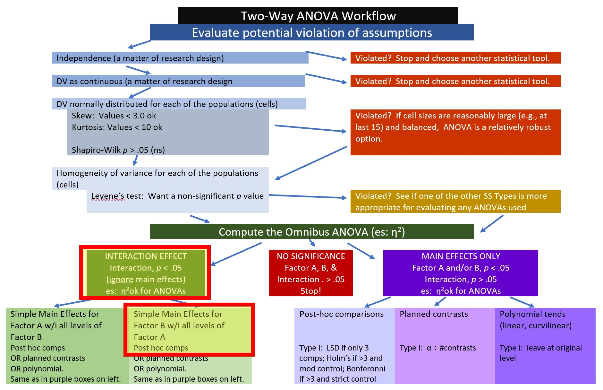

```{r include=FALSE}
options(scipen=999)#eliminates scientific notation
```
# Factorial (Between-Subjects) ANOVA {#between}

[Screencasted Lecture Link](https://spu.hosted.panopto.com/Panopto/Pages/Viewer.aspx?pid=3bb1bee1-c2ac-4cda-95f2-ad8b0152132c) 

In this (somewhat long and complex) lesson we conduct a 3X2 ANOVA. We will

* Work an actual example from the literature.
  - "by hand", and
  - with R packages
* I will also demonstrate 
  - several options for exploring interaction effects, and
  - several options for exploring main effects.
* Exploring these options will allow us to:
  - Gain familiarity with the concepts central to multi-factor ANOVAs.
  - Explore tools for analyzing the complexity in designs.

The complexity is that not all of these things need to be conducted for every analysis. The two-way ANOVA Workflow is provided to help you map a way through your own analyses. I will periodically refer to this map so that we can more easily keep track of where we are in the process.
 

## Navigating this Lesson

There is about 1 hour and 30 minutes hours of lecture. If you work through the materials with me plan for another two hours of study.

While the majority of R objects and data you will need are created within the R script that sources the chapter, occasionally there are some that cannot be created from within the R framework. Additionally, sometimes links fail. All original materials are provided at the [Github site](https://github.com/lhbikos/ReCenterPsychStats) that hosts the book. More detailed guidelines for ways to access all these materials are provided in the OER's [introduction](#ReCintro)

### Learning Objectives

Learning objectives from this lecture include the following:

* Define, locate, and interpret all the effects associated with two-way ANOVA:
  - main
  - interaction (introducing the concept, *moderator*)
  - simple main effects
* Identify which means belong with which effects. Then compare and interpret them.
  - marginal means
  - individual cell means 
  - comparing them
* Map a process/workflow for investigating a factorial ANOVA
* Manage Type I error
* Conduct a power analysis to determine sample size 

### Planning for Practice

In each of these lessons I provide suggestions for practice that allow you to select from options that vary in degree of difficulty The least complex is to change the random seed and rework the problem demonstrated in the lesson. The results *should* map onto the ones obtained in the lecture. 

The second option comes from the research vignette. The Ramdhani et al. [-@ramdhani_affective_2018] article has two dependent variables (DVs; negative and positive evaluation) which are suitable for two-way ANOVAs. I will demonstrate a simulation of one of their 3X2 ANOVAs (negative) in this lecturette. The second dependent variable (positive) is suggested for the moderate level of difficulty. 

As a third option, you are welcome to use data to which you have access and is suitable for two-way ANOVA. In either case the practice options suggest that you:

* test the statistical assumptions
* conduct a two-way ANOVA, including
  - omnibus test and effect size
  - report main and interaction effects
  - conduct follow-up testing of simple main effects
* write a results section to include a figure and tables

### Readings & Resources

In preparing this chapter, I drew heavily from the following resource(s) that are freely available on the internet. Other resources are cited (when possible, linked) in the text with complete citations in the reference list.

* Kassambara, A. (n.d.). ANOVA in R: The Ultimate Guide. Datanovia. Retrieved December 28, 2022, from https://www.datanovia.com/en/lessons/anova-in-r/
  - In order to streamline the learning process, I have chosen to use *rstatix* package for the majority of ANOVA lessons. There are a number of tutorials about this package as well as its integration with *ggpubr* for creating relatively easy creation of attractive and informative figures. This tutorial is especially helpful.
* Navarro, D. (2020). Chapter 16: Factorial ANOVA. In [Learning Statistics with R - A tutorial for Psychology Students and other Beginners](https://learningstatisticswithr.com/). Retrieved from https://stats.libretexts.org/Bookshelves/Applied_Statistics/Book%3A_Learning_Statistics_with_R_-_A_tutorial_for_Psychology_Students_and_other_Beginners_(Navarro)
  - Navarro's OER includes a good mix of conceptual information about one-way ANOVA as well as R code. My code/approach is a mix of Green and Salkind's [-@green_using_2017], Field's [-@field_discovering_2012], Navarro's [-@navarro_chapter_2020], and other techniques I have found on the internet and learned from my students.
* Ramdhani, N., Thontowi, H. B., & Ancok, D. (2018). Affective Reactions Among Students Belonging to Ethnic Groups Engaged in Prior Conflict. *Journal of Pacific Rim Psychology, 12*, e2. https://doi.org/10.1017/prp.2017.22
  - The source of our research vignette.

### Packages

The packages used in this lesson are embedded in this code. When the hashtags are removed, the script below will (a) check to see if the following packages are installed on your computer and, if not (b) install them.
```{r tidy=TRUE, tidy.opts=list(width.cutoff=70)}
#will install the package if not already installed
#if(!require(knitr)){install.packages("knitr")}
#if(!require(psych)){install.packages("psych")}
#if(!require(tidyverse)){install.packages("tidyverse")}
#if(!require(dplyr)){install.packages("dplyr")}
#if(!require(ggpubr)){install.packages("ggpubr")}
#if(!require(rstatix)){install.packages("rstatix")}
#if(!require(effectsize)){install.packages("effectsize")}
#if(!require(pwr2)){install.packages("pwr2")}
#if(!require(apaTables)){install.packages("apaTables")}
#if(!require(emmeans)){install.packages("emmeans")}#although we don't call this package directly, there are rstatix functions that are a wrapper for it and therefore it needs to be installed
#if(!require(car)){install.packages("car")}#although we don't call this package directly, there are rstatix functions that are a wrapper for it and therefore it needs to be installed
```

## Introducing Factorial ANOVA

My approach to teaching is to address the conceptual as we work problems. That said, there are some critical ideas we should address first.

**ANOVA is for experiments** (or arguably closely related designs). As we learn about the assumptions you'll see that ANOVA has some rather restrictive ones (e.g., there should be an equal/equivalent number of cases per cell). To the degree that we violate these assumptions, we should locate alternative statistical approaches where these assumptions are relaxed.

**Factorial**: a term used when there are two or more independent variables (IVs; the factors). The factors could be between-groups, within-groups, repeated measures, or a combination of between and within. 

* **Independent factorial design**: several IVs (predictors/factors) and each has been measured using different participants (between groups).
* **Related factorial design**: several IVs (factors/predictors) have been measured, but the same participants have been used in all conditions (repeated measures or within-subjects).
* **Mixed design**: several IVs (factors/predictors) have been measured. One or more factors uses different participants (between-subjects) and one or more factors uses the same participants (within-subjects). Thus, there is a cobination of independent (between) and related (within or repated) designs.

"Naming" the ANOVA model follows a number/levels convention. The example in this lesson is a 3X2 ANOVA. We know there are two factors that have three and two levels, respectively: 

* *rater ethnicity* has three levels representing the two ethnic groups that were in prior conflict (Marudese, Dayaknese) and a third group who was uninvolved in the conflict (Javanese); 
* *photo stimulus* has two levels representing members of the two ethnic groups that were in prior conflict (Madurese, Dayaknese); 

**Moderator** is what creates an interaction. Below are traditional representations of the *statistical* and *conceptual* figures of interaction effects. We will say that Factor B, *moderates* the relationship between Factor A (the IV) and the DV.
 
In a later lesson we work an ANCOVA -- where we will distinguish between a *moderator* and a *covariate.* In lessons on regression models, you will likely be introduced to the notion of *mediator.* 


### Workflow for Two-Way ANOVA

The following is a proposed workflow for conducting a two-way ANOVA. 

 


Steps of the workflow include:

1. Enter data 
    + predictors should formatted as as factors (ordered or unordered); the dependent variable should be continuously scaled
    + understanding the format of data can often provide clues as to which ANOVA/statistic to use
2. Explore data 
    + graph the data 
    + compute descriptive statistics
    + evaluate distributional assumptions 
    + assess the homogeneity of variance assumption with Levene's test  
    + assess the nomality assumption with the Shapiro Wilk test
    + determine if their are outliers; if appropriate, delete 
3. Compute the omnibus ANOVA
    + *depending on what you found in the data exploration phase, you may need to run a robust version of the test*
5. Follow-up testing based on significant main or interaction effects
    + significant interactions require test of simple main effects which could be further explored with contrasts, posthoc comparisons, and/or polynomials
    + *the exact methods you choose will depend upon the tests of assumptions during data exploration*
6. Managing Type I error

## Research Vignette

The research vignette for this example was located in Kalimantan, Indonesia and focused on bias in young people from three ethnic groups. The Madurese and Dayaknese groups were engaged in ethnic conflict that spanned 1996 to 2001. The last incidence of mass violence was in 2001 where approximately 500 people (mostly from the Madurese ethnic group) were expelled from the province. Ramdhani et al.'s [-@ramdhani_affective_2018] research hypotheses were based on the roles of the three ethnic groups in the study. According to the author, the Madurese were viewed as the transgressors when they occupied lands and took employment and business opportunities from the Dayaknese. Ramdhani et al. also included a third group who were not involved in the conflict (Javanese). The research participants were students studying in Yogyakara who were not involved in the conflict. They included 39 Madurese, 35 Dyaknese, and 37 Javanese; 83 were male and 28 were female.

In the study [@ramdhani_affective_2018], participants viewed facial pictures of three men and three women (in traditional dress) from each ethnic group (6 photos per ethnic group). Participant were asked, "How do you feel when you see this photo? Please indicate your answers based on your actual feelings." Participants responded on a 7-point Likert scale ranging from 1 (*strongly disagree*) to 7 (*strongly agree*). Higher scores indicated ratings of higher intensity on that scale. The two scales included the following words:

* Positive: friendly, kind, helpful, happy
* Negative: disgusting, suspicious, hateful, angry

### Data Simulation

Below is script to simulate data for the negative reactions variable from the information available from the manuscript [@ramdhani_affective_2018].

```{r message = FALSE, warning = FALSE, tidy=TRUE, tidy.opts=list(width.cutoff=70)}
library(tidyverse)
set.seed(210731)
#sample size, M and SD for each cell; this will put it in a long file
Negative<-round(c(rnorm(17,mean=1.91,sd=0.73),rnorm(18,mean=3.16,sd=0.19),rnorm(19, mean=3.3, sd=1.05), rnorm(20, mean=3.00, sd=1.07), rnorm(18, mean=2.64, sd=0.95), rnorm(19, mean=2.99, sd=0.80)),3) 
#sample size, M and SD for each cell; this will put it in a long file
Positive<-round(c(rnorm(17,mean=4.99,sd=1.38),rnorm(18,mean=3.83,sd=1.13),rnorm(19, mean=4.2, sd=0.82), rnorm(20, mean=4.19, sd=0.91), rnorm(18, mean=4.17, sd=0.60), rnorm(19, mean=3.26, sd=0.94)),3) 
ID <- factor(seq(1,111))
Rater <- c(rep("Dayaknese",35), rep("Madurese", 39), rep ("Javanese", 37))
Photo <- c(rep("Dayaknese", 17), rep("Madurese", 18), rep("Dayaknese", 19), rep("Madurese", 20), rep("Dayaknese", 18), rep("Madurese", 19))
#groups the 3 variables into a single df: ID#, DV, condition
Ramdhani_df<- data.frame(ID, Negative, Positive, Rater, Photo) 
```

For two-way ANOVA our variables need to be properly formatted. In our case:

* Negative is a continuously scaled DV and should be *num*
* Positive is a continuously scaled DV and should be *num*
* Rater should be an unordered factor
* Photo should be an unordered facor

```{r tidy=TRUE, tidy.opts=list(width.cutoff=70)}
str(Ramdhani_df)
```
Our Negative variable is correctly formatted. Let's reformat Rater and Photo to be factors and re-evaluate the structure. R's default is to order the factors alphabetically. In this case this is fine. If we had ordered factors such as dosage (placebo, lo, hi) we would want to respecify the order.

```{r tidy=TRUE, tidy.opts=list(width.cutoff=70)}
Ramdhani_df[,'Rater'] <- as.factor(Ramdhani_df[,'Rater'])
Ramdhani_df[,'Photo'] <- as.factor(Ramdhani_df[,'Photo'])
str(Ramdhani_df)
```
If you want to export this data as a file to your computer, remove the hashtags to save it (and re-import it) as a .csv ("Excel lite") or .rds (R object) file. This is not a necessary step.

The code for .csv will likely lose the formatting (i.e., making the Rater and Photo variables factors), but it is easy to view in Excel.
```{r tidy=TRUE, tidy.opts=list(width.cutoff=70)}
#write the simulated data as a .csv
#write.table(Ramdhani_df, file="RamdhaniCSV.csv", sep=",", col.names=TRUE, row.names=FALSE)
#bring back the simulated dat from a .csv file
#Ramdhani_df <- read.csv ("RamdhaniCSV.csv", header = TRUE)
#str(Ramdhani_df)
```

The code for the .rds file will retain the formatting of the variables, but is not easy to view outside of R.
```{r tidy=TRUE, tidy.opts=list(width.cutoff=70)}
#to save the df as an .rds (think "R object") file on your computer; it should save in the same file as the .rmd file you are working with
#saveRDS(Ramdhani_df, "Ramdhani_RDS.rds")
#bring back the simulated dat from an .rds file
#Ramdhani_df <- readRDS("Ramdhani_RDS.rds")
#str(Ramdhani_RDS)
```

### Quick peek at the data

Let's first examine the descriptive statistics (e.g., means of the variable, Negative) by group. We can use the *describeBy()* function from the *psych* package.

```{r tidy=TRUE, tidy.opts=list(width.cutoff=70)}
negative.descripts <- psych::describeBy(Negative ~ Rater + Photo, mat = TRUE, data = Ramdhani_df, digits = 3) #digits allows us to round the output
negative.descripts
```

The *write.table()* function can be a helpful way to export output to .csv files so that you can manipulate it into tables. 

```{r tidy=TRUE, tidy.opts=list(width.cutoff=70)}
write.table(negative.descripts, file="NegativeDescripts.csv", sep=",", col.names=TRUE, row.names=FALSE)
```

At this stage, it would be useful to plot our data. Figures can assist in the conceptualization of the analysis. 

```{r message = FALSE, warning = FALSE, tidy=TRUE, tidy.opts=list(width.cutoff=70)}
ggpubr::ggboxplot(Ramdhani_df, x = "Rater", y = "Negative", color = "Photo",xlab = "Ethnicity of Rater", ylab = "Negative Reaction", add = "jitter", title = "Boxplots Clustered by Rater Ethnicity")
```

Narrating results is sometimes made easier if variables are switched. There is usually not a right or wrong answer. Here is another view, switching the Rater and Photo predictors.

```{r message = FALSE, warning = FALSE, tidy=TRUE, tidy.opts=list(width.cutoff=70)}
ggpubr::ggboxplot(Ramdhani_df, x = "Photo", y = "Negative", color = "Rater", xlab = "Photo Stimulus",
             ylab = "Negative Reaction", add = "jitter", title = "Boxplots Clustered by Ethnicity Represented in Photo Stimulus")
```

Yet another option plots the raw data as bubbles, the means as lines, and denotes differences in the moderator with color.
```{r tidy=TRUE, tidy.opts=list(width.cutoff=70), warning = FALSE, message = FALSE}
ggpubr::ggline(Ramdhani_df, x = "Rater", y = "Negative", color = "Photo", xlab = "Ethnicity of Rater",
             ylab = "Negative Reaction", add = c("mean_se", "dotplot"), title = "Lineplot Clustered by Rater Ethnicity")

#add this for a different color palette:  palette = c("#00AFBB", "#E7B800")
```
We can reverse this to see if it assists with our conceptualization.
```{r tidy=TRUE, tidy.opts=list(width.cutoff=70)}
ggpubr::ggline(Ramdhani_df, x = "Photo", y = "Negative", color = "Rater", xlab = "Photo Stimulus",
             ylab = "Negative Reaction", add = c("mean_se", "dotplot"), title = "Lineplots Custered by Ethnicity in Photo Stimulus")
```

## Working the Factorial ANOVA (by hand)

Before we work an ANOVA let's take a moment to consider what we are doing and how it informs our decision-making. This figure (which already contains "the answers") may help conceptualize how variance is partitioned.


As in one-way ANOVA, we partition variance into **total**, **model**, and **residual**. However, we now further divide the $SS_M$ into its respective factors A(column), B(row,) and their a x b product.


In this, we begin to talk about main effects and interactions.

### Sums of Squares Total

Our formula is the same as it was for one-way ANOVA:

$$SS_{T}= \sum (x_{i}-\bar{x}_{grand})^{2}$$
Let's calculate it for the Ramdhani et al. [-@ramdhani_affective_2018] data. Our grand (i.e., overall) mean is 

```{r tidy=TRUE, tidy.opts=list(width.cutoff=70)}
mean(Ramdhani_df$Negative)
```

Subtracting the grand mean from each Negative rating yields a mean difference.
```{r message=FALSE, warning=FALSE, tidy=TRUE, tidy.opts=list(width.cutoff=70)}
library(tidyverse)
Ramdhani_df <- Ramdhani_df %>% 
  mutate(m_dev = Negative-mean(Negative))
head(Ramdhani_df)
```
Pop quiz: What's the sum of our new *m_dev* variable?

Let's find out!
```{r tidy=TRUE, tidy.opts=list(width.cutoff=70)}
sum(Ramdhani_df$m_dev)
```

Of course! The sum of squared deviations around the mean is zero. Next we square those mean deviations.
```{r tidy=TRUE, tidy.opts=list(width.cutoff=70)}
Ramdhani_df <- Ramdhani_df %>% 
  mutate(m_devSQ = m_dev^2)
head(Ramdhani_df)
```

Then we sum the squared mean deviations.
```{r tidy=TRUE, tidy.opts=list(width.cutoff=70)}
sum(Ramdhani_df$m_devSQ)
```
This value, 114.775, the sum of squared deviations around the grand mean, is our $SS_T$; the associated *degrees of freedom* is $N$ - 1. 

In factorial ANOVA, we divide $SS_T$ into **model/between** sums of squares and **residual/within** sums of squares.

### Sums of Squares for the Model 

$$SS_{M}= \sum n_{k}(\bar{x}_{k}-\bar{x}_{grand})^{2}$$

The *model* generally represents the notion that the means are different than each other. We want the variation between our means to be greater than the variation within each of the groups from which our means are calculated.

In factorial ANOVA, we need means for each of the combinations of the factors. We have a 3 x 2 model:

* Rater with three levels: Dayaknese, Madurese, Javanese
* Photo with two levels: Dayaknese, Madurese

Let's repeat some code we used before to obtain the cell-level means and cell sizes.

```{r tidy=TRUE, tidy.opts=list(width.cutoff=70)}
psych::describeBy(Negative ~ Rater + Photo, mat = TRUE, data = Ramdhani_df, digits = 3)
#Note. Recently my students and I have been having intermittent struggles with the describeBy function in the psych package. We have noticed that it is problematic when using .rds files and when using data directly imported from Qualtrics. If you are having similar difficulties, try uploading the .csv file and making the appropriate formatting changes.
```

We also need the grand mean (i.e., the mean that disregards [or "collapses across"] the factors).
```{r tidy=TRUE, tidy.opts=list(width.cutoff=70)}
mean(Ramdhani_df$Negative)
```
This formula occurs in six chunks, representing the six cells of our designed. In each of the chunks we have the $n$, group mean, and grand mean.

```{r tidy=TRUE, tidy.opts=list(width.cutoff=70)}
17*(1.818 - 2.947)^2 + 18*(2.524 - 2.947)^2 + 19*(3.301 - 2.947)^2 + 18*(3.129 - 2.947)^2 + 19*(3.465 - 2.947)^2 + 20*(3.297 - 2.947)^2
```
This value, 35.415, $SS_M$ is the value accounted for by the model. That is, the amount of variance accounted for by the grouping variable/factors, Rater and Photo.

### Sums of Squares Residual (or within)

$SS_R$ is error associated with within group variability. If people are randomly assigned to conditions there should be no other confounding variable. Thus, all $SS_R$ variability is *uninteresting* for the research and treated as noise.

$$SS_{R}= \sum(x_{ik}-\bar{x}_{k})^{^{2}}$$
Here's another configuration of the same:

$$SS_{R}= s_{group1}^{2}(n-1) + s_{group2}^{2}(n-1) + s_{group3}^{2}(n-1) + s_{group4}^{2}(n-1) + s_{group5}^{2}(n-1) + s_{group6}^{2}(n-1))$$

Again, the formula is in six chunks -- but this time the calculations are *within-group*. We need the variance (the standard deviation squared) for the calculation. We can retrieve these from the descriptive statistics.

```{r tidy=TRUE, tidy.opts=list(width.cutoff=70)}
psych::describeBy(Negative ~ Rater + Photo, mat = TRUE, data = Ramdhani_df, digits = 3)
```

Calculating $SS_R$
```{r tidy=TRUE, tidy.opts=list(width.cutoff=70)}
((.768^2)*(17-1))+ ((.742^2)*(18-1)) + ((1.030^2)*(19-1)) + ((.156^2)*(18-1)) + ((.637^2)*(19-1)) + ((1.332^2)*(20-1))
```

The value for our $SS_R$ is 79.321. Its degrees of freedom is $N - k$. That is, the total $N$ minus the number of groups: 
```{r tidy=TRUE, tidy.opts=list(width.cutoff=70)}
111 - 6
```

### A Recap on the Relationship between $SS_T$, $SS_M$, and $SS_R$

$SS_T = SS_M + SS_R$
In our case:

* $SS_T$ was 114.775
* $SS_M$ was 35.415
* $SS_R$ was 79.321

Considering rounding error, we were successful!
```{r tidy=TRUE, tidy.opts=list(width.cutoff=70)}
35.415 + 79.321
```

### Calculating SS for Each Factor and Their Products

#### Rater Main Effect

$SS_a:Rater$ is calculated the same way as $SS_M$ for one-way ANOVA. Simply collapse across Photo and calculate the *marginal means* for Negative as a function of the Rater's ethnicity.

Reminder of the formula: $SS_{a:Rater}= \sum n_{k}(\bar{x}_{k}-\bar{x}_{grand})^{2}$

There are three cells involved in the calculation of $SS_a:Rater$.

```{r tidy=TRUE, tidy.opts=list(width.cutoff=70)}
psych::describeBy(Negative ~ Rater, mat = TRUE, data = Ramdhani_df, digits = 3)
```
Again, we need the grand mean.
```{r tidy=TRUE, tidy.opts=list(width.cutoff=70)}
mean(Ramdhani_df$Negative)
```
Now to calculate the Rater main effect.
```{r tidy=TRUE, tidy.opts=list(width.cutoff=70)}
35*(2.491 - 2.947)^2 + 37*(3.007 - 2.947)^2 +39*(3.299 - 2.947)^2 
```
#### Photo Main Effect

$SS_b:Photo$ is calculated the same way as $SS_M$ for one-way ANOVA. Simply collapse across Rater and calculate the *marginal means* for Negative as a function of the ethnicity reflected in the Photo stimulus:

Reminder of the formula: $SS_{a:Photo}= \sum n_{k}(\bar{x}_{k}-\bar{x}_{grand})^{2}$.

With Photo, we have only two cells.

```{r tidy=TRUE, tidy.opts=list(width.cutoff=70)}
psych::describeBy(Negative ~ Photo, mat = TRUE, data = Ramdhani_df, digits = 3)
```

Again, we need the grand mean.
```{r tidy=TRUE, tidy.opts=list(width.cutoff=70)}
mean(Ramdhani_df$Negative)
```

```{r tidy=TRUE, tidy.opts=list(width.cutoff=70)}
54*(2.575 - 2.947)^2 + 57*(3.300 - 2.947)^2 
```
#### Interaction effect

The interaction term is simply the $SS_M$ remaining after subtracting the SS from the main effects.

$SS_{axb} = SS_M - (SS_a + SS_b)$

```{r tidy=TRUE, tidy.opts=list(width.cutoff=70)}
35.415 - (12.243 + 14.575)

```
Let's revisit the figure I showed at the beginning of this section to see, again, how variance is partitioned.


### Source Table Games!

As in the lesson for one-way ANOVA, we can use the information in this source table to determine if we have statistically significance in the model. There is enough information in the source table to be able to calculate all the elements. The formulas in the table provide some hints. Before scrolling onto the answers, try to complete it yourself.

|Summary ANOVA for Negative Reaction
|:-------------------------------------------------------|

|Source    |SS       |df         |$MS = \frac{SS}{df}$ |$F = \frac{MS_{source}}{MS_{resid}}$ |$F_{CV}$|
|:---------|:--------|:----------|:------|:------|:------|
|Model     |         |$k-1$      |       |       |       |
|a         |         |$k_{a}-1$  |       |       |       |
|b         |         |$k_{b}-1$  |       |       |       |
|aXb       |         |$(df_{a})(df_{b})$||       |       |
|Residual  |         |$n-k$      |       |       |       |
|Total     |         |           |       |       |       |

```{r tidy=TRUE, tidy.opts=list(width.cutoff=70)}
#hand-calculating the MS values
35.415/5   #Model
12.243/2   #a: Rater
14.575/1   #b:  Photo
8.597/2    #axb interaction term
79.321/105 #residual
#hand-calculating the F values
7.083/.755  #Model
6.122/.755  #a: Rater
14.575/.755 #b:  Photo
4.299/.755  #axb interaction term
```

To find the $F_{CV}$ we can use an [F distribution table](https://www.statology.org/f-distribution-table/).

Or use a look-up function, which follows this general form: qf(p, df1, df2. lower.tail=FALSE)
```{r tidy=TRUE, tidy.opts=list(width.cutoff=70)}
#looking up the F critical values
qf(.05, 5, 105, lower.tail=FALSE)#Model F critical value
qf(.05, 2, 105, lower.tail=FALSE)#a and axb F critical value
qf(.05, 1, 105, lower.tail=FALSE)#b F critical value

```
When the $F$ value exceeds the $F_{CV}$, the effect is statistically significant.

|Summary ANOVA for Negative Reaction
|:-------------------------------------------------------|

|Source    |SS       |df         |$MS = \frac{SS}{df}$ |$F = \frac{MS_{source}}{MS_{resid}}$ |$F_{CV}$|
|:---------|:--------|:----------|:------|:------|:------|
|Model     |35.415   |5          |7.083  |9.381  |2.301  |
|a         |12.243   |2          |6.122  |8.109  |3.083  |
|b         |14.575   |1          |14.575 |19.305 |3.932  |
|aXb       |8.597    |2          |4.299  |5.694  |3.083  |
|Residual  |79.321   |105        |0.755  |       |       |
|Total     |114.775  |           |       |       |       |

### Interpreting the results

What have we learned?

* there is a main effect for Rater
* there is a main effect for Photo
* there is a significant interaction effect

In the face of this significant interaction effect, we would follow-up by investigating the interaction effect. Why? The significant interaction effect means that findings (e.g., the story of the results) are more complex than group identity or photo stimulus, alone, can explain.

>You may notice that the results from the hand calculation are slightly different from the results I will obtain with the R packages. This is because the formula we have used for the hand-calculations utilizes an  approach to calculating the sums of squares that presumes that we have a balanced design (i.e., that the cell sizes are equal). When cell sizes are unequal (i.e., an unbalanced design) the Type II package in *rstatix::anova_test* will produce different result.

> Should we be concerned? No (and yes). My purpose in teaching hand calculations is for creating a conceptual overview of what is occurring in ANOVA models. If this lesson was a deeper exploration into the inner workings of ANOVA, we would take more time to understand what is occurring. My goal is to provide you with enough of an introduction to ANOVA that you would be able to explore further which sums of squares type would be most appropriate for your unique ANOVA model.


## Working the Factorial ANOVA with R Packages

### Evaluating the statistical assumptions

All statistical tests have some assumptions about the data. I have marked our Two-Way ANOVA Workflow with a yellow box outlined in red to let us know that we are just beginning the process of analyzing our data with an evaluation of the statistical assumptions.


The are four critical assumptions in factorial ANOVA:

* Cases represent random samples from the populations 
  - This is an issue of research design
  - Although we see ANOVA used (often incorrectly) in other settings, ANOVA was really designed for the random clinical trial (RCT).
* Scores on the DV are independent of each other.
  - This is an issue of research design
  - With correlated observations, there is a dramatic increase of Type I error
  - There are alternative statistics designed for analyzing data that has dependencies (e.g., repeated measures ANOVA, dyadic data analysis, multilevel modeling)
* The DV is normally distributed for each of the populations
  - that is, data for each cell (representing the combinations of each factor) is normally distributed
* Population variances of the DV are the same for all cells
  - When cell sizes are not equal, ANOVA not robust to this violation and cannot trust F ratio

Even though we position the evaluation of assumptions first -- some of the best tests of the assumptions use the resulting ANOVA model. Because of this, I will quickly run the model now. I will not explain the results until after we evaluate the assumptions.

```{r tidy=TRUE, tidy.opts=list(width.cutoff=70)}
TwoWay_neg<-aov(Negative~Rater*Photo, Ramdhani_df)
summary(TwoWay_neg)
model.tables(TwoWay_neg,"means")
```

#### Is the dependent variable normally distributed?

##### Is there evidence of skew or kurtosis?

Let's start by analyzing **skew** and **kurtosis**. Skew and kurtosis are one way to evaluate whether or not data are normally distributed. When we use the "type=1" argument, the skew and kurtosis indices in *psych:describe* (or *psych::describeBy*) can be interpreted according to Kline's [-@kline_data_2016] guidelines. Regarding skew, values greater than the absolute value of 3.0 are generally considered "severely skewed." Regarding kurtosis, "severely kurtotic" is argued to be anywhere greater the absolute values of 8 to 20. Kline recommended using a conservative threshold of the absolute value of 10.

```{r tidy=TRUE, tidy.opts=list(width.cutoff=70)}
psych::describeBy(Negative ~ Rater + Photo, mat = TRUE, data = Ramdhani_df, digits = 3, type = 1)
```

Using guidelines from Kline [-@kline_principles_2016] our values for skewness fall below |3.0| and our values for kurtosis fall below |10|.

##### Are the model residuals normally distributed?

We can further investigate normality with the Shapiro-Wilk test. The assumption requires that the distribution be normal in each of the levels of each factor. In the case of multiple factors (such as is the case in factorial ANOVA), the assumption requires a normal distribution in each combination of these levels (e.g., Javanese rater of Dyaknese photo). In this lesson's 3 x 2 ANOVA, there are six such combinations. This cell-level analysis has been demonstrated in [one-way ANOVA](#oneway) and independent [t-test](#tIndSample) lessons. To the degree that there are many factorial combinations (and therefore, cells), this approach becomes unwieldy to calculate, interpret, and report. The cell-level analysis of normality is also only appropriate when there are a low number of levels/groupings and there are many data points per group. Thus, as models become more complex, researchers turn to the model-based option for assessing normality. To do this, we first create an object that tests our research model.

Just a paragraph or two earlier, I ran the factorial ANOVA and saved the results in an object. Among the information contained in that object are *residuals*. Residuals are the unexplained variance in the outcome (or dependent) variable after accounting for the predictor (or independent) variable. In the code below we extract the residuals (i.e., that which is left-over/unexplained) from the model. We can examine their distribution with a plot.

```{r tidy=TRUE, tidy.opts=list(width.cutoff=70)}
#creates object of residuals
resid_neg<- residuals(TwoWay_neg) 
```

Next, we can take a "look" them with a couple of plots.

```{r}
hist(resid_neg)
```

So far so good -- our distribution of *residuals* (i.e., what is leftover after the model is applied) resembles a normal distribution.

The Q-Q plot provides another view. The dots represent the residuals. When they are relatively close to the line they not only suggest good fit of the model, but we know they are small and evenly distributed around zero (i.e., normally distributed). 

```{r  tidy=TRUE, tidy.opts=list(width.cutoff=70)}
qqnorm(resid_neg)
```

Additionally, we can formally test the distribution of the residuals with a Shapiro test. We want the associated *p* value to be greater than 0.05.
```{r tidy=TRUE, tidy.opts=list(width.cutoff=70)}
shapiro.test(resid_neg)
```
Whooo hoo! $p > 0.05$. This means that our distribution of residuals is not statistically significantly different from a normal distribution ($W = 0.985, p = 0.234$).

##### Are there outliers?

If our data pointed to significant violations of normality, we could consider identifying and removing outliers. Removing data is a serious consideration that should not be made lightly. If needed, though, here is a tool to inspect the data and then, if necessary, remove it.

We can think of outlier identification in a couple of ways. First, we might look at dependent variable across the entire dataset. That is, without regard to the levels of the grouping variable. We can point *rstatix::identify_outliers()* to the data.

```{r tidy=TRUE, tidy.opts=list(width.cutoff=70)}
Ramdhani_df%>%
  rstatix::identify_outliers(Negative)
```

Our results indicate that one case (ID = 73) had an outlier (TRUE), but it was not extreme (FALSE).

Let's re-run the code, this time requiring it to look within each of the grouping levels of the condition variable.

```{r tidy=TRUE, tidy.opts=list(width.cutoff=70)}
Ramdhani_df%>%
  group_by(Rater, Photo)%>%
  rstatix::identify_outliers(Negative)
```
This time there are three cases where there are outliers (TRUE), but they are not extreme (FALSE). Handily, the function returns information about each row of data. We can use such information to help us delete it. 

Let's say that, after very careful consideration, we decided to remove the case with ID = 18. We could use *dplyr::filter()* to do so. In this code, the *filter()* function locates all the cases where ID = 18. The exclamation point that precedes the equal sign indicates that the purpose is to remove the case. 

```{r tidy=TRUE, tidy.opts=list(width.cutoff=70)}
#Ramdhani_df <- dplyr::filter(Ramdhani_df, ID != "18")
```

Once executed, we can see that this case is no longer in the dataframe. Although I demonstrated this in the accompanying lecture, I have hashtagged out the command because I would not delete the case. If you already deleted the case, you can return the hashtag and re-run all the code up to this point.

Here's how I would summarize our data in terms of normality:

>Factorial ANOVA assumes that the dependent variable is normally is distributed for all cells in the design. Skew and kurtosis values for each factorial combinations fell below the guidelines recommended by Kline [-@kline_data_2016]. That is, they were below the absolute values of 3 for skew and 10 for kurtosis. Similarly, no extreme outliers were identified and results of the Shapiro-Wilk normality test (applied to the residuals from the factorial ANOVA model) suggested that model residuals did not differ significantly from a normal distribution ($W = 0.9846, p = 0.234$). 

#### Are the variances of the dependent variable similar across the levels of the grouping factors?

We can evaluate the homogeneity of variance test with the Levene's test for the equality of error variances. Levene's requires a *fully saturated model.* This means that the prediction model requires an interaction effect (not just two, non-interacting predictors). We can use the *rstatix::levene_test()*. Within the function we point to the dataset, then specify the formula of the factorial ANOVA. That is, predicting Negative from the Rater and Photo factors. The asterisk indicates that they will also be added as an interaction term.

```{r tidy=TRUE, tidy.opts=list(width.cutoff=70)}
rstatix::levene_test(Ramdhani_df, Negative ~ Rater*Photo)
```
Levene's test, itself, is an *F*-test. Thus, its reporting assumes the form of an *F*-string. Our result has indicated a violation of the homogeneity of variance assumption ($F[5, 105] = 8.634, p < .001)$. This is not surprising as the boxplots displayed some widely varying variances. 

Should we be concerned? Addressing violations of homogeneity of variance in factorial ANOVA is complex. The following have been suggested:

* One approach is to use different error variances in follow-up to the omnibus. Kassambara [-@kassambara_anova_nodate] suggested that separate one-way ANOVAs for the analysis of simple main effects will provide these separate error terms.
* Green and Salkind [-@green_using_2017] indicated that we should become more concerned about the trustworthiness of the *p* values from the omnibus two-way ANOVA when this assumption is violated and the cell sizes are unequal. In today's research vignette, our design is balanced (i.e., the cell sizes are quite similar). 

#### Summarizing results from the analysis of assumptions

It is common for an APA style results section to begin with a review of the evaluation of the statistical assumptions. As we have just finished these analyses, I will document what we have learned so far:

>Factorial ANOVA assumes that the dependent variable is normally is distributed for all cells in the design. Skew and kurtosis values for each factorial combinations fell below the guidelines recommended by Kline [-@kline_data_2016]. That is, they were below the absolute values of 3 for skew and 10 for kurtosis. Similarly, no extreme outliers were identified and results of the Shapiro-Wilk normality test (applied to the residuals from the factorial ANOVA model) suggested that model residuals did not differ significantly from a normal distribution ($W = 0.9846, p = 0.234$). Results of Levene’s test for equality of error variances indicated a violation of the homogeneity of variance assumption, ($F[5, 105] = 8.834, p < .001$). Given that cell sample sizes were roughly equal and greater than 15, each [@green_using_2017] we proceded with the two-way ANOVA.

### Evaluating the Omnibus ANOVA

The *F*-tests associated with the two-way ANOVA are the *omnibus* -- providing the result for the main and interaction effects. 

Here's where we are in the workflow.


When we run the two-way ANOVA we will be looking for several effects:

* main effects for each predictor, and
* the interaction effect.

It is possible that all effects will be significant, none will be significant, or some will be significant. The interaction effect always takes precedence over the main effect because it lets us know there is a more nuanced/complex result.

In the code below, the *type* argument is used to specify the type of sums of squares that are used. Type II is the *rstatix::anova_test()*'s default and is what I will use in this demonstration. It will yield identical results as *type=1* when data are balanced (i.e., cell sizes are equal).  In specifying the ANOVA, order of entry matters if you choose *type=1*. In that case, if there are distinctions between independent variable and moderator, enter the independent variable first because it will claim the most variance. I provide more information on these options related to types of sums of squares calculations near the end of the chapter.

```{r tidy=TRUE, tidy.opts=list(width.cutoff=70), warning=FALSE, message=FALSE}
omnibus2w <- rstatix::anova_test(Ramdhani_df, Negative ~ Rater*Photo, type="2", detailed=TRUE)
omnibus2w
```

Let’s write the *F strings* from the above table.

* Rater main effect: $F[2, 105] = 8.098, p < 0.001, \eta ^{2} = 0.134$ 
* Photo stimulus main effect: $F[1, 105] = 19.346, p < 0.001, \eta ^{2} = 0.156$
* Interaction effect: $F[2, 105] = 5.696, p = 0.004, \eta ^{2} = 0.098$

**Eta squared** (represented in the "ges" column of ouput) is one of the most commonly used measures of effect. It refers to the proportion of variability in the DV/outcome variable that can be explained in terms of the IVs/predictors. Conventionally, values of .01, .06, and .14 are considered to be small, medium, and large effect sizes, respectively. 

You may see different values (.02, .13, .26) offered as small, medium, and large -- these values are used when multiple regression is used. A useful summary of effect sizes, guide to interpreting their magnitudes, and common usage can be found [here](https://imaging.mrc-cbu.cam.ac.uk/statswiki/FAQ/effectSize) [@watson_rules_2020].

The formula for $\eta ^{2}$ is straightforward:

$$\eta ^{2}=\frac{SS_{M}}{SS_{T}}$$

Before moving to follow-up, an APA style write-up of the omnibus might read like this:

#### APA write-up of the omnibus results

>A 3 X 2 ANOVA was conducted to evaluate the effects of rater ethnicity (3 levels, Dayaknese, Madurese, Javanese) and photo stimulus (2 levels, Dayaknese on Madurese,) on negative reactions to the photo stimuli. 

>Computing sums of squares with a Type II approach, the results for the ANOVA indicated a significant main effect for ethnicity of the rater ($F[2, 105] = 8.098, p < 0.001, \eta ^{2} = 0.134$), a significant main effect for photo stimulus, ($F[1, 105] = 19.346, p < 0.001, \eta ^{2} = 0.156$), and a significant interaction effect ($F[2, 105] = 5.696, p = 0.004, \eta ^{2} = 0.098$).

### Follow-up to a Significant Interaction Effect

In factorial ANOVA we are interested in main effects and interaction effects. When the result is explained by a main effect, then there is a consistent trend as a function of a factor (e.g., Madurese raters had consistently higher Negative evaluations, irrespective of stimulus). In an interaction effect, the results are more complex (e.g., the ratings across the stimulus differed for the three groups of raters). 

There are a variety of strategies to follow-up a significant interaction effect. In this lesson, I demonstrate the two I believe to be the most useful in the context of psychologists operating within the scientist-practitioner-advocacy context. I provide additional examples in the [appendix](#moRe).

When an interaction effect is significant (irrespective of the significance of one or more main effects), examination of **simple main effects** is a common statistical/explanatory approached that is used. The Two-Way ANOVA Workflow shows where we are in this process. Our research vignette is a 3 x 2 ANOVA. The first factor, ethnicity, has three levels (Dayaknes, Javanese, Madurese) and the second factor, photo stimulus, has two levels (Dayaknese, Madurese). When we conduct simple main effects, we evaluate one factor within the levels of the other factor. The number of levels in each factor changes the number of steps (i.e., the complexity) in the analysis.

When I am analyzing the simple main effect of photo stimulus (two levels) within ethnicity of the rater (three levels), I only need a one-step procedure that will conduct pairwise comparisons of the negative evaluating of the photo stimulus for the Dayaknese, Javanese, and Madurese raters, separately (while controlling for Type I error). Traditionally, researchers will follow with three, separate, one-way ANOVAs. However, any procedure (e.g., t-tests, pairwise comparisons) that will make these pairwise comparisons is sufficient.

When I am analyzing the simple main effect of ethnicity of the rater (three levels) within photo stimulus (two levels), I will need a two-step process. The first step will require the one-way ANOVA to determine, first, if there were statistically significant differences within the photo stimulus (e.g., Were there differences between Dayaknese, Javanese, and Madurese raters when viewing the Dayaknese photos?). If there were statistically significant differences, we follow up with an analysis of pairwise comparisons.

Although I will demonstrate both rater ethnicity within photo stimulus and photo stimulus within rater ethnicity in this lesson, we will choose only one for the write-up of results.


#### Planning for the management of Type I Error

Controlling for Type I error can depend, in part, on the design of the follow-up tests that are planned, and the number of pairwise comparisons that follow.

In the first option, the examination of the simple main effect of photo stimulus within ethnicity of rater results in only three pairwise comparisons. In this case, I will use the traditional Bonferroni. Why? Because there are only three post omnibus analyses, its more restrictive control is less likely to be problematic.

In the second option, the examination of the simple main effect of ethnicity of the rater within photo stimulus results in the potential comparison of six pairwise comparisons. If we used a traditional Bonferroni and divided .05/6, the *p* value for each comparison would need to be less than 0.008. Most would agree that this is too restrictive.

```{r}
.05/6
```
The Holm's sequential Bonferroni [@green_using_2017] offers a middle-of-the-road approach (not as strict as .05/6 with the traditional Bonferroni; not as lenient as "none") to managing Type I error. 

If we were to hand-calculate the Holms, we would rank order the *p* values associated with the six comparisons in order from lowest (e.g., 0.000001448891) to highest (e.g., 1.000). The first *p* value is evaluated with the most strict criterion (.05/6; the traditional Bonferonni approach). Then, each successive comparison calculates the *p* value by using the number of *remaining* comparisons as the denominator (e.g., .05/5, .05/4, .05/3). As the *p* values increase and the alpha levels relax, there will be a cut-point where remaining comparisons are not statistically significant. Luckily, most R packages offer the Holm's sequential Bonferroni as an option. The algorithm in the package rearranges the mathematical formula and produces a *p* value that we can interpret according to the traditional values of $p < .05, p < .01$ and $p < .001$. I will demonstrate use of Holm's in the examination of the simple main effect of ethnicity of rater within photo stimulus.

#### Option #1 the simple main effect of photo stimulus within ethnicity of the rater

In the examination of the simple main effect of photo stimulus within ethnicity of the rater our goal is to compare the:

* Dayaknese raters' negative evaluation of the Dayaknese and Madurese photos,
* Javanese raters' negative evaluation fo the Dayaknese and Madurese photos, and
* Madurese raters' negative evaluation of the Dayaknese and Madurese photos.

Thus, we only need three, pairwise comparisons. I will demonstrate two ways to conduct these analyses. Here's where we are in the two-way ANOVA workflow


Separate one-way ANOVAs are a traditional option for this evaluation. Using *dplyr::group_by()* we can efficiently calculate the three ANOVAs by the grouping variable, Rater. One advantage of separate one-way ANOVAs is that they each have their own error term and that this can help mitigate problems associated with violation of the homogeneity of variance assumption [@kassambara_anova_nodate]. 

Note that in this method there is no option for controlling Type I error. Thus, we would need to do it manually. The traditional Bonferroni involves dividing family-wise error (traditionally $p < .05$) by the number of follow-up comparisons. In our case $.05/3 = .017$. 

```{r tidy=TRUE, tidy.opts=list(width.cutoff=70), warning=FALSE, message=FALSE}
Ramdhani_df%>%
  dplyr::group_by(Rater)%>%
             rstatix::anova_test(Negative ~ Photo)
```

The APA style write-up will convey what we have found using this traditional approach:

>To explore the interaction effect, we followed with a test of the simple main effect of photo stimulus within the ethnicity of the rater. That is, with separate one-way ANOVAs (chosen, in part, to mitigate violation of the homogeneity of variance assumption [@kassambara_anova_nodate]) we examined the effect of the photo stimulus within the Dayaknese, Madurese, and Javanese groups. To control for Type I error across the three simple main effects, we set alpha at .017 (.05/3). Results indicated significant differences for Dayaknese ($F [1, 33] = 50.404, p < 0.001, \eta ^{2} = 0.604$) and Javanese ethnic groups $(F [1, 35] = 17.183, p < 0.001, \eta ^{2} = 0.329)$, but not for the Madurese ethnic group $(F [1, 37] < 0.001, p = .993, \eta ^{2} < .001)$. As illustrated in Figure 1, the Dayaknese and Javanese raters both reported stronger negative reactions to the Madurese. The differences in ratings for the Madurese were not statistically significantly different. In this way, the rater's ethnic group moderated the relationship between the photo stimulus and negative reactions. 

The *rstatix::emmeans_test()* offers an efficient alternative to this pairwise analysis that will (a) automatically control for Type I error and (b) integrate well into a figure. Note that this function is a wrapper to functions in the *emmeans* package. If you haven't already, you will need to install the *emmeans* package. For each, the resulting test statistic is a  *t.ratio*. The result of this *t*-test will be slightly different than an independent sample *t*-test because it is based on *estimated marginal means* (i.e., means based on the model, not directly on the data). We will spend more time with estimated marginal means in the ANCOVA lesson. 

In the script below, we will group the dependent variable by Rater and then conduct pairwise comparisons. Note that I have requested that that the traditional Bonferroni be used to manage Type I error. We can see these adjusted *p* values in the output.

```{r warning=FALSE, message=FALSE}
library(tidyverse)
pwPHwiETH <- Ramdhani_df%>%
  group_by(Rater)%>%
  rstatix::emmeans_test(Negative ~ Photo, detailed = TRUE, p.adjust.method = "bonferroni")
pwPHwiETH
```

Not surprisingly, our results are quite similar. I would report them this way:

>To explore the interaction effect, we followed with a test of the simple main effect of photo stimulus within the ethnicity of the rater. Specifically, we conducted pairwise comparisons between the groups using the estimated marginal means. We specified the Bonferroni method for managing Type I error. Results suggested statistically significant differences differences for the Dayaknese ($M_diff = -1.312, t[105] = -4.461, p < 0.001$) and Javanese ethnic groups ($M_diff = -0.941, t[105] = -3.291, p < 0.001$) but not for the Madurese ethnic group ($M_diff = 0.003, t[105] = 0.0121, p = 0.990$). As illustrated in Figure 1, the Dayaknese and Javanese raters both reported stronger negative reactions to the Madurese. The differences in ratings for the Madurese were not statistically significantly different. In this way, the rater's ethnic group moderated the relationship between the photo stimulus and negative reactions. 

Because we used the *rstatix* functions, we can easily integrate them into our *ggpubr::ggboxplot()*. Let's first re-run the version of the boxplot where "Rater" is on the x-axis (and, is therefore our grouping variable). Because I want the data to be as true-to-scale as possible, I have added the full range of the y axis through the *ylim* argument. In order to update the ggboxplot, we will need to save it as an option. My object name represents the "PHoto within Ethnicity" simple main effect. 
```{r tidy=TRUE, tidy.opts=list(width.cutoff=70)}
boxPHwiETH <- ggpubr::ggboxplot(Ramdhani_df, x = "Rater", y = "Negative", color = "Photo",xlab = "Ethnicity of Rater", ylab = "Negative Reaction", add = "jitter", title = "Simple Main Effect of Photo Stimulus within Rater", ylim = c(1, 7))

pwPHwiETH <- pwPHwiETH %>% rstatix::add_xy_position(x = "Rater") #x should be whatever the variable was used in the group_by argument 
boxPHwiETH <- boxPHwiETH +
  ggpubr::stat_pvalue_manual(pwPHwiETH, label = "p.adj.signif", tip.length = 0.02, hide.ns = TRUE, y.position = c(3.8, 5.1))

boxPHwiETH
```

#### Option #2 the simple main effect of ethnicity of rater within photo stimulus.

In the examination of the simple main effect of rater ethnicity photo stimulus our goal is to compare:

* Dayaknese, Javanese, and Madurese negative evaluations of the Dayaknese photos, and
* Dayaknese, Javanese, and Madurese negative evaluations of the Maudurese photos.

Consequently, we will need a two-staged evaluation. First, we will conduct separate one-way ANOVAs. Second, we will follow-up with pairwise comparisons. 



Let's start with the one-way ANOVAs. Using *dplyr::group_by()* we can efficiently calculate the three ANOVAs by the grouping variable, Photo. One advantage of separate one-way ANOVAs is that they each have their own error term and that this can help mitigate problems associated with violation of the homogeneity of variance assumption [@kassambara_anova_nodate]. 

Note that in this method there is no option for controlling Type I error. Thus, we would need to do it manually. The traditional Bonferroni involves dividing family-wise error (traditionally $p < .05$) by the number of follow-up comparisons. In our case $.05/2 = .025$. 

```{r tidy=TRUE, tidy.opts=list(width.cutoff=70)}
Ramdhani_df%>%
  dplyr::group_by(Photo)%>%
             rstatix::anova_test(Negative ~ Rater)
```

The APA style write-up will convey what we have found (so far) using this approach:

>To explore the interaction effect, we followed with a test of the simple main effect of ethnicity of the rater within the photo stimulus. We began with separate one-way ANOVAs (chosen, in part, to mitigate violation of the homogeneity of variance assumption [@kassambara_anova_nodate]). To control for Type I error across the two simple main effects, we set alpha at .025 (.05/2). Results indicated significant differences for Dayaknese photo ($F [2, 51] = 13.325, p < 0.001, \eta ^{2} = 0.343$) but not for the Madurese photo $(F [2, 54] = 0.679, p = 0.512, \eta ^{2} = 0.025)$. 

Results suggest that there are differences within the Dayaknese group, yet because there are three groups, we cannot know with certainty where there are statistically significant difference. As before, we can use the  *rstatix::emmeans_test()* to conduct the pairwise analysis. This function will (a) automatically control for Type I error and (b) integrate well into a figure. For each comparison, the resulting test statistic is a  *t.ratios*. The result of this *t*-test will be slightly different than an independent sample *t*-test because it is based on *estimated marginal means* (i.e., means based on the model, not directly on the data). We will spend more time with estimated marginal means in the ANCOVA lesson. 

In the script below, we will group the dependent variable by Photo and then conduct pairwise comparisons. Note that I have requested that that the Holm's sequential Bonferroni be used to manage Type I error. We can see these adjusted *p* values in the output.

```{r tidy=TRUE, tidy.opts=list(width.cutoff=70)}
pwETHwiPH <- Ramdhani_df%>%
  dplyr::group_by(Photo)%>%
  rstatix::emmeans_test(Negative ~ Rater, p.adjust.method = "holm")
pwETHwiPH
```
Very consistent with the one-way ANOVAs, we see that there were significant rater differences in the evaluation of the Dayaknese photo, but not for the Madurese photo. Further, in the rating of the Dayaknese photo, there were statistically significant differences between all three comparisons of ethnic groups. The *p*-values remained statistically significant with the adjustment of the Holm's.

For a quick demonstration of differences in managing Type I error, I wil replace "holm" with "bonferroni." Here, we will see the more restrictive result, where one of the previously significant comparisons drops out. Note that I am not saving this results as an object -- I don't want it to interfere with our subsequent analyses

```{r tidy=TRUE, tidy.opts=list(width.cutoff=70)}
#demonstration of the more restrictive bonferroni approach to managing Type I error
Ramdhani_df%>%
  dplyr::group_by(Photo)%>%
  rstatix::emmeans_test(Negative ~ Rater, p.adjust.method = "bonferroni")
```
Let's create a figure that reflects the results of this simple main effect of rater ethnicity within photo stimulus. As before, we start with the corresponding figure where "Photo" is on the x-axis.

```{r tidy=TRUE, tidy.opts=list(width.cutoff=70)}
boxETHwiPH <- ggpubr::ggboxplot(Ramdhani_df, x = "Photo", y = "Negative", color = "Rater",xlab = "Rater Ethnicity Represented within Photo Stimulus", ylab = "Negative Reaction", add = "jitter", title = "Simple Main Effect of Rater within Photo Stimulus", ylim = c(1, 7))

pwETHwiPH <- pwETHwiPH %>% rstatix::add_xy_position(x = "Photo") #x should be whatever the variable was used in the group_by argument 
boxETHwiPH <- boxETHwiPH +
  ggpubr::stat_pvalue_manual(pwETHwiPH, label = "p.adj.signif", tip.length = 0.02, hide.ns = TRUE, y.position = c(5, 5.5, 6))

boxETHwiPH
```

Here's how I would update the APA style reporting of results:

>To explore the interaction effect, we followed with a test of the simple main effect of ethnicity of the rater within the photo stimulus. We began with separate one-way ANOVAs (chosen, in part, to mitigate violation of the homogeneity of variance assumption [@kassambara_anova_nodate]). To control for Type I error across the two simple main effects, we set alpha at .025 (.05/2). Results indicated significant differences for Dayaknese photo ($F [2, 51] = 13.325, p < 0.001, \eta ^{2} = 0.343$) but not for the Madurese photo $(F [2, 54] = 0.679, p = 0.512, \eta ^{2} = 0.025)$. We followed up significant one-way ANOVA with pairwise comparisons between the groups using the estimated marginal means. We specified the Holm's sequential Bonferroni for managing Type I error. Regarding evaluation of the Dayaknese photo, results suggested statistically significant differences in all combinations of raters. As shown in Figure 1, the Dayaknese raters had the lowest ratings, followed by Javanese raters, and then Madurese raters. Consistent with the non-significant one-way ANOVA evaluating ratings of the Madurese photo, there were no statistically significant differences for raters. Results of these tests are presented in Table 1.

#### Options #3 through *k*

There are seemingly infinite approaches to analyzing significant interaction effects. I am frequently asked, "But what about _____?" And "Do you have an example of ____?" In prior versions of this lesson, I included a few more examples in this section of follow-up to a significant interaction effect. However, in an effort to reduce the cognitive load of the chapter and stay focused on the primary learning goals I have relocated some of these to the [appendix](#moRe) At the time of this update, there are worked examples that highlight:

* Orthogonal contrast-coding
* All possible post hoc comparisons
* Polynomial trends

If, as a reader, you have recommendations for more specific examples, please suggest them using the contact information provided at the beginning of the OER.


### Investigating Main Effects

We now focus on the possibility that there might be significant main effects, but a non-significant interaction effect. We only interpret main effects when there is a non-significant interaction effect. Why? Because in the presence of a significant interaction effect, the main effect will not tell a complete story. If we didn't specify a correct model, we still might have an incomplete story. But that's another issue. 

Here's where we are on the workflow.


Recall that main effects are the *marginal means* -- that is the effects of factor A *collapsed across* all the levels of factor B.

If the main effect has only two levels (e.g., the ratings of the Dayaknese and Madurese photos):

* the comparison was already ignoring/including all levels of the rater ethnicity factor (Dayaknese, Madurese, Javanese),
* it was only a comparison of two cells (Dayaknese rater, Madurese rater), therefore
* there is no need for further follow-up. 

In the case of our specific research vignette, we learned from the omnibus test that the Photo main effect was statistically significant ($F[1, 105] = 19.346, p < 0.001, \eta ^{2} = 0.156$).This means that we know there are statistically significant differences between ratings of Dayaknese and Madurese photos overall. 

```{r tidy=TRUE, tidy.opts=list(width.cutoff=70)}
psych::describeBy(Negative ~ Photo, data = Ramdhani_df, mat=TRUE)
```
A quick review of the descriptive statistics, aggregated by photo stimulus indicates that, overall, Madurese photos were evaluated more negatively.

If the main effect has three or more levels (e.g,. ethnicity of rater with Dayaknese, Madurese, Javanese levels), then we follow-up with one or more of the myriad of options. I tend to focus on three:

* planned contrasts
* posthoc comparisons (all possible cells)
* polynomial

From our omnibus evaluation, our rater main effect was $F[2, 105] = 8.098, p < .001, \eta ^{2} = 0.134$.  I will demonstrate how to do each as follow-up to a *pretend* scenario where a main effect (but not the interaction effect) had been significant. In fact, our follow-up of Rater main effects will be quite similar to the manner in which we followed up the significant omnibus in the [one-way ANOVA lesson](#oneway). 

Here's what would happen if we simply ran a one-way ANOVA.

```{r tidy=TRUE, tidy.opts=list(width.cutoff=70), warning=FALSE, message=FALSE}
rater_main <- rstatix::anova_test(Ramdhani_df, Negative ~ Rater, detailed=FALSE)
rater_main
```
Results of a one-way ANOVA evaluating negative reaction to photos of members of Dayaknese and Madurese ethnic groups indicate a statistically differences as a function of the ethnicity of the rater ($F[2, 108] = 6.426, p = 0.002, \eta^2 = 0.106$)

A boxplot representing this main effect may help convey how the main effect of Rater (collapsed across Photo) is different than an interaction effect.

```{r tidy=TRUE, tidy.opts=list(width.cutoff=70)}
box_RaterMain <- ggpubr::ggboxplot(Ramdhani_df, x = "Rater", y = "Negative", xlab = "Ethnicity of Rater", ylab = "Negative Reaction", color = "Rater", ylim = c(1, 7), title = "Boxplots of Rater Main Effect")
box_RaterMain
```

#### Option #1 post hoc paired comparisons

An easy possibility is to follow-up with all possible post hoc pairwise comparisons. Here is a reminder of our location on the workflow.


Post hoc, pairwise comparisons are:

* used for exploratory work when no firm hypotheses were articulated a priori,
* used to compare the means of all combinations of pairs of an experimental condition, and
* less powerful than planned comparisons because more strict criterion for significance should be used.

By specifying the *formula* of the ANOVA, the *rstatix::t_test()* function will provide comparisons of all possible combinations. The arguments in the code mirror those we used for the omnibus. Note that I am saving the results as an object. We will use this object ("ttest") later when we create an accompanying figure. 

We will request the traditional Bonferroni using the *p.adjust.method*. The *rstatix::t_test()* offers multiple options for adjusting the *p* values.

```{r tidy=TRUE, tidy.opts=list(width.cutoff=70)}
RaterMain_ttest <- rstatix::t_test(Ramdhani_df, Negative ~ Rater, p.adjust.method="bonferroni", detailed=TRUE)
RaterMain_ttest
```

The *estimate* column provide the mean difference between the two levels of the independent different. The *estimate1/group1* and *estimate2/group2* columns provide those means and identify the group levels. The *statistic* column provides the value of the *t*-test. 

The *p* value is the unadjusted *p*-value, it will usually be "more significant" (i.e., a lower value) than the *p.adj* value associated with the strategy for managing Type I error that we specified in our code. The column *p.adj.signif* provides symbolic notation associated with the *p.adj* value. In this specific case we specified the traditional Bonferroni as the adjusted *p* value.

An APA style results section of this portion of follow-up might read like this:

>We followed significant the rater main effect with a series of post hoc, pairwise comparisons. We controlled for Type I error with the traditional Bonferroni adjustment. Results suggested that there were statistically significant differences between the Dayaknese and Javanese ($M_{diff} = -0.515, p = 0.035$) and Dayaknese and Madurese ($M_{diff} = -0.807, p =< 0.003$) raters, but not  Javanese and Madurese rater ($M_{diff} = -0.292, p = 0.642$). This analysis disregards the ethnic identity displayed on the photo.

Below is an augmentation of the figure that appeared at the beginning of the chapter. We can use the objects from the omnibus tests (named, "omnibus2w") and post hoc pairwise comparisons ("RaterMain_ttest") to add the ANOVA string and significance bars to the figure. Although they may not be appropriate in every circumstance, such detail can assist the figure in conveying maximal amounts of information.

```{r tidy=TRUE, tidy.opts=list(width.cutoff=70)}
RaterMain_ttest <- RaterMain_ttest %>% rstatix::add_xy_position(x = "Rater") 
box_RaterMain + 
  ggpubr::stat_pvalue_manual(RaterMain_ttest, label = "p.adj.signif", tip.length = 0.02, hide.ns = TRUE, y.position = c(5, 6)) 
```


#### Option #2 planned orthogonal contrasts

We generally try for *orthogonal* contrasts so that the partitioning of variance is independent (clean, not overlapping). Planned contrasts are a great way to do this. Here's where we are in the workflow.


If you aren't extremely careful about your order-of-operations in R, it can confuse objects, so I have named these contrasts *c1* and *c2* to remind myself that they refer to the main effect of ethnicity of the rater.

In this hypothetical scenario (remember we are pretending we are in the circumstance of a non-significant interaction effect but a significant main effect), I am:

* comparing the DV for the Javanese rater to the combined Dayaknese and Madurese raters (c1).
* comparing the DV for the Dayaknese and Madurese raters (c2).

These are orthogonal because:

* there are *k* - 1 comparisons, and 
* once a contrast is isolated (i.e., the Javanese rater in contrast #1) it cannot be used again
  -  The "cake" analogy can be a useful mnemonic: once you take out a piece of the cake, you really can't put it back in
  
I am not aware of *rstatix* functions or arguments that can complete these analyses. Therefore, we will use functions from base R.  It helps to know what the default contrast codes are; we can get that information with the *contrasts()* function.

```{r tidy=TRUE, tidy.opts=list(width.cutoff=70)}
contrasts(Ramdhani_df$Rater)
```

Next, we set up the contrast conditions. In the code below,

* c1 indicates that the Javanese (noted as -2) are compared to the combined ratings from the Dayaknese (1) and Madurese (1)
* c2 indicates that the Dayaknese (-1) and Madurese (1) are compared; Javanese (0) is removed from the contrast.

```{r message=FALSE, warning=FALSE, tidy=TRUE, tidy.opts=list(width.cutoff=70)}
# tell R which groups to compare
c1 <- c(1, -2, 1) 
c2 <- c(-1, 0, 1) 
mat <- cbind(c1,c2) #combine the above bits
contrasts(Ramdhani_df$Rater) <- mat # attach the contrasts to the variable
```

This allows us to recheck the contrasts.

```{r tidy=TRUE, tidy.opts=list(width.cutoff=70)}
contrasts(Ramdhani_df$Rater)
```
With this output we can confirm that, in contrast 1 (the first column) we are comparing the Javanese to the combined Dayaknese and Madurese. In contrast 2 (the second column) we are comparing the Dayaknese to the Madurese.

Then we run the contrast and extract the output.

```{r tidy=TRUE, tidy.opts=list(width.cutoff=70)}
mainPlanned <- aov(Negative ~ Rater, data = Ramdhani_df)
summary.lm(mainPlanned)
contrasts(Ramdhani_df$Rater)<-cbind(c(1,-2,1), c(-1,0,1))
```

These planned contrasts show that when the Javanese raters are compared to the combined Dayaknese and Madurese raters, there was a non significant difference, $t(108) = -0.567, p = 0.572$. However, there were significant differences between Dayaknese and Javanese raters, $t(108) = 3.556, p < 0.001$. 

An mini APA style reporting of these results might look like this:

>We followed the significant rater main effect with a pair of planned, orthogonal, contrasts. The first compared Javanese raters to the combined Dayakneses and Madurese raters; there was a nonsignificant difference ($t[108] = -0.567, p = 0.572$). There was significant differences between Dayaknese and Javanese raters, $t(108) = 3.556, p < 0.001$. 

I am not aware of script that would effectively display this in a figure. Therefore, I would use a simple boxplot for the rater main effect.

```{r tidy=TRUE, tidy.opts=list(width.cutoff=70)}
box_RaterMain <- ggpubr::ggboxplot(Ramdhani_df, x = "Rater", y = "Negative", xlab = "Ethnicity of Rater", ylab = "Negative Reaction", color = "Rater", ylim = c(1, 7), title = "Boxplot of Rater Main Effect")
box_RaterMain
```

#### Option #3 trend/polynomial analysis

Polynomial contrasts let us see if there is a linear (or curvilinear) pattern to the data. To detect a trend, the data must be coded in an ascending order...and it needs to be a sensible comparison. Here's where this would fall in our workflow.


Because these three ethnic groups are not *ordered* in the same way as would an experiment involving dosage (e.g,. placebo, lo dose, hi dose), evaluation of the polynomial trend is not really justified (even though it is statistically possible). None-the-less, I will demonstrate how it is conducted. 

The polynomial fits linear and curvilinear trends across levels of a factor based on how the variable is coded in R. The *contrasts()* function from base R will reveal ths ordering. Not surprisingly, this is the same order seen in our boxplots. In terms of the "story" of the vignette, the authors suggest that the Dayaknese are typically viewed as the ones who were victimized, the Javanese were not involved, and the Madurese have been viewed as aggressors.

```{r}
contrasts(Ramdhani_df$Rater)
```
Viewing the contrasts() output, we see that the trends (linear, quadratic) in our contrast coding will be fit across Dayaknese, Javanese, and Madurese. 

In a polynomial analysis, the statistical analysis looks across the ordered means to see if they fit a linear or curvilinear shape that is one fewer than the number of levels (i.e., $k-1$). Because the Rater factor has three levels, the polynomial contrast checks for linear (.L) and quadratic (one change in direction) trends (.Q). If we had four levels, *contr.poly()* could also check for cubic change (two changes in direction). Conventionally, when more than one trend is significant, we interpret the most complex one (i.e., quadratic over linear).

To the best of my knowledge, *rstatix* does not offer these contrasts. We can fairly easily make these calculations in base R by creating a set of polynomial contrasts. In the prior example we specified our contrasts through coding. Here we can the *contr.poly(3)* function. The "3" lets R know that there are three levels in Rater The *aov()* function will automatically test for quadratic (one hump) and linear (straight line) trends.

```{r tidy=TRUE, tidy.opts=list(width.cutoff=70)}
contrasts(Ramdhani_df$Rater)<-contr.poly(3)
mainTrend<-aov(Negative ~ Rater, data = Ramdhani_df)
summary.lm(mainTrend)
```

**Rater.L** tests the data to see if there is a significant linear trend. There is: $t(108) = 3.556, < 0 .001$.

**Rater.Q** tests to see if there is a significant quadratic (curvilinear, one hump) trend. There is not: $t(108) = -0.567, p = .572$.

Here's how I might prepare a statement for inclusion in an write-up of APA style results:

>Our follow-up to a significant main effect for Rater included a polynomial contrast. Results supported a significant linear trend ($t[108] = 3.556, p < .001$) such that negative reactions increased linearly across Dayaknese, Javanese, and Madurese raters.

A line plot might be a useful choice in conveying the linear trend. 

```{r tidy=TRUE, tidy.opts=list(width.cutoff=70), warning = FALSE}
ggpubr::ggline(Ramdhani_df, x = "Rater", y = "Negative",  xlab = "Ethnicity of Rater", linetype="solid",
             ylab = "Negative Reaction", add = c("mean_sd", "jitter"), title = "Linear Trend for Rater Main Effect")

#add this for a different color palette:  palette = c("#00AFBB", "#E7B800")
```


## APA Style Results

First, I am loathe to term anything "final." In academia, there is *always* the possibility or revision. Given that I demonstrated a number of options in the workflow (with more in the [appendix](#moRe)), let me first show the workflow with the particular path I took:


That is, I first tested the statistical assumptions and computed the omnibus ANOVA. Because there was a significant interaction effect, I followed with examination of the simple main effect of photo stimulus within ethnicity of the rater. It made sense to me to conduct the all post hoc pairwise comparisons within this simple main effect. In light of that, here's how I might write it up:

>A 3 X 2 ANOVA was conducted to evaluate the effects of rater ethnicity (3 levels, Dayaknese, Madurese, Javanese) and photo stimulus (2 levels, Dayaknese on Madurese,) on negative reactions to the photo stimuli. Factorial ANOVA assumes that the dependent variable is normally is distributed for all cells in the design. Skew and kurtosis values for each factorial combinations fell below the guidelines recommended by Kline [-@kline_data_2016]. That is, they were below the absolute values of 3 for skew and 10 for kurtosis. Similarly, no extreme outliers were identified and results of the Shapiro-Wilk normality test (applied to the residuals from the factorial ANOVA model) suggested that model residuals did not differ significantly from a normal distribution ($W = 0.9846, p = 0.234$). Results of Levene’s test for equality of error variances indicated a violation of the homogeneity of variance assumption, ($F[5, 105] = 8.834, p < 0.001$). Given that cell sample sizes were roughly equal and greater than 15, each; [@green_using_2017] we proceded with the two-way ANOVA.

>Computing sums of squares with a Type II approach, the results for the ANOVA indicated a significant main effect for ethnicity of the rater ($F[2, 105] = 8.098, p < 0.001, \eta ^{2} = 0.134$), a significant main effect for photo stimulus, ($F[1, 105] = 19.346, p < 0.001, \eta ^{2} = 0.156$), and a significant interaction effect ($F[2, 105] = 5.696, p = .004, \eta ^{2} = 0.098$).

>To explore the interaction effect, we followed with a test of the simple main effect of photo stimulus within the ethnicity of the rater. That is, with separate one-way ANOVAs (chosen, in part, to mitigate violation of the homogeneity of variance assumption [@kassambara_anova_nodate]) we examined the effect of the photo stimulus within the Dayaknese, Madurese, and Javanese groups. To control for Type I error across the three simple main effects, we set alpha at .017 (.05/3). Results indicated significant differences for Dayaknese ($F [1, 33] = 50.404, p < 0.001, \eta ^{2} = 0.604$) and Javanese ethnic groups $(F [1, 35] = 17.183, p < 0.001, \eta ^{2} = 0.329)$, but not for the Madurese ethnic group $(F [1, 37] < 0.001, p = .993, \eta ^{2} < .001)$. As illustrated in Figure 1, the Dayaknese and Javanese raters both reported stronger negative reactions to the Madurese. The differences in ratings for the Madurese were not statistically significantly different. In this way, the rater's ethnic group moderated the relationship between the photo stimulus and negative reactions. 

We can simply call the Figure we created before:
```{r}
boxPHwiETH
```
```{r tidy=TRUE, tidy.opts=list(width.cutoff=70)}
apaTables::apa.2way.table(iv1 = Rater, iv2 = Photo, dv = Negative, data = Ramdhani_df, landscape=TRUE, table.number = 1, filename="Table_1_MeansSDs.doc")
```

```{r tidy=TRUE, tidy.opts=list(width.cutoff=70)}
apaTables::apa.aov.table(TwoWay_neg, filename = "Table_2_effects.doc", table.number = 2, type = "II")
```

While I have not located a package that will take *rstatix* output to make an APA style table with our pairwise comparisons, we can use the *MASS* package to write the pwc object to a .csv file, then manually make our own table.

```{r tidy=TRUE, tidy.opts=list(width.cutoff=70)}
MASS::write.matrix(pwPHwiETH, sep = ",", file = "pwPHwiETH.csv")
```


### Comparing Our Results to Rhamdani et al. [-@ramdhani_affective_2018]

As is common in simulations, our results approximate the findings reported in the manuscript, but does not replicate them exactly. Our main and interaction effects map on very closely. However, in the follow-up tests, while our findings that Dayaknese rated the Madurese photos more negatively, the findings related to the Javanese' and Madurese' ratings wiggled around some. Given the varying variability around each of the group means (i.e., and violation of the homogeneity of variance assumption) this makes sense to me. I find it to be a useful lesson in "what it takes" to get stable, meaningful results. 

## Options for Violation of Statistical Assumptions

Statistical assumptions are conditions that we should meet in order for the results of a particular statistical test to be valid. They are frequently focused on the trustworthiness of the *p* value. Some assumptions (e.g., dependency, random sampling) are specific to the research design. Others (e.g., normal distribution, homogeneity of variance) are ones that we evaluate with statistical tests. Thus, we are often asking, "What do we do it we violate one of these statistical assumptions?"

### Violating the Assumption of Normality

Regarding the assumption of normal distribution within each of the cells (i.e., the combinations of the levels of the two factors in the design), Green and Salkind [-@green_using_2017] provide some assurance that ANOVA is robust to violation of the normality assumption when there are at least 15 cases per cell and that the design is balanced (i.e., the number of cases per cell are roughly equal).

In the case of low power caused by low sample size or severely unbalanced designs, the research team may wish to consider extending the study to collect more data. Alternatively, although it is always difficult to remove cases, the researchers may inspect the data for outliers and see what happens if extreme outliers are removed or if the data is truncated at the extreme ends. Further, Kline [-@kline_data_2016] has helpful coverage for options regarding transforming data. A substantial concern about transformations relates to the interpretability of the results.

### Violating the Homogeneity of Variance Assumption

Addressing violations of the homogeneity of variance assumption feel more tricky. In one-way ANOVA, the Welch's alternative was an easily accessible alternative that is robust to the homogeneity of variance assumption.The [WRS2 package](https://cran.r-project.org/web/packages/WRS2/index.html) has been identified as a resource for ANOVA designs with statistical methods based on Wilcox' WRS functions that are robust to these statistical violations.

One potential alternative is to change the sums of squares type used in the ANOVA calculations. In ANOVA models sums of squares can be calculated four different ways: Types I, II, III, and IV.  

SS Type II is the *aov()* default. Because *rstatix()* is a wrapper for *aov()* it is similarly the default for *rstatix()*. I find it to be a best practice to include the *type = * argument in my code so that I am reminded of the need to make this choice.

**Type I** sums of squares is similar to hierarchical linear regression in that the first predictor in the model claims as much variance as it can and the leftovers are claimed by the variable entered next – each claiming as much as possible leaving the leftovers for what follows. Unless the variables are completely independent of each other (unlikely), Type I sums of squares cannot evaluate the true main effect of each variable. Type I should not be used to evaluate main effects and interactions because the order of predictors will affect the results.

**Type II** (the default in the package we used) is appropriate if you are interested main effects because it ignores the effect of any interactions involving the main effect. Thus, variance from a main effect is not “lost” to any interaction terms containing that effect. Type II is appropriate for main effects analyses only, but should not be used when evaluating interaction effects. Type II sums of squares is not affected by the type of contrast coding used to specify the predictor variables.

**Type III** is the default in many stats packages – but not the R packages we used. In Type III all effects (main effects and interactions) are evaluated (simultaneously) taking into consideration all other effects in the model (not just the ones entered before). Type III is more robust to unequal samples sizes (e.g., unbalanced designs). Type III is best when predictors are encoded with orthogonal contrasts.

***Type IV** is identical to Type III except it requires no missing cells. In *rstatix::anova_test*, this type is not available.

Researchers appear to disagree about which sums of squares type to use. Certainly, when package and program developers specify a default. The *rstatix::anova_test* that we used (which is a wrapper for the *aov()* in base R) has set Type II as the default. In contrast, Field [-@field_discovering_2012] suggested that it is safest to stick with Type III sums of squares. For more information, check out this explanation on [r-bloggers](https://www.r-bloggers.com/2011/03/anova-%E2%80%93-type-iiiiii-ss-explained/).

In this lesson I stuck with the *rstatix::anova_test()* default because

* Type II sums of squares was used in hand-calculations,
* Our example was reasonably balanced (equal cell sizes), and 
* We had only violated the homogeneity of variance assumption. 

For demonstration purposes, let's run the Type III alternative to see the differences: 

```{r tidy=TRUE, tidy.opts=list(width.cutoff=70), warning=FALSE, message=FALSE}
rstatix::anova_test(Ramdhani_df, Negative ~ Rater*Photo, type="3", detailed=TRUE)
```
For comparison, this was our earlier analysis:

```{r tidy=TRUE, tidy.opts=list(width.cutoff=70), warning=FALSE, message=FALSE}
rstatix::anova_test(Ramdhani_df, Negative ~ Rater*Photo, type="2", detailed=TRUE)
```
Note that the sums of squares are somewhat different between models -- and that the Type III results includes an intercept. In today's example, the statistical significance remains the same across the models.

Unfortunately, violations of the assumption of homogeneity variance impact choices at both the omnibus and follow-up levels of analysis [@green_using_2017]. Kassambara [-@kassambara_anova_nodate] noted that when the homogeneity of variance assumption has been violated, it is better to follow-up a significant omnibus with separate one-way ANOVAs because these offer separate and unique error terms. One operational advantage to this is option is that researchers can return to procedures for one-way ANOVA, assessing for violations at that level and using the Welch's alternative for the follow-up of simple main effects or main effects.

## Power Analysis

Asking about *power* can be a euphemistic way of asking, "How large should my sample size be?"

Power is defined as the ability of the test to detect statistical significance when there is such. It's represented formulaically as (1 - *P*)(Type II error). Power is traditionally set at 80% (or .8)

We will do both -- evaluate the power of our current example and then work backwards to estimate the sample size needed.

We'll use the *pwr.2way()* function from the *pwr2* package.
Helpful resources are found here: 

*  https://cran.r-project.org/web/packages/pwr2/pwr2.pdf
*  https://rdrr.io/cran/pwr2/man/ss.2way.html

The *pwr.2way()* and *ss.2way()* functions require the following:

* **a** number of groups in Factor A
* **b** number of groups in Factor B
* **alpha** significant level (Type I error probability)
* **beta** Type II error probability (Power = 1 - beta; traditionally set at .1 or .2)
* **f.A** the *f* effect size of Factor A 
* **f.B** the *f* effect size of Factor B
* **B** Iteration times, default is 100 

Hints for calculating the *f.A* and *f.B* values:

* In this case, we will rerun the statistic, grab both effect sizes, and convert them to the *f* (not the $f^2$)
  - calculation can be straightforward, either use an online calculator, a hand-calculated formula, or the *eta2_to_f* function from the *effectsize* 
* When an effect size is unknown, you can substitute what you expect using Cohen's guidelines of .10, .25, and .40 as small, medium, and large (for the *f*, not $F^2$)

Let's quickly rerun our model to get both the df and calculate the *f* effect value
```{r message=FALSE, warning=FALSE, tidy=TRUE, tidy.opts=list(width.cutoff=70)}
rstatix::anova_test(Ramdhani_df, Negative ~ Rater*Photo, type="2", detailed=TRUE)
```
If we want to understand power in our analysis, we need to convert our effect size ($\eta^2$) for the *interaction* to $f$ effect size (this is not the same as the *F* test). The *effectsize* package has a series of converters. We can use the *eta2_to_f()* function. 

```{r tidy=TRUE, tidy.opts=list(width.cutoff=70)}
effectsize::eta2_to_f(0.134) #FactorA -- Rater
effectsize::eta2_to_f(0.156) #Factor B -- Photo
```
### Post Hoc Power Analysis

Now we calculate power for our existing model. We'll use the package *pwr2* and the function *pwr.2way()*. To specify this we identify:

* a: number of groups for Factor A (Rater)
* b: number of groups for Factor B (Photo)
* size.A: sample size per group in Factor A (because ours differ slightly, I divided the N by the number of groups)
* size.B: sample size per group in Factor B (because ours differ slightly, I divided the N by the number of groups)
* f.A: Effect size of Factor A
* f.A.: Effect size of Factor B
```{r tidy=TRUE, tidy.opts=list(width.cutoff=70)}
pwr2::pwr.2way(a=3, b=2, alpha = 0.05, size.A = 37, size.B = 55, f.A = .3935, f.B = .430)
```
At 0.9998 (Rater), 1.0000 (Photo), and 0.9998 (interaction), our power to detect a significant effect for Factor A/Rater and Factor B/Photo was huge! 

### Estimating Sample Size Requirements

If we want to replicate this study we could use its results to estimate what would be needed for the replication.

In this specification:

* a: number of groups for Factor A (Rater)
* b: number of groups for Factor B (Photo)
* alpha: significance level (Type I error probability); usually .05
* beta: Type II error probability (Power = 1-beta); usually .80
* f.A: Effect size (*f*) of Factor A (this time we know; other times we can guess from previously published literature)
* f.A.: Effect size (*f*) of Factor B
* B: iteration times, default number is 100

```{r tidy=TRUE, tidy.opts=list(width.cutoff=70)}
pwr2::ss.2way(a = 3, b = 2, alpha = .05, beta = .8, f.A = .3935, f.B = .430, B= 100)
```
Curiously, 18 was just about the number that was in each of the six cells!

Often times researchers will play around with the *f* values. Remember Cohen's indication of small (.10), medium (.25), and large (.40). Let's see what happens when we enter different values. Specifically, what if we only had a medium effect?

```{r tidy=TRUE, tidy.opts=list(width.cutoff=70)}
pwr2::ss.2way(a = 3, b = 2, alpha = .05, beta = .80, f.A = .25, f.B = .25, B= 100) #if we expected a medium effect
```

And what would happen if we only had a small effect?
```{r tidy=TRUE, tidy.opts=list(width.cutoff=70)}
pwr2::ss.2way(a = 3, b = 2, alpha = .05, beta = .80, f.A = .10, f.B = .10, B= 100) #if we expected a small effect
```

## Practice Problems

The suggestions for homework differ in degree of complexity. I encourage you to start with a problem that feels "do-able" and then try at least one more problem that challenges you in some way. At a minimum your data should allow for a 2 X 3 (or 3 X 2) design. At least one of the problems you work should have a statistically significant interaction effect that you work all the way through. 

Regardless, your choices should meet you where you are (e.g., in terms of your self-efficacy for statistics, your learning goals, and competing life demands). Whichever you choose, you will focus on these larger steps in factorial-way ANOVA, including:

* test the statistical assumptions
* conduct a two-way ANOVA, including
  - omnibus test and effect size
  - report main and interaction effects
  - conduct follow-up testing of simple main effects
* write a results section to include a figure and tables

Additionally, please complete at least one set of *hand calculations*, that is use the code demonstrated in the chapter to work through the formulas that compute the factorial ANOVA. At this stage in your learning, you may ignore any missingness in your dataset by excluding all rows with missing data in your variables of interest.

### Problem #1: Play around with this simulation.

Copy the script for the simulation and then change (at least) one thing in the simulation to see how it impacts the results. 

* If two-way ANOVA is new to you, perhaps you just change the number in "set.seed(210731)" from 210731 to something else. Your results should parallel those obtained in the lecture, making it easier for you to check your work as you go.
* If you are interested in power, change the sample size to something larger or smaller.
* If you are interested in variability (i.e., the homogeneity of variance assumption), perhaps you change the standard deviations in a way that violates the assumption.

### Problem #2: Conduct a factorial ANOVA with the *positive evaluation* dependent variable.

The Ramdhani et al. [-@ramdhani_affective_2018] article has two dependent variables (negative and positive evaluation). Each is suitable for two-way ANOVA. I used *negative evaluation* as the dependent variable; you are welcome to conduct the analysis with *positive evaluation* as the dependent variable.

### Problem #3: Try something entirely new.

Using data for which you have permission and access (e.g., IRB approved data you have collected or from your lab; data you simulate from a published article; data from an open science repository; data from other chapters in this OER), complete a two-way, factorial ANOVA. Please have at least 3 levels for one predictor and at least 2 levels for the second predictor.

### Grading Rubric

Regardless which option(s) you chose, use the elements in the grading rubric to guide you through the practice.

|Assignment Component                    | Points Possible   | Points Earned|
|:-------------------------------------- |:----------------: |:------------:|
|1. Narrate the research vignette, describing the IV and DV. Minimally, the data should allow the analysis of a 2 x 3 (or 3 X 2) design. At least one of the problems you work should have a significant interaction effect so that follow-up is required. | 5 |_____  |
|2. Simulate (or import) and format data.        |      5            |_____  |           
|3. Evaluate statistical assumptions.            |      5            |_____  |
|4. Conduct omnibus ANOVA (w effect size).       |      5           | _____  |  
|5. Conduct one set of follow-up tests; narrate your choice.| 5 |_____  |               
|6. Describe approach for managing Type I error. |    5        |_____  |   
|7. APA style results with table(s) and figure.  |    5        |_____  |   
|8. Conduct power analyses to determine the power of the current study and a recommended sample size.|    5        |_____  | 
|9. Explanation to grader.                       |      5        |_____  |
|**Totals**                                     |      45     |_____  |         

|Hand Calculations                         | Points Poss   | Points Earned
|:-----------------------------------------|:-------------:|:--------------|
|1.  Calculate sums of squares total (SST) for the omnibus ANOVA. Steps in this calculation must include calculating a grand mean and creating variables representing the mean deviation and mean deviation squared. | 4  |  |
|2. Calculate the sums of squares for the model (SSM) for the omnibus ANOVA. A necessary step in this equation is to calculate group means for all combinations of the levels in the factorial design.  |4 |  |
|3. Calculate the sums of squares residual (SSR) for the omnibus ANOVA. A necessary step in this equation is to calculate the variance for each group. | 4 ||
|4.  Calculate sums of squares model (SSM) for each of the factors in the model.  | 4  |  |
|5. Create a source table that includes the sums of squares, degrees of freedom, mean squares, *F* values, and *F* critical values |8 |  |
|6. Are the *F*-tests for the main and interaction effects statistically significant? Why or why not? | 2 |  |
|7. Calculate and interpret the $\eta^2$ effect sizes for the main and interaction effects. | 4 |  |
|8. Assemble the results into their statistical strings. |4 |  |
|**Totals* **                                  |     34      |             |

```{r, child= 'Worked_Examples/15-7-woRked_Factorial.Rmd'}
```

```{r include=FALSE}
sessionInfo()
```

