--- 
lang: "en"
title: "ReCentering Psych Stats:  Analysis of Variance"
author: "Lynette H Bikos, PhD, ABPP"
knit: "bookdown::render_book"
site:  bookdown::bookdown_site
documentclass: book
bibliography: STATSnMETH.bib
citation-style: apa-single-spaced.csl
link-citations: true

#url: 'http\://whateveritis
#github-repo: whatever it is

description: 'This is an open-access, book-in-progress. My goal in offering it is to re-center the materials used in training statistics and research methods in graduate and post-graduate psychology programs.'
#cover-image: "ReCenter_bookcover.jpg"

output:
  bookdown::gitbook:
    dev: svglite
    css: css/style.css
    includes: 
        in_header: [google-analytics-otl.html]
    toc_depth: 4
    split-by: section
    split_bib: true
    number_sections: true
    #pandoc_args: [ "--csl", "apa-single-spaced.csl" ]
    config:
      toc:
        scroll_highlight: yes
        collapse: section
        before: |
          <li><a href="./"><strong>ReCentering Psych Stats:  Analysis of Variance</strong><br>by Lynette H Bikos, PhD, ABPP</a></li>
        after: |
          #<li><a href="https:link" target="_blank">Open access book-in-progress</br>
          <li><a rel="license" href="http://creativecommons.org/licenses/by-nc-sa/4.0/"></a></li>
            <li><a href="https://bookdown.org" target="_blank">Built with Bookdown</a></li>
      download: [pdf]
      view: https://github.com/ontheline/otl-bookdown/blob/master/%s
      search: yes
      sharing:
        facebook: yes
        github: yes
        twitter: yes

  #bookdown::pdf_book:
    #citation_package: default
    #pandoc_args: [ "--csl", "apa-single-spaced.csl" ]

  bookdown::word_document2:
    default

  bookdown::markdown_document2:
    default
---

# BOOK COVER {-}

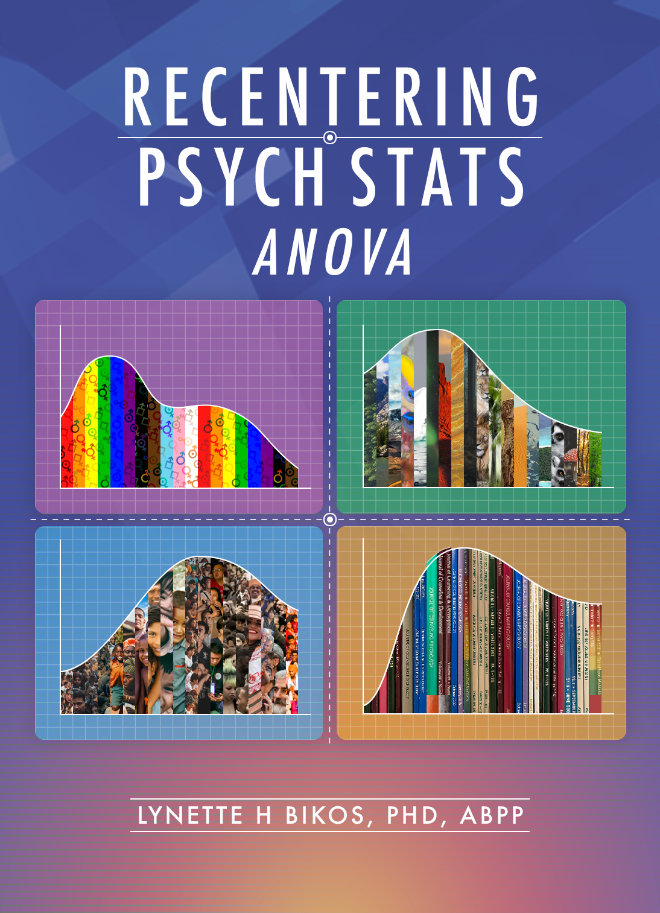

# Preface {-}

**If you are viewing this document, you should know that this is a book-in-progress.  Early drafts are released for the purpose teaching my classes and gaining formative feedback from a host of stakeholders. The document was last updated on `r format (Sys.Date(), '%d %b %Y')`**.  Emerging volumes on other statistics are posted on the [ReCentering Psych Stats](https://lhbikos.github.io/BikosRVT/ReCenter.html) page at my research team's website. 

[Screencasted Lecture Link](https://spu.hosted.panopto.com/Panopto/Pages/Viewer.aspx?id=c932455e-ef06-444a-bdca-acf7012d759a)

To *center* a variable in regression means to set its value at zero and interpret all other values in relation to this reference point. Regarding race and gender, researchers often center male and White at zero. Further, it is typical that research vignettes in statistics textbooks are similarly seated in a White, Western (frequently U.S.), heteronormative, framework. The purpose of this project is to create a set of open educational resources (OER) appropriate for doctoral and post-doctoral training that contribute to a socially responsive pedagogy -- that is, it contributes to justice, equity, diversity, and inclusion. 

Statistics training in doctoral programs are frequently taught with fee-for-use programs (e.g., SPSS/AMOS, SAS, MPlus) that may not be readily available to the post-doctoral professional. In recent years, there has been an increase and improvement in R packages (e.g., *psych*, *lavaan*) used for in analyses common to psychological research. Correspondingly, many graduate programs are transitioning to statistics training in R (free and open source).  This is a challenge for post-doctoral psychologists who were trained with other software. This OER will offer statistics training with R and be freely available (specifically in a GitHub respository and posted through GitHub Pages) under a Creative Commons Attribution - Non Commercial - Share Alike license [CC BY-NC-SA 4.0]. 

Training models for doctoral programs in HSP are commonly scholar-practitioner, scientist-practitioner, or clinical-scientist.  An emerging model, the *scientist-practitioner-advocacy* training model incorporates social justice advocacy so that graduates are equipped to recognize and address the sociocultural context of oppression and unjust distribution of resources and opportunities [@mallinckrodt_scientist-practitioner-advocate_2014]. In statistics textbooks, the use of research vignettes engages the learner around a tangible scenario for identifying independent variables, dependent variables, covariates, and potential mechanisms of change. Many students recall examples in Field's  [-@field_discovering_2012] popular statistics text:  Viagra to teach one-way ANOVA, beer goggles for two-way ANOVA, and bushtucker for repeated measures.  What if the research vignettes were more socially responsive? 

In this OER, research vignettes will be from recently published articles where: 

* the author’s identity is from a group where scholarship is historically marginalized (e.g., BIPOC, LGBTQ+, LMIC[low-middle income countries]), 
* the research is responsive to issues of justice, equity, inclusion, diversity, 
* the lesson’s statistic is used in the article, and 
* there is sufficient information in the article to simulate the data for the chapter example(s) and practice problem(s); or it is publicly available.  

In training for multicultural competence, the saying, "A fish doesn't know that it's wet" is often used to convey the notion that we are often unaware of our own cultural characteristics. In recent months and years, there has been an increased awakening to the institutional and systemic racism that our systems are perpetuating. Queuing from the water metaphor, I am hopeful that a text that is recentered in the ways I have described can contribute to *changing the water* in higher education and in the profession of psychology.


## Copyright with Open Access {-}
<a rel="license" href="http://creativecommons.org/licenses/by-nc-sa/4.0/"></a>

This book is published under a a <a rel="license" href="http://creativecommons.org/licenses/by-nc-sa/4.0/">Creative Commons Attribution-NonCommercial-ShareAlike 4.0 International License</a>. This means that this book can be reused, remixed, retained, revised and redistributed (including commercially) as long as appropriate credit is given to the authors. If you remix, or modify the original version of this open textbook, you must redistribute all versions of this open textbook under the same license - CC BY-SA.

A [GitHub open-source repository](https://github.com/lhbikos/ReCenterPsychStats) contains all of the text and source code for the book, including data and images. 

# ACKNOWLEDGEMENTS {-}

As a doctoral student at the University of Kansas (1992-2005), I learned that "a foreign language" was required for graduation. *Please note that as one who studies the intersections of global, vocational, and sustainable psychology, I regret that I do not have language skills beyond English.* This could have been met with credit from high school my rural, mid-Missouri high school did not offer such classes. This requirement would have typically been met with courses taken during an undergraduate program -- but my non-teaching degree in the University of Missouri's School of Education was exempt from this. The requirement could have also been met with a computer language (fortran, C++) -- I did not have any of those either. There was a tiny footnote on my doctoral degree plan that indicated that a 2-credit course, "SPSS for Windows" would substitute for the language requirement.  Given that it was taught by my one of my favorite professors, I readily signed up. As it turns out, Samuel B. Green, PhD, was using the course to draft chapters in the textbook [@green_using_2014] that has been so helpful for so many. Unfortunately, Drs. Green (1947 - 2018) and Salkind (2947 - 2017) are no longer with us. I have worn out numerous versions of their text. Another favorite text of mine was Dr. Barbara Byrne's [-@byrne_structural_2016], "Structural Equation Modeling with AMOS." I loved the way she worked through each problem and paired it with a published journal article, so that the user could see how the statistical evaluation fit within the larger project/article. I took my tea-stained text with me to a workshop she taught at APA and was proud of the signature she added to it (a little catfur might have fallen out).  Dr. Byrne created SEM texts for a number of statistical programs (e.g., LISREL, EQS, MPlus). As I was learning R, I wrote Dr. Byrne, asking if she had an edition teaching SEM/CFA with R. She promptly wrote back, saying that she did not have the bandwidth to learn a new statistics package.  We lost Dr. Byrne in December 2020. I am so grateful to these role models for their contributions to my statistical training.  I am also grateful for the doctoral students who have taken my courses and are continuing to provide input for how to improve the materials.

The inspiration for training materials that re*center statistics and research methods came from the [Academics for Black Survival and Wellness Initiative](https://www.academics4blacklives.com/). This project, co-founded by Della V. Mosley, Ph.D., and Pearis L. Bellamy, M.S., made clear the necessity and urgency for change in higher education and the profession of psychology. 

At very practical levels, I am indebted to SPU's Library, and more specifically, SPU's Education, Technology, and Media Department.  Assistant Dean for Instructional Design and Emerging Technologies, R. John Robertson, MSc, MCS, has offered unlimited consultation, support, and connection. Senior Instructional Designer in Graphics & Illustrations, Dominic Wilkinson, designed the logo and bookcover.  Psychology and Scholarly Communications Librarian, Kristin Hoffman, MLIS, has provided consultation on topics ranging from OERS to citations. I am alo indebted to Associate Vice President, Teaching and Learning at Kwantlen Polytechnic University, Rajiv Jhangiani, PhD. Dr. Jhangiani's text [-@jhangiani_research_2019] was the first OER I ever used and I was grateful for his encouraging conversation.

Financial support for this text has been provided from the *Call to Action on Equity, Inclusion, Diversity, Justice, and Social Responsivity
Request for Proposals* grant from the Association of Psychology Postdoctoral and Internship Centers (2021-2022). 


<!--chapter:end:index.Rmd-->

# Introduction {#ReCintro}

[Screencasted Lecture Link](https://spu.hosted.panopto.com/Panopto/Pages/Viewer.aspx?pid=cc9b7c0d-e5c3-4e4e-a469-acf7013ee761)

## What to expect in each chapter

This textbook is intended as *applied,* in that a primary goal is to help the scientist-practitioner-advocate use a variety of statistics in research problems and *writing them up* for a program evaluation, dissertation, or journal article. In support of that goal, I try to provide just enough conceptual information so that the researcher can select the appropriate statistic (i.e., distinguishing between when ANOVA is appropriate and when regression is appropriate) and assign variables to their proper role (e.g., covariate, moderator, mediator).

This conceptual approach does include occasional, step-by-step, *hand-calculations* (only we calculate them arithmetically in R) to provide a *visceral feeling* of what is happening within the statistical algorithm that may be invisible to the researcher.  Additionally, the conceptual review includes a review of the assumptions about the characteristics of the data and research design that are required for the statistic. Statistics can be daunting, so I have worked hard to establish a *workflow* through each analysis. When possible, I include a flowchart that is referenced frequently in each chapter and assists the the researcher keep track of their place in the many steps and choices that accompany even the simplest of analyses.

As with many statistics texts, each chapter includes a *research vignette.* Somewhat unique to this resource is that the vignettes are selected from recently published articles. Each vignette is chosen with the intent to meet as many of the following criteria as possible:

* the statistic that is the focus of the chapter was properly used in the article,
* the author’s identity is from a group where scholarship is historically marginalized (e.g., BIPOC, LGBTQ+, LMIC [low middle income countries]),
* the research has a justice, equity, inclusion, diversity, and social responsivity focus and will contribute positively to a social justice pedagogy, and 
* the data is available in a repository or there is sufficient  information in the article to simulate the data for the chapter example(s) and practice problem(s).  

In each chapter we employ *R* packages that will efficiently calculate the statistic and the dashboard of metrics (e.g., effect sizes, confidence intervals) that are typically reported in psychological science.

## Strategies for Accessing and Using this OER

There are a number of ways you can access this resource. You may wish to try several strategies and then select which works best for you.  I demonstrate these in the screencast that accompanies this chapter.

1. Simply follow along in the .html formatted document that is available on via GitHug Pages, and then
   * open a fresh .rmd file of your own, copying (or retyping) the script  and running it 
2. Locate the original documents at the [GitHub repository](https://github.com/lhbikos/ReCenterPsychStats) . You can
   * open them to simply take note of the "behind the scenes" script
   * copy/download individual documents that are of interest to you
   * fork a copy of the entire project to your own GitHub site and further download it (in its entirety) to your personal workspace. The [GitHub Desktop app](https://desktop.github.com/) makes this easy!
3. Listen to the accompanying lectures (I think sound best when the speed is 1.75). The lectures are being recorded in Panopto and should include the closed captioning.
4. Provide feedback to me!  If you fork a copy to your own GitHub repository, you can 
   * open up an editing tool and mark up the document with your edits,
   * start a discussion by leaving comments/questions, and then
   * sending them back to me by committing and saving.  I get an e-mail notiying me of this action.  I can then review (accepting or rejecting) them and, if a discussion is appropriate, reply back to you.

## If You are New to R

R can be oveRwhelming. Jumping right into advanced statistics might not be the easiest way to start. However, in these chapters, I provide complete code for every step of the process, starting with uploading the data. To help explain what R script is doing, I sometimes write it in the chapter text; sometimes leave hastagged-comments in the chunks; and, particularly in the accompanying screencasted lectures, try to take time to narrate what the R script is doing.  

I've found that, somewhere on the internet, there's almost always a solution to what I'm trying to do. I am frequently stuck and stumped and have spent hours searching the internet for even the tiniest of things.  When you watch my videos, you may notice that in my R studio, there is a "scRiptuRe" file. I takes notes on the solutions and scripts here -- using keywords that are meaningful to me so that when I need to repeat the task, I can hopefully search my own prior solutions and find a fix or a hint.

### Base R

The base program is free and is available here:  https://www.r-project.org/  

Because R is already on my machine (and because the instructions are sufficient), I will not walk through the instllation, but I will point out a few things.

* Follow the instructions for your operating system (Mac, Windows, Linux)
* The "cran" (I think "cranium") is the *Comprehensive R Archive Network.*  In order for R to run on your computer, you have to choose a location.  Because proximity is somewhat related to processing speed, select one that is geographically "close to you." 
* You will see the results of this download on your desktop (or elsewhere if you chose to not have it appear there) but you won't ever use R through this platform.

### R Studio

*R Studio* is the desktop application I work in R.  It's a separate download. Choose the free, desktop, option that is appropriate for your operating system:   https://www.rstudio.com/products/RStudio/

* Upper right window:  Includes several tabs; we frequently monitor the
  + Environment: it lists the *objects* that are available to you (e.g., dataframes)
* Lower right window: has a number of helpful tabs.
  + Files:  Displays the file structure in your computer's environment.  Make it a practice to (a) organize your work in small folders and (b) navigating to that small folder that is holding your project when you are working on it.
  + Packages:  Lists the packages that have been installed.  If you navigate to it, you can see if it is "on."  You can also access information about the package (e.g., available functions, examples of script used with the package) in this menu.  This information opens in the Help window.
  + Viewer and Plots are helpful, later, when we can simultaneously look at our output and still work on our script.
* Primary window
  + R Studio runs in the background(in the console).  Very occasionally, I can find useful troubleshooting information here.
  + More commonly, I open my R Markdown document so that it takes the whole screen and I work directly, right here.
* *R Markdown* is the way that many analysts write *script*, conduct analyses, and even write up results.  These are saved as .rmd files.
  + In R Studio, open an R Markdown document through File/New File/R Markdown
  + Specify the details of your document (title, author, desired ouput)
  + In a separate step, SAVE this document (File/Save] into a NEW FILE FOLDER that will contain anything else you need for your project (e.g., the data).
  + *Packages* are at the heart of working in R.  Installing and activating packages require writing script.

### R Hygiene

Many initial problems in R can be solved with good R hygiene. Here are some suggestions for basic practices.  It can be tempting to "skip this."  However, in the first few weeks of class, these are the solutions I am presenting to my students.

#### Everything is documented in the .rmd file

Although others do it differently, everything is in my .rmd file. That is, for uploading data and opening packages I write the code in my .rmd file.  Why?  Because when I read about what I did hours or years later, I have a permanent record of very critical things like (a) where my data is located, (b) what version I was using, and (c) what package was associated with the functions.

#### File organization

File organization is a critical key to this:

* Create a project file folder.
* Put the data file in it.
* Open an R Markdown file.
* Save it in the same file folder.
* When your data and .rmd files are in the same folder (not your desktop, but a shared folder), they can be connected.

#### Chunks

The R Markdown document is an incredible tool for integrating text, tables, and analyses.  This entire OER is written in R Markdown.  A central feature of this is "chunks."

The easiest way to insert a chunk is to use the INSERT/R command at the top of this editor box.  You can also insert a chunk with the keyboard shortcut:  CTRL/ALT/i

"Chunks" start and end with with those three tic marks and will show up in a shaded box, like this:

```{r title for the chunk contents}
#hashtags let me write comments to remind myself what I did
#here I am simply demonstrating arithmetic (but I would normally be running code)
2021 - 1966
```

Each chunk must open and close.  If one or more of your tic marks get deleted, your chunk won't be read as such and your script will not run.  The only thing in the chunks should be script for running R; you can hashtag-out script so it won't run.

Although unnecessary, you can add a brief title for the chunk in the opening row, after the "r."  These create something of a table of contents of all the chunks -- making it easier to find what you did.  You can access them in the "Chunks" tab at the bottom left of R Studio. If you wish to knit a document, you cannot have identical chunk titles.

You can put almost anything you want in the space outside of tics.  Syntax for simple formatting in the text areas (e.g,. using italics, making headings, bold, etc.) is found here:  https://rmarkdown.rstudio.com/authoring_basics.html


#### Packages

As scientist-practitioners (and not coders), we will rely on *packages* to do our work for us. At first you may feel overwhelmed about the large number of packages that are available. Soon, though, you will become accustomed to the ones most applicable to our work (e.g., psych, tidyverse, lavaan, apaTables).

Researchers treat packages differently. In these lectures, I list all the packages we will use in an opening chunk that asks R to check to see if the package is installed, and if not, installs it.  

```{r checking for packages}
if(!require(psych)){install.packages("psych")}
```

To make a package operable, you need to open it through the library.  This process must be repeated each time you restart R. I don't open the package (through the "library(package_name)") command until it is time to use it.  Especially for new users, I think it's important to connect the functions with the specific packages.

```{r opening psych, package, message=FALSE, warning=FALSE}
#install.packages ("psych")
library (psych)
```

If you type in your own "install.packages" code, hashtag it out once it's been installed.  It is problematic to continue to re-run this code .

#### Knitting

An incredible feature of R Markdown is its capacity to *knit* to HTML, powerpoint, or word. If you access the .rmd files for this OER, you can use annotate or revise them to suit your purposes.  If you redistribute them, though, please honor the Creative Commons Attribution-NonCommercial-ShareAlike 4.0 International License with a citation.

### tRoubleshooting in R maRkdown

Hiccups are normal.  Here are some ideas that I have found useful in getting unstuck.

* In an R script, you must have everything in order -- Every. Single. Time. 
  + All the packages have to be in your library and activated; if you restart R, you need to reload each package.
  + If you open an .rmd file and want a boxplot, you cannot just scroll down to that script.  You need to run any *prerequisite* script (like loading the package, importing data, putting the data in the global environment, etc.)
  + Do you feel lost?  clear your global environment (broom) and start at the top of the R script. Frequent, fresh starts are good.
* Your .rmd file and your data need to be stored in the same file folder.  These should be separate for separate projects, no matter how small.
* Type any warnings you get into a search engine.  Odds are, you'll get some decent hints in a manner of seconds.  Especially at first, these are common errors:
  + The package isn't loaded (if you restarted R, you need to reload your packages)
  + The .rmd file has been saved yet, or isn't saved in the same folder as the data
  + Errors of punctuation or spelling
* Restart R (it's quick -- not like restarting your computer)
* If you receive an error indicating that a function isn't working or recognized, and you have loaded the package, type the name of the package in front of the function with two colons (e.g., psych::describe(df). If multiple packages are loaded with functions that have the same name, R can get confused.

### stRategies for success

* Engage with R, but don't let it overwhelm you.
  + The *mechanical is also the conceptual*. Especially when it is *simpler*, do try to retype the script into your own .rmd file and run it. Track down the errors you are making and fix them.
  + If this stresses you out, move to simply copying the code into the .rmd file and running it.  If you continue to have errors, you may have violated one of the best practices above (Is the package loaded? Are the data and .rmd files in the same place? Is all the prerequisite script run?).
  + Still overwhelmed?  Keep moving forward by downloading a copy of the .rmd file that accompanies any given chapter and just "run it along" with the lecture. Spend your mental power trying to understand what each piece does. Then select a practice problem that is appropriate for your next level of growth. 
* Copy script that works elsewhere and replace it with your datafile, variables, etc.  
* The leaRning curve is steep, but not impossible.  Gladwell[-@gladwell_outliers_2008] reminds us that it takes about 10,000 hours to get GREAT at something (2,000 to get reasonably competent). Practice. Practice. Practice.
* Updates to R, R Studio, and the packages are NECESSARY, but can also be problematic.  It could very well be that updates cause programs/script to fail (e.g., "X has been deprecated for version X.XX").  Moreover, this very well could have happened between my distribution of these resources and your attempt to use it.  My personal practice is to update R, R Studio, and the packages a week or two before each academic term.
* Embrace your downward dog.  Also, walk away, then come back.
  

### Resources for getting staRted

R for Data Science:  https://r4ds.had.co.nz/

R Cookbook:  http://shop.oreilly.com/product/9780596809164.do

R Markdown homepage with tutorials:  https://rmarkdown.rstudio.com/index.html

R has cheatsheets for everything, here's one for R Markdown:  https://www.rstudio.com/wp-content/uploads/2015/02/rmarkdown-cheatsheet.pdf 

R Markdown Reference guide:  https://www.rstudio.com/wp-content/uploads/2015/03/rmarkdown-reference.pdf

Using R Markdown for writing reproducible scientific papers:  https://libscie.github.io/rmarkdown-workshop/handout.html 

LaTeX equation editor:  https://www.codecogs.com/latex/eqneditor.php

<!--chapter:end:01-Introduction.Rmd-->

# Ready_Set_R {#Ready}

[Screencasted Lecture Link](https://spu.hosted.panopto.com/Panopto/Pages/Viewer.aspx?pid=6b27a60c-edcb-4565-aaf1-ad890174586e) 
 
```{r  include=FALSE}
knitr::opts_chunk$set(echo = TRUE)
knitr::opts_chunk$set(comment = NA) #keeps out the hashtags in the knits
options(scipen=999)#eliminates scientific notation
```

With the goal of creating a common, system-wide approach to using the platform, this lesson is primarily created for CPY and I/O doctoral students who are entering the "stats sequence."I hope it will also be useful for others (including faculty) who are also making the transition to R. 
 
## Navigating this Lesson

There is about 45 minutes of lecture.  

While the majority of R objects and data you will need are created within the R script that sources the chapter, occasionally there are some that cannot be created from within the R framework. Additionally, sometimes links fail.  All original materials are provided at the [Github site](https://github.com/lhbikos/ReCenterPsychStats) that hosts the book. More detailed guidelines for ways to access all these materials are provided in the OER's [introduction](#ReCintro)

### Learning Objectives

Learning objectives from this lecture include the following:

* Downloading/installing R's parts and pieces.
* Using R-Markdown as the interface for running R analyses and saving the script.
* Recognizing and adopting best practices for "R hygiene."
* Identifying effective strategies for troubleshooting R hiccups.

##  downloading and installing R

### So many paRts and pieces

Before we download, it may be helpful to understand some of R's many parts and pieces.

The base software is free and is available [here](https://www.r-project.org/)  

Because R is already on my machine (and because the instructions are sufficient), I will not walk through the demo, but I will point out a few things.

* The "cran" (I think "cranium") is the *Comprehensive R Archive Network.*  In order for R to run on your computer, you have to choose a location -- and it should be geographically "close to you." 
  + Follow the instructions for your operating system (Mac, Windows, Linux)
  + You will see the results of this download on your desktop (or elsewhere if you chose to not have it appear there) but you won't ever use R through this platform.
* [R Studio](https://www.rstudio.com/products/RStudio/) is the way in which we operate R.  It's a separate download. Choose the free, desktop, option that is appropriate for your operating system:   
* *R Markdown* is the way that many analysts write *script*, conduct analyses, and even write up results.  These are saved as .rmd files.
  + In R Studio, open an R Markdown document through File/New File/R Markdown
  + Specify the details of your document (title, author, desired ouput)
  + In a separate step, SAVE this document (File/Save] into a NEW FILE FOLDER that will contain anything else you need for your project (e.g., the data).
  + *Packages* are at the heart of working in R.  Installing and activating packages require writing script.
  
**Note** If you have an enterprise-owned machine (e.g,. in my specific context, if you are a faculty/staff or have a lab with an SPU-issued laptops) there are complications caused by how documents are stored. You will likely need to consult with your computer and technology support office.
  
### oRienting to R Studio (focusing only on the things we will be using first and most often)

* Upper right window
  + Environment:  lists the *objects* that are available to you (e.g., dataframes)
* Lower right window
  + Files:  Mimics your computer's environment.  Make it a practice to (a) organize your work in small folders and (b) navigating to that small folder that is holding your project when you are working on it.
  + Packages:  Lists the packages that have been installed.  If you navigate to it, you can see if it is "on."  You can also access information about the package (e.g., available functions, examples of script used with the package) in this menu.  This information actually opens in the Help window.
  + Viewer and Plots are helpful, later, when we can simultaneously look at our output and still work on our script.
* Primary window
  + R Studio runs in the background.  Very occasionally, I can find useful troubleshooting information here.
  + More commonly, I open my R Markdown document so that it takes the whole screen and I work directly, right here.
  
## best pRactices

### Setting up the file

* Create a project file folder.
* Put the data file in it.
* Open an R Markdown file.
* Save it in the same file folder.

### Script in chunks and everything else in the "inline text" sections

The only thing in the chunks should be script for running R.  You can also hashtag-out script so it won't run.

You can put almost anything you want in the "inline text with simple formatting."  Syntax for simple formatting in the text areas (e.g,. using italics, making headings, bold, etc.) is found here:  https://rmarkdown.rstudio.com/authoring_basics.html

"Chunks" start and end with with those three little tic marks and will show up in a shaded box.  Chunks have three symbols in their upper right.  Those controls will DISAPPEAR (if there are "```" )and your script wont run) if those tic marks are missing or showing up in the wrong place.

The easiest way to insert a chunk is to use the INSERT/R command at the top of this editor box.  You can also insert a chunk with the keyboard shortcut:  CTRL/ALT/i

### Managing packages

Note that I have hashtags in front my "install.packages" commands.  This is because I have already installed them.  

* You can run the script by temporarily removing the hashtag and running each command individually by placing your cursor at the end of the line of code and entering CNTRL/ENTER as a keyboard shortcut.  
* You can run the entire chunk by selecting the green arrow in the upper right of the chunk.
* You can run all the script prior to any chunk by clicking the middle symbol (grey down arrow)

ONCE A PACKAGE HAS BEEN INSTALLED, replace the hashtag.  It makes a mess to continue to re-run this code for installing packages (after they have already been installed).  

To make a package operable, you need to open it through the library.  This process must be repeated EACH TIME YOU RESTART R.

```{r message=FALSE, warning=FALSE}
#install.packages ("foreign")
#install.packages ("psych")
library (psych)
```

It takes awhile to learn which package is used for which task. A complete analysis (e.g., preliminary statistics, primary statistics, creating tables and figures) will require a number of packages. Many researchers like to list them all at in a complete section near the top of an .rmd file. In my lessons, I will include an "install-if-needed" section at the top that (hopefully) includes all the packages we use. My personal practice is to open the package (using the "library(package)" command) as I need it.  For me this serves two purposes:

* It helps me remember (and continue to learn) which package is used for which task, and
* (Possibly) helps prevent packages who share function names to not get confused with each other.
  - Another best practice for avoiding this problem is to name the package with two colons in front of the function (psych::describe)

Below is an example of the script that will appear near the beginning of each lesson. When the hashtags are removed, it checks to see if these packages are available to the user.

```{r }
#will install the package if not already installed
#if(!require(foreign)){install.packages("foreign")} #makes it possible to import data from packages, especially SPSS
#if(!require(psych)){install.packages("psych")} #psych package is useful for a variety of things we do
```

### Upload the data 

When conducted properly, the data will appear as an object in the global environment.  

In the context of this OER, I will be simulating data right in each lesson for use in the lesson. This makes the web-based platform more *portable.* This means that when working the problems in the chapter we do not (a) write the data to a file and (b) import data from files. Because these are essential skills, I will demonstrate this process here -- starting with simulating data.

At this point, simulating data is beyond the learning goals I have established for the chapter.  I do need to include the code so that we get some data. The data I am simulating is used in the [one-way ANOVA lesson](#oneway). The data is from the Tran and Lee [-@tran_you_2014] random clinical trial. 

In this simulation, I am simply creating an ID number, a condition (High, Low, Control), and a score on the dependent variable, "Accurate." More information about this study is included in the [one-way ANOVA chapter](#oneway). 

```{r }
#Note, this simulation results in a different datsetthan is in the OnewayANOVA lesson
set.seed(2021) #sets a random seed so that we get the same results each time
Accurate <- c(rnorm(30, mean=1.18, sd=0.80), rnorm(30, mean=1.83, sd = 0.58), rnorm(30, mean = 1.76, sd = 0.56))#sample size, M and SD for each group
Accurate[Accurate>3]<-3 #set upper bound for DV
Accurate[Accurate<0]<-0 #set lower bound for DV
ID<-factor(seq(1,90)) #IDs for participants
COND<-c(rep("High", 30), rep("Low", 30), rep("Control", 30)) #name factors and identify how many in each group; should be in same order as first row of script
Acc_sim30 <-data.frame(ID, COND, Accurate) #groups the 3 variables into a single df:  ID#, DV, condition
```

At this point, this data lives only in this .rmd file after the above code is run. Although there are numerous ways to export and import data, I have a preference for two.  

#### To and from .csv files

The first is to write the data to a .csv file. In your computer's environment (outside of R), these files are easily manipulated in Excel. I think of them as being "Excel lite" because although Excel can operate them, they lack some of the more advanced features of an Excel spreadsheet.

In the code below, I identify the R object "Acc_sim30" and give it a filename, "to_CSV.csv".  This filename must have the .csv extension.  I also indicate that it should preserve the column names (but ignore row names; since we don't have row names).

This file will save in the same folder as wherever you are using this .rmd file.

```{r}
#to write it to an outfile as a .csv
write.table(Acc_sim30, file="to_CSV.csv", sep=",", col.names=TRUE, row.names=FALSE)
```

Importing this object back into the R environment can be accomplished with some simple code. For the sake of demonstration, 

```{r}
#to save the df as an .csv (think "Excel lite") file on your computer; it should save in the same file as the .rmd file you are working with
from_CSV <- read.csv ("to_CSV.csv", header = TRUE)
```

The advantage of working with .csv files is that it is then easy to inspect and manipulate them without R.  The disadvantage of .csv files is that each time they are imported they lose any formatting you may have meticulously assigned to them. 


#### To and from .rds files

While it is easy enough to rerun the code (or copy it from data prep .rmd and paste it into an .rmd you are using for advanced analysis), there is an easier way!  This is to save the data as an R object.  This preserves all the characteristics of the data.

```{r}
#to save the df as an .rds file on your computer; it should save in the same file as the .rmd file you are working with
saveRDS(Acc_sim30, "to_Robject.rds")
```

This file will save to your computer (and you can send it to colleagues). However, it is not easy to "just open it" in Excel. To open an .rds file and use it (whether you created it or it is sent to you by a colleague), use the following code:

```{r}
from_rds <- readRDS("to_Robject.rds")
```

#### From SPSS files

Your data may come to you in a variety of ways. One of the most common is SPSS. The *foreign* package is popular for importing SPSS data.  Below is code which would import an SPSS file *if I had created one*.  You'll see that this script is hashtagged out because I do not have an SPSS file.  

```{r}
#opening an SPSS file requires the foreign package which I opened earlier
#from_SPSS <- foreign::read.spss ("SPSSdata.sav", use.value.labels = TRUE, to.data.frame = TRUE)
```

## quick demonstRation

Let's run some simple descriptives. In the script below, I am using the *psych* package. Descriptive statistics will appear for all the data in the dataframe and the output will be rounded to three spaces.

```{r}
library(psych)
round(psych::describe(Acc_sim30),3)
```
Because "ID" is the case ID and COND is the factor (high, low, control), the only variable for which this data is sensible is "Accurate."  None-the-less, this provides an example of how to apply a package's function to a dataset.  As we progress through the text we will learn how to manage the data so that we get the specific output we are seeking.

## the knitted file
One of the coolest things about R Markdown is its capacity to *knit* to HTML, PPT, or WORD.  

* In this OER, I am writing the lessons in R markdown (.rmd files), with the package *bookdown* as a helper, and knitting the files to the .html format. In prior years, I knitted these documents to .doc formats.  There are numerous possibilities!
* The package *papaja* is designed to prepare APA manuscripts where the writing, statistics, and references are all accomplished in a single file. This process contributes to replicability and reproducibility.

## tRoubleshooting in R maRkdown

* In a given set of operations, you must run/execute each piece of code in order: every, single, time. That is, all the packages have to be in your library and activated.
  + If you open an .rmd file, you cannot just scroll down to make a boxplot.  You need to run any *prerequisite* script (like loading files, putting the data in the global environment, etc.)
  + Lost?  clear your global environment (broom icon in the upper right) and start over. Fresh starts are good.
* Your .rmd file and your data need to be stored in the same file folder.  These should be separate for separate projects, no matter how small.
* Type any warnings you get into a search engine.  Odds are, you'll get some decent hints in a manner of seconds.  Especially at first, these are common errors:
  + The package isn't loaded
  + The .rmd file hasn't been saved yet, or isn't saved in the same folder as the data
  + Errors of punctuation or spelling
* Restart R (it's quick -- not like restarting your computer)

## just *why* are we tRansitioning to R?

* It (or at least it appears to be) is the futuRe.
* SPSS site (and individual) license are increasingly expensive and limited (e.g., we need Mplus, AMOS, HLM, or R). As package development for R is exploding, we have tools to "do just about anything."
* Most graduate psychology programs are scientist/practitioner in nature and include training in "high end" statistics.  Yet, many of your employing organizations will not have SPSS.  R is a free, universally accessible program, that our graduates can use anywhere.

## stRategies for success

* Engage with R, but don't let it overwhelm you.
  + The *mechanical is also the conceptual*. Especially while it's *simpler*, do try to retype the script into your own .rmd file and run it. Track down the errors you are making and fix them.
  + If this stresses you out, move to simply copying the code into the .rmd file and running it.  If you continue to have errors, you may have violated one of the best practices above (ask, "Is the package activated?" "Are the data and .rmd files in the same place?" "Is all the prerequisite script run?").
  + Still overwhelmed?  Keep moving forward by (retrieving the original.rmd file from the GitHub repository) opening a copy of the .rmd file and just "run it along" with the lecture. Spend your mental power trying to understand what each piece does so you can translate it for any homework assignments. My suggestions for practice aspire to be parallel to the lecture with no sneaky trix.
* Copy script that works elsewhere and replace it with your datafile, variables, etc.  
* The leaRning curve is steep, but not impossible.  Gladwell [-@gladwell_outliers_2008] reminds us that it takes about 10,000 hours to get GREAT at something (2,000 to get reasonably competent). Practice. Practice. Practice.
* Updates to R, R Studio, and the packages are NECESSARY, but can also be temporarily problematic.  It could very well be that updates cause programs/script to fail (e.g., "X has been deprecated for version X.XX").  Moreover, this very well could have happened between our distribution of the lecture and your attempt to use it days later. My practice is to update R, R Studio, and my packages about two weeks prior to the start of each academic term.
* Embrace your downward dog.  Also, walk away, go for a bicycle ride, then come back.
  

## Resources for getting staRted

R for Data Science:  https://r4ds.had.co.nz/

R Cookbook:  http://shop.oreilly.com/product/9780596809164.do

R Markdown homepage with tutorials:  https://rmarkdown.rstudio.com/index.html

R has cheatsheets for everything, here's the one for R Markdown:  https://www.rstudio.com/wp-content/uploads/2015/02/rmarkdown-cheatsheet.pdf 

R Markdown Reference guide:  https://www.rstudio.com/wp-content/uploads/2015/03/rmarkdown-reference.pdf

Using R Markdown for writing reproducible scientific papers:  https://libscie.github.io/rmarkdown-workshop/handout.html 

Script for all of Field's text:  https://studysites.uk.sagepub.com/dsur/study/scriptfi.htm

LaTeX equation editor:  https://www.codecogs.com/latex/eqneditor.php


```{r include=FALSE}
sessionInfo()
```


<!--chapter:end:02-ReadySetR.Rmd-->

# waRming up {#waRmups}

[Screencasted Lecture Link](https://spu.hosted.panopto.com/Panopto/Pages/Viewer.aspx?pid=45cedbad-3504-439b-a9b2-ad89017fcc5a) 
 
```{r include=FALSE}
knitr::opts_chunk$set(echo = TRUE)
knitr::opts_chunk$set(comment = NA) #keeps out the hashtags in the knits
```

```{r include=FALSE}
options(scipen=999)#eliminates scientific notation
```

The beginning of any data analysis means familiarizing yourself with the data, that is, its distributional characteristics as well as its relations. 
 

## Navigating this Lesson

There is about 25 minutes of lecture.  

While the majority of R objects and data you will need are created within the R script that sources the chapter, occasionally there are some that cannot be created from within the R framework. Additionally, sometimes links fail.  All original materials are provided at the [Github site](https://github.com/lhbikos/ReCenterPsychStats) that hosts the book. More detailed guidelines for ways to access all these materials are provided in the OER's [introduction](#ReCintro)

### Learning Objectives

Learning objectives from this lecture include the following:

* Produce descriptive statistics (means, standard deviations, skew, kurtosis), and correlation matrix, with the *psych* package
* Produce plots of data
* Interpret skew, kurtosis, correlations
* Create an APA Style table and results section that includes means, standard deviations, and correlations

### Planning for Practice

This is designed as a "get (back) into it" assignment.  You will essentially work through this very same lecture, using the same dataframe -- just a different set of continuous variables.

### Readings & Resources

In preparing this chapter, I drew heavily from the following resource(s). Other resources are cited (when possible, linked) in the text with complete citations in the reference list.

* Revelle, W. (2020). An introduction to the psych package: Part I: data entry and data description.
  - Revelle is the author/creator of the *psych* package. His tutorial provides both technical and interpretive information. Read pages 1-17.
* Lui, P. P. (2020). Racial Microaggression, Overt Discrimination, and Distress: (In)Direct Associations With Psychological Adjustment. *The Counseling Psychologist, 32*.
  - This is the research vignette from which I simulate data that we can use in the lesson and practice problem.
 
```{r  include=FALSE}
#will install the package if not already installed
#if(!require(tidyverse)){install.packages("tidyverse")}
#if(!require(psych)){install.packages("psych")}
#if(!require(apaTables)){install.packages("apaTables")}
#if(!require(MASS)){install.packages("MASS")}
``` 

## Research Vignette

We will use simulated data from Lui [-@lui_racial_2020] for simple data screening. Controlling for overt discrimination and neuroticism, Lui examined the degree to which racial microaggressions contributed to negative affect, alcohol consumption, and drinking problems in African American, Asian American, and Latinx American college students (*N* = 713).

Using the means, standard deviations, correlation matrix, and group sizes (*n*) I simulated the data. While the process of simulation is beyond the learning goals of this lesson (you can skip that part), I include it here so that it is easy to work the rest of the script.

```{r}
set.seed(210807)#sets the random seed so that we consistently get the same results
#for practice, you could change (or remove) the random seed and try to interpret the results (they should be quite similar)
#There are probe more efficient ways to simulate data.
#Given the information available in the manuscript, my approach was to first create the datasets for each of the racial ethnic groups that were provided and then binding them together.

#First, the data for the students who identified as Asian American
Asian_mu <- c(1.52, 1.72, 2.69, 1.71, 2.14, 2.35, 2.42)
Asian_stddev <- c(2.52, 2.04, 0.47, 0.70, 0.80, 2.41, 3.36)
Asian_corMat <- matrix(c(1.00,  0.69,  0.19,  0.28,  0.32,  0.08,  0.23,
                          0.69,  1.00,  0.20,  0.29,  0.33,  0.13,  0.25,
                          0.19,  0.20,  1.00,  0.50,  0.50, -0.04,  0.09,
                          0.28,  0.29,  0.50,  1.00,  0.76,  0.04,  0.18,
                          0.32,  0.33,  0.50,  0.76,  1.00,  0.10,  0.21,
                          0.08,  0.13, -0.04,  0.04,  0.10,  1.00,  0.42,
                          0.23,  0.25,  0.09,  0.18,  0.21,  0.42,  1.00),
                        ncol=7)
Asian_covMat <- Asian_stddev %*% t(Asian_stddev) * Asian_corMat

library(MASS)
Asian_dat <- mvrnorm(n = 398, mu = Asian_mu, Sigma = Asian_covMat, empirical = TRUE)
Asian_df <- as.data.frame(Asian_dat)

library(tidyverse)
Asian_df <- rename(Asian_df, OvDisc = V1, mAggr = V2, Neuro = V3, nAff = V4, psyDist = V5, Alcohol = V6, drProb = V7)
Asian_df$RacEth <- "Asian"

#Second, the data for the students who identified as Black/African American
Black_mu <- c(4.45, 3.84, 2.60, 1.84, 2.10, 2.81, 2.14)
Black_stddev <- c(4.22, 3.08, 0.89, 0.80, 0.81, 2.49, 3.24)
Black_corMat <- matrix(c( 1.00,  0.81,  0.17,  0.15,  0.09,  0.05, -0.16,
              0.81,  1.00,  0.17,  0.21,  0.11,  0.09, -0.01,
              0.17,  0.17,  1.00,  0.59,  0.54,  0.05,  0.24,
              0.15,  0.21,  0.59,  1.00,  0.72,  0.12,  0.22,
              0.09,  0.11,  0.54,  0.72,  1.00,  0.21,  0.40,
              0.05,  0.09,  0.05,  0.12,  0.21,  1.00,  0.65,
              -0.16,-0.01,  0.24,  0.22,  0.40,  0.65,  1.00),
           ncol = 7)
Black_covMat <- Black_stddev %*% t(Black_stddev) * Black_corMat
Black_dat <- mvrnorm(n = 133, mu = Black_mu, Sigma = Black_covMat, empirical = TRUE)
Black_df <- as.data.frame(Black_dat)
Black_df <- rename(Black_df, OvDisc = V1, mAggr = V2, Neuro = V3, nAff = V4, psyDist = V5, Alcohol = V6, drProb = V7)
Black_df$RacEth <- "Black"

#Third, the data for the students who identified as Latinx American
Latinx_mu <- c(1.56, 2.34, 2.69, 1.81, 2.17, 3.47, 2.69)
Latinx_stddev <- c(2.46, 2.49, 0.86, 0.71, 0.78, 2.59, 3.76)
Latinx_corMat <- matrix(c( 1.00,  0.78,  0.27,  0.36,  0.42, -0.06,  0.08,
                           0.78,  1.00,  0.33,  0.26,  0.35, -0.11, -0.02,
                           0.27,  0.33,  1.00,  0.62,  0.64, -0.04,  0.15,
                           0.36,  0.26,  0.62,  1.00,  0.81, -0.08,  0.17,
                           0.42,  0.35,  0.64,  0.81,  1.00, -0.06,  0.15,
                           -0.06,-0.11, -0.04, -0.08, -0.06,  1.00,  0.60,
                           0.08, -0.02,  0.15,  0.17,  0.15,  0.60,  1.00),
                        ncol = 7)
Latinx_covMat <- Latinx_stddev %*% t(Latinx_stddev) * Latinx_corMat
Latinx_dat <- mvrnorm(n = 182, mu = Latinx_mu, Sigma = Latinx_covMat, empirical = TRUE)
Latinx_df <- as.data.frame(Latinx_dat)
Latinx_df <- rename(Latinx_df, OvDisc = V1, mAggr = V2, Neuro = V3, nAff = V4, psyDist = V5, Alcohol = V6, drProb = V7)
Latinx_df$RacEth <- "Latinx"

Lui_sim_df <-bind_rows (Asian_df, Black_df, Latinx_df)
```

If you have simulated the data, you can continue using the the "Lui_sim_df" object that we created.  In your own research you may wish to save data as a file. Although I will hashtag it out (making it inoperable until the hashtags are removed), here is code to save the simulated data both .csv (think "Excel lite") and .rds (it retains all the properties we assigned to it in R) files and then bring/import them back into R. For more complete instructions see the [Ready_Set_R](#Ready) lesson.

```{r}
#write the simulated data  as a .csv
#write.table(Lui_sim_df, file="Lui_CSV.csv", sep=",", col.names=TRUE, row.names=FALSE)
#bring back the simulated dat from a .csv file
#df <- read.csv ("Lui_CSV.csv", header = TRUE)
```

```{r}
#to save the df as an .rds (think "R object") file on your computer; it should save in the same file as the .rmd file you are working with
#saveRDS(Lui_sim_df, "Lui_RDS.rds")
#bring back the simulated dat from an .rds file
#df <- readRDS("Lui_RDS.rds")
```

You may have noticed a couple of things in each of these operations

* First, I named the data object that global environment "df" (i.e., dataframe). 
  - It is a common (but not required) practice for researchers to simply use "df" or "dat" for their R script, no matter the type or source of the data. This practice has advantages (makes reusing code easy) and disadvantages (it's easy to get confused about what data is what).
* Second, if you run the code, the updating *replaces* the prior code. 
  - While this is irrelevant today (we are saving the same data in different ways), it points out the importance of creating a sensible and systematic *order of operations* in your .rmd files and then knowing where you are in the process.
  
Because the data is simulated, I can simply use the data I created in the simulation, however, I will go ahead and use the convention of renaming it, "df."

```{r}
df <- Lui_sim_df
```

Is this R session reading our variables correctly?  Check it with the "structure" command.

```{r}
str (df)
```

Looking back at the Lui [-@lui_racial_2020] article we can presume the following variables (variable/variable name) to have the following structure (scaling/R scaling):

* Discrimination/OvDis:interval/num
  - theoretically someone could experience no discrimination, but it would still score as 1.0 if the scale is averaged and the respondent marked 1 (never or not at all) for all the options.
* Microaggressions/mAggr: interval/num
 - theoretically someone could experience no microaggressions, but it would still score as 1.0 if the scale is averaged and the respondent marked 1 (never; and then not at all [stressful]) for all the options.
* Neuroticism/Neuro: interval/num
* Negative affect/nAff:interval/num
* Psychological distress/psyDist:interval/num
* Hazardous alcohol use/Alcohol:  interval/num
* Drinking problems/drProb:  interval/num
* Race Ethnicity/RacEth:  nominal/chr

Everything is fine except Race Ethnicity which needs to be a factor.  Let's change it and check again.

At this point I need to use the tidyverse package so that I can *mutate()* the RacEth variable to be a factor.

```{r }
# A .csv file is uninformed -- it just holds data (and R guesses what it is); respecifying the type of variable will likely need to be completed each time the file is used.

library(tidyverse)
df <- df %>%
    mutate(
        RacEth = as.factor(RacEth))
```

```{r }
#checking the structure of the data
str(df)
```

Manipulating the dats is an important skill. I can use the *select()* function to obtain certain variable.  I want to select three variables that are continuous and then disaggregate them by race/ethnicity. 

```{r}
library(tidyverse)
#This was struggling to run because there are multiple packages open with a "select" function
#I solved the problem by indicating that I wanted to use the select function from the "dplyr" package
#dplyr is part of the tidyverse package
tiny_df <- df%>%
  dplyr::select(mAggr, nAff, psyDist)
```

We can start with simple descriptives. Revelle's [-@revelle_introduction_2020] *psych* package was made specifically for much of the type of work we do.

```{r }
library(psych)
describe(tiny_df)
```

One of the easiest way to get "counts" of categorical variables is to use them in the *psych* package's *describeBy()* function. In the script below, I am asking for descriptives of the entire df, but disaggregated by RacEth.
```{r}
describeBy (df, df$RacEth, mat=TRUE)
```

### Determining Skew and Kurtosis

To understand whether our data are normally distributed, we can look at skew and kurtosis.  The skew and kurtosis indices in the *psych* package are reported as *z* scores.  Regarding skew, values > 3.0 are generally considered "severely skewed."  Regarding kurtosis, "severely kurtotic" is argued anywhere > 8 to 20 [@kline_principles_2016].

### SPLOM 

SPLOM (scatterplot matrix) is a graphical tool that uses multiple scatterplots to determine the correlation (if any) between a set of variables.  These plots are organized into a matrix, making it easy to see them all at once.

In the *psych* package, the *pairs.panels()* produces these. 

**On diagonal** we see:  

 * histogram of each variable
 * superimposed with a normal curve

**Below diagonal** we see: 

* xy scatter plot (not useful for our categorical RacEth row)
* the *lowess* locally fit regression line
* the X axis represents the column variable; the Y axis, the row variable

**Above diagonal** we see:

* Pearson correlation

```{r }
# the pch = "." command produces a cleaner graphic and is especially useful when there are lots of variables
psych::pairs.panels(tiny_df, pch=".")
```

What do we observe?

* All 3 variables look normally distributed
* relationship between mAggr with nAff and psyDist is quite comparable
* relationship between nAff and psyDist is very strong
* are these correlations significant?  Revelle [-@revelle_introduction_2020] is not a fan of the associated *p* value, but we can get it several ways (hang tight).

Writing up an APA style results section usually involves some sort of table.  A super helpful package for doing this is *apaTables*.  Really cool is the instructional article (pubbed in a peer reviewed journal) that also talks about the contributions of tools like this contributing to the *reproducibility* of science by reducing errors and, if the R script/data are shared how the evaluation process is standardized and therefore reproducible. [@stanley_reproducible_2018].

```{r }
library(apaTables)
```

```{r}
# unlike the psych package, this function removes any categorical variables
Table1_Cor <- apaTables::apa.cor.table(tiny_df, filename = "Table1_Cor.doc", table.number = 1, show.conf.interval = FALSE, landscape = TRUE)

#swap in this command to see it in the console
print(Table1_Cor) 
```
## Results

Our sample included Asian American (*n* = 398), Latinx (*n* = 182), and Black (*n* = 133) participants. Visual inspection of the three variables of interest (negative affect, psychological distress, microaggressions) combined with formal evaluation of skewness and kurtosis suggested univariate normality.  Correlations between negative affect and psychological distress were quite strong; correlations with each of these variables and microaggressions were moderate.  Results are presented in Table 1.


## Practice Problems

The three exercises described below are designed to "meet you where you are" and allow you to challenge your skills depending on your comfort with statistics and R.

Regardless which you choose, you should:

* Create a tiny_df from a larger df
* Calculate and interpret descriptives for the continuously scaled variables
* Create the SPLOM (pairs.panels) of the continuously scaled variables
* Use the *apaTables* package to make an APA style table with means, standard deviations, and correlations
* Write up a mini-results section (APA style)

### Problem #1: Change the Random Seed

If this topic feels a bit overwhelming, simply change the random seed in the data simulation (at the very top), then rework the lesson exactly as written. This should provide minor changes to the data (maybe in the second or third decimal point), but the results will likely be very similar.

|Element                                  | Points Poss   | Points Earned
|:----------------------------------------|:-------------:|:--------------|
|1. Create the tiny_df                    |      3        |               | 
|2. Descriptives of tiny_df               |      3        |               |
|3. SPLOM/pairs.panels                    |      3        |               |
|4. apaTables matrix                      |      3        |               |
|5. Mini-results                          |      5        |               |
|6. Explanation/discussion with a grader  |      5        |               |
|**Totals                                 |     22        |               |   


### Problem #2: 

Use the simulated data from the Lui [-@lui_racial_2020] study. However, select three continuous variables (2 must be different from mine) and then conduct the analyses.

|Element                                  | Points Poss   | Points Earned
|:----------------------------------------|:-------------:|:--------------|
|1. Create the tiny_df                    |      3        |               | 
|2. Descriptives of tiny_df               |      3        |               |
|3. SPLOM/pairs.panels                    |      3        |               |
|4. apaTables matrix                      |      3        |               |
|5. Mini-results                          |      5        |               |
|6. Explanation/discussion with a grader  |      5        |               |
|**Totals                                 |     22        |               |   


### Problem #3: 

Use data for which you have permission and access. This could be IRB approved data you have collected or from your lab; data you simulate from a published article; data from an open science repository; or data from other chapters in this OER.

|Element                                  | Points Poss   | Points Earned
|:----------------------------------------|:-------------:|:--------------|
|1. Create the tiny_df                    |      3        |               | 
|2. Descriptives of tiny_df               |      3        |               |
|3. SPLOM/pairs.panels                    |      3        |               |
|4. apaTables matrix                      |      3        |               |
|5. Mini-results                          |      5        |               |
|6. Explanation/discussion with a grader  |      5        |               |
|**Totals                                 |     22        |               |   

```{r include=FALSE}
sessionInfo()
```


<!--chapter:end:03-waRmup.Rmd-->

---
output:
  word_document: default
  html_document: default
---
# One-way ANOVA {#oneway}

```{r  include=FALSE}
knitr::opts_chunk$set(echo = TRUE)
knitr::opts_chunk$set(comment = NA) #keeps out the hashtags in the knits
options(scipen=999)#eliminates scientific notation
```

[Screencasted Lecture Link](https://spu.hosted.panopto.com/Panopto/Pages/Viewer.aspx?pid=c88f8492-0599-462d-a471-ad8a01702156) 

One-way ANOVA allows the researcher to analyze mean differences between two or more groups on a between-subjects factor.  For the one-way ANOVA, each case (i.e., individual, participant) must have scores on two variables:  a factor and a dependent variable.

The factor must be categorical in nature, dividing the cases into two or more groups or levels.  These levels could be ordered (e.g., placebo, low dose, high dose) or unordered (e.g., cognitive-behavioral, existential, psychodynamic).  The dependent variable must be assessed on a quantitative, continuous dimension.  The ANOVA F test evaluates whether population means on the dependent variable differ across the levels of the factor.

One-way ANOVA can be used in experimental, quasi-experimental, and field studies.  As we work through the chapter we will examine some some of the requirements (assumptions) of the statistic in greater detail.

## Navigating this Lesson

There is about 2 hours of lecture.  If you work through the materials with me plan for another two hours of study.

### Learning Objectives

Learning objectives from this lecture include the following:

* Evaluate the statistical assumptions associated with one-way analysis of variance (ANOVA).
* Describe the relationship between model/between-subjects and residual/within-subjects variance.
* Narrate the steps in conducting a formal one-way ANOVA beginning with testing the statistical assumptions through writing up an APA style results section.
* Conduct a one-way ANOVA in R (including calculation of effect sizes and follow-up to the omnibus).
* Conduct a power analysis for a one-way ANOVA.
* Produce an APA style results section.


### Planning for Practice

In each of these lessons I provide suggestions for practice that allow you to select one or more problems that are graded in difficulty The least complex is to change the random seed and rework the problem demonstrated in the lesson. The results *should* map onto the ones obtained in the lecture. 

The second option comes from the research vignette. The Tran et al. [@tran_you_2014] has two variables where the authors have conducted one-way ANOVAs.  I will demonstrate one (*Accurate*) in this lecture; the second is suggested as homework. 

As a third option, you are welcome to use data to which you have access and is suitable for two-way ANOVA. In either case, you will be expected to:

* test the statistical assumptions
* conduct a one-way ANOVA, including
  - omnibus test and effect size
  - follow-up (pairwise, planned comparisons, polynomial trends)
* write a results section to include a figure and tables

### Readings & Resources

In preparing this chapter, I drew heavily from the following resource(s) that are freely available on the internet.  Other resources are cited (when possible, linked) in the text with complete citations in the reference list.

* Chapter 14, Comparing Several Means (one-Way ANOVA) From Danielle Navarro's [Learning Statistics with R](https://learningstatisticswithr.com/) 
* Chapter 5.5.2, Simulating data for one-way between subjects design with 3 levels from Matthew J. C. Crump's [Programming for Psychologists: Data Creation and Analysis](https://crumplab.github.io/programmingforpsych/simulating-and-analyzing-data-in-r.html#single-factor-anovas-data-simulation-and-analysis)


### Packages

The packages used in this lesson are embedded in this code. When the hashtags are removed, the script below will (a) check to see if the following packages are installed on your computer and, if not (b) install them.
```{r }
#will install the package if not already installed
#if(!require(gplots)){install.packages("gplots")} #easy plotting for simple ANOVA
#if(!require(tidyverse)){install.packages("tidyverse")} #creating new variables and other handy functions
#if(!require(psych)){install.packages("psych")} #for descriptive statistics and writing them as csv files
#if(!require(rstatix)){install.packages("rstatix")} #a number of wrappers for ANOVA models; today for evaluating the Shapiro
#if(!require(lsr)){install.packages("lsr")} #produces effect sizes
#if(!require(pwr)){install.packages("pwr")} #estimating sample sizes and power analysis
#if(!require(apaTAbles)){install.packages("apaTables")} #produces an APA style table for ANOVAs and other models
#if(!require(formattable)){install.packages("formattable")} #produces an APA style table for ANOVAs and other models
#if(!require(effectsize)){install.packages("effectsize")} #produces an APA style table for ANOVAs and other models
```


## Workflow for One-Way ANOVA

The following is a proposed workflow for conducting a one-way ANOVA. 

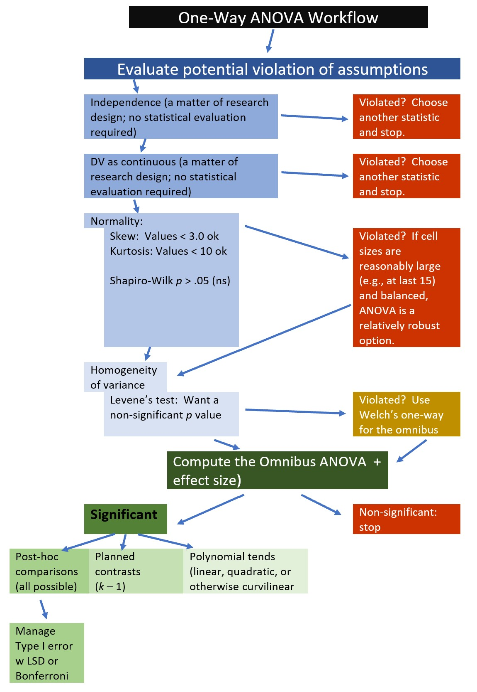 

1. Prepare (upload) data.
2. Explore data
     + graphs
     + descriptive statistics
3. Checking distributional assumptions
     + assessing normality via skew, kurtosis, Shapiro Wilks
     + checking for violation of homogeneity of variance assumption with Levene's test; if we violate this we can use Welch's omnibus ANOVA
4. Compute the omnibus ANOVA (remember to use Welch's if Levene's *p* < .05)
5. Compute post-hoc comparisons, planned contrasts, or polynomial trends
6. Managing Type I error
7. Sample size/power analysis (which you should think about first -- but in the context of teaching ANOVA, it's more pedagogically sensible, here)

## Research Vignette

The *exceptionalizing racial stereotype* is microaggression framed as interpersonally complimentary, but perpetuates negative stereotypical views of a racial/ethnic group. We are using data that is *simulated* from a random clinical trial (RCT) conducted by Tran and Lee [-@tran_you_2014].

The one-way ANOVA examples we are simulating represent the post-only design which investigated three levels of the exceptionalizing stereotype in a sample of Asian American participants. This experimental design involved a confederate (posing as a peer) whose parting comment fell into the low racial loading, high racial loading, or control conditions.

|COND            |Assignment  | Manipulation     |Post-test Observation|
|:---------------|:-----------|:-----------------|:--------------------|
|**Low** racial loading condition (*n* = 22)|Random | Yes: "Nice talking to you. You speak English well." |**Accurate**|
|**High** racial loading (*n* = 23) | Random | Yes: "Nice talking to you. You speak English well for an Asian." |**Accurate**|
|**Control** (*n* = 23)  |Random | No: "Nice talking to you." | **Accurate**|


Tran and Lee [-@tran_you_2014] reported results from two ANOVAs and 4 ANCOVAs, using a pre-test as a covariate. A preprint of their article is available [here](https://pdfs.semanticscholar.org/4146/b528961c041de317c6a4c699f12fc5a4bc22.pdf?_ga=2.179078439.2028716028.1610939782-1660125104.1610939782).

* **Accurate** is the DV we will be exploring in class.  Participants rated how *accurate* they believed their partner's impression of them was (0 = *very inaccurate*, 3 = *very accurate*).
*  **moreTalk** is the DV assigned for homework.  Participants rated how much longer they would continue the interaction with their partner compared to their interactions in general (-2 = *much less than average*, 0 = *average*, 2 = *much more than average*).

### Data Simulation

Simulating data for a one-way ANOVA requires the sample size (rnorm), mean (mean), and standard deviation (sd) for each of the groups [@crump_simulating_2018]. In creating this simulation, I used the data from Table 1 in the Tran and Lee [-@tran_you_2014] article. Having worked the problem several times, I made one change. The group sizes in the original study were 23, 22, and 23. To ensure that we would have statistically significant results in our worked example, I increased the sample sizes to 30 for each group.  In this way we have a perfectly *balanced* (equal cell sizes) design. 

```{r }
#Note, this script results in a different simulation than is in the ReadySetR lesson
set.seed(210820) #sets a random seed so that we get the same results each time
Accurate <- c(rnorm(30, mean=1.18, sd=0.80), rnorm(30, mean=1.83, sd = 0.58), rnorm(30, mean = 1.76, sd = 0.56))#sample size, M and SD for each group
Accurate[Accurate>3]<-3 #set upper bound for DV
Accurate[Accurate<0]<-0 #set lower bound for DV
moreTalk <- c(rnorm(30, mean=-.82, sd=0.91), rnorm(30, mean=-0.39, sd = 0.66), rnorm(30, mean = -0.04, sd = 0.71))#sample size, M and SD for each group
moreTalk[moreTalk>2]<-2 #set upper bound for DV
moreTalk[moreTalk<-2]<--2 #set lower bound for DV
ID<-factor(seq(1,90)) #IDs for participants
COND<-c(rep("High", 30), rep("Low", 30), rep("Control", 30)) #name factors and identify how many in each group; should be in same order as first row of script
accSIM30 <-data.frame(ID, COND, Accurate, moreTalk) #groups the 3 variables into a single df:  ID#, DV, condition
```

## Working the Problem

### Preparing the Data

Examining the data is important for several reasons. First, we can begin to inspect for any anomalies. Second, if we are confused about what statistic we wish to apply, understanding the characteristics of the data can provide clues.  

In R markdown we can

* look at the data by clicking on it, and
* examine its structure with the *str()* function.

Let's do both.

```{r }
str(accSIM30)
```
If we look at this simple dataset, we see that we see that

*  **COND** is a grouping variable) with 3 levels (high, low, control)
   - it is presently in "chr" (character) format, it needs to be changed to be a factor.
*  **Accurate** is a continuous variable
   - it is presently in "num" (numerical) format, this is satisfactory. 
*  **moreTalk** is a continuous variable
   - it is presently in "num" (numerical) format, this is satisfactory.

There are many ways to convert variables to factors; here's one of the simplest.

```{r }
#convert variable  to factor
accSIM30$COND <- factor(accSIM30$COND)
```

Let's recheck the structure

```{r }
str(accSIM30)
```
By default, R orders factors alphabetically.  This means, analysis will assume that "Control" (C) is the lowest condition, then "High," then "Low."  Since these have theoretically ordered values, we want them in the order of "Control," "Low," "High."

Here is the script to create a an ordered factor.

```{r }
#ordering the factor
accSIM30$COND <- factor(accSIM30$COND, levels = c("Control", "Low", "High"))
```

Again, we can check our work.
```{r }
#another structure check
str(accSIM30)
```
Now our variables are suitable for analysis.

At this point, you may wish to export and/or import the data as a .csv (think "Excel lite") or .rds (R object that preserves the information about the variables -- such changing COND to an ordered factor), here is the code to do so.  The data should save in the same folder as the .rmd file. Therefore, it is really important (think good R hygiene) have organized your folders so that your .rmd and datafiles are co-located.

I have hashtagged out the code. If you wish to use it, delete the hashtags. Although I show the .csv code first, my personal preference is to save R data as .rds files.  While they aren't easy to "see" as an independent file, they retain the formatting of the variables. For a demonstration, refer back to the [Ready_Set_R](#Ready) lesson.

```{r}
#write the simulated data  as a .csv
#write.table(accSIM30, file="accSIM.csv", sep=",", col.names=TRUE, row.names=FALSE)
#bring back the simulated dat from a .csv file
#acc_csv <- read.csv ("accSIM.csv", header = TRUE)
```

```{r}
#a quick demo to show that the .csv format loses the variable formatting
#str(acc_csv)
```

```{r}
#to save the df as an .rds (think "R object") file on your computer; it should save in the same file as the .rmd file you are working with
#saveRDS(accSIM30, "accSIM.rds")
#bring back the simulated dat from an .rds file
#acc_RDS <- readRDS("accSIM.rds")
```

```{r}
#a quick demo to show that the .rds format preserves the variable formatting
#str(acc_RDS)
```

Note that I renamed each of these data objects to reflect the form in whic I saved them (i.e., "acc_csv", "acc_RDS"). If you have followed this step, you will want to rename the file before continuing with the rest of the chapter. Alternatively, you can start from scratch, re-run the code to simulate the data, and skip this portion on importing/exporting data.

```{r}
#accSIM30 <- acc_RDS
#or
#accSIM30 <- acc_csv
```


### Exploring the Distributional Characteristics Numerically

Let's continue data exploration. We will do this several ways so that you will have several tools for such exploration.  In this first exploration, I will demonstrate how to grab a quick mean.

```{r }
aggregate (Accurate ~ COND, accSIM30, mean)
```

And now a standard deviation.
```{r }
aggregate (Accurate ~ COND, accSIM30, sd)
```

Before looking at the graphs, we can see that racially loaded *high* condition has the lowest accuracy score and the largest variability.  Let's take a look at the graphs to "see" this.

### Exploring the Distributional Characteristics Graphically

The package *gplots* produces a simple line graph and the script is fairly intuitive.  The *plotmeans()* function plots the means with error bars (95% confidence intervals) around the mean.  Regarding the confidence intervals, we can think, "How confident are we that the mean is this particular value?"  Earlier we noted that the "high racial loading condition" had the lowest mean and the widest variability.  Is this apparent from the graph?

```{r }
library(gplots)
plotmeans (formula = Accurate ~ COND, #plots DV by IV
           data = accSIM30, #identifies the data frame
           xlab = "Racial Loading Condition", #let's us specify a label for the x-axis
           ylab = "Accuracy of Confederate's Impression", #let's us specify a label for the y-axis
           n.label = TRUE  #we can even specify the sample size for each level of the group
           )

#this code could be more elegantly written in one row
#plotmeans (formula = Accurate ~ COND, data = accSIM30, xlab = "Racial Loading Condition", ylab = "Accuracy of Confederate's Impression", n.label = TRUE)
```

Boxplots, with the *boxplot2()* function provide another view of our data.  In boxplots the center value is the median.  The box spans the *interquartile range* and ranges from the 25th to the 75th percentile. The whiskers cover 1.5 times the interquartile range. When this does not capture the entire range, outliers are represented with dots.

```{r }
boxplot2 (Accurate ~ COND, data = accSIM30, xlab = "Racial Loading Condition", ylab = "Accuracy of Confederate's Impression", n.label = TRUE)
```

From both the boxplot and the linegraph with error bars, we can see that participants in the low racial loading condition have the highest accuracy ratings.  This is followed by the control and then high racial loading conditions.  Are these differences statistically significant? This is why we need the one-way ANOVA.

## Understanding ANOVA with *Hand Calculations*

ANOVA was developed by Sir Ronald Fisher in the early 20th century.  The name is a bit of a misnomer -- rather than analyzing *variances*, we are investigating differences in *means* (but the formula does take variances into consideration...stay tuned).

ANOVA falls squarely within the tradition of **null hypothesis significance testing** (NHST). As such, a formal, traditional, ANOVA begins with statements of the null and alternate hypotheses. *Note. Tran and Lee [-@tran_you_2014] do not list such.*

In our example, we would hypothesize that the population means (i.e., Asian or Asian American individuals in the U.S.) are equal:

$$H_{O}:  \mu _{1} = \mu _{2} = \mu _{3}$$

There are an number of ways that the $H_{O}$ could be false.  Here are a few:

$$H_{a1}:  \mu _{1} \neq \mu _{2} \neq \mu _{3}$$
$$H_{a2}:  \mu _{1} =  \mu _{2} > \mu _{3}$$

$$H_{a3}:  \mu _{1} >  \mu _{2} > \mu _{3}$$
The bottom line is that if we have a statistically significant omnibus ANOVA (i.e., the test of the overall significance of the model) and the $H_{O}$ is false, somewhere between the three levels of the grouping factor, the means are statistically significantly different from each other. 

In evaluating the differences between means, one-way ANOVA compares:

* systematic variance to unsystematic variance
* explained to unexplained variation
* experimental effect to the individual differences
* model variance to residual variance
* between group variance to within group variance

The ratio of these variances is the **F-ratio**.

Navarro [-@navarro_book_2020] offers a set of useful figures to compare between- and within-group variation.


```{r  fig.cap="Graphical illustration of \"between groups\" variation", echo=FALSE}
	width <- 7
	height <- 4
	# params
	mu <- c(-4, -.25, 3.5)
	sig <- 2

	# data
	x <- seq(-3,3,.1)
	x1 <- x*sig + mu[1]
	x2 <- x*sig + mu[2]
	x3 <- x*sig + mu[3]
	y1 <- dnorm( x1, mu[1], sig )
	y2 <- dnorm( x2, mu[2], sig )
	y3 <- dnorm( x3, mu[3], sig )

	# set up window
	plot.new() # create graphics device
	plot.window(xlim = c(-10,10), ylim = c(0,.25)) # define plot area
	axis(side = 1, # axis located below
	     col = "gray20",  # coloured gray
	     at = c(-10,mu,10), # tick marks located at
	     labels = c("","group 1","group 2","group 3","")
	)  

	# plot densities
	lines(x1,y1, type = "l", col = "gray20")
	lines(x2,y2, type = "l", col = "gray20")
	lines(x3,y3, type = "l", col = "gray20")

	# arrows
	arrows(
	  mu[1],.15, # from
	  mu[2],.15, # to
	  code = 3,  # arrows on both ends
	  lwd = 2,   # thick line
	)

	arrows(
	  mu[2],.125, # from
	  mu[3],.125, # to
	  code = 3,  # arrows on both ends
	  lwd = 2,   # thick line
	)

	arrows(
	  mu[1],.1, # from
	  mu[3],.1, # to
	  code = 3,  # arrows on both ends
	  lwd = 2,   # thick line
	)

	# title 
	title(main = "Between-group variation\n(i.e., differences among group means)",
	      font.main = 1)
```

```{r fig.cap="Graphical illustration of  \"within groups\" variation", echo=FALSE}
width <- 7
	height <- 4

		# params
	mu <- c(-4, -.25, 3.5)
	sig <- 2

	# data
	x <- seq(-3,3,.1)
	x1 <- x*sig + mu[1]
	x2 <- x*sig + mu[2]
	x3 <- x*sig + mu[3]
	y1 <- dnorm( x1, mu[1], sig )
	y2 <- dnorm( x2, mu[2], sig )
	y3 <- dnorm( x3, mu[3], sig )

	# set up window
	plot.new() # create graphics device
	plot.window(xlim = c(-10,10), ylim = c(0,.25)) # define plot area
	axis(side = 1, # axis located below
	     col = "gray20",  # coloured gray
	     at = c(-10,mu,10), # tick marks located at
	     labels = c("","group 1","group 2","group 3","")
	)  

	# plot densities
	lines(x1,y1, type = "l", col = "gray20")
	lines(x2,y2, type = "l", col = "gray20")
	lines(x3,y3, type = "l", col = "gray20")

	# arrows
	x <- 1.5
	y <- .135
	for (i in 1:3) {
	  arrows(
	    mu[i]-x,y, # from
	    mu[i]+x,y, # to
	    code = 3,  # arrows on both ends
	    lwd = 2,   # thick line
	  )  }
```

Perhaps an oversimplification, but to the degree that between-group variance (i.e,. model variance) is greater than within-group variance (i.e., residual variance) there may be support to suggest that there are statistically significant differences between groups.

Let's examine how variance is partitioned by hand-calculating sums of squares total, model, and residual.  

### Sums of Squares Total

Sums of squares total represents the total amount of variance within our data. Examining the formula(s; there are several ways to consider it) can help us gain a conceptual understanding of this.

In this first version of the formula we can see that the grand (or overall) mean is subtracted from each individual score, squared, and then summed.  This makes sense:  *sums of squares, total*.


$$SS_{T}= \sum (x_{i}-\bar{x}_{grand})^{2}$$
In the next version of the formula we see that the sums of square total is the addition of the sums of squares model and residual.

$$SS_{T}= SS_{M} + SS_{R}$$

"Between" and "within" are another way to understand "model" and "residual."  This is reflected in the next formula.

$$SS_{T}= SS_{B} + SS_{W}$$
Finally, think of the sums of squares total as the grand variance multiplied by the overall degrees of freedom (*N* - 1).

$$SS_{T}= s_{grand}^{2}(n-1)$$
Let's take a moment to *hand-calculate* $SS_{T}$. Not to worry!  We'll get R to do the math for us.  This is just a conceptual tour of sums of squares total.

Our grand (i.e., overall) mean is 

```{r }
GrandMean <- mean(accSIM30$Accurate)
GrandMean
```
```{r echo = FALSE, results ='hide'}
#this script is used for the inline coding in the lesson and, although you will want to run it so you can "feed" the objects into later script, there is no "lesson" relative to this lecture 
library(formattable)
GrandMean <- digits(GrandMean, 3) 
GrandMean

```


Subtracting the grand mean from each Accurate score yields a mean difference.
```{r }
library(tidyverse)

accSIM30 <- accSIM30 %>% 
  mutate(m_dev = Accurate-mean(Accurate))

head(accSIM30)
```
Pop quiz:  What's the sum of our new *m_dev* variable?  Let's check.

```{r }
mean(accSIM30$m_dev)
```
Unless you run the script at the top of this document ("options(scipen=999)") R will (seemingly selectively) use **scientific e notation** to report your results. The proper value is one where the base number (before the "e") is multiplied by 10, raised to the power shown: $3.830065 * 10^{17}$ Another way to think of it is to move the decimal 17 places to the left.  In any case, this number is essentially zero.

Back to the point of sums of squares total, the sum of deviations around the grand mean will always be zero.  To make them useful, we must square them:

```{r }
accSIM30 <- accSIM30 %>% 
  dplyr::mutate(m_devSQ = m_dev^2)

head(accSIM30)
```

If we sum the squared mean deviations we will obtain the total variance (sums of squares total):

```{r }
SST <- sum(accSIM30$m_devSQ)
SST
```
```{r echo = FALSE, results ='hide'}
#this script is used for the inline coding in the lesson and, although you will want to run it so you can "feed" the objects into later script, there is no "lesson" relative to this lecture 
SST <- digits(SST,3)
SST
```

This value, the sum of squared deviations around the grand mean, is our $SS_T$; the associated *degrees of freedom* is $N - 1$; in our case this is 90-1 = 89.

In one-way ANOVA, we divide $SS_T$ into **model/between sums of squares** and **residual/within sums of squares**.

The *model* generally represents the notion that the means are different than each other.  We want the variation between our means to be greater than the variation within each of the groups from which our means are calculated.

### Sums of Squares for the Model (or Between)

We just determined that the total amount of variation within the data is `r SST` units.  From this we can estimate how much of this variation our model can explain.  $SS_M$ tells us how much of the total variation can be explained by the fact that different data points come from different groups.

We see this reflected in the formula below, where 

* the grand mean is subtracted from each group mean
* this value is squared and multiplied by the number of cases in each group
* these values are summed

$$SS_{M}= \sum n_{k}(\bar{x}_{k}-\bar{x}_{grand})^{2}$$

To calculate this, we start with the grand mean (previously calculated): `r GrandMean`.

We also estimate the group means.
```{r }
GroupMeans <- aggregate (Accurate ~ COND, accSIM30, mean)
GroupMeans

```
```{r  echo = FALSE, results ='hide'}
#this script is used for the inline coding in the lesson and, although you will want to run it so you can "feed" the objects into later script, there is no "lesson" relative to this lecture 

ControlMean <- digits(GroupMeans$Accurate[1],3)
ControlMean
LowMean <- digits(GroupMeans$Accurate[2],3)
LowMean
HighMean <- digits(GroupMeans$Accurate[3],3)
HighMean

nGroup <- accSIM30 %>% count(COND)
nGroup
nControl <- nGroup$n[1]
nControl
nLow <- nGroup$n[2]
nLow
nHigh<- nGroup$n[3]
nHigh
```

This formula occurs in three chunks, representing the control, low, and high racial loading conditions.  In each of the chunks we have the $n$, group mean, and grand mean.
```{r }
#Calculated by using object names from our calculations
SSM <- nControl*(ControlMean - GrandMean)^2 + nLow*(LowMean - GrandMean)^2 + nHigh*(HighMean - GrandMean)^2
SSM
#calculated by specifying the actual values from our calculations
30*(1.756 - 1.603)^2 + 30*(1.900 - 1.603)^2 + 30*(1.153 - 1.603)^2
#Both result in the same
```
```{r echo = FALSE, results ='hide'}
#this script is used for the inline coding in the lesson and, although you will want to run it so you can "feed" the objects into later script, there is no "lesson" relative to this lecture 
SSM <- digits (SSM,3)
SSM
```


This value, $SS_M$ is the value accounted for by the model -- the proportion of variance accounted for by the grouping variable/factor, COND.  Degrees of freedom for $SS_M$ is always one less than the number of elements (e.g., groups) used in its calculation ($k-1$). Because we have three groups, our degrees of freedom for the model is 2.

### Sums of Squares Residual (or within)

To recap, we know there are `r SST` units of variation to be explained in our data.  Our model explains `r SSM` of these units. Sums of squares residual tells us how much of the variation cannot be explained by the model.  This value is influenced by extraneous factors; some will refer to it as "noise."

Looking at the formula can assist us in with a conceptual formula. In $SS_R$ we subtract the group mean from each individual member of the group and then square it.

$$SS_{R}= \sum(x_{ik}-\bar{x}_{k})^{^{2}}$$
Here's another approach to calculating$SS_R$. In this one the variance for each group is multiplied by its respective degrees of freedom, then summed.

$$SS_{R}= s_{group1}^{2}(n-1) + s_{group2}^{2}(n-1) + s_{group3}^{2}(n-1))$$
Again, the formula is in three chunks -- but this time the calculations are *within-group*.  We need the variance (the standard deviation squared) for the calculation.
```{r }
SDs <- aggregate (Accurate ~ COND, accSIM30, sd)
SDs
```
```{r echo = FALSE, results ='hide'}
#this script is used for the inline coding in the lesson and, although you will want to run it so you can "feed" the objects into later script, there is no "lesson" relative to this lecture 
sdControl <- digits(SDs$Accurate[1],3)
sdControl
sdLow <- digits(SDs$Accurate[2],3)
sdLow
sdHigh <- digits(SDs$Accurate[3],3)
sdHigh
```

A quick tangent -- this calculation demonstrates the relationship between standard deviation and variance.  Variance is the standard deviation, squared.
```{r }
#just showing you that the variance (next) is the standard deviation, squared
sdControl^2#the standard deviation of the control group, when squared should equal the variance reported in the next chunk
```

```{r }
VARs <- aggregate (Accurate ~ COND, accSIM30, var)
VARs
```
```{r echo = FALSE, results ='hide'}
#this script is used for the inline coding in the lesson and, although you will want to run it so you can "feed" the objects into later script, there is no "lesson" relative to this lecture 
varControl <- digits(VARs$Accurate[1],3)
varControl
varLow <- digits(VARs$Accurate[2],3)
varLow
varHigh <- digits(VARs$Accurate[3],3)
varHigh
```

We will use the second formula to calculate $SS_R$. For each of the groups, we multiply the variance by the respective degrees of freedom for the group (*n* - 1).

```{r }
#Calculated by using object names from our calculations
SSR <- varControl*(nControl-1) + varLow*(nLow-1) + varHigh*(nHigh-1)
#calculated by specifying the actual values from our calculations
SSR
0.212*(30-1) + 0.397*(30-1) + 0.434*(30-1)
#Both result in the same
```
The value for our $SS_R$ is `r SSR`.  Degrees of freedom for the residual is $df_T - df_M$. 

* $df_T$ was $N-1$: 90 - 1 = 89 
* $df_M$ was $k - 1$:  3 - 1 = 2
* Therefore, $df_R$: is 89 - 2 = 87

```{r echo = FALSE, results ='hide'}
#this script is used for the inline coding in the lesson and, although you will want to run it so you can "feed" the objects into later script, there is no "lesson" relative to this lecture 
dfT <- 89
dfM <- 2
dfR <- 87
```

### Relationship between $SS_T$, $SS_M$, and $SS_R$.  

In case it's not clear:

$SS_T$ = `r SSM` + `r SSR`

```{r }
#Calculated by using object names from our calculations
SSM + SSR
#calculated by specifying the actual values from our calculations
9.432 + 30.247
#Both result in the same
```
Our SST, calculated from above was `r SST`.

### Mean Squares Model & Residual

Our estimates of variation were *sums of squares* and are influenced by the number of scores that were summed.  We can correct this bias by calculating their average -- the *mean squares* or $MS$. We will use these in the calculation of the $F$ ratio -- the statistic that tests if there are significant differences between groups.

Like the constellation of sums of squares, we calculate mean squares for the model ($MS_M$) and residual($MS_R$).  Each formula simply divides the corresponding sums of squares by their respective degrees of freedom.

$$MS_M = \frac{SS_{M}}{df{_{M}}}$$
Regarding the calculation of our model mean squares: 

* $SS_M$ was `r SSM`
* $df_M$ was `r dfM`
* Therefore, $MS_M=$is:

```{r }
# mean squares for the model
#Calculated by using object names from our calculations
MSM <- SSM/dfM
MSM
#calculated by specifying the actual values from our calculations
9.432/2
#Both result in the same
```


$$MS_R = \frac{SS_{R}}{df{_{R}}}$$
Regarding the calculation of our model residual squares:

* $SS_R$ was `r SSR`
* $df_R$ was `r dfR`
* Therefore, $MS_R$ is:

```{r }
# mean squares for the residual
#Calculated by using object names from our calculations
MSR <- SSR/ dfR
MSR
#calculated by specifying the actual values from our calculations
30.247/87
#Both result in the same
```

### Calculating the *F*-Statistic

The *F*-statistic (or *F*-ratio) is the assesses the ratio (as its name implies) of variation explained by the model to  unsystematic factors (i.e., the residual). Earlier we used "between" and "within" language. Especially when we think of our example -- where the model is composed of three groups, we can think of the *F* statistic as assessing the ratio of variation explained by between-subjects differences to within-subjects differences. Navarro's [@navarro_chapter_2020] figures (earlier in the chapter) illustrate this well.


$$F = \frac{MS_{M}}{MS_{R}}$$
Regarding the calculation of our *F*-ratio:

* $MS_M$ was `r MSM`
* $MS_R$ was `r MSR`
* Therefore, $F$ is:

```{r }
#Calculated by using object names from our calculations
Fratio <- MSM / MSR
Fratio
#calculated by specifying the actual values from our calculations
4.716/0.348
#Both result in the same
```

### Source Table Games

These last few calculations are actually less complicated than this presentation makes them seem. To better understand the relation between sums of squares, degrees of freedom, and mean squares, let's play a couple of rounds of *Source Table Games*!

Rules of the game:

* In each case, mean squares are determined by dividing the sums of squares by its respective degrees of freedom.
* The F statistic is determined by dividing $MS_M$ by $MS_R$

Knowing only two of the values, challenge yourself to complete the rest of the table. Before looking at the answers (below), try to the fill in the blanks based in the table based on what we have learned so far.

| Game    |Total (df, *N* - 1) |Model (df, *k* -1) |Residual (df, $df_T - df_M$)|
|:--------|-------------------:|------------------:|---------------------------:|
|SS       |`r SST`(`r dfT`)    |`r SSM`(`r dfM`)   |______                      |
|MS       |NA                  |______             |______                      |

$F = MS_{M}/MS_{R}$ =  ______     


**DON'T PEEK!  TRY TO DO THE CALCULATIONS IN THE "SOURCE TABLE GAMES" EXERCISE BEFORE LOOKING AT THESE ANSWERS**

| Answers |Total (df, *N* - 1) |Model (df, *k* -1) |Residual (df, $df_T - df_M$)|
|:--------|-------------------:|------------------:|---------------------------:|
|SS       |`r SST`(`r dfT`)    |`r SSM`(`r dfM`)   |`r SSR`(`r dfR`)           |
|MS       |NA                  |`r MSM`            |`r MSR`                     |

$F = MS_{M}/MS_{R}$ = `r Fratio`                      


To determine whether or not it is statistically significant, we can check a [table of critical values](https://www.statology.org/how-to-read-the-f-distribution-table/) [@zach_how_2019] for the *F* test.   


Our example has `r dfM` (numerator) and `r dfR` (denominator) degrees of freedom.  Rolling down to the table where $\alpha  = .05$, we can see that any $F$ value > 3.11 (a value somewhere between 3.07 and 3.15) will be statistically significant.  Our $F$ = `r Fratio`, so we have clearly exceeded the threshold.  This is our *omnibus F test*.  Significance at this level lets us know that there is at least 1 statistically significant difference between our control, low, and high racially loaded conditions. While it is important to follow-up to see where these significant differences lie, we will not do these by hand.  Rather, let's rework the problem in R.

We can also use a look-up function, which follows this general form:  qf(p, df1, df2. lower.tail=FALSE)
```{r}
#looking up the F critical values
qf(.05, 2, 87, lower.tail=FALSE)#Model F critical value
```

## Working the One-Way ANOVA in R

Let's rework the problem in R. We start at the top of the flowchart, evaluating the statistical assumptions.

 


### Evaluating the Statistical Assumptions

All statistical tests have some assumptions about the data. The one-way ANOVA has four assumptions:

* The dependent variable is normally distributed for each of the populations as defined by the different levels of the factor.  We will examine this by
  - evaluating skew and kurtosis
  - visually inspecting the distribution
  - conduct a Shapiro Wilks test
  - examine a QQ plot
* The variances of the dependent variable are the same for all populations.  This is often termed the *homogeneity of variance* assumption.  We will examine this with
  - Levene's Test
* The cases represent *random* samples from the populations and scores on the test variable are independent of each other. That is, comparing related cases (e.g., parent/child, manager/employee, time1/time2) must be completed by another statistic such as repeated measures ANOVA or dyadic data analysis.
  - *Independence* in observations is a research design issue. ANOVA not robust to violating this assumption. When observations are correlated/dependent there is a dramatic increase in Type I error.
* The dependent variable is measured on an interval scale.
  - This is also a research design issue.  If the dependent variable is categorical, another statistic (such as logistic regression) should be chosen.

#### Is the dependent variable normally distributed across levels of the factor?

From the *psych* package, the *describe()* function can be used to provide descriptives of continuously scaled variables (i.e., variables measured on the interval or ratio scale).  In this simple example, we can specify the specific continuous, DV.

```{r }
library(psych)
#we name the function
#in parentheses we list the object that is the dataframe
#the $ sign precedes the specific variable for which we want the information
psych::describe(accSIM30$Accurate)
```

If we want descriptives for each level of the grouping variable (factor), we can use the *describeBy()* function of the *psych* package. The order of entry within the script is the DV followed by the grouping variable (IV).

```{r }
#It is unnecessary to create an object, but an object allows you to do cool stuff, like write it to a .csv file and use that as a basis for APA style tables
#In this script we can think "Accurate by COND" meaning that the descriptives for accuracy will be grouped by COND which is a categorical variable
#mat = TRUE means we will get the output in matrix (table) form
#digits = 3 means output will be rounded to 3 decimal places
#data = accSIM30 is a different (I think easier) way to identify the object that holds the dataframe
des.mat <- psych::describeBy (Accurate ~ COND, mat=TRUE, digits=3, data=accSIM30) 

#describeBy(accSIM30$Accurate, accSIM30$COND, mat=TRUE)

des.mat #let's you see the matrix object
write.csv (des.mat, file="Table1.csv") #optional to write it to a .csv file
```

Skew and kurtosis speaks to normal distributions.  The skew and kurtosis indices in the *psych* package are reported as *z* scores.  Regarding skew, values greater than 3.0 are generally considered "severely skewed."  Regarding kurtosis, "severely kurtotic" is argued to be anywhere greater 8 to 20 [@kline_principles_2016].

The *Shapiro-Wilks* test evaluates the hypothesis that the distribution of the data as a whole deviates from a comparable normal distribution. If the test is non-significant (*p* >.05) it tells us that the distribution of the sample is not significantly different from a normal distribution. If, however, the test is significant (*p* < .05) then the distribution in question is significantly different from a normal distribution. The *rstatix* package has a wrapper that can conduct the Shapiro-Wilks test for us.

```{r }
library(rstatix)
shapiro <- accSIM30 %>%
  group_by(COND) %>%
  shapiro_test(Accurate)
shapiro
```
```{r echo = FALSE, results ='hide'}
#this script is used for the inline coding in the lesson and, although you will want to run it so you can "feed" the objects into later script, there is no "lesson" relative to this lecture 
swControl <- digits(shapiro$statistic[1],3)
swControl
swLow <- digits(shapiro$statistic[2],3)
swLow
swHigh <- digits(shapiro$statistic[3],3)
swHigh

swControlp <- digits(shapiro$p[1],3)
swControlp
swLowp <- digits(shapiro$p[2],3)
swLowp
swHighp <- digits(shapiro$p[3],3)
swHighp
```

The $p$ values for the distributions of the dependent variable (accurate) in each of the three conditions are all well above .05. This tells us that the Accurate variable does not deviate from a statistically significant distribution (Control, *W* = `r swControl`, *p* = `r swControlp`; Low, *W* = `r swLow`, *p* = `r swLowp`; High, *W* = `r swHigh`, *p* = `r swHighp`).

There are limitations to the Shapiro-Wilks test. As the dataset being evaluated gets larger, the Shapiro-Wilks test becomes more sensitive to small deviations; this leads to a greater probability of rejecting the null hypothesis (null hypothesis being the values come from a normal distribution).  Green and Salkind [-@green_using_2014] advised that ANOVA is relatively robust to violations of normality if there are at least 15 cases per cell and the design is reasonably balanced (i.e., equal cell sizes).

#### Are the variances of the dependent variable similar across the levels of the grouping factor?

The Levene's test evaluates the ANOVA assumption  that variances of the dependent variable for each level of the independent variable are similarly distributed. We want this to be non-significant ($p$ > .05). If violated, we need to use an ANOVA test that is "robust to the violation of the homogeneity of variance" (e.g., Welch's oneway).

In R, Levene's test is found in the  _car_ package.

```{r }
library(car)
#Our set up is similar:  Accurate by condition, followed by the object that holds the dataframe, followed by the instruction to center the analysis around the mean
levene <- leveneTest (Accurate ~ COND, accSIM30, center=mean)
levene
```
```{r echo = FALSE, results ='hide'}
#this script is used for the inline coding in the lesson and, although you will want to run it so you can "feed" the objects into later script, there is no "lesson" relative to this lecture 
df1levene<- digits(levene$Df[1],0)
df1levene
df2levene<- digits(levene$Df[2],0)
df2levene
Flevene <- digits(levene$"F value"[1],3)
Flevene
plevene <- digits(levene$"Pr(>F)"[1],3)
plevene
```

We write the result of the Levene's as $F$(`r df1levene`,`r df2levene`) = `r Flevene`, $p$ = `r plevene`  Because $p$ > .05, we know that the result is nonsignficant -- that the variances of the three groups are not statistically significantly different than each other.

IF the results had been statistically significantly different, we would have needed to use a Welch's $F$ or robust version of ANOVA.

#### Summarizing results from the analysis of assumptions

It is common for an APA style results section to begin with a review of the evaluation of the statistical assumptions.  As we have just finished these analyses, I will document what we have learned so far:

A one-way analysis of variance was conducted to evaluate the relationship between degree of racial loading of an exceptionalizing microaggression and the perceived accuracy of a research confederate's impression of the Asian or Asian American participant.  The independent variable, condition, included three levels:  control/none, low, and high levels of racial loading.  Results of Levene's homogeneity of variance test indicated no violation of the homogeneity of variance assumption ($F$[`r df1levene`,`r df2levene`] = `r Flevene`, $p$ = `r plevene`). Similarly, results of the Shapiro Wilk's test indicated no violation of the normality assumption in each of the cells (Control, *W* = `r swControl`, *p* = `r swControlp`; Low, *W* = `r swLow`, *p* = `r swLowp`; High, *W* = `r swHigh`, *p* = `r swHighp`).

Now we can move onto computing the omnibus ANOVA. *Omnibus* is the term applied to the first *F* test that evaluates if all groups have the same mean [@chen_relationship_2018].  If this test is not significance there is no evidence in the data to reject the null; that is, there is no evidence to suggest that group means are different.  If it is significant -- and there are 3 or more groups -- follow-up testing will be needed to determine where the differences lie.

### Computing the Omnibus ANOVA

Having met all the assumptions, we are now ready to calculate the omnibus $F$ test.

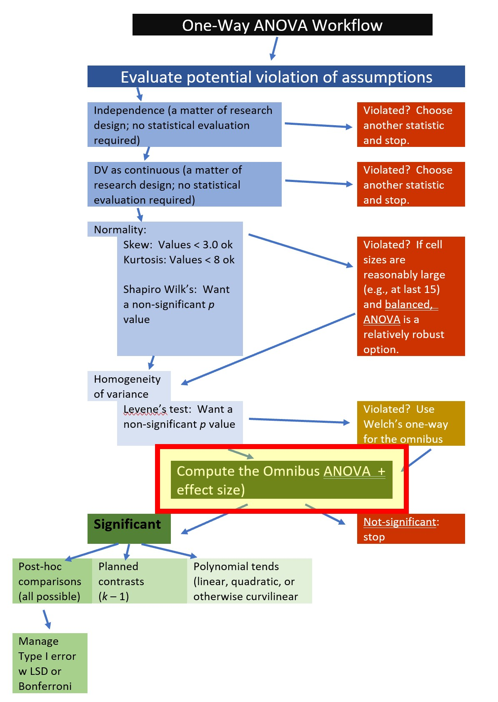 


ANOVA is a special case of the general linear model (regression is a "not so special case" of the general linear model), therefore we use the linear model function, *aov()* to run the analysis.  

In the code below, we predict Accuracy from COND (3 levels: control, low, high).

By assigning the results of the *aov()* function to an object (omnibus) we can then use that object (think *model*) in other functions to get details about our analysis.

```{r }
#the script looks familiar, "Accurate by Condition"
omnibus <- aov(Accurate ~ COND, data = accSIM30) #DV ~ IV  I say, "DV by IV"
summary (omnibus) #ANOVA output
```

```{r echo = FALSE, results ='hide'}
#this script is used for the inline coding in the lesson and, although you will want to run it so you can "feed" the objects into later script, there is no "lesson" relative to this lecture 
df1omnibus<- digits(summary(omnibus)[[1]][1, "Df"],0)
df1omnibus
df2omnibus<- digits(summary(omnibus)[[1]][2, "Df"],0)
df2omnibus
SSMomnibus<- digits(summary(omnibus)[[1]][1, "Sum Sq"],3)
SSMomnibus
SSRomnibus<- digits(summary(omnibus)[[1]][2, "Sum Sq"],3)
SSRomnibus
SSTomnibus <- digits((SSMomnibus + SSRomnibus),3)
SSTomnibus
MSMomnibus<- digits(summary(omnibus)[[1]][1, "Mean Sq"],3)
MSMomnibus
MSRomnibus<- digits(summary(omnibus)[[1]][2, "Mean Sq"],3)
MSRomnibus
Fomnibus<- digits(summary(omnibus)[[1]][1, "F value"],3)
Fomnibus
pomnibus<- digits(summary(omnibus)[[1]][1, "Pr(>F)"],3)
pomnibus
```


Inserting the *aov()* object (omnibus) into the summary command produces the ANOVA Source Table that we manually created above.

The values we see map onto those we calculated by hand.  Our $SS_M$ (`r SSMomnibus`) plus $SS_R$ (`r SSRomnibus`) sum to equal the $SS_T$ (`r SST`) we calculated by hand.

Dividing the two sums of squares by their respective degrees of freedom produces the sums of means squared.  

Then, dividing the $MS_M$ (COND) by $MS_R$ (`r MSMomnibus`/`r MSRomnibus`) provides the *F* value.  By using a table of *F* critical values, we already knew that our *F* value exceeded the value in the table of critical values.  Here we see that *p* = `r pomnibus`. 

The "*F* string" for an APA style results section should be written like this: *F* (`r df1omnibus`, `r df2omnibus`) = `r Fomnibus`, *p* < .001.

The object we created with the *aov()* function is capable of producing much information.  Applying the *names()* function to the object can give us a list of values within it. 

```{r }
names(omnibus)
```
 *summary()* is one of the most commonly used function applied to *aov()* objects, but it's not the only one.
Let's try some other options.

```{r }
model.tables (omnibus, "means")
```
Let's graph some of the data.
```{r }
plot(omnibus) 
```

The *aov()* command has a quickplot feature.  The first of the four plots fits the residuals.  We already know from Levene's that we did not violate the homogeneity of variance test.  With its straight line, this plot shows an equal spread across the three groups.  

When the dots of the Q-Q plot map onto the diagonal, we have some indication of normality of the residuals (we want residuals to be normally distributed).

#### Effect size for the one-way ANOVA

**Eta squared** is one of the most commonly used measures of effect. It refers to the proportion of variability in the dependent variable/outcome that can be explained in terms of the independent variable/predictor.  Traditional interpretive values are similar to the Pearson's *r*:

0 = no relationship
.02 = small
.13 = medium
.26 = large
1 = a perfect (one-to-one) correspondence

A useful summary of effect sizes, guide to interpreting their magnitudes, and common usage can be found [here](https://imaging.mrc-cbu.cam.ac.uk/statswiki/FAQ/effectSize) [@watson_rules_2020].

The formula  for $\eta^2$ is straightforward.  If we think back to our hand-calculations of all the sums of squares, we can clearly see that this is the proportion of variance that is accounted for by the model.

$$\eta ^{2}=\frac{SS_{M}}{SS_{T}}$$
Hand calculation, then, is straightforward.:

```{r }
#Calculated using the object names
SSMomnibus / (SSMomnibus + 30.246)
#Calculated by using the numeric values
9.432/(9.432 + 30.246)
#Optiosn should produce the same result
```
The *lsr* package includes an eta-squared calculator. To use it, we simply insert the model/object we created with the *aov()* function to *lsr*'s *etaSquared()* function.  

```{r }
library(lsr)
etaSquared(omnibus)
```
```{r echo = FALSE, results ='hide'}
#this script is used for the inline coding in the lesson and, although you will want to run it so you can "feed" the objects into later script, there is no "lesson" relative to this lecture 
etaSQomni <- digits(etaSquared(omnibus)[1, "eta.sq"],3)
etaSQomni

```

Notice that there are two effect sizes.  We described eta-squared.  Partial eta-squared is the effect size reported in SPSS.  There's a long history of debate about which to use.  In certain circumstances (especially in more complicated analyses), partial-eta squared can be a bit more generous (i.e., larger than $\eta^2$). Thus, many prefer the reporting of $\eta^2$.

In our case, we see no difference between the two values. Differences begin to appear in datasets that are more complicated, such as when sample sizes across the levels of a factor differ.

#### Summarizing results from the omnibus ANOVA

Presenting the APA style results of the omnibus test is very straightforward:

Results indicated a significant effect of COND on accuracy perception *F* (`r df1omnibus`, `r df2omnibus`) = `r Fomnibus`, *p* < .001, $\eta^2$ = `r etaSQomni`.


### Follow-up to the Omnibus *F*

The *F*-test associated with the one-way ANOVA is the *omnibus* -- giving the result for the overall test.  Looking at the workflow for the one-way ANOVA we see that if we had had we had a non-significant $F$, we would have stopped our analysis.  

However, if the omnibus $F$ is significant, we know that there is at least one pair of cells where there is a statistically significant difference.  We have several ways (each with its own strengths/limitations) to figure out where these differences lie.

We have several options for following up; a very common option is to conduct post-hoc, pairwise comparisons.

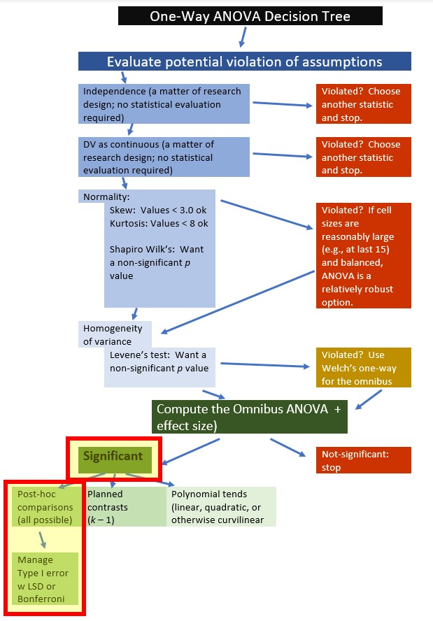 

#### OPTION 1:  Post-hoc, pairwise, comparisons 

Post-hoc, pairwise comparisons are:

* used for exploratory work when no firm hypotheses were articulated a priori,
* used to compare the means of all combinations of pairs of an experimental condition,
* less powerful than planned comparisons b/c strict criterion for significance must be used.

Helpful information about how to conduct post-hoc pairwise comparisons in R can be found at the [UCLA Institute for Digital Research and Education site](https://stats.idre.ucla.edu/r/faq/how-can-i-do-post-hoc-pairwise-comparisons-in-r/) [@noauthor_how_nodate].

```{r }
pairwise.t.test(accSIM30$Accurate, accSIM30$COND, p.adj = "none")
#can swap "bonf" or "holm" for p.adj
```

The output only provides the $p$ values associated with the mean differences in each of the conditions. We see that $p < .05$ when high is compared to control and high is compared to low.  An APA style reporting results of these typically involves referencing the means (often reported in a table of means and standard deviations) or mean differences (hand calculated) with their *p* values.  

**Should we be concerned about Type I error?"**

Recall that *Type I error* is the concern about false positives -- that we would incorrectly reject a true null hypothesis (that we would say that there is a statistically significant difference when there is not one).  This concern increases when we have a large number of pairwise comparisons.

Green and Salkind [-@green_using_2014] review three options for managing Type I error.

* Traditional Bonferroni: 
  - Adjusts the *p* value upward by multiplying it (the raw *p* values) by the number of comparisons being completed. This holds the *total* Type I error rate across these tests to $\alpha$ (usually .05).  The traditional Bonferroni is simple and therefore attractive, but when *p* values hover around .05, it can be too restrictive.
* Holms Sequential Bonferroni:
  - We'll describe this in more detail later. Briefly, it allows us to rank order the comparisons by their *p* value (smallest to largest). We determine the significance of each *p* value *sequentially.*  
* LSD method:
  - Permitted when there are only three pairwise comparisons among three groups, researchers can leave the *p* values as they are.  Since the Tran and Lee [-@tran_you_2014] research vignette is one of those circumstances, I not make adjustments for Type I error. I would name claim the LSD and cite Green and Salkind [-green_using_2014] as justification for that decision.
 
There is, though, an even more powerful approach...


#### OPTION 2:  Planned contrasts

Another option is to evaluate planned comparisons.

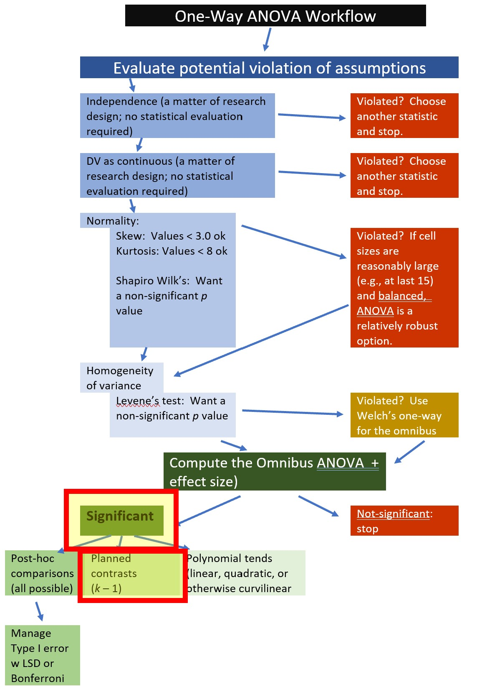 
Planned comparisons are 

* theory-driven comparisons constructed prior to data collection,
* based on the idea of partitioning the variance created by the overall effect of group differences into gradually smaller portions of variance.
* more powerful than post-hoc tests.

Planned contrasts involve further considerations regarding the *partitioning of variance.*

* There will always be *k*-1 contrasts. 
* Each contrast must involve only two chunks of variance.

*Orthogonal* contrasts are even more sophisticated. Essential to conducting an orthogonal contrast is the requirement that if a group is singled out in one comparison it should be excluded from subsequent contrasts. The typical, orthogonal scenario with three groups has only two contrasts:

1. Control versus Low and High  (because control was excluded, it should not reappear)
2. Low versus High

Underlying the *aov()* program is the linear model.  We could have used it for the omnibus ANOVA, but it has clunky output.

We use it now to retrieve some contrast information.  The code below is a planned comparison that uses the coding in the database to compare the lowest coded group (Control was 1, Low was 2, High was 3) to the other two groups.

```{r }
summary.lm(omnibus)
```

From the above, regression output, we see that there was not a statistically significant difference between COND_Control and  COND_Low (*p* = 0.347). There were statistically significant difference when CONDControl (the intercept) was compared to CONDHigh (*p* < .001).

Note that these tests are conducted as  *t* tests.  Why?  We are comparing only two groups and can use the *t*. distribution.

It's quite possible we want something different. 

**Step 1: ** Specify our contrasts 

* Specifying the contrasts means you know their order within the factor
* Early in the data preparation, we created an ordered factor with Control, Low, High as the order.
* We want orthogonal contrasts, this means there will be
  - *k* - 1 contrasts; we will have 2
  - once we single out a condition for comparison, we cannot use it again.
  
In *contrast1* we compare the Control condition to the combined Low and High conditions.
In *contrast2* we discard the Control condition (it was already singled out) and we compare the Low and High conditions.

This is sensible because we likely hypothesize that any degree of racially loaded stereotypes may have a deleterious outcome, so we first compare Control to the two conditions with any degree of racial loading. Subsequently, we compare the Low and High levels of the factor. 

**Step 2:**  Bind them together and check the output to ensure that we've mapped them correctly. 
```{r }
#Contrast1  compares Control against the combined effects of Low and High.
contrast1 <- c(-2,1,1)

#Contrast2 excludes Control; compares Low to High.
contrast2 <- c(0,-1,1)

#binding the contrasts together
contrasts(accSIM30$COND)<-cbind(contrast1, contrast2)
accSIM30$COND
```

Thinking back to the hand-calculations and contrast mapping, the table of weights that R just produced confirms that 

*  Contrast 1 compares the Control condition against the levels with any racial loading.  
*  Contrast 2 compares the Low and High loadings.  

**Step 3:**  Create a new _aov()_ model

```{r }
#create a new object, the ANOVA looks the same, but it will now consider the contrasts
accPlanned <- aov(Accurate ~ COND, data = accSIM30)
summary.lm(accPlanned)
contrasts(accSIM30$COND)<-cbind(c(-2,1,1), c(0,-1,1))
```

These planned contrasts show that when the control condition is compared to the combined low and high racial loading conditions, there is not a statistically significant difference, *t*(87) = -0.077, *p* = 0.085.  However, when the low and high racial loading conditions are compared, there is a statistically significant difference, *t*(87) = -4.909, *p* < 0.001. 

#### Trend (polynomial) analysis

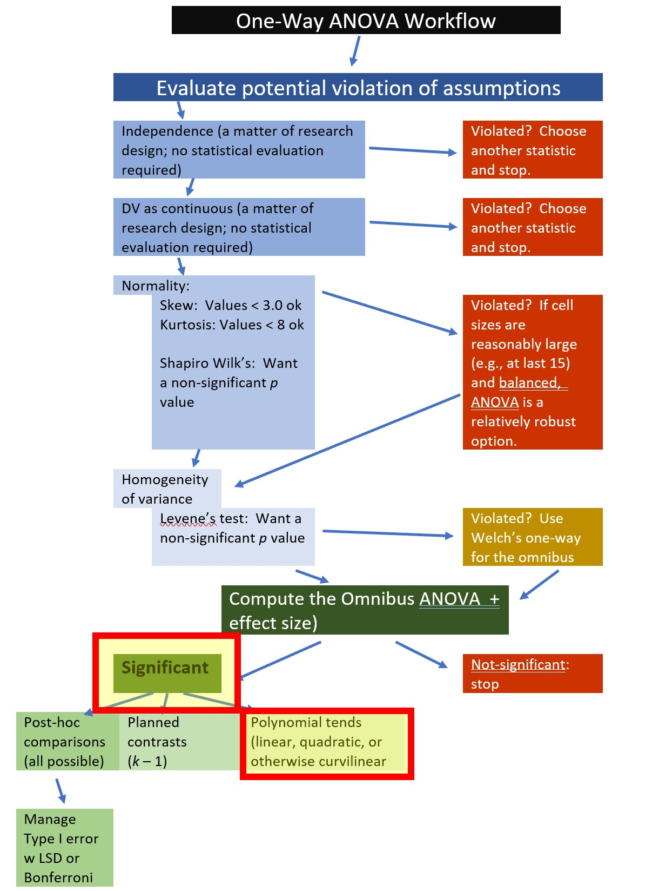 

Polynomial contrasts let us see if there is a linear (or curvilinear) pattern to the data.  To detect a trend, the data must be coded in an ascending order and it needs to be a sensible, theoretically defensible, comparison.  Our data has a theoretically ordered effect (control, low racially loaded condition, high racially loaded condition).  Recall that we created an ordered factor when we imported the data.

In a polynomial analysis, the statistical analysis looks across the ordered means to see if they fit a linear or curvilinear shape that is one less than the number of levels.  Our factor has three levels, therefore the polynomial contrast can check for a linear shape (.L) or a quadratic (one change in direction) shape (.Q).  If we had four levels, the contr.poly could check for cubic change (two changes in direction). Conventionally, when more than one trend is significant, we intepret the most complex one (i.e., quadratic over linear).

```{r }
contrasts(accSIM30$COND)<-contr.poly(3)
accTrend<-aov(Accurate ~ COND, data = accSIM30)
summary.lm(accTrend)
```
A quick peek back at an early plot shows illustrates the quadratic trend that was supported by the analysis.

Results of our polynomial contrast suggested statistically significant results for both linear $t(87) = -3.963 , p < .001$ and quadratic $t(87) = -3.380, p = .001$ trends. 


#### Which set of follow-up tests do we report?

It depends!  What best tells the story of your data?  Here are some things to consider.

*  If the post-hoc comparisons are robustly statistically significant (and controlling Type I error is not going to change that significance), I think this provides good information and I would learn toward report those.
*  If *p* values are hovering around 0.05, an orthogonal contrast will offer more power because 
   - a *k* - 1 comparison will be more powerful
   - a priori theory is compelling
*  The polynomial can be a nice addition if there is a linear or quadratic relationship that is sensible or interesting.  

Although I would report either the post-hoc or planned contrasts, I will sometimes add a polynomial if it clarifies the result (i.e., there is a meaningful linear or curvilinear pattern essential to understanding the data.


### What if we Violated the Homogeneity of Variance test?

The *oneway.test* produces Welch's *F* -- a  test more robust to violation of the homogeneity of variance assumption. The Welch's approach to attenuating error or erroneous conclusions caused by violations of the homogeneity of variance assumption is to adjust the residual degrees of freedom used to produce the Welch's *F*-ratio.

Another common correction is the Brown and Forsythe *F*-ratio. At this time I have not located and tried an R package that produces this.

```{r}
oneway.test (Accurate ~ COND, data = accSIM30)
```

Note that the denominator *df* is now 56.34 (not 87) and *p* value is a little larger (it was 0.00000745). With its design intended to avoid making a Type I error, the Welch's *F* is more "conservative."  While it doesn't matter in this case, if it were a study where the *p* value was closer to .05, it could make a difference. These are some of the tradeoffs made in order to have confidence in the results.  


## Power Analysis

Power analysis allows us to determine the sample size required to detect an effect of a given size with a given degree of confidence.  Utilized another way, it allows us to determine the probability of detecting an effect of a given size with a given level of confidence.  If the probability is unacceptably low, we may want to revise or stop. A helpful overview of power as well as guidelines for how to use the *pwr* package can be found at a [Quick-R website](https://www.statmethods.net/stats/power.html) [@kabacoff_power_2017].

There are four interrelating elements of power:

1. Sample size, *N*
2. Effect size,
   - For one-way ANOVAs, Cohen suggests that f values of 0.1, 0.25, and 0.4 represent small, medium, and large effect sizes, respectively.
3. Significance level = P(Type I error),
   - Recall that Type I error is the rejection of a true null hypothesis (a false positive).
   - Stated another way, Type I error is the probability of finding an effect that is not there.
4. power = 1 - P(Type II error),
   - Recall that Type II error is the non-rejection of a false null hypothesis (a false negative).
   - Power is the probability of finding an effect that is there.
  
If we have any three of these values, we can calculate the fourth.

In Champely's *pwr* package, we can conduct a power analysis for a variety of designs, including the balanced one-way ANOVA (i.e., roughly equal cell sizes) design that we worked in this chapter.

The *pwr.anova.test()* has five parameters:

* *k* = # groups
* *n* = sample size
* *f* = effect sizes, where 0.1/small, 0.25/medium, and 0.4/large
  - In the absence from an estimate from our own data, we make a guess about the expected effect size value based on our knowledge of the literature
* *sig.level* = *p* value that you will use
* *power* = .80 is the standard value

In the script below, we simply add our values. So long as we have four values, the fifth will be calculated for us.

Because this calculator requires the effect size in the metric of Cohen's *f* (this is not the same as the *F* ratio), we need to convert it. The *effectsize* package has a series of converters.  We can use the *eta2_to_f()* function. 

```{r}
library(effectsize)
eta2_to_f(.238) 
```
We simply plug this value into the "f =".

```{r}
library(pwr)

pwr.anova.test (k = 3, f = .5589, sig.level = .05, power = .80)
```

This result suggested that we would need 11 people per group.

If we were unsure about what to expect in a sample size, we could take a guess.  I like to be on the safe(r) side and go with a smaller  effect. What would happen if we had a Cohen's *f* that represented a small effect?

```{r}
pwr.anova.test (k = 3, f = .1, sig.level = .05, power = .80)
```
Yikes!  We would need over 300 per group!

If effect sizes are new to you, play around with this effect size converter hosted at [Psychometrica.de](https://www.psychometrica.de/effect_size.html). For examples like this one, use the option labeled, "Transformation of the effect sizes *d*, *r*, *f*, *Odds Ratio*, $\eta^2$, and *Common Language Effect Size (CLES*)."

## APA Style Results

All that's left to do is *write it up*!  APA style results sections in empirical manuscripts are typically accompanied by tables and figures. APA style discourages repeated material and encourages reducing the cognitive load of the reader. For this example, I suggest two tables -- one with means and standard deviations of the groups and a second that reports the output from the one-way ANOVA.  In an article with multiple statistics, the authors might wish to combine or delete these.

The package *apaTables* can produce journal-ready tables by using the object produced by the *aov()* function. Deciding what to report in text and table is important.  

Here I create Table 1 with means and standard deviations (plus a 95% confidence interval around each mean).

```{r }
library(apaTables)
# table.number = 1 assigns a table number to the top of the table 
# filename = "Table1.doc" writes the table to Microsoft Word and puts it in your project folder
apa.1way.table(iv=COND, dv=Accurate, show.conf.interval = TRUE, data=accSIM30, table.number = 1, filename = "Table1.doc")
```
I will want to give the values of mean differences ($M_{diff}$) in the results.  I can quickly use R to calculate them here.
```{r }
1.76 - 1.15#calculating mean difference between control and high
1.90 - 1.15#calculating mean difference between low and high
1.76 - 1.90#calculating mean difference between  control and low
```

Here I create Table 2 with results of the one-way ANOVA.  The result in Microsoft Word can be edited (e.g., I would replace the partial-eta squared with $\eta^2$) for the journal article.

```{r }
apaTables::apa.aov.table (omnibus, table.number = 2, filename = "Table2.doc")
```
Regarding figures, there are a number of options. I find the *plotmeans()* function (used earlier) to be adequate for the purpose of one-way ANOVA.  As we progress through this textbook, I will demonstrate a number of options that offer more and less complexity.

```{r}
plotmeans (formula = Accurate ~ COND, data = accSIM30, xlab = "Racial Loading Condition", ylab = "Accuracy of Confederate's Impression", n.label = FALSE)
```


With table and figure at hand, here is how I would write up these results:

A one-way analysis of variance was conducted to evaluate the relationship between degree of racial loading of an exceptionalizing microaggression and the perceived accuracy of a research confederate's impression of the Asian or Asian American participant.  The independent variable, COND, included three levels:  control/none, low, and high levels of racial loading.  Results of Levene's homogeneity of variance test indicated no violation of the homogeneity of variance assumption ($F$[`r df1levene`,`r df2levene`] = `r Flevene`, $p$ = `r plevene`). Similarly, results of the Shapiro Wilk's test indicated no violation of the normality assumption in each of the cells (Control, *W* = `r swControl`, *p* = `r swControlp`; Low, *W* = `r swLow`, *p* = `r swLowp`; High, *W* = `r swHigh`, *p* = `r swHighp`).

Results indicated a significant effect of COND on accuracy perception *F* (`r df1omnibus`, `r df2omnibus`) = `r Fomnibus`, *p* < .001, $\eta^2$ = `r etaSQomni`. In a series of post-hoc comparisons, there were statistically significant differences between the control and high ($M_{diff}$ = 0.61, *p* < .001) and low and high ($M_{diff}$ = 0.75, *p* < 0.001) conditions, but not the control and low conditions ($M_{diff}$ = -.14, *p* = 0.347). A statistically significant polynomial contrast suggested a quadratic trend across the three, ordered, levels of the conditions ($t[87] = -0.364, p = .001$) such that perception of accuracy increased slighty from the control to low conditions, but decreased more dramatically from low to high. Consequently, it appeared that only the highest degree of racial loading (e.g., "You speak English well for an Asian") resulted in the decreased perceptions of accuracy of impressions from the confederate.   Means and standard deviations are presented in Table 1 and complete ANOVA results are presented in Table 2.  Figure 1 provides an illustration of the results.


## Practice Problems

In each of these lessons I provide suggestions for practice that allow you to select one or more problems that offer differing levels of difficulty. Whichever you choose, you will focus on these larger steps in one-way ANOVA, inluding:

* test the statistical assumptions
* conduct a one-way ANOVA, including
  - omnibus test and effect size
  - follow-up (pairwise, planned comparisons, polynomial trends)
* write a results section to include a figure and tables


### Problem #1:  Play around with this simulation.

* If one-way ANOVA is new to you, perhaps you just change the number in "set.seed(2021)" from 2021 to something else. Your results should parallel those obtained in the lecture, making it easier for you to check your work as you go.
* If you are interested in power, change the sample size to something larger or smaller.
* If you are interested in variability (i.e., the homogeneity of variance assumption), perhaps you change the standard deviations in a way that violates the assumption.

Using the lecture and workflow (chart) as a guide, please work through all the steps listed in the proposed assignment/grading rubric.

|Assignment Component                    | Points Possible   | Points Earned|
|:-------------------------------------- |:----------------: |:------------:|
|1. Check and, if needed, format data |      5            |_____  |           
|2. Evaluate statistical assumptions     |      5            |_____  |
|3. Conduct omnibus ANOVA (w effect size)|      5           | _____  |  
|4. Conduct one set of follow-up tests; narrate your choice| 5 |_____  |               
|5. Describe approach for managing Type I error|    5        |_____  |   
|6. APA style results with table(s) and figure|    5        |_____  |       
|7. Explanation to grader                 |      5        |_____  |
|**Totals**                               |      35       |_____  |          


### Problem #2:  Conduct a one-way ANOVA with the *moreTalk* dependent variable.

In their study, Tran and Lee [-@tran_you_2014] included an outcome variable where participants rated how much longer they would continue the interaction with their partner compared to their interactions in general. The scale ranged from -2 (*much less than average*) through 0 (*average*) to 2 (*much more than average*). This variable is available in the original simulation. 

Using the lecture and workflow (chart) as a guide, please work through all the steps listed in the proposed assignment/grading rubric.


|Assignment Component                    | Points Possible   | Points Earned|
|:-------------------------------------- |:----------------: |:------------:|
|1. Check and, if needed, format data |      5            |_____  |           
|2. Evaluate statistical assumptions     |      5            |_____  |
|3. Conduct omnibus ANOVA (w effect size)|      5           | _____  |  
|4. Conduct one set of follow-up tests; narrate your choice| 5 |_____  |               
|5. Describe approach for managing Type I error |    5        |_____  |   
|6. APA style results with table(s) and figure  |    5        |_____  |       
|7. Explanation to grader                 |      5        |_____  |
|**Totals**                               |      35       |_____  |             


### Problem #3:  Try something entirely new.

Using data for which you have permission and access (e.g.,  IRB approved data you have collected or from your lab; data you simulate from a published article; data from an open science repository; data from other chapters in this OER), complete a one-way ANOVA. Please have at least 3 levels for the predictor variable. 

Using the lecture and workflow (chart) as a guide, please work through all the steps listed in the proposed assignment/grading rubric.

|Assignment Component                    | Points Possible   | Points Earned|
|:-------------------------------------- |:----------------: |:------------:|
|1. Narrate the research vignette, describing the IV and DV | 5 |_____  |
|2. Simulate (or import) and format data               |      5            |_____  |           
|3. Evaluate statistical assumptions     |      5            |_____  |
|4. Conduct omnibus ANOVA (w effect size) |      5           | _____  |  
|5. Conduct one set of follow-up tests; narrate your choice| 5 |_____  |               
|6. Describe approach for managing Type I error |    5        |_____  |   
|7. APA style results with table(s) and figure  |    5        |_____  |       
|8 Explanation to grader                 |      5        |_____  |
|**Totals**                               |      35       |_____  |          


## Bonus Reel: 

{#id .class width=620 height=211} 

### Coming soon!

* We're hoping to have a podcast-style conversation with Dr. Alisia Tran and/or Dr. Richard M. Lee about their study.
* Elaboration of how data can be simulated for one-way ANOVA
* Further demonstration of how sample size can effect results

### What's with the inline code?

If you are working in the .rmd file you may notice sections that look like this:

```{r results ='hide'}
#this script is used for the inline coding in the lesson and, although you will want to run it so you can "feed" the objects into later script, there is no "lesson" relative to this lecture 
df1omnibus<- digits(summary(omnibus)[[1]][1, "Df"],0)
df1omnibus
df2omnibus<- digits(summary(omnibus)[[1]][2, "Df"],0)
df2omnibus
SSMomnibus<- digits(summary(omnibus)[[1]][1, "Sum Sq"],3)
SSMomnibus
SSRomnibus<- digits(summary(omnibus)[[1]][2, "Sum Sq"],3)
SSRomnibus
SSTomnibus <- digits((SSMomnibus + SSRomnibus),3)
SSTomnibus
MSMomnibus<- digits(summary(omnibus)[[1]][1, "Mean Sq"],3)
MSMomnibus
MSRomnibus<- digits(summary(omnibus)[[1]][2, "Mean Sq"],3)
MSRomnibus
Fomnibus<- digits(summary(omnibus)[[1]][1, "F value"],3)
Fomnibus
pomnibus<- digits(summary(omnibus)[[1]][1, "Pr(>F)"],3)
pomnibus
```

I'm still learning about this and am using the lessons to practice. In these hidden (from the rendered view) boxes of script, I am capturing the output values as R objects. Later I can use inline code (the object's name, preceded with an "r", surrounded by tics [unfortunately, I cannot demo it in the .rmd file without getting an error]) to insert the value into the lecture notes and results.  I'm working up to writing an entire journal article in R. This way, if something changes (e.g., more participants in the Qualtrics survey, a different approach to cleaning data) when I re-run the script everything auto-updates and I'm at less of a risk (or maybe a different kind of risk) for making typographical errors.


```{r include=FALSE}
sessionInfo()
```


<!--chapter:end:04-OnewayANOVA.Rmd-->

# Factorial (Between-Subjects) ANOVA {#between}

```{r  include=FALSE}
knitr::opts_chunk$set(echo = TRUE)
knitr::opts_chunk$set(comment = NA) #keeps out the hashtags in the knits
options(scipen=999)#eliminates scientific notation
```

[Screencasted Lecture Link](https://spu.hosted.panopto.com/Panopto/Pages/Viewer.aspx?pid=3bb1bee1-c2ac-4cda-95f2-ad8b0152132c) 

In this lesson we conduct a 3X2 ANOVA. The lesson is long and somewhat complicated.  We will

* Work an actual example from the literature.
  - "by hand", and
  - with R packages
* I will also demonstrate 
  - several options for exploring interaction effects, and
  - several options for exploring main effects.
* Exploring these options will allow us to:
  - Gain familiarity with the concepts central to multi-factor ANOVAs.
  - Explore tools for analyzing the complexity in designs.

The complexity is that not all of these things need to be conducted for every analysis. The Two-Way ANOVA Decision-Tree is provided to help you map a way through your own analyses. I will periodically indicate this map in the lesson so that we can more easily keep track of where we are in the process.
  

## Navigating this Lesson

There is about 1 hour and 30 minutes hours of lecture.  If you work through the materials with me plan for another two hours of study.

While the majority of R objects and data you will need are created within the R script that sources the chapter, occasionally there are some that cannot be created from within the R framework. Additionally, sometimes links fail.  All original materials are provided at the [Github site](https://github.com/lhbikos/ReCenterPsychStats) that hosts the book. More detailed guidelines for ways to access all these materials are provided in the OER's [introduction](#ReCintro)

### Learning Objectives

Learning objectives from this lecture include the following:

* Define, locate, and interpret all the effects associated with two-way ANOVA:
  - main
  - interaction (introducing the concept, *moderator*)
  - simple main effects
* Identify which means belong with which effects.  Then compare and interpret them.
  - marginal means
  - individual cell means 
  - comparing them
* Map a process/workflow for investigating a factorial ANOVA
* Manage Type I error
* Conduct a power analysis to determine sample size 


### Planning for Practice

In each of these lessons I provide suggestions for practice that allow you to select one or more problems that are graded in difficulty The least complex is to change the random seed and rework the problem demonstrated in the lesson. The results *should* map onto the ones obtained in the lecture. 

The second option comes from the research vignette. The Ramdhani et al. [-@ramdhani_affective_2018] article has two dependent variables (negative and positive evaluation) which are suitable for two-way ANOVAs.  I will demonstrate a simulation of one of their 2X3 ANOVAs (negative) in this lecturette. The second dependent variable (positive) is suggested for the moderate level of difficulty. 

As a third option, you are welcome to use data to which you have access and is suitable for two-way ANOVA. In either case, you will be expected to:

* test the statistical assumptions
* conduct a two-way ANOVA, including
  - omnibus test and effect size
  - report main and interaction effects
  - conduct follow-up testing of simple main effects
* write a results section to include a figure and tables

### Readings & Resources

In preparing this chapter, I drew heavily from the following resource(s) that are freely available on the internet.  Other resources are cited (when possible, linked) in the text with complete citations in the reference list.

* Navarro, D. (2020). Chapter 16: Factorial ANOVA. In *Learning Statistics with R - A tutorial for Psychology Students and other Beginners.* Retrieved from https://stats.libretexts.org/Bookshelves/Applied_Statistics/Book%3A_Learning_Statistics_with_R_-_A_tutorial_for_Psychology_Students_and_other_Beginners_(Navarro)
  - Navarro's OER includes a good mix of conceptual information about factorial ANOVA as well as R code.  My code/approach is a mix of Field's, Navarro's, and other techniques I have found on the internet and learned from my students.
* Ramdhani, N., Thontowi, H. B., & Ancok, D. (2018). Affective Reactions Among Students Belonging to Ethnic Groups Engaged in Prior Conflict. *Journal of Pacific Rim Psychology, 1*2, e2. https://doi.org/10.1017/prp.2017.22

### Packages

The packages used in this lesson are embedded in this code. When the hashtags are removed, the script below will (a) check to see if the following packages are installed on your computer and, if not (b) install them.
```{r }
#will install the package if not already installed
#if(!require(psych)){install.packages("psych")}
#if(!require(tidyverse)){install.packages("tidyverse")}
#if(!require(lsr)){install.packages("lsr")}
#if(!require(car)){install.packages("car")}
#if(!require(ggpubr)){install.packages("ggpubr")}
#if(!require(pwr2)){install.packages("pwr2")}
#if(!require(apaTables)){install.packages("apaTables")}
```

## Introducing Factorial ANOVA

My approach to teaching is to address the conceptual as we work problems.  That said, there are some critical ideas we should address first.

**ANOVA is for experiments** (or arguably closely related designs).  As we get into the assumptions you'll see that it has some interesting ones (e.g., there should be an equal/equivalent number of cases per cell).  To the degree that we violate these assumptions, we should locate alternative statistical approaches where these assumptions are relaxed.

**Factorial**: the term used when there are two or more independent variables (the factors).  The factors could be between-groups, within-groups, repeated measures, or a combination of between and within.  

* **Independent factorial design**: several IVs (predictors/factors) and each has been measured using different participants (between groups).
* **Related factorial design**: several IVs (factors/predictors) have been measured, but the same participants have been used in all conditions (repeated measures).
* **Mixed design**: several IVs (factors/predictors) have been measured; some with different participants whereas others use the same participants. A combo of independent (between) and related (within) designs.
*  Factor naming follows a number/levels convention.  
  - Today's example is a 3X2 ANOVA.  We know there are two factors that have three and two levels, respectively: *Ethnicity*  has three levels representing the two ethnic groups that were in prior conflict (Marudese, Dayaknese) and a third group who was uninvolved in the conflict (Javanese); *Photo stimulus* has two levels representing members of the two ethnic groups that were in prior conflict (Madurese, Dayaknese);  

 **Moderator** is what creates an interaction.  Below are traditional representations of the *statistical* and *conceptual* figures of interaction effects. We will say that Factor B, *moderates* the relationship between Factor A/IV and the DV.
 
In a later lesson we work an ANCOVA -- where we will distinguish between a *moderator* and a *covariate.*  In regression models, you will likely be introduced to the *mediator.*  

{#id .class width=1000 height=400px}

### Workflow for Two-Way ANOVA

The following is a proposed workflow for conducting a two-way ANOVA. 

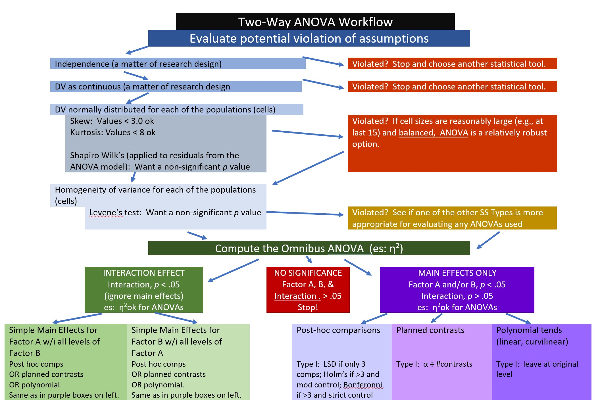 


Steps of the workflow include:

1. Enter data 
    + seems straightforward; understanding the format of data can often provide clues as to which ANOVA/statistic to use
    + predictors should formatted as as factors (ordered or unordered); the dependent variable should be continuously scaled
2. Explore data 
    + graphing the data 
    + computing descriptive statistics
    + check distributional assumptions 
    + use Levene's test to check for homogeneity of variance 
    + use Shapiro Wilks to check for normality
3. Construct or choose contrasts
    + select contrasts & specify for all of the independent variables in your analysis
    + if you want to use Type III sums of squares, contrasts must be orthogonal
4. Compute the omnibus ANOVA
    + *Depending on what you found in the data exploration phase, you may need to run a robust version of the test*
5. Follow-up testing based on significant main or interaction effects
    + significant interactions require test of simple main effects which could be urther explored with contrasts, posthoc acomparisons, and/or polynomials
    + *the exact methods you choose will depend upon the tests of assumptions during data exploration*
6. Managing Type I error

## Research Vignette

The research vignette for this example was located in Kalimantan, Indonesia and focused on bias in young people from three ethnic groups. The Madurese and Dayaknese groups were engaged in ethnic conflict that spanned 1996 to 2001. The last incidence of mass violence was in 2001 where approximately 500 people (mostly from the Madurese ethnic group). Ramdhani et al.'s [-@ramdhani_affective_2018] research hypotheses were based on the roles of the three ethnic groups in the study.  The Madurese appear to be viewed as the transgressors when they occupied lands and took employment and business opportunities from the Dayaknese. Ramdhani et al. also included a third group who were not involved in the conflict (Javanese). The research participants were students studying in Yogyakara who were not involved in the conflict.  They included 39 Madurese, 35 Dyaknese, and 37 Javanese; 83 were male and 28 were female.

In the study [@ramdhani_affective_2018], participants viewed facial pictures of three men and three women (in traditional dress) from each ethnic group (6 photos per ethnic group). Participant were asked, "How do you feel when you see this photo?  Please indicate your answers based on your actual feelings."  Participants responded on a 7-point Likert scale ranging from 1 (*strongly disagree*) to 7 (*strongly agree*. Higher scores indicated ratings of higher intensity on that scale.  The two scales included the following words:

* Positive:  friendly, kind, helpful, happy
* Negative:  disgusting, suspicious, hateful, angry

Below is script to simulate data for the negative reactions variable from the information available from the manuscript [@ramdhani_affective_2018].


```{r}
library(tidyverse)
set.seed(210731)
Negative<-round(c(rnorm(17,mean=1.91,sd=0.73),rnorm(18,mean=3.16,sd=0.19),rnorm(19, mean=3.3, sd=1.05), rnorm(20, mean=3.00, sd=1.07), rnorm(18, mean=2.64, sd=0.95), rnorm(19, mean=2.99, sd=0.80)),3) #sample size, M and SD for each cell; this will put it in a long file
Positive<-round(c(rnorm(17,mean=4.99,sd=1.38),rnorm(18,mean=3.83,sd=1.13),rnorm(19, mean=4.2, sd=0.82), rnorm(20, mean=4.19, sd=0.91), rnorm(18, mean=4.17, sd=0.60), rnorm(19, mean=3.26, sd=0.94)),3) #sample size, M and SD for each cell; this will put it in a long file
ID <- factor(seq(1,111))
Rater <- c(rep("Dayaknese",35), rep("Madurese", 39), rep ("Javanese", 37))
Photo <- c(rep("Dayaknese", 17), rep("Madurese", 18), rep("Dayaknese", 19), rep("Madurese", 20), rep("Dayaknese", 18), rep("Madurese", 19))
Ramdhani_df<- data.frame(ID, Negative, Positive, Rater, Photo) #groups the 3 variables into a single df:  ID#, DV, condition
#ANOVAresults<-aov(Negative~Rater*Photo, Ramdhani_df) #runs the ANOVA -- I used this in the simulation to check my work
#summary(ANOVAresults) #ANOVA output
#model.tables(ANOVAresults,"means") #extracts the means for the 3 groups
```

For two-way ANOVA our variables need to be properly formatted. In our case:

* Negative is a continuously scaled DV and should be *num*
* Positive is a continuously scaled DV and should be *num*
* Rater should be an unordered factor
* Photo should be an unordered facor

```{r}
str(Ramdhani_df)
```
Our Negative variable is correctly formatted. Let's reformat Numeric and Photo to be factors. And ask for the structure again. In the absence of instruction, R will order the factors alphabetically. In this case this is fine.  If we had ordered factors such as dosage (placebo, lo, hi) we would want to specify the order.

```{r}
Ramdhani_df[,'Rater'] <- as.factor(Ramdhani_df[,'Rater'])
Ramdhani_df[,'Photo'] <- as.factor(Ramdhani_df[,'Photo'])
str(Ramdhani_df)
```
If you want to export this data as a file to your computer, remove the hashtags to save it (and re-import it) as a .csv ("Excel lite") or .rds (R object) file. This is not a necessary step.

The code for .csv will likely lose the formatting (i.e., making the Rater and Photo variables factors), but it is easy to view in Excel.
```{r}
#write the simulated data  as a .csv
#write.table(Ramdhani_df, file="RamdhaniCSV.csv", sep=",", col.names=TRUE, row.names=FALSE)
#bring back the simulated dat from a .csv file
#Ramdhani_df <- read.csv ("RamdhaniCSV.csv", header = TRUE)
#str(Ramdhani_df)
```

The code for the .rds file will retain the formatting of the variables, but is not easy to view outside of R.
```{r}
#to save the df as an .rds (think "R object") file on your computer; it should save in the same file as the .rmd file you are working with
#saveRDS(Ramdhani_df, "Ramdhani_RDS.rds")
#bring back the simulated dat from an .rds file
#Ramdhani_RDS <- readRDS("Ramdhani_RDS.rds")
#str(Ramdhani_RDS)
```

### Preliminary exploration of our research vignette

Let's first examine the descriptive statistic (e.g., means of Negative) by group. We can use the *describeBy()* function from the *psych* package.

```{r }
library(psych)
negative.descripts <- psych::describeBy(Negative ~ Rater + Photo, mat = TRUE, data = Ramdhani_df, digits = 3) #digits allows us to round the output
negative.descripts
```

The *write.table()* function can be a helpful way to export output to .csv files so that you can manipulate it into tables. 

```{r }
write.table(negative.descripts, file="NegativeDescripts.csv", sep=",", col.names=TRUE, row.names=FALSE)
```

At this stage, it would be useful to plot our data. Figures can really help us conceptualize our analysis.  

```{r }
library(ggpubr)
ggboxplot(Ramdhani_df, x = "Rater", y = "Negative", color = "Photo",xlab = "Ethnicity of Rater", ylab = "Negative Reaction")
```
Narrating results is sometimes made easier if variables are switched. There is usually not a right or wrong answer. Here is another view, switching the Rater and Photo predictors.

```{r}
ggboxplot(Ramdhani_df, x = "Photo", y = "Negative", color = "Rater", xlab = "Photo Stimulus",
             ylab = "Negative Reaction")
```

```{r }
ggline(Ramdhani_df, x = "Rater", y = "Negative", color = "Photo", xlab = "Ethnicity of Rater",
             ylab = "Negative Reaction", add = c("mean_se", "dotplot"))

#add this for a different color palette:  palette = c("#00AFBB", "#E7B800")
```


```{r }
ggline(Ramdhani_df, x = "Photo", y = "Negative", color = "Rater", xlab = "Photo Stimulus",
             ylab = "Negative Reaction", add = c("mean_se", "dotplot"))
```


## Working the Factorial ANOVA (by hand)

Before we work an ANOVA let's take a moment to consider what we are doing and how it informs our decision-making. This figure (which already contains "the answers") may help conceptualize how variance becomes partitioned.

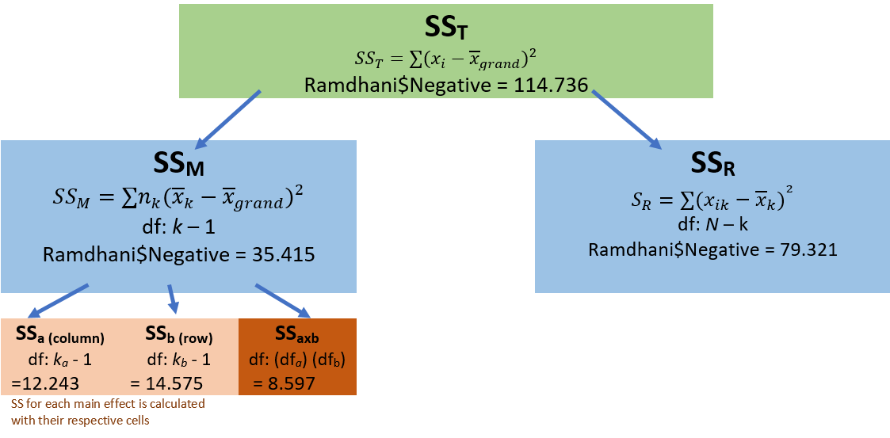

As in one-way ANOVA, we partition variance into **total**, **model**, and **residual**.  However, we now further divide the $SS_M$ into its respective factors A(column), B(row) and their a x b product.


In this, we begin to talk about main effects and interactions.

### Sums of Squares Total

Our formula is the same as before:

$$SS_{T}= \sum (x_{i}-\bar{x}_{grand})^{2}$$
Let's calculate it for the Ramdhani et al. [-@ramdhani_affective_2018] data.
Our grand (i.e., overall) mean is 

```{r }
mean(Ramdhani_df$Negative)
```

Subtracting the grand mean from each Accurate score yields a mean difference.
```{r }
library(tidyverse)
Ramdhani_df <- Ramdhani_df %>% 
  mutate(m_dev = Negative-mean(Negative))
```
Pop quiz:  What's the sum of our new *m_dev* variable?

Let's find out!
```{r }
sum(Ramdhani_df$m_dev)
```

If we square those mean deviations:
```{r }
Ramdhani_df <- Ramdhani_df %>% 
  mutate(m_devSQ = m_dev^2)
```

If we sum the squared mean deviations:

```{r }
sum(Ramdhani_df$m_devSQ)
```
This value, 114.775, the sum of squared deviations around the grand mean, is our $SS_T$; the associated *degrees of freedom* is $N$ - 1.  
In factorial ANOVA, we divide $SS_T$ into **model/between sums of squares** and **residual/within sums of squares**.

### Sums of Squares for the Model 

$$SS_{M}= \sum n_{k}(\bar{x}_{k}-\bar{x}_{grand})^{2}$$

The *model* generally represents the notion that the means are different than each other.  We want the variation between our means to be greater than the variation within each of the groups from which our means are calculated.

In factorial, we need to obtain means for each of the combinations of the factors. We have a 3 x 2:

* Rater with three levels:  Dayaknese, Madurese, Javanese
* Photo with two levels:  Dayaknese, Madurese

Let's repeat some code we used before to get the cell-level means and sample size.

```{r}
psych::describeBy(Negative ~ Rater + Photo, mat = TRUE, data = Ramdhani_df, digits = 3)
```

We also need the grand mean (i.e., the mean that disregards the factors).
```{r }
mean(Ramdhani_df$Negative)
```
This formula occurs in six chunks, representing the six cells of our designed.  In each of the chunks we have the $n$, group mean, and grand mean.

```{r }
17*(1.818 - 2.947)^2 + 18*(2.524 - 2.947)^2 + 19*(3.301 - 2.947)^2 + 18*(3.129 - 2.947)^2 + 19*(3.465 - 2.947)^2 + 20*(3.297 - 2.947)^2
```
This value, 35.415, $SS_M$ is the value accounted for by the model -- the proportion of variance accounted for by the grouping variables/factors, Rater and Photo.

### Sums of Squares Residual (or within)

$SS_R$ is error associated with within group variability – If people are randomly assigned to treatment group there should be no other covariate (confounding variable) so that all SSR variability is *uninteresting* for the research and treated as noise.

$$SS_{R}= \sum(x_{ik}-\bar{x}_{k})^{^{2}}$$
Here's another configuration of the same:

$$SS_{R}= s_{group1}^{2}(n-1) + s_{group2}^{2}(n-1) + s_{group3}^{2}(n-1) + s_{group4}^{2}(n-1) + s_{group5}^{2}(n-1) + s_{group6}^{2}(n-1))$$

Again, the formula is in six chunks -- but this time the calculations are *within-group*.  We need the variance (the standard deviation squared) for the calculation. Let's take another look at our descriptives.

```{r}
psych::describeBy(Negative ~ Rater + Photo, mat = TRUE, data = Ramdhani_df, digits = 3)
```

Calculating $SS_R$
```{r}
((.768^2)*(17-1))+ ((.742^2)*(18-1)) + ((1.030^2)*(19-1)) + ((.156^2)*(18-1)) + ((.637^2)*(19-1)) + ((1.332^2)*(20-1))
```

The value for our $SS_R$ is 79.321.  It's degrees of freedom is $N - k$, meaning the total $N$ minus the number of groups:  
```{r}
111 - 6
```

### Relationship between $SS_T$, $SS_M$, and $SS_R$.  In case it's not clear:

$SS_T = SS_M + SS_R$
In our case:

* $SS_T$ was 114.775
* $SS_M$ was 35.415
* $SS_R$ was 79.321

Considering rounding error, we were successful!
```{r }
35.415 + 79.321
```

### But we need to understand the SS for each of the factors and their product.

#### Rater Main Effect

$SS_a:Rater$ is calculated the same way as $SS_M$ for one-way ANOVA, simply collapsing across Photo and calculating the *marginal means* for Negative as a function of ethnicity of the Rater:

Reminder of the formula:  $SS_{a:Rater}= \sum n_{k}(\bar{x}_{k}-\bar{x}_{grand})^{2}$

With Rater, we have three cells:

```{r}
psych::describeBy(Negative ~ Rater, mat = TRUE, data = Ramdhani_df, digits = 3)
```
Again, we need the grand mean.
```{r }
mean(Ramdhani_df$Negative)
```
Now to calculate the Rater main effect
```{r }
35*(2.491 - 2.947)^2 + 37*(3.007 - 2.947)^2 +39*(3.299 - 2.947)^2  
```
#### Photo  Main Effect

$SS_b:Photo$ is calculated the same way as $SS_M$ for one-way ANOVA, simply collapsing across Rater and calculating the *marginal means* for Negative as a function of ethnicity reflected in the Photo stimulus:

Reminder of the formula:  $SS_{a:Photo}= \sum n_{k}(\bar{x}_{k}-\bar{x}_{grand})^{2}$

With Photo, we have only two cells:

```{r}
psych::describeBy(Negative ~ Photo, mat = TRUE, data = Ramdhani_df, digits = 3)
```

Again, we need the grand mean
```{r }
mean(Ramdhani_df$Negative)
```

```{r }
54*(2.575 - 2.947)^2 + 57*(3.300 - 2.947)^2 
```
#### Interaction effect

The interaction term is simply the $SS_M$ remaining after subtracting the SS from the main effects.

$SS_{axb} = SS_M - (SS_a + SS_b)$

```{r}
35.415 - (12.243 + 14.575)

```
Let's revisit the figure I showed at the beginning of this section to see, again, how variance is partitioned.


### Source Table Games!

As in the lesson for one-way ANOVA, we can use the hints in this source table to determine if we have statistically significance in the model.  The formulas in the table provide some hints. 

|Summary ANOVA for Negative Reaction
|:-------------------------------------------------------|

|Source    |SS       |df         |$MS = \frac{SS}{df}$ |$F = \frac{MS_{source}}{MS_{resid}}$ |$F_{CV}$|
|:---------|:--------|:----------|:------|:------|:------|
|Model     |         |$k-1$      |       |       |       |
|a         |         |$k_{a}-1$  |       |       |       |
|b         |         |$k_{b}-1$  |       |       |       |
|aXb       |         |$(df_{a})(df_{b})$||       |       |
|Residual  |         |$n-k$      |       |       |       |
|Total     |         |           |       |       |       |


|Summary ANOVA for Negative Reaction
|:-------------------------------------------------------|

|Source    |SS       |df         |$MS = \frac{SS}{df}$ |$F = \frac{MS_{source}}{MS_{resid}}$ |$F_{CV}$|
|:---------|:--------|:----------|:------|:------|:------|
|Model     |35.415   |5          |7.083  |9.381  |2.301  |
|a         |12.243   |2          |6.122  |8.109  |3.083  |
|b         |14.575   |1          |14.575 |19.305 |3.932  |
|aXb       |8.597    |2          |4.299  |5.694  |3.083  |
|Residual  |79.321   |105        |0.755  |       |       |
|Total     |114.775  |           |       |       |       |

```{r}
#hand-calculating the MS values
35.415/5   #Model
12.243/2   #a: Rater
14.575/1   #b:  Photo
8.597/2    #axb interaction term
79.321/105 #residual
#hand-calculating the F values
7.083/.755  #Model
6.122/.755  #a: Rater
14.575/.755 #b:  Photo
4.299/.755  #axb interaction term
```

To find the $F_{CV}$ we can use an [F distribution table](https://www.statology.org/f-distribution-table/).

Or use a look-up function, which follows this general form:  qf(p, df1, df2. lower.tail=FALSE)
```{r}
#looking up the F critical values
qf(.05, 5, 105, lower.tail=FALSE)#Model F critical value
qf(.05, 2, 105, lower.tail=FALSE)#a and axb F critical value
qf(.05, 1, 105, lower.tail=FALSE)#b F critical value

```
When the $F$ value exceeds the $F_{CV}$, the effect is statistically significant.


### Interpreting the results

What have we learned?

* there is a main effect for Rater
* there is a main effect for Photo
* there is a significant interaction effect

In the face of this significant interaction effect, we would follow-up by investigating the interaction effect.  Why?  The significant interaction effect means that findings (e.g., the story of the results) are more complex than group identity or photo stimulus, alone, can explain.

## Working the Factorial ANOVA with R packages

### Evaluating the statistical assumptions

All statistical tests have some assumptions about the data. This particular ANOVA has three:

Assumptions

* Cases represent random samples from the populations 
  - This is an issue of research design
  - ANOVA was really designed for the RCT; while we see it applied elsewhere...argHHHHHHHH
* Scores on the DV are independent of each other.
  - With correlated observations, a dramatic increase of Type I error
  - There are better options for analyzing data that has dependencies (i.e., repeated measures ANOVA...but also dyadic, multilevel modeling)
* DV is normally distributed for each of the populations
  - that is, each cell (representing the combinations of each factor) is normally distributed
* Population variances of the DV are the same for all cells
  - When cell sizes ≠, ANOVA not robust to this violation and cannot trust F ratio

Even though we position the evaluation of assumptions first -- some of the best tests of the assumptions use the resulting ANOVA model.  So, I'm going to quickly run the model now -- but not explain the results -- but use it to evaluate the assumptions.

I have marked our Two-Way ANOVA Decision-Tree with a yellow box outlined in red to let us know that we are just beginning the process of analyzing our data.

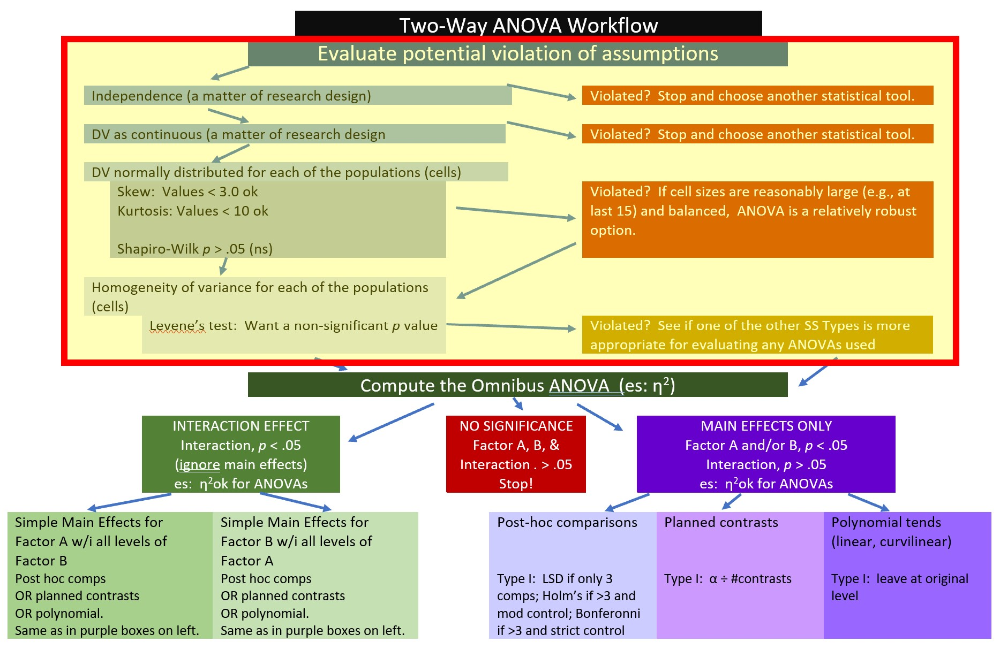

```{r }
TwoWay_neg<-aov(Negative~Rater*Photo, Ramdhani_df)
summary(TwoWay_neg)
model.tables(TwoWay_neg,"means")
```

#### DV is normally distributed

We can start easy with **skew** and **kurtosis**.

```{r}
library(psych)
psych::describeBy(Negative ~ Rater + Photo, mat = TRUE, data = Ramdhani_df, digits = 3)
```

Using guidelines from Kline [-@kline_principles_2016]
* All skew is below 3; 
* All kurtosis is below 8 (8 to 20 is considered to be *extreme*)

In a factorial design, the Shapiro-Wilk test is applied to residuals from the model itself.  Examination of those residuals can give us a good indication of normality.

First, we extract the residuals (i.e., that which is left-over/unexplained) from the model.

```{r }
resid_neg<- residuals (TwoWay_neg) #creates object of residuals
hist(resid_neg)
```
So far so good -- these look normal. Let's examine a QQ plot.  We want the dots (the *residuals*), or what is leftover after the model is applied to line up on the diagonal line (within reason). This would indicate a normal distribution.

```{r  }
qqnorm(resid_neg)
```
We can formally test the distribution of the residuals with a Shapiro test. We want the associated *p* value to be less than 0.05.
```{r }
shapiro.test(resid_neg)
```
Whooo hoo!  $p > 0.05$

Here's how I would summarize our data in terms of normality:

Factorial ANOVA assumes that the dependent variable is normally is distributed for all cells in the design.  Our analysis suggested skew and kurtosis were within the bounds considered to be normally distributed.  Further, the Shapiro-Wilk normality test (applied to the residuals from the factorial ANOVA model) suggested that the plotting of the residuals did not differ significantly from a normal distribution ($W$ = 0.9846, $p$ = 0.234).

#### Homogeneity of variance

Levene's test is also applied to the ANOVA model; in this case I just wrote it out.  Levene's requires a *fully saturated model.*  This means that the prediction model requires an interaction effect (not just two, non-interacting predictors).

```{r }
library(car)
leveneTest(Negative ~ Rater*Photo, data = Ramdhani_df)
```
Levene's test has indicated a violation of the homogeneity of variance assumption ($F$[5, 105] = 8.634, $p$ < .001). This is not surprising. The boxplots shows some widely varying variances. 

### Evaluating the Omnibus ANOVA

The *F*-tests associated with the two-way ANOVA are the *omnibus* -- giving the result for the main and interaction effects.  

Here's where we are in the decision tree.

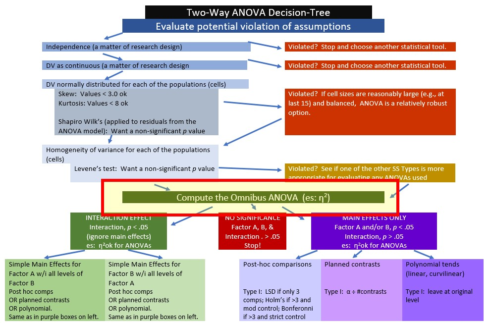

When we run the two-way ANOVA we will be looking for several effects:

* main effects for each predictor, and
* the interaction effect.

It is possible that all of them will be significant, none will be significant, or some will be significant. The interaction effect always takes precedence over the main effect because it let's us know there is a more nuanced/complex story.

In specifying the ANOVA, order of entry matters.  If you have a distinction between IV and moderator, put the IV first.
```{r }
TwoWay_neg<-aov(Negative~Rater*Photo, Ramdhani_df)
summary(TwoWay_neg)
model.tables(TwoWay_neg,"means")
```

Let’s gather the *F strings*”* from the above table.
Rater main effect: significant (*F*[2, 105] = 8.077, *p* < .001). Photo stimulus main effect: significant (*F*[1, 105] = 19.346, *p* < .001). Interaction effect: significant (*F*[2, 105] = 5.696, *p* = .004).

```{r }
plot(TwoWay_neg) 
```

#### Effect sizes

**Eta squared** is one of the most commonly used measures of effect. It refers to the proportion of variability in the DV/outcome variable that can be explained in terms of the IV/predictor.  Traditional interpretive values are similar to the Pearson's *r*:

0 = no relationship
.02 = small
.13 = medium
.26 = large
1 = a perfect (one-to-one) correspondence

More interpretive info can be found here:  https://imaging.mrc-cbu.cam.ac.uk/statswiki/FAQ/effectSize

The formula is straightforward:

$$\eta ^{2}=\frac{SS_{M}}{SS_{T}}$$
```{r }
library(lsr)
etaSquared(TwoWay_neg)
```
We can update our *F* string:
Rater main effect: significant (*F*[2, 105] = 8.077, *p* < .001, $\eta ^{2}$ = 0.107). Photo stimulus main effect: significant (*F*[1, 105] = 19.346, *p* < .001, $\eta ^{2}$ = 0.127). Interaction effect: significant (*F*[2, 105] = 5.696, *p* = .004, $\eta ^{2}$ = 0.075).

#### APA Write-up of the omnibus results

A 3 X 2 ANOVA was conducted to evaluate the effects of rater ethnicity (3 levels, Dayaknese, Madurese, Javanese) and photo stimulus (2 levels, Dayaknese on Madurese,) on negative reactions to the photo stimuli. Results of Levene’s Test for Equality of Error Variances indicated violation of the assumption, ($F$[5, 105] = 8.834, $p$ < .001). Our analysis of the individual cell means (see Table 1 for means and standard deviations) suggested skew and kurtosis were within the bounds considered to be normally distributed [@kline_principles_2016]. A non-significant Shapiro-Wilk normality test (applied to the residuals from the factorial ANOVA model) provided further evidence that the assumption of normality was not violated ($W$ = 0.9846, $p$ = 0.234).

Computing sums of squares with a Type II approach, the results for the ANOVA indicated a significant main effect for ethnicity of the rater (*F*[2, 105] = 8.077, *p* < .001, $\eta ^{2}$ = 0.107), a significant main effect for photo stimulus, (*F*[1, 105] = 19.346, *p* < .001, $\eta ^{2}$ = 0.127), and a significant interaction effect (*F*[2, 105] = 5.696, *p* = .004, $\eta ^{2}$ = 0.075).

*...The next paragraph will have one of the follow-up options. We will add it later in the lesson*

### Follow-up a significant interaction effect

The aspirational ideal of a factorial ANOVA is a significant interaction effect.  Interpretation is more complex than a main effect (later) of either factor.

There are a mazillion ways to follow-up a significant interaction effect.  I will demo the four I believe to be the most useful in the context of psychologists operating within the scientist-practitioner-advocacy context.

When an interaction effect is significant (irrespective of the significance of one or more main effects), examination of **simple main effects** is a common statistical/explanatory approached that is used. The Two-Way ANOVA Decision Tree shows where we are in this process.

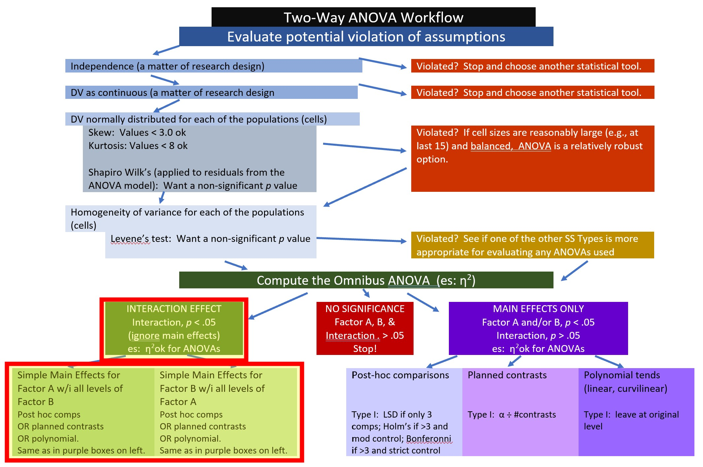

We're going to subset the data to see only the people in one group (e.g., low income neighborhood) and the do the other group(s) separately. 

Remember the custom orthogonal contrasts in one-way ANOVA? We will do the same for these super, simple main effects. In our 3x2 ANOVA, Rater has three levels: Dayaknese, Madurese, and Javanese.

#### Option #1 the simple main effect of photo stimulus within ethnicity of the rater

Here we subset each of the three ethnic groups and then compare their ratings of the two photos.
```{r message=FALSE, warning=FALSE}
Dayaknese <- subset(Ramdhani_df, Rater == "Dayaknese") #subset data
Dayaknese_simple <- aov(Negative ~ Photo, data = Dayaknese) #change df to subset, new model name 
summary(Dayaknese_simple) #output for simple main effect
etaSquared(Dayaknese_simple, anova = FALSE ) #effect size for simple main effect can add "type = 1,2,3,4" to correspond with the ANOVA that was run
```
Within the Dayaknese ethnic group, there is a statistically significant difference in negative reactions to Dayaknese and Madurese photos: *F* (1, 33) = 50.4, *p* < .001, $\eta ^{2}$ = 0.60.

Next we evaluate photo rating within the Madurese ethnic group.
```{r  message=FALSE, warning=FALSE}
Madurese <- subset(Ramdhani_df, Rater == "Madurese") #subset data
Madurese_simple <- aov(Negative ~ Photo, data = Madurese) #change df to subset, new model name 
summary(Madurese_simple) #output for simple main effect
etaSquared(Madurese_simple, anova = FALSE ) #effect size for simple main effect can add "type = 1,2,3,4" to correspond with the ANOVA that was run
```
Within the Madurese ethnic group, there was a nonsignificant difference in negative reactions to Dayaknese and Madurese photos:  *F* (1, 37) = 0.00, *p* = .993, $\eta ^{2}$ < .001.

```{r  message=FALSE, warning=FALSE}
Javanese <- subset(Ramdhani_df, Rater == "Javanese") #subset data
Javanese_simple <- aov(Negative ~ Photo, data = Javanese) #change df to subset, new model name 
summary(Javanese_simple) #output for simple main effect
etaSquared(Javanese_simple, anova = FALSE ) #effect size for simple main effect can add "type = 1,2,3,4" to correspond with the ANOVA that was run
```
Within the Javanese ethnic group, there was a significant difference in negative reactions to Dayaknese and Madurese photos: *F* (1, 35) = 17.18, *p* < .001, $\eta ^{2}$ = 0.33.

If I were using this approach in a 3 X 2 ANOVA, I would probably not control for Type I error.  Why?  I only conducted follow-up comparisons to evaluate the simple main effect of photo stimulus within rater ethnicity; that is, I would hold it at alpha = 0.05.  

* Photo stimulus (Dayaknese or Madurese) within the Dayaknese ethnic group.
* Photo stimulus (Dayaknese or Madurese) within the Madurese ethnic group.
* Photo stimulus (Dayaknese or Madurese) within the Javanese ethnic group.  

However, because it's good for instruction, it would be equally fine to use a traditional Bonferroni, dividing .05/3 = 0.017 and testing each at 0.017.  I will use this approach in the write-up.

FAQ:  Could we do the reverse simple effect, ethnicity of rater within the photo stimulus?  Absolutely!  The choice is yours (and sometimes the results will differ).  I usually run both and then report ONE -- the one that conveys the story the data has to tell.  You *could* report both sets, but then you would really want to control Type I error and your repetitive contrasts are faaaaaar from independent/orthogonal.

**APA Style Results for Option #1 follow-up.**  *This would be added to the results of the omnibus two-way ANOVA.* 

To explore the interaction effect, we followed with a test of the simple main effect of photo stimulus within the ethnicity of the rater. That is, we looked at the effect of the photo stimulus within the Dayaknese, Madurese, and Javanese groups, separately. To control for Type I error across the three simple main effects, we set alpha at .017 (.05/3). Results indicated significant differences for Dayaknese (*F* [1, 33] = 50.4, *p* < .001, $\eta ^{2}$ = 0.60.) and Javanese ethnic groups (*F* [1, 35]= 17.18, *p* < .001, $\eta ^{2}$ = 0.33), but not for the Madurese ethnic group (*F* [1, 37] = 0.000, *p* = .993, $\eta ^{2}$ < .001).  As illustrated in Figure 1, the Dayaknese and Javanese rathers both reported stronger negative reactions to the Madurese. The differences in ratings for the Madurese were not statistically significantly different.  In this way, the rater's ethnic group moderated the relationship between the photo stimulus and negative reactions.

```{r }
library(ggpubr)
ggboxplot(Ramdhani_df, x = "Rater", y = "Negative", color = "Photo",xlab = "Ethnicity of Rater", ylab = "Negative Reaction")
```

#### Option #2 the simple main effect of ethnicity of rater within photo stimulus.

In this simple main effect of ethnicity of rater (3 levels) within photo stimulus (2 levels), we will conduct two one-way ANOVAs for the Dayaknese and Madurese photos, separately.  However, we will want to do orthogonal contrast-coding for rater ethnicity for the follow-up (to the follow-up).

It helps to know what the default contrast codes are: 

```{r }
contrasts(Ramdhani_df$Rater)
```

Let's create custom contrasts. Recall that an orthogonal contrast requires that there be one less contrast than the number of groups and that once a group is singled out, it cannot be compared again.

Thus, I want to compare the 

* Javanese to the Dayaknese and Madurese combined, then
* Dayaknese to Madurese

```{r  message=FALSE, warning=FALSE}
# tell R which groups to compare
c1 <- c(1, -2, 1) 
c2 <- c(-1, 0, 1) 
mat <- cbind(c1,c2) #combine the above bits
contrasts(Ramdhani_df$Rater) <- mat # attach the contrasts to the variable
```

This allows us to recheck the contrasts.
```{r }
contrasts (Ramdhani_df$Rater)
```
Yes, in contrast 1 we are comparing the Javanese to the combined Dayaknese and Madurese.  In contrast 2 we are comparing the Dayaknese to the Madureses.

```{r message=FALSE, warning=FALSE}
Dayaknese_Ph <- subset(Ramdhani_df, Photo == "Dayaknese") #subset data
Dykn_simple <- aov(Negative ~ Rater, data = Dayaknese_Ph) #change df to subset, new model name 
summary(Dykn_simple) #output for simple main effect
etaSquared(Dykn_simple, anova = FALSE ) #effect size for simple main effect can add "type = 1,2,3,4" to correspond with the ANOVA that was run
```
*F* [2, 51]) = 13.32, *p* < .001, $\eta ^{2}$ = 0.343.

```{r message=FALSE, warning=FALSE}
summary.aov(Dykn_simple, split=list(Rater=list("Javanese v Dayaknese and Madurese"=1, "Dayaknese  Madurese" = 2)))
```
The simple main effect of ethnicity of the rater within the reaction to the photos of members of the Dayaknese ethnic group was  statistically significant:  *F* [2, 51] = 13.32, *p* < .001, $\eta ^{2}$ = 0.343. Follow-up testing indicated non-significant differences when the ratings from members of the Javanese ethnic group were compared to the Dayaknese and Madurese, combined (*F* [1, 51] = 0.095, *p* = .759).  There was a statistically significant difference when Dayaknese and Madurese raters were compared (*F* [1, 51] =26.554, *p* < .001)

```{r message=FALSE, warning=FALSE}
Madurese_Ph <- subset(Ramdhani_df, Photo == "Madurese") #subset data
Mdrs_simple <- aov(Negative ~ Rater, data = Madurese_Ph) #change df to subset, new model name 
summary(Mdrs_simple) #output for simple main effect
etaSquared(Mdrs_simple, anova = FALSE ) #effect size for simple main effect can add "type = 1,2,3,4" to correspond with the ANOVA that was run
```

*F* [2, 54] = 0.679, *p* = .512, $\eta ^{2}$ = 0.024.

```{r  message=FALSE, warning=FALSE}
summary.aov(Mdrs_simple, split=list(Rater=list("Javanese v Dayaknese and Madurese"=1, "Dayaknese  Madurese" = 2)))
```

The simple main effect of ethnicity of the rater within  rating the photos of Madurese people was not statistically significant:  (*F* [2, 54] = 0.679, *p* = .512, $\eta ^{2}$ = 0.024). Correspondingly, follow-up testing indicated non-significant differences when the ratings of the Javanese were compared to Dayaknese and Madurese, combined (*F* [1, 54] = 1.008, *p* = .320) and when the ratings of the Dayaknese and Madurese were compared (*F* [1, 54] = 0.349, *p* = .557)

To control for Type I error, we have 4 follow-up contrasts (2 for Dayaknese, 2 for Madurese).  We'll control Type I error with .05/4 = .0125

```{r }
.05/4
```

**APA Write-up of the simple main effect of photo stimulus within rater ethnicity.** *This would be added to the write-up of the omnibus two-way ANOVA test.

*Option #2*: To explore the interaction effect, we followed with tests of simple effect of rater ethnicity within the photo stimulus. That is, we looked at the effect of each each rater's ethnicity within the Madurese and Dayaknese photo stimulus, separately. Our first analysis evaluated the effect of the rater's ethnicity when evaluating the Dayaknese photo; our second analysis evaluated effect of the rater's ethnicity when evaluating the Madurese photo. To control for Type I error across the two simple main effects, we set alpha at .0125 (.05/4). The simple main effect of ethnicity of the rater within the reaction to the photos of members of the Dayaknese ethnic group was  statistically significant:  *F* [2, 51] = 13.32, *p* < .001, $\eta ^{2}$ = 0.343. Follow-up testing indicated non-significant differences when the ratings from members of the Javanese ethnic group were compared to the Dayaknese and Madurese, combined (*F* [1, 51] = 0.095, *p* = .759).  There was a statistically significant difference when Dayaknese and Madurese raters were compared (*F* [1, 51] =26.554, *p* < .001).  The simple main effect of ethnicity of the rater within when rating the photos of Madurese people was not statistically significant:  (*F* [2, 54] = 0.679, *p* = .512, $\eta ^{2}$ = 0.024). Correspondingly, follow-up testing indicated non-significant differences when the ratings of the Javanese were compared to Dayaknese and Madurese, combined (*F* [1, 54] = 1.008, *p* = .320) and when the ratings of the Dayaknese and Madurese were compared (*F* [1, 54] = 0.349, *p* = .557).  This moderating effect of ethnicity of the rater on the negative reaction to the photo stimulus is illustrated in Figure 1. 

```{r}
ggboxplot(Ramdhani_df, x = "Photo", y = "Negative", color = "Rater", xlab = "Photo Stimulus",
             ylab = "Negative Reaction")
```

#### Post hoc comparisons

Another option is compare all possible cells. These are termed *post hoc comparisons.*  They are an alternative to simple main effects; you would not report both. The figure shows our place on the Two-Way ANOVA Decision Tree.

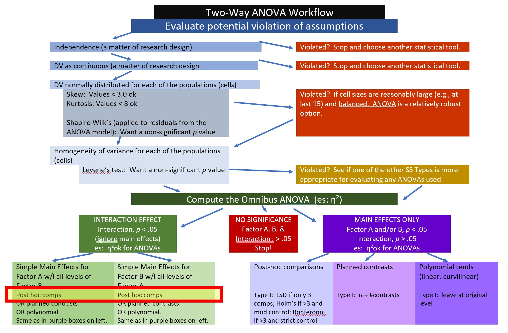


As the numbers of levels increase, post hoc comparisons become somewhat unwieldly.  Even though this procedure produces them all, you can select which sensible number you want to prepare and control for Type I error in that way.

The total number of paired comparisons is:  k(k-1)*2
k is the number of groups.  With race (2 levels) and neighborhood income level (3 levels), we have 6 groups

```{r }
6*(6-1)/2
```
Sure enough -- look below:

```{r }
posthocs <- TukeyHSD(TwoWay_neg, ordered = TRUE)
posthocs
```

If we want to consider all 15 pairwise comparisons and also control for Type I error, a Holm's sequential Bonerroni [@green_using_2014] will help us take a middle-of-the-road approach (not as strict as .05/15 with the traditional Bonferroni; not as lenient as "none") to managing Type I error. 

With the Holms, we rank order the *p* values associated with the 15 comparisons in order from lowest (e.g., .0000018) to highest (e.g., 1.000).  The first *p* value is evaluated with the most strict criterion (.05/15) according to the traditional Bonferonni approach. Then, each successive comparison calculates the *p* value by using the number of *remaining* comparisons as the denominator (e.g., .05/14, .05/13, .05/12). As the *p* values rise and the alpha levels relax, there will be a cut-point where remaining comparisons are not statistically significant.

```{r }
.05/15
.05/14
```

To facilitate this contrast, let's extract the 15 TukeyHSD tests and work with them in Excel.

First, obtain the structure of the *posthoc* object

```{r }
str(posthocs)
```

```{r }
write.csv(posthocs$'Rater:Photo', 'posthocsOUT.csv')
```

In Excel, I would sort my results by their *p* values (low to high) and consider my thresshold (*p* < .003) to determine which effects were statistically significant. Using the strictest criteria of *p* < .0033, we would have four statistically significant values.

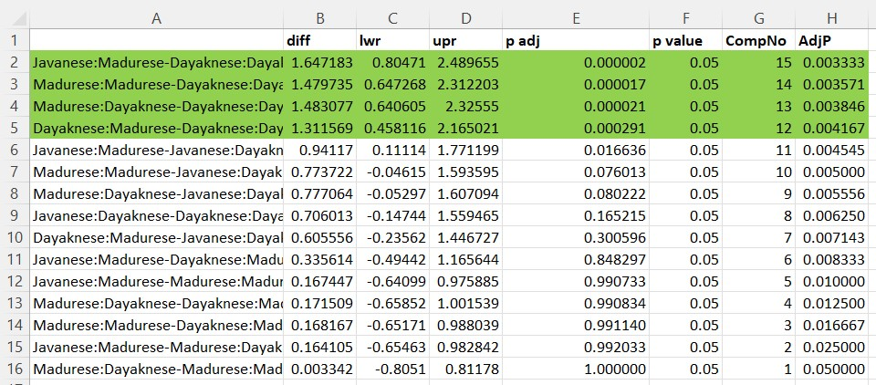

I would ask, "Is this what we want?" Similar to the simple main effects we just tested, I am interested in two sets of comparisons:

First, how are the two sets of photos (Madurese and Dayaknese) rated within each set of raters.

* Javanese:Madurese - Javanese:Dayaknese
* Dayaknese:Madurese - Dayaknese:Dayaknese
* Madurese:Madurese - Madurese:Dayaknese

Second, focused on each photo, what are the relative ratings.

* Javanese:Madurese - Dayaknese:Madurese
* Madurese: Madurese - Dayaknese:Madurese

* Javanese:Dayaknese - Dayaknese:Dayaknese
* Madurese: Dayaknese - Dayaknese:Dayaknese

This is only seven sets of comparisons and would considerably reduce the alpha:
```{r}
.05/7
```
Below I have greyed-out the comparisons that are less interesting to me and left the seven that are my focal interest. I have highlighted in green the two comparisons that are statistically significant based on the Holms' sequential criteria. In this case, it does not make any difference in our interpretation of these focal predictors.  

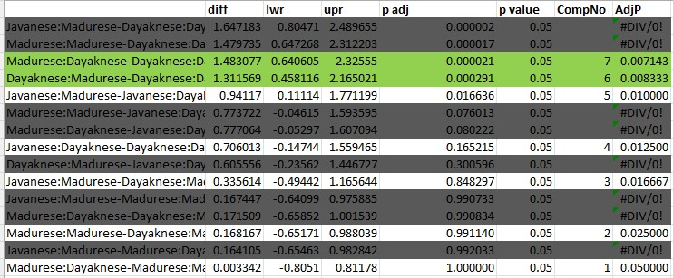

#### Polynomial Trends 

In the context of the significant interaction effect, we might also be interested in polynomial trends for any simple main effects where 3 or more cells are compared.

Why?  If there are only two cells being compared, then the significance of that has already been tested and if significant, it is also a significant linear effect (because the shape between any two points is a line, hence it's *linear*). Below is a figure of where the polynomial test of an interaction effect may fall in the process.

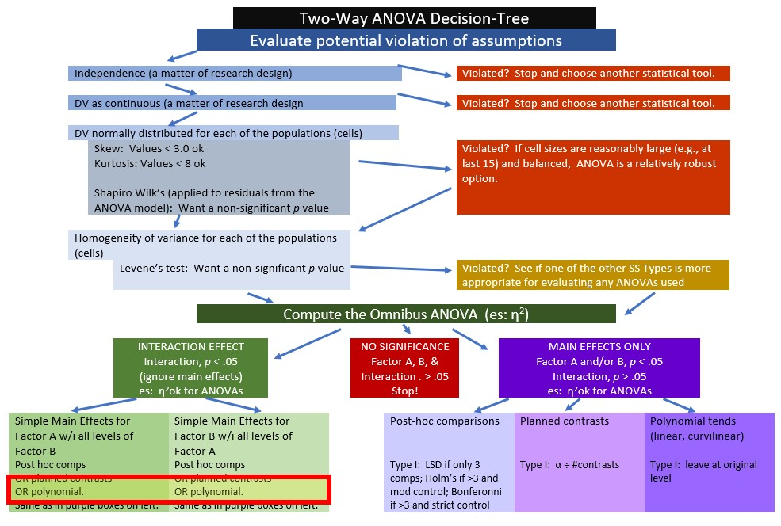

In our example, Rater has three groups  Thus, we could evaluate a polynomial for the simple main effect of ethnicity of the rater within photo stimulus (separately for the photos of the Dayaknese and Madurese). We conduct these separately for Dayaknese, Madurese, and Javanese groups.

In the event that more than one polynomial trend select the higher one.  For example, if both linear and quadratic are selected, interpret the quadratic trend

```{r }
contrasts(Dayaknese_Ph$Rater)<-contr.poly(3)
poly_Dy<-aov(Negative ~ Rater, data = Dayaknese_Ph)
summary.lm(poly_Dy)
```

Results of a polynomial trend analysis indicated a statistically significant linear trend for evaluation of the Dayaknese photos across the three raters *t* (51) = 5.153, *p* < .001.

```{r }
contrasts(Madurese_Ph$Rater)<-contr.poly(3)
poly_Md<-aov(Negative ~ Rater, data = Madurese_Ph)
summary.lm(poly_Md)
```
Results of a polynomial trend analysis were non-significant when ethnicity of the rater was evaluated when rating Madurese photos.

## In the event of a non-significant interaction, but one or more significant main effects

We now focus on the possibility that there might be significant main effects, but a non-significant interaction effect.  We **only** interpret main effects when there is a non-significant interaction effect.  Why? Because in the presence of a significant interaction effect, the main effect will not tell a complete story. *(And, if we didn't specify a correct model, we still might have an incomplete story. But that's another issue.)* Here's where we are on the Decision-Tree.

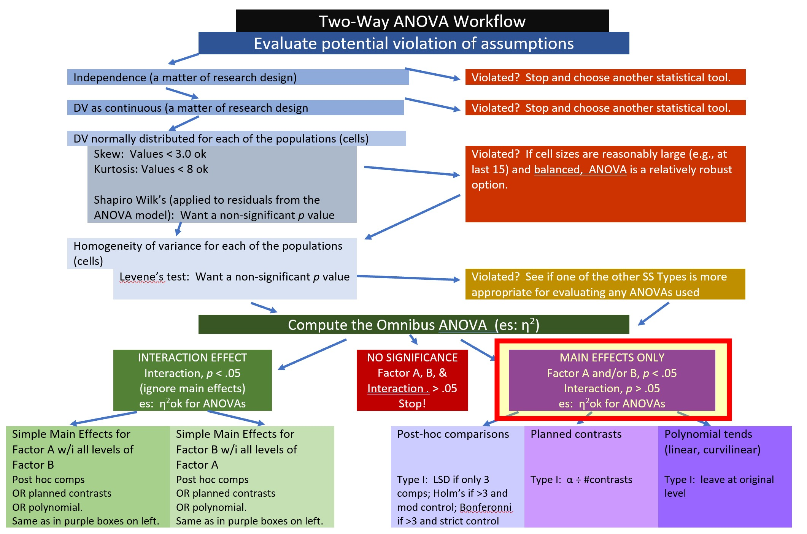

Recall that main effects are the *marginal means* -- that is the effects of Factor A *collapsed across* all the levels of Factor B.

If the main effect has only two levels (e.g., the ratings of the Dayaknese and Madurese photos):

* the comparison was already ignoring/including all levels of the rater ethnicity factor (Dayaknese, Madurese, Javanese),
* it was only a comparison of two cells (Dayaknese rater, Madurese rater), therefore
* there is no need for further follow-up.  

If the main effect has three or more levels (e.g,. ethnicity of rater with Dayaknese, Madurese, Javanese levels), then you would follow-up with one or more of the myriad of options.  In this class we have focused on three:

* planned contrasts
* posthoc comparisons (all possible cells)
* polynomial

I will demo how to do each as follow-up to a *pretend* scenario where the main effect (but not the interaction) had been significant. I will write up the portion that would be inserted in an APA style results section.

Essentially, we treat these main effect analyses as the follow-up to a significant one-way ANOVA evaluating, in our case, the ethnicity of the Rater.

```{r }
RaterMain <- aov(Negative ~ Rater, data = Ramdhani_df) #DV ~ IV  I say, "DV by IV"
model.tables (RaterMain) #ANOVA output
summary(RaterMain)
etaSquared(RaterMain)
```
A boxplot representing this main effect may help convey how the main effect of Rater (collapsed across Photo) is different than an interaction effect.
```{r}
ggboxplot(Ramdhani_df, x = "Rater", y = "Negative", xlab = "Ethnicity of Rater", ylab = "Negative Reaction")
```


### Follow-up with all post-hocs

An easy possibility is to follow-up with all possible post-hocs. In the main effect case, these are far simpler than where we conducted all possile posthocs for the interaction effect (remember the Holms sequential Bonferroni?).

Here is a reminder of our location on the Decision-Tree.

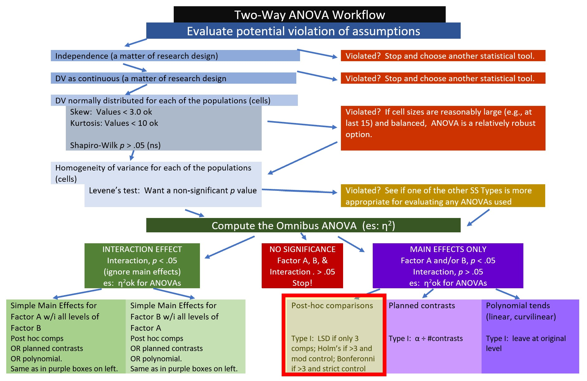

The *TukeyHSD()* function produces posthoc comparisons by providing the mean difference, a 95% confidence interval of those differences, and the associated *p* value.
```{r }
TukeyHSD(RaterMain, ordered = TRUE)
```
Results suggest there were statistically significant differences (*p* < .05) between the Madurese and Dayaknese. These differences, though, would have been when rating *all* photos.  This analysis disregards the ethnicity portrayed in the photo.

### Follow-up with planned contrasts

We generally try for *orthogonal* contrasts so that the partitioning of variance is independent (clean, not overlapping). Planned contrasts are a great way to do this.  Here's where we are in the Decision-Tree.


If you aren't SUPER DUPER careful about your order-of-operations in R, it can confuse objects, so I have named these contrasts *main_c1* and *main_c2* to remind myself that they refer to the main effect of ethnicity of the rater.

In this hypothetical scenario (remember we are pretending we are in the circumstance of a non-significant interaction effect but a significant main effect), I am:

* Constrast #1:  comparing the DV for the Javanese rater to the combined Dayaknese and Madurese raters.
* Contrast #2:  comparing the DV for the Dayaknese and Madurese raters.

These are orthogonal because:

* there are *k* - 1 comparisons, and 
* once a contrast is isolated (i.e., the Javanese rater in contrast #1) it cannot be used again
  -  piece of cake analogy...once you take out a piece of the cake, you really can't put it back in

```{r }
#Contrast1  compares Control against the combined effects of Low and High.
main_c1 <- c(1,-2,1)

#Contrast2 excludes Control; compares Low to High.
main_c2 <- c(-1,0,1)
contrasts(Ramdhani_df$Rater)<-cbind(main_c1, main_c2)
contrasts(Ramdhani_df$Rater)
```
Then we run the contrast

```{r }
mainPlanned <- aov(Negative ~ Rater, data = Ramdhani_df)
summary.lm(mainPlanned)
contrasts(Ramdhani_df$Rater)<-cbind(c(1,-2,1), c(-1,0,1))
```

These planned contrasts show that when the Javanese raters are compared to the combined Dayaknese and Madurese raters, there was a non significant difference, *t*(108) = -0.567, *p* = .572. However, there were significant differences between Dayaknese and Javanese raters, *t*(108) = 3.556, *p* < .001. 


### Polynomial Trends

Polynomial contrasts let us see if there is a linear (or curvilinear) pattern to the data. To detect a trend, the data must be coded in an ascending order...and it needs to be a sensible comparison. Here's where this would fall in our Decision-Tree.

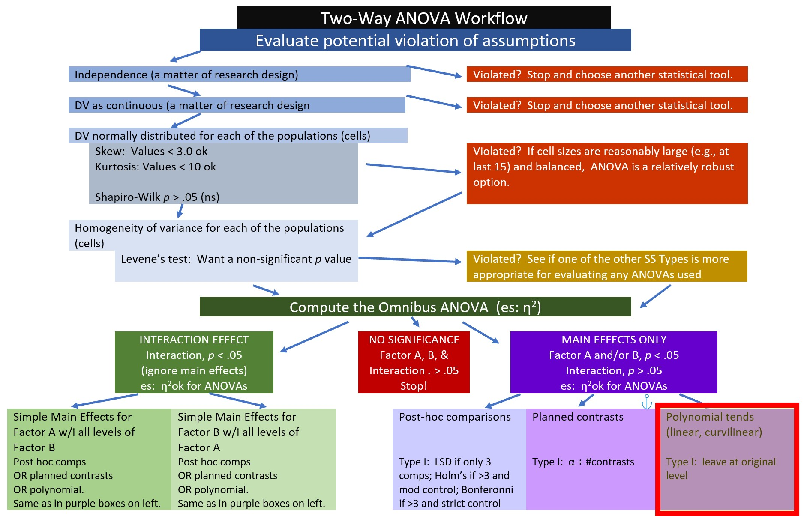
Because these three ethnic groups are not *ordered* in the same way as would an experiment involving dosage (e.g,. placebo, lo dose, hi dose), evaluation of the polynomial trend is not really justified (even though it is statistically possible). None-the-less, I will demonstrate how it is conducted.

```{r }
contrasts(Ramdhani_df$Rater)<-contr.poly(3)
mainTrend<-aov(Negative ~ Rater, data = Ramdhani_df)
summary.lm(mainTrend)
```

**Rater.L** tests the data to see if there is a significant linear trend.  There is:  *t* = 3.556, *p* < .001.

**Rater.!** tests to see if there is a significant quadratic (curvilinear, one hump) trend.  There is not:  *t* = -0.567, *p* = .572.

Results supported a significant linear trend (*t* = 3.556, *p* < .001) such that negative reactions increased in a linear reaction across the three rating groups.

```{r}
ggboxplot(Ramdhani_df, x = "Rater", y = "Negative", xlab = "Ethnicity of Rater", ylab = "Negative Reaction")
```


## My *final* APA Style Results Section

First, I am reluctant to term anything "final." It seems like there is always the possibility or revision.  Given that I demonstrated a number of options, let me first show the Decision-Tree with the particular path I took:


In light of that, here's the final write-up:

**Results**

A 3 X 2 ANOVA was conducted to evaluate the effects of rater ethnicity (3 levels, Dayaknese, Madurese, Javanese) and photo stimulus (2 levels, Dayaknese on Madurese,) on negative reactions to the photo stimuli. Results of Levene’s Test for Equality of Error Variances indicated violation of the assumption, ($F$[5, 105] = 8.834, $p$ < .001). Our analysis of the individual cell means (see Table 1 for means and standard deviations) suggested skew and kurtosis were within the bounds considered to be normally distributed [@kline_principles_2016]. A non-significant Shapiro-Wilk normality test (applied to the residuals from the factorial ANOVA model) provided further evidence that the assumption of normality was not violated ($W$ = 0.9846, $p$ = 0.234).

Computing sums of squares with a Type II approach, the results for the ANOVA indicated a significant main effect for ethnicity of the rater (*F*[2, 105] = 8.077, *p* < .001, $\eta ^{2}$ = 0.107), a significant main effect for photo stimulus, (*F*[1, 105] = 19.346, *p* < .001, $\eta ^{2}$ = 0.127), and a significant interaction effect (*F*[2, 105] = 5.696, *p* = .004, $\eta ^{2}$ = 0.075).

To explore the interaction effect, we followed with a test of the simple main effect of photo stimulus within the ethnicity of the rater. That is, we looked at the effect of the photo stimulus within the Dayaknese, Madurese, and Javanese groups, separately. To control for Type I error across the three simple main effects, we set alpha at .017 (.05/3). Results indicated significant differences for Dayaknese (*F* [1, 33] = 50.4, *p* < .001, $\eta ^{2}$ = 0.60.) and Javanese ethnic groups (*F* [1, 35]= 17.18, *p* < .001, $\eta ^{2}$ = 0.33), but not for the Madurese ethnic group (*F* [1, 37] = 0.000, *p* = .993, $\eta ^{2}$ < .001).  As illustrated in Figure 1, the Dayaknese and Javanese rathers both reported stronger negative reactions to the Madurese. The differences in ratings for the Madurese were not statistically significantly different.  In this way, the rater's ethnic group moderated the relationship between the photo stimulus and negative reactions.

```{r }
library(ggpubr)
ggboxplot(Ramdhani_df, x = "Rater", y = "Negative", color = "Photo",xlab = "Ethnicity of Rater", ylab = "Negative Reaction")
```


```{r }
library(apaTables)
apa.2way.table(iv1 = Rater, iv2 = Photo, dv = Negative, data = Ramdhani_df, landscape=TRUE, table.number = 1, filename="Table_1_MeansSDs.doc")

```

```{r }
apa.aov.table(TwoWay_neg, filename = "Table_2_effects.doc", table.number = 2, type = "II")
```

### Comparing Our Results to Rhamdani et al. [-@ramdhani_affective_2018]

As is common in simulations, our data gets close to the findings, but does not replicate them exactly. Our main and interaction effects map on very closely. However, in the follow-up tests, while our findings that Dayaknese rated the Madurese photos more negatively, was consistent across our simulated data and the article, the findings related to the Javanese' and Madurese' ratings wiggled around some. A close look at the figures can explain that with varying variability and close means, this is probable.  I find it to be a useful lesson in "what it takes" to get stable, meaningful results. 

## Options for Assumption Violations

In one-way ANOVA we could simply apply the Welch's alternative.  It's not so easy in factorial.  One alternative, though, is to change the Sums of Squares type used in the ANOVA calculations.  

In ANOVA models sums of squares can be calculated four different ways: Type I, II, III, and IV. This matters. 

SS Type II is the *aov()* default. It may be a best practice to go ahead and specify the SS Type in both the *aov()*, eta-squared, and apaTables script so that they are  consistent.

**Type I** sums of squares is similar to hierarchical linear regression in that the first predictor in the model claims as much variance as it can and the leftovers are claimed by the variable entered next – each claiming as much as possible leaving the leftovers for what follows. Unless the variables are completely independent of each other (unlikely), Type I sums of squares cannot evaluate the true main effect of each variable. Type I should not be used to evaluate main effects and interactions because the order of predictors will affect the results.

**Type II** is the R default appropriate if you are interested main effects because it ignores the effect of any interactions involving the main effect. Thus, variance from a main effect is not “lost” to any interaction terms containing that effect. Type II is appropriate for main effects analyses only, but should not be used when evaluating interaction effects. Type II sums of squares is not affected by the type of contrast coding used to specify the predictor variables.

**Type III** is the default in many stats packages – but not R. In Type III all effects (main effects and interactions) are evaluated (simultaneously) taking into consideration all other effects in the model (not just the ones entered before). Type III is more robust to unequal samples sizes (e.g., unbalanced designs). Type III is best when predictors are encoded with orthogonal contrasts.

***Type IV** is identical to Type III except it requires no missing cells. 

Field [-@field_discovering_2012] suggests that it is safest to stick with Type III sums of squares .  We apply the type to the model we create in the initial run. For more information, check out this explanation on [r-bloggers](https://www.r-bloggers.com/2011/03/anova-%E2%80%93-type-iiiiii-ss-explained/).

Many researchers automatically use Type III as the SS type.  Today I went with the R default because

* Type II sums of squares was used in hand-calculations,
* Our example was reasonably balanced (equal cell sizes), and 
* We had only violated the homogeneity of variance assumption.  

For demonstration purposes, let's run the Type III alternative to see the differences:  

```{r }
#this is what we did
Anova(TwoWay_neg)
```

```{r }
#We change the SS type by applying it to our model.
Anova(TwoWay_neg, type ="III")
```
Note that the sums of squares are somewhat different between models -- and that the Type III tests includes an intercept. In today's example, the  statistical significance remains the same across the models.

Now let's compare the effect sizes across models.

```{r}
etaSquared(TwoWay_neg)
```

```{r}
etaSquared(TwoWay_neg, type=3)
```
The Type III effect size for Rater is higher; the others are quite similar.


## Power 

*Power* is often our euphemistic way of asking, "How large should my sample size be?"

Power defined is the ability of the test to detect statistical significance when there is such.  It's represented formulaically as 1 - *P*)(Type II error).  Power is traditionally set at 80% (or .8)

We'll do both -- evaluate the power of our current example and then work backwards to estimate the sample size needed (which is our usual question for MRPs and dissertations).

We'll use the *pwr.2way()* function from the *pwr2* package.
Helpful resources are found here: 

*  https://cran.r-project.org/web/packages/pwr2/pwr2.pdf
*  https://rdrr.io/cran/pwr2/man/ss.2way.html

The *pwr.2way()* and *ss.2way()* functions require the following:

* **a** number of groups in Factor A
* **b** number of groups in Factor B
* **alpha**  significant level (Type I error probaility)
* **beta** Type II error probability (Power = 1 - beta; traditionally set at .1 or .2)
* **f.A** the *f* effect size of Factor A 
* **f.B** the *f* effect size of Factor B
* **B** Iteration times, default is 100 

Hints for calculating the *f.A* and *f.B* values:

* In this case, we will rerun the statistic, grab both, and convert them to the *f* (not the $f^2$)
  - calculation can be straightforward, either use an online calculator, a hand-calculated formula, or the *eta2_to_f* function from the *effectsize* 
* In unknown case, you can substitute what you expect using Cohen's guidelines of .10, .25, and .40 as small, medium, and large (for the *f*, not $F^2$)
* Helpful resource:  https://imaging.mrc-cbu.cam.ac.uk/statswiki/FAQ/effectSize 

Let's quickly rerun our model to get both the df and calculate the *f* effect value
```{r  message=FALSE, warning=FALSE}
etaSquared(TwoWay_neg, anova = TRUE)
# get the partial eta-square (second number)
# and dfs 
```
If we want to understand power in our analysis, we need to convert our effect size for the *interaction* to $f$ effect size (this is not the same as the *F* test). The *effectsize* package has a series of converters.  We can use the *eta2_to_f()* function. 

```{r}
library(effectsize)
eta2_to_f(0.1066) #FactorA -- Rater
eta2_to_f(0.1274) #Factor B -- Photo
```

Now, to calculate power for our existing model. We'll use the package *pwr2* and the function *pwr.2way()*. To specify this we identify:

a:  number of groups for Factor A (Rater)
b:  number of groups for Factor B (Photo)
size.A:  sample size per group in Factor A (because ours differ slightly, I divided the N by the number of groups)
size.B:  sample size per group in Factor B (because ours differ slightly, I divided the N by the number of groups)
f.A:  Effect size of Factor A
f.A.:  Effect size of Factor B
```{r}
library(pwr2)
pwr.2way(a=3, b=2, alpha = 0.05, size.A = 37, size.B = 55, f.A = .345, f.B = .382)
```
Our power to detect a significant effect for Factor A/Rater and Factor B/Photo was huge!  


**Calculating sample size requirements**

Say we wanted to replicate this study.  We could use the estimates from this study to estimate what would be needed for the replication.

In this specification:

a:  number of groups for Factor A (Rater)
b:  number of groups for Factor B (Photo)
alpha: significance level  (Type I error probability); usually .05
beta:  Type II error probability (Power = 1-beta); usually .80
f.A:  Effect size (*f*) of Factor A (this time we know; other times we can guess from previously published literature)
f.A.:  Effect size (*f*) of Factor B
B: iteration times, default number is 100

```{r}
ss.2way(a = 3, b = 2, alpha = .05, beta = .8, f.A = .345, f.B = .382, B= 100)
```
Curiously, that's just about the number that was in each of the six cells!

Often times researchers will play around with the *f* values.  Remember Cohen's indication of small (.10), medium (.25), and large (.40).  We know we have a small effect for race and a larger effect for neighborhood income.  Let's see what happens when we enter different values. Specifically, what if we only had a medium effect.

```{r}
ss.2way(a = 3, b = 2, alpha = .05, beta = .80, f.A = .25, f.B = .25, B= 100) #if we expected a medium effect
ss.2way(a = 3, b = 2, alpha = .05, beta = .80, f.A = .10, f.B = .10, B= 100) #if we expected a small effect
```


## Practice Problems

In each of these lessons I provide suggestions for practice that allow you to select one or more problems that are graded in difficulty. In any case, you will be expected to:

* test the statistical assumptions
* conduct a two-way ANOVA, including
  - omnibus test and effect size
  - report main and interaction effects
  - conduct follow-up testing of simple main effects
* write a results section to include a figure and tables

### Problem #1:  Play around with this simulation.

Copy the script for the simulation and then change (at least) one thing in the simulation to see how it impacts the results.  

* If two-way ANOVA is new to you, perhaps you just change the number in "set.seed(210731)" from 210731 to something else. Your results should parallel those obtained in the lecture, making it easier for you to check your work as you go.
* If you are interested in power, change the sample size to something larger or smaller.
* If you are interested in variability (i.e., the homogeneity of variance assumption), perhaps you change the standard deviations in a way that violates the assumption.

Using the lecture and workflow (chart) as a guide, please work through all the steps listed in the proposed assignment/grading rubric.

|Assignment Component                    | Points Possible   | Points Earned|
|:-------------------------------------- |:----------------: |:------------:|
|1. Check and, if needed, format data |      5            |_____  |           
|2. Evaluate statistical assumptions     |      5            |_____  |
|3. Conduct omnibus ANOVA (w effect size)|      5           | _____  |  
|4. Conduct one set of follow-up tests; narrate your choice| 5 |_____  |               
|5. Describe approach for managing Type I error|    5        |_____  |   
|6. APA style results with table(s) and figure|    5        |_____  |       
|7. Explanation to grader                 |      5        |_____  |
|**Totals**                               |      35       |_____  |          


### Problem #2:  Conduct a one-way ANOVA with the *positive evaluation* dependent variable.

The Ramdhani et al. [-@ramdhani_affective_2018] article has two dependent variables (negative and positive evaluation) which are suitable for two-way ANOVAs. I used *negative evaluation* as the dependent variable; you are welcome to conduct the analysis with *positive evaluation* as the dependent variable.

|Assignment Component                    | Points Possible   | Points Earned|
|:-------------------------------------- |:----------------: |:------------:|
|1. Check and, if needed, format data |      5            |_____  |           
|2. Evaluate statistical assumptions     |      5            |_____  |
|3. Conduct omnibus ANOVA (w effect size)|      5           | _____  |  
|4. Conduct one set of follow-up tests; narrate your choice| 5 |_____  |               
|5. Describe approach for managing Type I error |    5        |_____  |   
|6. APA style results with table(s) and figure  |    5        |_____  |       
|7. Explanation to grader                 |      5        |_____  |
|**Totals**                               |      35       |_____  |             


### Problem #3:  Try something entirely new.

Using data for which you have permission and access (e.g.,  IRB approved data you have collected or from your lab; data you simulate from a published article; data from an open science repository; data from other chapters in this OER), complete a two-way, factorial ANOVA. Please have at least 3 levels for one predictor and at least 2 levels for the second predictor.

Using the lecture and workflow (chart) as a guide, please work through all the steps listed in the proposed assignment/grading rubric.

|Assignment Component                    | Points Possible   | Points Earned|
|:-------------------------------------- |:----------------: |:------------:|
|1. Narrate the research vignette, describing the IV and DV | 5 |_____  |
|2. Simulate (or import) and format data               |      5            |_____  |           
|3. Evaluate statistical assumptions     |      5            |_____  |
|4. Conduct omnibus ANOVA (w effect size) |      5           | _____  |  
|5. Conduct one set of follow-up tests; narrate your choice| 5 |_____  |               
|6. Describe approach for managing Type I error |    5        |_____  |   
|7. APA style results with table(s) and figure  |    5        |_____  |       
|8 Explanation to grader                 |      5        |_____  |
|**Totals**                               |      35       |_____  |          


```{r include=FALSE}
sessionInfo()
```


<!--chapter:end:05-FactorialANOVA.Rmd-->

# One-Way Repeated Measures ANOVA {#Repeated}

 [Screencasted Lecture Link](https://spu.hosted.panopto.com/Panopto/Pages/Viewer.aspx?pid=c8f5737f-d00d-4fa4-ba3c-ad8b01762258) 
 
```{r  include=FALSE}
knitr::opts_chunk$set(echo = TRUE)
knitr::opts_chunk$set(comment = NA) #keeps out the hashtags in the knits
options(scipen=999)#eliminates scientific notation
```

In the prior lessons, a critical assumption is that the observations must be "independent."  That is, related people (partners, parent/child, manager/employee) cannot comprise the data and there cannot be multiple waves of data for the same person. Repeated measures ANOVA is created specifically for this *dependent* purpose. This lessons focuses on the one-way repeated measures ANOVA, where we measure changes across time.

## Navigating this Lesson

There is just over one hour of lecture.  If you work through the materials with me it would be plan for an additional two hours

While the majority of R objects and data you will need are created within the R script that sources the chapter, occasionally there are some that cannot be created from within the R framework. Additionally, sometimes links fail.  All original materials are provided at the [Github site](https://github.com/lhbikos/ReCenterPsychStats) that hosts the book. More detailed guidelines for ways to access all these materials are provided in the OER's [introduction](#ReCintro)

### Learning Objectives

Learning objectives from this lecture include the following:

* Evaluate the suitability of a research design/question and dataset for conducting a one-way repeated measures ANOVA; identify alternatives if the data is not suitable.
* Hand-calculate a one-way repeated measures NOVA
  - describing the partitioning of variance as it relates to model/residual; within/between
* Test the assumptions for one-way repeated measures ANOVA.
* Conduct a one-way repeated measures ANOVA (omnibus and follow-up) in R.
* Interpret output from the one-way repeated measures ANOVA (and follow-up). 
* Prepare an APA style results section of the one-way repeated measures ANOVA output.
* Demonstrate how an increased sample size increases the power of a statistical test.

### Planning for Practice

The suggestions for homework are graded in complexity with more complete descriptions at the end of the chapter follow these suggestions.

* Rework the problem in the chapter by changing the random seed in the code that simulates the data.  This should provide minor changes to the data, but the results will likely be very similar. 
* There were no additional variables in this example. However, you'll see we do have an issue with statistical power. Perhaps change the sample size to see if it changes (maybe stabilizes?) the results.
* Conduct a one-way repeated measures ANOVA with data to which you have access. This could include data you simulate on your own or from a published article.

### Readings & Resources

In preparing this chapter, I drew heavily from the following resource(s). Other resources are cited (when possible, linked) in the text with complete citations in the reference list.

* Repeated Measures ANOVA in R: The Ultimate Guide. (n.d.). Datanovia. Retrieved October 19, 2020, from https://www.datanovia.com/en/lessons/repeated-measures-anova-in-r 
  - This website is an excellent guide for both one-way repeated measures and mixed design ANOVA. A great resource for both the conceptual and procedural.  This is the guide I have used for the basis of the lecture.  Working through their example would be great additional practice.
* Green, S. B., & Salkind, N. J. (2014). One-Way Repeated Measures Analysis of Variance (Lesson 29). In Using SPSS for Windows and Macintosh: Analyzing and understanding data (Seventh edition., pp. 209–217). Pearson.
  - For years I taught from the Green and Salkind text. Even though it was written for SPSS, the authors do a terrific job of walking the reader through the one-way repeated measures logic and process.
* Amodeo, A. L., Picariello, S., Valerio, P., & Scandurra, C. (2018). Empowering transgender youths: Promoting resilience through a group training program. Journal of Gay & Lesbian Mental Health, 22(1), 3–19.
  - This mixed methods (qualitative and quantitative) includes a one-way repeated measures example.  While the entire article is a good read, if you are short on time, focus your reading on the portions that address relevant to the use of the one-way repeated measures ANOVA:  research design, procedure, results.

### Packages

The packages used in this lesson are embedded in this code. When the hashtags are removed, the script below will (a) check to see if the following packages are installed on your computer and, if not (b) install them.
```{r  }
#will install the package if not already installed
#if(!require(tidyverse)){install.packages("tidyverse")} #manipulate data
#if(!require(psych)){install.packages("psych")} 
#if(!require(ggpubr)){install.packages("ggpubr")} #easy plots
#if(!require(rstatix)){install.packages("rstatix")} #pipe-friendly R functions
#if(!require(data.table)){install.packages("data.table")} #pipe-friendly R functions
#if(!require(reshape2)){install.packages("reshape2")} #pipe-friendly R functions
#if(!require(WebPower)){install.packages("WebPower")} #power analysis tools for repeated measures
#if(!require(MASS)){install.packages("MASS")} #power analysis tools for repeated measures
```

## Introducing One-way Repeated Measures ANOVA

There are a couple of typical use cases for one-way repeated measures ANOVA.  In the first, the research participant is assessed in multiple conditions -- with no interested in change-over-time.

In the Green and Salkind [-@green_using_2014] statistics text, the one-way repeated measures example used in the lesson compared a teachers' perception of stress when responding to parents, teachers, and school administrators.


Another common use case is about time, with the classic design being a pre-test, an intervention, a post-test and a follow up.  In this we likely hope that there is a positive change from pre-to-post and that that change either stays constant (from post-to-follow-up) or, perhaps, increases even further.  Our research vignette is interested in change-over-time.

{#id .class width=1000 height=100px}

### Workflow for Oneway Repeated Measures ANOVA

The following is a proposed workflow for conducting a one-way repeated measures ANOVA. 

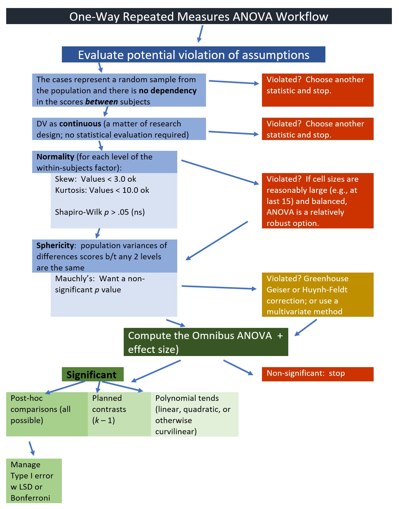

Steps involved in analyzing the data include:

1. Prepare (upload) data.
2. Explore data
     + graphs
     + descriptive statistics
3. Checking distributional assumptions
     + assessing normality via skew, kurtosis, Shapiro Wilks
     + checking or violation of the *sphericity* assumption with Mauchly's test; if violated interpret the corrected output or use a multivariate approach for the analysis
4. Compute the omnibus ANOVA 
5. Compute post-hoc comparisons, planned contrasts, or polynomial trends
6. Managing Type I error
7. Sample size/power analysis (which you should think about first -- but in the context of teaching ANOVA, it's more pedagogically sensible, here)

## Research Vignette

Amodeo [@amodeo_empowering_2018] and colleagues conducted a mixed methods study (qualitative and quantitative) to evaluate the effectiveness of an empowerment, peer-group-based, intervention with participants (*N* = 8) who experienced transphobic episodes. Focus groups used qualitative methods to summarize emergent themes from the program (identity affirmation, self-acceptance, group as support) and a one-way, repeated measures ANOVA provided evidence of increased resilience from pre to three-month followup.

Eight participants (seven transgender women and one genderqueer person) participated in the intervention.  The mean age was 28.5 (*SD* = 5.85).  All participants were Italian.

The within-subjects condition was wave:

* T1, beginning of training
* Training, three 8-hour days, 
  - content included identity and heterosexism, sociopolitical issues and minority stress, resilience and empowerment
* T2, at the conclusion of the 3-day training
* Follow-up session 3 months later
* T3, at the conclusion of the +3 month follow-up session

The dependent variable (assessed at each wave) was a 14-item resilience scale [@wagnild_development_1993]. Items were assessed on a 7-point scale ranting from *Strongly disagree* to *Strongly agree* with higher scores indicating higher levels of resilience.  An example items was, "I usually manage one way or another."

{#id .class width=1000 height=100px}

### Code for simulating the data used today.

Below is the code I used to simulate data. The following code assumes 8 participants who each participated in 3 waves (pre, post, followup).
```{r }
set.seed(2022)
ID<-factor(c(rep(seq(1,8),each=3)))#gives me 8 numbers, assigning each number 3 consecutive spots, in sequence
Resilience<-rnorm(24,mean=c(5.7,6.21,6.26),sd=c(.88,.79,.37)) #gives me a column of 24 numbers with the specified Ms and SD
Wave<-rep(c("Pre","Post", "FollowUp"),each=1,8) #repeats pre, post, follow-up once each, 8 times
Amodeo_long<-data.frame(ID, Wave, Resilience)
#OneWay_mod<-aov(Resilience~Wave + Error(ID/(Wave)), AmodeoSIM)
#summary(OneWay_mod)
#model.tables(OneWay_mod,"means")
```

Let's take a look at the structure of our variables.  We want ID to be a factor, Resilience to be numeric, and Wave to be an ordered factor (Pre, Post, FollowUp).

```{r}
str(Amodeo_long)
```
We just need to change Wave to be an ordered factor.

```{r}
Amodeo_long$Wave <- factor(Amodeo_long$Wave, levels = c("Pre", "Post", "FollowUp"))
```

And we check the structure again.
```{r}
str(Amodeo_long)
```

**Shape Shifters**

The form of our data matters.  The simulation created a *long* form (formally called the *person-period* form) of data.  That is, each observation for each person is listed in its own row. In this dataset where we have 8 people with 3 observation (pre, post, follow-up) each, we have 24 rows. This is convenient, because this is the form we need for repeated measures ANOVA.  

However, for some of the calculations (particularly those we will do by hand), we need the data to be in its typical wide form (formally called the *person level* form). We can do this with the *data.table* and *reshape2*()* packages.  

```{r }
library(reshape2)
# Create a new df (Amodeo_wide)
# Identify the original df
# We are telling it to connect the values of the Resilience variable its respective Wave designation
Amodeo_wide <- reshape2::dcast(data = Amodeo_long, formula =ID~Wave, value.var = "Resilience")
#doublecheck to see if they did what you think
str(Amodeo_wide)
Amodeo_wide$ID <- factor(Amodeo_wide$ID)

```
In this reshape script, I asked for a quick structure check.  The format of the variables looks good.

If you want to export these data as files to your computer, remove the hashtags to save (and re-import) them as .csv ("Excel lite") or .rds (R object) files. This is not a necessary step.  

The code for the .rds file will retain the formatting of the variables, but is not easy to view outside of R.  I would choose this option.
```{r}
#to save the df as an .rds (think "R object") file on your computer; it should save in the same file as the .rmd file you are working with
#saveRDS(Amodeo_long, "Amodeo_longRDS.rds")
#saveRDS(Amodeo_wide, "Amodeo_wideRDS.rds")
#bring back the simulated dat from an .rds file
#Amodeo_long <- readRDS("Amodeo_longRDS.rds")
#Amodeo_wide <- readRDS("Amodeo_wideRDS.rds")
```

An option is to write them as .csv files. The code for .csv will likely lose any variable formatting, but they is easy to view and manipulate in Excel. If you choose this option, you will probably need to re-run the code to reformat the Wave variable as an ordered factor
```{r}
#write the simulated data  as a .csv
#write.table(Amodeo_long, file="Amodeo_longCSV.csv", sep=",", col.names=TRUE, row.names=FALSE)
#write.table(Amodeo_wide, file="Amodeo_wideCSV.csv", sep=",", col.names=TRUE, row.names=FALSE)
#bring back the simulated dat from a .csv file
#Amodeo_long <- read.csv ("Amodeo_longCSV.csv", header = TRUE)
#Amodeo_wide <- read.csv ("Amodeo_wideCSV.csv", header = TRUE)
```

### Quick peek at the data

Before we get into the statistic let's look at our data.
```{r}
str(Amodeo_long)
```
In the following output, see the order of presentation on the first screen of output.  Even though we have ordered our factor so that "Pre" is first, the *describeBy()* function seems to be ordering them alphabetically.

```{r}
library(psych)
psych::describeBy(Amodeo_long$Resilience, Wave, mat = TRUE, data = Amodeo_long)
```

Another view (if we use the wide file)

```{r}
psych::describe(Amodeo_wide)
```
Our means suggest that resilience increases from pre to post, then declines a bit. We use one-way repeated measures ANOVA to learn if there are statistically significant differences between the pairs of means and over time.

Let's also take a quick look at a boxplot of our data.  

```{r }
boxplot (Resilience ~ Wave, data = Amodeo_long, xlab = "Wave", ylab = "Resilience", n.label = TRUE)
```


## Working the One-Way Repeated Measures ANOVA (by hand)

Before working our problem in R, let's gain a conceptual understanding by partitioning the variance by hand.

In repeated measures ANOVA:  $SS_T = SS_B + SS_W$, where

*  B = between-subjects variance
*  W = within-subjects variance
   - $SS_W = SS_M + SS_R$

What differs is that $SS_M$ and $SS_R$ (model and residual, are found in $SS_W$)

*  $SS_T = SS_B + (SS_M + SS_R)$

{#id .class width=500 height=250px}

### Sums of Squares Total

$$SS_{T}= \sum (x_{i}-\bar{x}_{grand})^{2}$$
$$SS_{T}= s_{grand}^{2}(n-1)$$
Degrees of freedom for $SS_T$ is *N* - 1, where *N* is the total number of cells.

Let's take a moment to *hand-calculate* $SS_{T}$ (but in R).

Our grand (i.e., overall) mean is 
```{r }
mean(Amodeo_long$Resilience)
```

Subtracting the grand mean from each resilience score yields a mean difference.
```{r }
library(tidyverse)

Amodeo_long <- Amodeo_long %>% 
  mutate(m_dev = Resilience-mean(Resilience))
```
Pop quiz:  What's the sum of our new *m_dev* variable?

```{r }
sum(Amodeo_long$m_dev)
```

If we square those mean deviations:
```{r }
Amodeo_long <- Amodeo_long %>% 
  mutate(m_devSQ = m_dev^2)
```

If we sum the squared mean deviations:
```{r }
sum(Amodeo_long$m_devSQ)
```
This value, the sum of squared deviations around the grand mean, is our $SS_T$; the associated *degrees of freedom* is 23 (24 - 1; *N* - 1).

### Sums of Squares Within for Repated Measures ANOVA

$$SS_W = s_{person1}^{2}(n_{1}-1)+s_{person2}^{2}(n_{2}-1)+s_{person3}^{2}(n_{3}-1)+...+s_{personk}^{2}(n_{k}-1)$$
Degrees of freedom (df) within is *N - k*; or the summation of the df for each of the persons.

```{r }
library(psych)
describeBy(Resilience ~ ID, data = Amodeo_long, mat = TRUE, digits = 3)
```
With 8 people, there will be 8 chunks of the analysis, in each:

* SD squared (to get the variance)
* multiplied by #observations less 1

```{r }
(.605^2*(3-1)) + (.760^2*(3-1)) + (.992^2*(3-1))+ (.568^2*(3-1))+ (.824^2*(3-1))+ (.146^2*(3-1))+ (.248^2*(3-1)) + (.553^2*(3-1))
```

### Sums of Squares Model -- Effect of Time

$$SS_{M}= \sum n_{k}(\bar{x}_{k}-\bar{x}_{grand})^{2}$$
Degrees of freedom will be k - 1 (number of levels, minus one).

```{r }
library(psych)
psych::describe(Amodeo_wide)
```
In this case, we are interested in change in resilience over time.  Hence, *time* is our mode.  In our equation, we have three chunks representing the pre, post, and follow-up *conditions* (waves). From each, we subtract the grand mean, square it, and multiply by the *n* observed in each wave.

Degrees of freedom (df) for $SS_M$ is *k* - 1

Let's calculate grand mean; that is the resilience score for all participants across all waves.
```{r}
mean(Amodeo_long$Resilience)
```

Now we can calculate the $SS_M$.
```{r }
(8*(6.14 - 6.017)^2) + (8*(6.33 - 6.017)^2) + (8*(5.59 - 6.017)^2) 
#df is 3-1 = 2
```

### Sums of Squares Residual

Let's take the easy way out, given that $SS_W = SS_M + SS_R$:

$SS_w$ = 6.636
$SS_M$ = 2.363
```{r }
6.636 - 2.363
```
Degrees of freedom (also taking the easy way out) is calculated by subtracting the $SS_M$  from $SS_W$.
```{r }
16-2
```

### Sums of Squares Between

Not used in our calculations today, but also calculated easily.  Given that $SS_T$ = $SS_W$ + $SS_B$:

$SS_T$ = 11.66; *df* = 23
$SS_W$ = 6.64; *df* = 16
```{r  }
11.66 - 6.64
23-16
```
$SS_B$ = 5.02, *df* = 7


Looking again at our sourcetable, we can move through the steps to calculate our *F* statistic.

### Mean Squares Model & Residual

Now that we have the Sums of Squares, we can calculate the mean squares (we need these for our $F$ statistic).

$$MS_M = \frac{SS_{M}}{df^{_{M}}}$$
```{r }
# mean squares for the model
2.36/2
```

And $MS_R=$
$$MS_R = \frac{SS_{R}}{df^{_{R}}}$$
Recall, df for the residual is N - k
(in our case that's 90 - 3)

```{r }
# mean squares for the residual
4.27 / 14
```

### *F* ratio

$$F = \frac{MS_{M}}{MS_{R}}$$
```{r }
1.18 / .305
```

To find the $F_{CV}$ we can use an [F distribution table](https://www.statology.org/f-distribution-table/).

Or use a look-up function, which follows this general form:  qf(p, df1, df2. lower.tail=FALSE)
```{r}
#looking up the F critical values
qf(.05, 2, 14, lower.tail=FALSE)#Model F critical value
```

Our example has 2 (numerator) and 14 (denominator) degrees of freedom.  Rolling down to the table where $\alpha  = .05$, we can see that any $F$ value > 3.73 will be statistically significant.  Our $F$ = 3.87, so we have (just barely) exceeded the thresshhold.  This is our *omnibus F*.  We know there is at least 1 statistically significant difference between our pre, post, and follow-up conditions.

## Working the One-Way ANOVA with R packages

### Testing the assumptions
Well start by testing the assumptions. Here is our place in the one-way ANOVA decision tree:

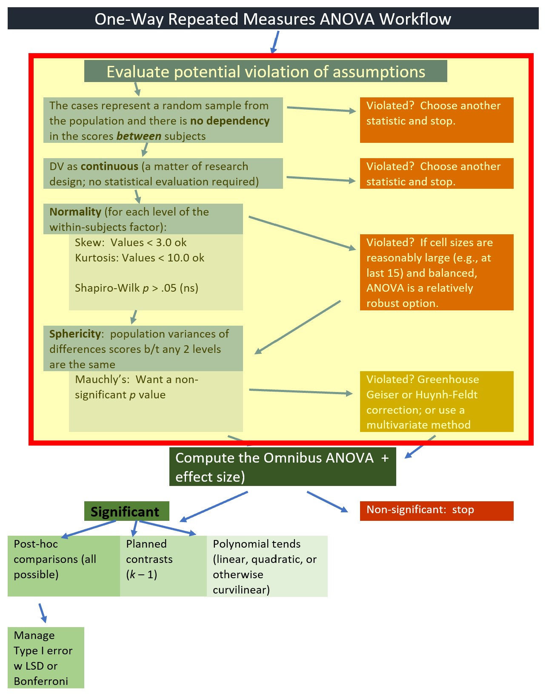

There are several different ways to conduct a repeated measures ANOVA.  Each has different assumptions/requirements.  These include:

* univariate statistics
  - this is what we will use today
* multivariate statistics
  - same as univariate, except it does not require the sphericity assumption
* multi-level modeling/hierarchical linear modeling
  - a different statistic altogether; stay tuned

#### Univariate assumptions for repeated measures ANOVA

* The cases represent a random sample from the population, and there is no dependency in the scores between participants. 
* There are no significant outliers in any cell of the design
  - Check by visualizing the data using box plots and the function *identify_outliers()* [rstatix]
  - Conduct a Shapiro-Wilk test of normality for each of the levels of the DV
  - Visually examine qq plots
* The dependent variable is normally distributed in the population for each level of the within-subjects factor.
* The population variance of difference scores computed between any two levels of a within-subjects factor is the same value regardless of which two levels are chosen; termed the **sphericity assumption**. 
  - Akin to compound symmetry (both variances across conditions are equal).
  - Akin to the homogeneity of variance assumption in between-group designs. 
  - Sometimes called the homogeneity-of-variance-of-differences assumption. 
  - Statistically evaluated with *Mauchly's test.* If Mauchly's *p* < .05, there are statistically significant differences.  The *anova_test()* function in the *rstatix* package reports Mauchly's and two alternatives to the traditional *F* that correct the values by the degree to which the sphericity assumption is violated. 

Demonstrating sphericity:

Using the data from our motivating example, I calculated differences for each of the time variables.  When we get into the analysis, we will use *Mauchly's test* in hopes that there are non-significant differences in variances between all three of the comparisons.

We are only concerned with the sphericity assumption if there are three or more groups.

$$variance_{A-B} \approx variance_{A-C}\approx variance_{B-C}$$

{#id .class width=500 height=250px}

#### Any outliers?

The boxplot is one common way for identifying outliers.  The boxplot uses the median and the lower (25th percentile) and upper (75th percentile) quartiles.  The difference bewteen Q3 and Q1 is the *interquartile range* (IQR).  Outliers are generally identified when values fall outside these lower and upper boundaries:

* Q1 - 1.5xIQR
* Q3 + 1.5xIQR

Extreme values occur when values fall outside these boundaries:

* Q1 - 3xIQR
* Q3 + 3xIQR

Let's take a look at a boxplot.
```{r }
library(ggpubr)
bxp <- ggboxplot(Amodeo_long, x = "Wave", y = "Resilience", add = "point", xlab = "Assessment Wave", ylab = "Self-Perception of Resilience")
bxp
```
The package *rstatix* has features that allow us to identify outliers.
```{r }
library(rstatix)
Amodeo_long %>%
  group_by(Wave)%>%
  identify_outliers(Resilience)

#?identify_outliers
```

No outliers are identified. Visual inspection of boxplots, assisted by the *identify_outliers()* function in the *rstatix* package (which reports values above Q3 + 1.5xIQR or below Q1 - 1.5xIQR, where IQR is the interquartile range) indicated no outliers.

#### Assessing normality 

```{r }
library(psych)
psych::describeBy(Resilience ~ Wave, mat=TRUE, data = Amodeo_long)
```

Our skew and kurtosis values fall below the thresshholds of concern [@kline_principles_2016]:

* < 3 for skew
* 8 - 20 indicates extreme skew for kurtosis


We can use the Shapiro-Wilk test for a formal detection of normality. When *p* < .05, it indicates that the distribution is statistically significantly different than a normal one.  Therefore, *p* > .05 indicates we did not violate the normal distribution assumption.

```{r }
Amodeo_long %>%
  group_by(Wave) %>%
  shapiro_test(Resilience)
```

Great!  The *p* value is > .05 for each of the cells.

The Shapiro-Wilk test is sensitive to sample size [@noauthor_repeated_nodate].  Samples > 50 may lead to *p* values that are < .05, even when non-normality is not problematic.  Therefore a second check with a QQ plot can be helpful.

```{r }
ggqqplot(Amodeo_long, "Resilience", facet.by = "Wave")
```


We already have a non-significant *p* from the Shapiro-Wilk; and these dots stay pretty well on the prediction line.

**APA Assumption Write-up So Far**

Repeated measures ANOVA has several assumptions regarding outliers, normality, and sphericity. Visual inspection of boxplots for each wave of the design, assisted by the *identify_outliers()* function in the *rstatix* package (which reports values above Q3 + 1.5xIQR or below Q1 - 1.5xIQR, where IQR is the interquartile range) indicated no outliers. Regarding normality, no values of skew and kurtosis (at each wave of assessment) fell within cautionary ranges for skew and kurtosis [@kline_principles_2016]. Additionally, the Shapiro-Wilk tests applied at each wave of the design were non-significant.

#### Assumption of Sphericity

The sphericity assumption is automatically checked with Mauchley's test during the computation of the ANOVA when the *anova_test()* [rstatix package] is used. When the *get_anova_table()* [rstatix] function is used, the Greenhouse-Geisser sphericity correction is automatically applied to factors violating the sphericity assumption.

The effect size, $\eta^2$ is reported in the ges column.

### Omnibus ANOVA

```{r }
str(Amodeo_long)
```

```{r }
library(rstatix)
RM_AOV <- anova_test(data = Amodeo_long, dv = Resilience, wid = ID, within = Wave)
RM_AOV
```
From the ANOVA object:  $F(2,14) = 3.91, p = 0.045, \eta^2 = 0.203$

From the Mauchly's Test for Sphericity object we learn that we did not violate the sphericity assumption:  $W = 0.566, p = .182$

From the Sphericity Corrections object are output for two alternative corrections to the *F* statistic, the Greenhouse-Geiser epsilon (GGe) and Huynh-Feldt epsilon (HFe).  Because we did not violate the sphericity assumption we do not need to use it. Notice that these two tests adjust our df (both numerator and denominator) to have a more conservative p value.

If we needed to write it up, the *F* string might look like this:

The Greenhouse Geiser estimate was 0.698 the correct omnibus was *F*(1.4, 9.77) = 3.91, *p* = .068.
The Huyhn Feldt estimate was 0.817 and the corrected omnibus was *F* (1.63, 11.44) = 3.91 *p* = .057.

You might be surprised that we are at follow-up already.  The test of the sphericity assumption occured at the same time we evaluated the omnibus ANOVA.

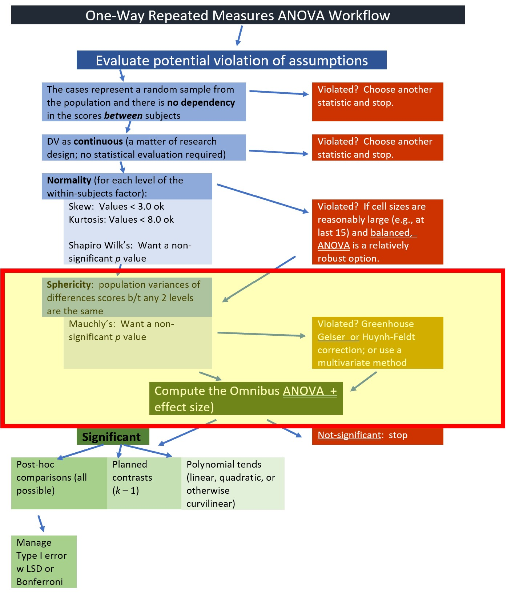

### Follow-up

Note that when I am calculating these pairwise *t* tests, I am creating an object (named "pwc").  The object will be a helpful tool in creating a Figure and an APA Style table.

```{r }
pwc <- Amodeo_long %>%
  pairwise_t_test(Resilience~Wave, paired = TRUE, p.adjust.method = "bonferroni")
pwc
```

So why didn't we get significance in the follow-up?  

* Our omnibus *F* was right at the margins
  - a larger sample size (assuming that the effects would hold) would be really useful.
  - there could be significance if we compared pre to the combined effects of post and follow-up.
  
What about Type I error?  With only three possible post-omnibus comparisons, I will claim the Tukey LSD approach and not adjust the alpha to a more conservative level [@green_using_2014].

Coolest boxplots ever
```{r }
pwc <- pwc %>% add_xy_position(x = "Wave")
bxp + 
  stat_pvalue_manual(pwc) +
  labs(
    subtitle = get_test_label(RM_AOV, detailed = TRUE),
    caption = get_pwc_label(pwc)
  )
```
Unfortunately, the *apaTables* package does not work with the *rstatix* package, so a table would need to be crafted by hand.

### Results Section

Repeated measures ANOVA has several assumptions regarding outliers, normality, and sphericity. Visual inspection of boxplots for each wave of the design, assisted by the *identify_outliers()* function in the *rstatix* package (which reports values above Q3 + 1.5xIQR or below Q1 - 1.5xIQR, where IQR is the interquartile range) indicated no outliers. Regarding normality, no values of skew and kurtosis (at each wave of assessment) fell within cautionary ranges for skew and kurtosis [@kline_principles_2016]. Additionally, the Shapiro-Wilk tests applied at each wave of the design were non-significant. A non-significant Mauchley's test ($W = 0.566, p = .182$) indicated that the sphericity assumption was not violated. 

The omnibus ANOVA was significant: $F(2,14) = 3.91, p = 0.045, \eta^2 = 0.203$. We followed up with all pairwise comparisons.  Curiously, and in spite of a significant omnibus test, there were not statistically significant differences between any of the pairs.  Regarding pre versus post, *t* = -2.15, *p*= .069.  Regarding pre versus follow-up, *t* = -2.00, *p* = .068.  Regarding post versus follow-up, *t* = 1.059, *p*= .325. Because there were only three pairwise comparisons subsequent to the omnibus test, alpha was retained at .05 [@green_using_2014].  While the trajectories from pre-to-post and pre-to-follow-up were in the expected direction, the small sample size likely contributed to a Type II error.  Descriptive statistics are reported in Table 1 and the differences are illustrated in Figure 1.

#### Creating an APA Style Table**

While I have not located a package that will take *rstatix* output to make an APA style table, we can use the *MASS* package to write the pwc object to a .csv file, then manually make our own table.

```{r }
library(MASS)
write.matrix(pwc, sep = ",", file = "PWC.csv")
```


**Let's compare this to the write-up in the Amodeo et al.[-@amodeo_empowering_2018]article.**

* The *F* string is presented in the Table 1 note (*F*[1.612, 11.283]) = 6.390, *p* = 0.18, $\eta _{p}^{2}$)
  - we can tell from the df that the *p* value has been had a correction for violation of the sphericity assumption
* Table 1 also reports all of the post-hoc, pairwise comparisons.  There is no mention of control for Type I error.  Had they used a traditional Bonferroni, they would have needed to reduce the alpha to (k*(k-1)/2) and then divide .05 by that number.

```{r }
(3 * (3-1))/2
.05/3
```
Although they report 6 comparisons; 3 are repeated because they are merely in reverse.  Yet, the revised alpha would be .016 and the one, lone, comparison would not have been statistically significant.  That said, we can invoke the Tukey LSD because there are only 3 comparisons and holding alpha at .05 can be defended [@green_using_2014].
* Regarding the presentation of the results
  - there is no figure
  - there is no data presented in the text; all data is presented in Table 1
* Regarding the research design and its limitations
  - the authors note that a control condition would have better supported the conclusions
  - the authors note the limited sample size and argue that this is a difficult group to recruit for intervention and evaluation
  - the article is centered around the qualitative aspect of the design; the quantitative portion is secondary

{#id .class width=1000 height=100px}

## Power in Repeated Measures ANOVA

The package *wp.rmanova* was designed for power analysis in repeated measures ANOVA.

Power analysis allows us to determine the probability of detecting an effect of a given size with a given level of confidence. Especially when we don't achieve significance, we may want to stop. 

In the *WebPower* package, we specify 6 of 7 interrelated elements; the package computes the missing one.

n = sample size (number of individuals in the whole study)
ng = number of groups
nm = number of measurements/conditions/waves
f = Cohen's *f* (an effect size; we can use a conversion calculator)
nscor = the Greenhouse Geiser correction from our ouput; 1.0 means no correction was needed and is the package's default; < 1 means some correction was applied. 
alpha = is the probability of Type I error; we traditionally set this at .05 
power = 1 - P(Type II error) we traditionally set this at .80 (so anything less is less than what we want)
type = 0 is for between-subjects, 1 is for repeated measures, 2 is for interaction effect. 

I used *effectsize* packages converter to transform our $\eta^2$ to Cohen's *f*.

```{r}
library(effectsize)
eta2_to_f(.203) 
```

```{r }
library(WebPower)
wp.rmanova(n=8, ng=1, nm=3, f = .5047, nscor = .689, alpha = .05, power = NULL, type = 1)
```

In reverse, setting *power* at .80 (the traditional value) and changing *n* to *NULL* yields a recommended sample size.    

In many cases we won't know some of the values in advance.  We can make best guesses based on our review of the literature.  In the script below:

* nscor is the degree of violation of the sphericity assumption.  If we think we won't violate it, we can enter 1.0 or leave it out (the wp.rmanova default is 1.0)
* f is the effect size estimate; Cohen suggests that f values of 0.1, 0.25, and 0.4 represent small, medium, and large effect sizes, respectively. 

```{r }
wp.rmanova(n=NULL, ng=1, nm=3, f = .5047, nscor = .689, alpha = .05, power = .80, type = 1)
```

## Practice Problems

In each of these lessons I provide suggestions for practice that allow you to select one or more problems that are graded in difficulty. In any case, you will be expected to:

* test the statistical assumptions
* conduct a one-way, including
  - omnibus test and effect size
  - conduct follow-up testing 
* write a results section to include a figure and tables

### Problem #2: Change the Random Seed

If repeated measures ANOVA is new to you, perhaps change the random seed and follow-along with the lesson.  

|Assignment Component                    | Points Possible   | Points Earned|
|:-------------------------------------- |:----------------: |:------------:|
|1. Check and, if needed, format data |      5            |_____  |           
|2. Evaluate statistical assumptions     |      5            |_____  |
|3. Conduct omnibus ANOVA (w effect size)|      5           | _____  |  
|4. Conduct all possible pairwise comparisons (like in the lecture)| 5 |_____  |               
|5. Describe approach for managing Type I error|    5        |_____  |   
|6. APA style results with table(s) and figure|    5        |_____  |       
|7. Explanation to grader                 |      5        |_____  |
|**Totals**                               |      35       |_____  |          


### Problem #2: Increase *N*

Our analysis of the Amodio et al. [-@amodio_empowering_2018] data failed to find significant increases in resilience from pre-to-post through follow-up.  Our power analysis suggested that a sample size of 50 would be sufficient to garner statistical significance. The new dataset has been resimulated with this new sample size.  

|Assignment Component                    | Points Possible   | Points Earned|
|:-------------------------------------- |:----------------: |:------------:|
|1. Check and, if needed, format data |      5            |_____  |           
|2. Evaluate statistical assumptions     |      5            |_____  |
|3. Conduct omnibus ANOVA (w effect size)|      5           | _____  |  
|4. Conduct all possible pairwise comparisons (like in the lecture)| 5 |_____  |               
|5. Describe approach for managing Type I error|    5        |_____  |   
|6. APA style results with table(s) and figure|    5        |_____  |       
|7. Explanation to grader                 |      5        |_____  |
|**Totals**                               |      35       |_____  |          


### Problem #2: Try Something Entirely New

Using data for which you have permission and access (e.g.,  IRB approved data you have collected or from your lab; data you simulate from a published article; data from an open science repository; data from other chapters in this OER), complete a one-way repeated measures ANOVA. Please have at least 3 levels for the predictor variable. 

Using the lecture and workflow (chart) as a guide, please work through all the steps listed in the proposed assignment/grading rubric.

|Assignment Component                    | Points Possible   | Points Earned|
|:-------------------------------------- |:----------------: |:------------:|
|1. Check and, if needed, format data |      5            |_____  |           
|2. Evaluate statistical assumptions     |      5            |_____  |
|3. Conduct omnibus ANOVA (w effect size)|      5           | _____  |  
|4. Conduct all possible pairwise comparisons (like in the lecture)| 5 |_____  |               
|5. Describe approach for managing Type I error|    5        |_____  |   
|6. APA style results with table(s) and figure|    5        |_____  |       
|7. Explanation to grader                 |      5        |_____  |
|**Totals**                               |      35       |_____  |           


## Bonus Reel: 

{#id .class width=620 height=211}


Without the *rstatix* helper package, here is how the analysis would be run in the package, *car.*  Note that this package results in the multivariate output.  The *p* value of the omnibus *F* was non-significant from the start (*p* = .213).


```{r }
library(car)

waveLevels <- c(1,2,3)
waveFactor <- as.factor(waveLevels)
waveFrame <- data.frame(waveFactor)
waveBind <-cbind(Amodeo_wide$Pre, Amodeo_wide$Post, Amodeo_wide$FollowUp)
waveModel<- lm(waveBind~1)
analysis <-Anova(waveModel, idata=waveFrame, idesign=~waveFactor)
summary(analysis)
```

```{r include=FALSE}
sessionInfo()
```


<!--chapter:end:06-OneWayRepeated.Rmd-->

# Mixed Design ANOVA {#Mixed}

 [Screencasted Lecture Link](https://spu.hosted.panopto.com/Panopto/Pages/Viewer.aspx?pid=b08debbb-948e-4f25-923a-ad8c01037e05) 
 
```{r  include=FALSE}
knitr::opts_chunk$set(echo = TRUE)
knitr::opts_chunk$set(comment = NA) #keeps out the hashtags in the knits
options(scipen=999)#eliminates scientific notation
```

The focus of this lecture is mixed design ANOVA. That is, we are conducting a two-way ANOVA where one of the factors is repeated measures and one of the factors is between groups. The mixed design ANOVA is often associated with the random clinical trial (RCT) where the researcher hopes for a significant interaction effect. Specifically, the researcher hopes that the individuals who were randomly assigned to the treatment condition improve from pre-test to post-test and maintain (or continue to improve) after post-test, while the people assigned to the no-treatment control are not statistically significantly different from treatment group at pre-test, and do not improve over time.

## Navigating this Lesson

There is just over one hour of lecture.  If you work through the materials with me it would be plan for an additional two hours.

While the majority of R objects and data you will need are created within the R script that sources the chapter, occasionally there are some that cannot be created from within the R framework. Additionally, sometimes links fail.  All original materials are provided at the [Github site](https://github.com/lhbikos/ReCenterPsychStats) that hosts the book. More detailed guidelines for ways to access all these materials are provided in the OER's [introduction](#ReCintro)

### Learning Objectives

Focusing on this week's materials, make sure you can:

* Evaluate the suitability of a research design/question and dataset for conducting a mixed design ANOVA; identify alternatives if the data is not suitable.
* Test the assumptions for mixed design ANOVA.
* Conduct a mixed design ANOVA (omnibus and follow-up) in R.
* Interpret output from the mixed design ANOVA (and follow-up). 
* Prepare an APA style results section of the mixed design ANOVA output.
* Conduct a power analysis for mixed design ANOVA.

### Planning for Practice

In each of these lessons I provide suggestions for practice that allow you to select one or more problems that are graded in difficulty The least complex is to change the random seed and rework the problem demonstrated in the lesson. The results *should* map onto the ones obtained in the lecture. 

The second option comes from the research vignette. The Murrar and Brauer [-@murrar_entertainment-education_2018] article has three variables (attitudes toward Arabs, attitudes toward Whites, and a difference score) which are suitable for mixed design ANOVAs.  I will demonstrate a a mixed design ANOVA with the difference score. I'll leave the other two variables for opportunities for practice.

As a third option, you are welcome to use data to which you have access and is suitable for two-way ANOVA. In either case, you will be expected to:

* test the statistical assumptions
* conduct a mixed design ANOVA, including
  - omnibus test and effect size
  - report main and interaction effects
  - conduct follow-up testing of simple main effects
* write a results section to include a figure and tables

### Readings & Resources

In preparing this chapter, I drew heavily from the following resource(s). Other resources are cited (when possible, linked) in the text with complete citations in the reference list.

* Repeated Measures ANOVA in R: The Ultimate Guide. (n.d.). Datanovia. Retrieved October 19, 2020, from https://www.datanovia.com/en/lessons/repeated-measures-anova-in-r/
  - This website is an excellent guide for both one-way repeated measures and mixed design ANOVA. A great resource for both the conceptual and procedural.  This is the guide I have used for the basis of the lecture.  Working through their example would be great additional practice.
* Murrar, S., & Brauer, M. (2018). Entertainment-education effectively reduces prejudice. *Group Processes & Intergroup Relations, 21*(7), 1053–1077. https://doi.org/10.1177/1368430216682350
  - This article is the source of our research vignette. Our problem is simulated from the first of their two experiments. The authors did not conduct mixed design ANOVA. Instead, they ran independent-samples *t* tests to test the differences between the sitcom conditions for each of the three waves. This is parallel to conducting the simple-main effect analysis of condition within wave subsequent to a significant interaction.  So, this is what we do! 

### Packages

The packages used in this lesson are embedded in this code. When the hashtags are removed, the script below will (a) check to see if the following packages are installed on your computer and, if not (b) install them.
```{r }
#will install the package if not already installed
#if(!require(lavaan)){install.packages("lavaan")}
#if(!require(semPlot)){install.packages("semPlot")}
#if(!require(tidyverse)){install.packages("tidyverse")}
#if(!require(psych)){install.packages("psych")}
#if(!require(jtools)){install.packages("jtools")}
```


## Introducing Mixed Design ANOVA

Mixed design ANOVA is characterized by the following:

* at least two independent variables.  
* Termed “mixed” because 
  - one is a between-subjects factor, and 
  - one is a repeated-measures (i.e., within-subjects) factor.
* In essence, we are simultaneously conducting (hence, it’s factorial or at least 2-way) 
  - a one-way independent ANOVA and a 
  - a one-way repeated-measures ANOVA.
  
Especially when there is a significant interaction there can be numerous ways to follow up.  We will work one set of analyses:  simple main effects (condition within wave; wave within condition) and, when needed, conduct posthoc pairwise comparisons as follow-up.  Other good options include identifying a priori contrasts and conducting polynomials (not demonstrated in this lecture).


The steps in working the mixed design generally include,

1. Exploring the data/evaluating the assumptions
2. Evaluating the omnibus test
3. Follow-up to the omnibus
   - if significant interaction effect:  simple main effects and further follow-up to those
   - if significant main effect (but no significant interaction effect), identify source of significance in the main effect
   - if no significance, stop
4. Write it up with tables, figure(s)

Assumptions for the mixed design ANOVA include the following:

* The dependent variable should be continuous with no significant outliers in any cell of the design
  - Check by visualizing the data using box plots and the function *identify_outliers()* [rstatix]
* The DV should be approximately normally distributed in each cell of the design
  - Check with Shapiro-Wilk normality test *shapiro_test()* [rstatix] or visual inspection using the QQ plot (ggqqplot())*ggqqplot()[ggpubr])
* The variances of the differences between groups should be equal.  This is termed the **sphericity assumption.**  This can be checked with Mauchly's test of sphericity, which is reported automatically with *anova_test()*[rstatix].

Violation of these assumptions can take a variety of routes:

* For 2- and 3- way ANOVAs, it may be possible to transform data to be within the assumptions
* A robust ANOVA in the *WRS2* package
* If 3 or more waves/conditions and large samples, it is possible to run a multi-level, model.
* In the absence of alternatives, it may be necessary to run the mixed design with the violated assumptions, but report them.
* ....and more.  Google it.

## Research Vignette

This lesson's research vignette is from Murrar and Brauer's [-@murrar_entertainment-education_2018] article that describes the results of two studies designed to reduce prejudice against Arabs/Muslims. We are working only a portion of the first study reported in the article. Participants (*N* = 193), all who were White, were randomly assigned to one of two conditions where they watched six episodes of the sitcom [*Friends*](http://www.friends-tv.org/) or [*Little Mosque on the Prairie*](https://en.wikipedia.org/wiki/Little_Mosque_on_the_Prairie). The sitcoms and specific episodes were  selected after significant pilot testing. The selection was based on the tension between being as similar as possible, yet the intervention-oriented sitcom needed to invoke psychologial processes known to reduce prejudice. The authors felt that both series had characters that were likable and relatable and were engaged in activities of daily living. The Friends series featured characters who were predominantly White, cis-gendered, and straight. The Little Mosque series portrays the experience Western Muslims and Arabs as they live in a small Canadian town.  This study involved assessment across three waves:  baseline (before watching the assigned episodes), post1 (immediately after watching the episodes), and post2 (completed 4-6 weeks after watching the episodes).

The study used *feelings and liking thermometers*, rating their feelings and liking toward 10 different groups of people on a 0 to 100 sliding scale (with higher scores reflecting greater liking and positive feelings. For the purpose of this analysis, the ratings of attitudes toward White people and attitudes toward Arabs/Muslims were used.  A third metric was introduced by subtracting the attitudes towards Arabs/Muslims from the attitudes toward Whites. Higher scores indicated more positive attitudes toward Whites where as low scores indicated no difference in attitudes. To recap, there were three potential dependent variables, all continuously scaled:

* AttWhite:  attitudes toward White people; higher scores reflect greater liking
* AttArab:  attitudes toward Arab people; higher scores reflect greater liking
* Diff:  the difference between AttWhite and AttArab; higher scores reflect a greater liking for White people

With random assignment, nearly equal cell sizes, a condition with two levels (Friends, Little Mosque), and three waves (baseline, post1, post2), this is perfect for mixed design ANOVA.


### Simulating the data from the journal article

Below is the code I have used to simulate the data. The simulation includes two dependent variables (AttWhite, AttArab), Wave (baseline, post1, post2), and COND (condition; Friends, Little_Mosque).  There is also a caseID (repeated three times across the three waves) and rowID (giving each observation within each case an ID). This creates the long-file, where each person has 3 rows of data representing baseline, post1, and post2.  You can use this simulation for two of the three practice suggestions.

```{r}
library(tidyverse)
set.seed(210813)#change this to any different number (and rerun the simulation) to rework the chapter problem
AttWhite<-round(c(rnorm(98,mean=76.79,sd=18.55),rnorm(95,mean=75.37,sd=18.99),rnorm(98, mean=77.47, sd=18.95), rnorm(95, mean=75.81, sd=19.29), rnorm(98, mean=77.79, sd=17.25), rnorm(95, mean=75.89, sd=19.44)),3) #sample size, M and SD for each cell; this will put it in a long file
AttWhite[AttWhite>100]<-100 #set upper bound for variable
AttWhite[AttWhite<0]<-0 #set lower bound for variable
AttArab<-round(c(rnorm(98,mean=64.11,sd=20.97),rnorm(95,mean=64.37,sd=20.03),rnorm(98, mean=64.16, sd=21.64), rnorm(95, mean=70.52, sd=18.55), rnorm(98, mean=65.29, sd=19.76), rnorm(95, mean=70.30, sd=17.98)),3)
AttArab[AttArab>100]<-100 #set upper bound for variable
AttArab[AttArab<0]<-0 #set lower bound for variable
rowID <- factor(seq(1,579))
caseID <- rep((1:193),3)
Wave <- c(rep("Baseline",193), rep("Post1", 193), rep ("Post2", 193))
COND <- c(rep("Friends", 98), rep("LittleMosque", 95), rep("Friends", 98), rep("LittleMosque", 95), rep("Friends", 98), rep("LittleMosque", 95))
Murrar_df<- data.frame(rowID, caseID, Wave, COND, AttArab, AttWhite) #groups the 3 variables into a single df:  ID#, DV, condition
#Arab_2way <- anova_test(
  #data = Murrar_df, dv = AttArab, wid = caseID, #UEdf is our df, dv is our DV, wid is the participant ID
  #between = COND, within = Wave # between is the between-subjects variable, within is the within subjects variable
#  )
#Arab_2way

#Diff<-round(c(rnorm(98,mean=12.68,sd=15.57),rnorm(95,mean=11.00,sd=17.25),rnorm(98, mean=13.31, sd=16.87), rnorm(95, mean=5.29, #sd=13.73), rnorm(98, mean=12.50, sd=16.24), rnorm(95, mean=5.60, sd=15.18)),3) #sample size, M and SD for each cell; this will #put it in a long file
```

Let's check the structure. We want 

* rowID and caseID to be unordered factors,
* Wave and COND to be ordered factors,  
* AttArab and AttWhite to be numerical

```{r}
str(Murrar_df)
```
```{r}
#make caseID a factor
Murrar_df[,'caseID'] <- as.factor(Murrar_df[,'caseID'])
#make Wave an ordered factor
Murrar_df$Wave <- factor(Murrar_df$Wave, levels = c("Baseline", "Post1", "Post2"))
#make COND an ordered factor
Murrar_df$COND <- factor(Murrar_df$COND, levels = c("Friends", "LittleMosque"))
```

Let's check the structure again.
```{r}
str(Murrar_df)
```

A key dependent variable in the Murrar and Brauer [@murrar_entertainment-education_2018] article is *attitude difference.* Specifically, the attitudes toward Arabs score was subtracted from the attitudes toward Whites scores.  Higher attitude difference indicate a greater preference for Whites.  Let's create that variable, here.

```{r}
Murrar_df$Diff <- Murrar_df$AttWhite - Murrar_df$AttArab
```

The code for the .rds file will retain the formatting of the variables, but is not easy to view outside of R. This is what I would do.
```{r}
#to save the df as an .rds (think "R object") file on your computer; it should save in the same file as the .rmd file you are working with
#saveRDS(Murrar_df, "Murrar_RDS.rds")
#bring back the simulated dat from an .rds file
#Murrar_df <- readRDS("Murrar_RDS.rds")
```

If you want to export this data as a file to your computer, remove the hashtags to save it (and re-import it) as a .csv ("Excel lite") or .rds (R object) file. This is not a necessary step.

The code for .csv will likely lose the formatting (i.e., stripping Wave and COND of their ordered factors), but it is easy to view in Excel.
```{r}
#write the simulated data  as a .csv
#write.table(Murrar_df, file="DiffCSV.csv", sep=",", col.names=TRUE, row.names=FALSE)
#bring back the simulated dat from a .csv file
#Murrar_df <- read.csv ("DiffCSV.csv", header = TRUE)
```

## Working the Mixed Design ANOVA with R packages

### Exploring data and testing assumptions

We begin the 2x3 mixed design ANOVA with a preliminary exploration of the data and testing of the assumptions. Here's where we are on the workflow:


First, let's take a look at the descriptives overall.
```{r}
library(psych)
psych::describe(Murrar_df)
```

Our analysis will use the difference score (Diff) as the dependent variable.  Let's look at this variable in its combinations of wave and condition.
```{r }
library(psych)
psych::describeBy(Diff ~ Wave + COND, data = Murrar_df, mat=TRUE)
```
First we look at the means.  We see that the baseline scores for the Friends and Little Mosque conditions are similar. However, the post1 and post2 difference scores (i.e., difference in attitudes toward White and Arab individuals, where higher scores indicate more favorable ratings of White individuals) are higher in the Friends condition than in the Little Mosque condition.

#### Assumption of Normality

We can use this output to evaluate the distributional characteristics of the dependent variable. Recall that mixed design ANOVA assumes a normal distribution.

Our values of skew and kurtosis are well within the limits [@kline_principles_2016] of a normal distribution.

* skew: < 3; the highest skew value in our data is 0.32
* kurtosis: extreme values are between 8 and 20; the highest kurtosis value in our data is .55

The boxplot is one common way for identifying outliers.  The boxplot uses the median and the lower (25th percentile) and upper (75th percentile) quartiles.  The difference bewteen Q3 and Q1 is the *interquartile range* (IQR).  

```{r }
library(ggpubr)

CNDwiWV <- ggboxplot(
  Murrar_df, x = "Wave", y = "Diff",
  color = "COND", palette = "jco", xlab = "Assessment Wave", ylab = "Difference in Attitudes towards Whites and Arabs", 
  )
CNDwiWV
```
The distributions look relatively normal with the mean well-centered.  Given that we simulated the data from means and standard deviations, this is not terribly surprising. This boxplot also provides us a glimpse of the patterns in our data.  That is, the means are quite similar at baseline; in the post intervention waves we see greater difference scores for the Friends condition.

Let's reconfigure the data by putting the wave on the X axis.  Plotting it both ways (i.e.,swapping roles of predictor and moderator) can help us get a sense of what is happening.
```{r }
WVwiCND <- ggboxplot(
  Murrar_df, x = "COND", y = "Diff",
  color = "Wave", palette = "jco", xlab = "Treatment Condition", ylab = "Difference in Attitudes towards Whites and Arabs"
  )
WVwiCND
```
Outliers are generally identified when values fall outside these lower and upper boundaries:

* Q1 - 1.5xIQR
* Q3 + 1.5xIQR

Extreme values occur when values fall outside these boundaries:

* Q1 - 3xIQR
* Q3 + 3xIQR

Using the *rstatix* package we can look for outliers in the dependent variable, doubly grouped by our predictor variables.
```{r }
library(rstatix)
Murrar_df %>%
  group_by(Wave, COND) %>%
  identify_outliers(Diff)
```
While we have some outliers (where "is.outlier" = "TRUE"), none are extreme (where "is.outlier" = "FALSE").  We'll keep these in mind as we continue to evaluate the data.

Next we can use the *shapiro_test()* to see if any of the distributions of the dependent variable (Diff) within each wave-by-condition combinations differs significantly from a normal distribution.
```{r }
Murrar_df %>%
  group_by(Wave, COND) %>%
  shapiro_test(Diff)
```
The Shapiro Wilks test suggests that distribution in each of our cells is not significantly different than normal.  We can further visualize this with QQ plots.

```{r }
ggqqplot(Murrar_df, "Diff", ggtheme = theme_bw()) +  facet_grid(Wave ~ COND)
```
#### Homogeneity of variance assumption

Because there is a between-subjects variable, we need need to evaluate the homogeneity of variance assumption.  As before, we can use the Levene's test. Considering each of the comparisons of condition within wave, there is no instance where we violate the assumption.

```{r }
Murrar_df %>%
  group_by(Wave) %>%
  levene_test(Diff ~ COND)
```
Levene's test indicated a violation of this assumption between the Friends and Little Mosque conditions at baseline (*F* [1, 191] = 3.973, *p* = .047). However, there was no indication of assumption violation at post1 (*F* [1, 191] = 0.141, *p* = .708), and post2 (*F* [1, 191] = 0.107, *p* = .743) waves of the design.

#### Assumption of homogeneity of covariance matrices

In this multivariate sample, the Box's M test evaluates if two or more covariance matrices are homogeneous. Like other tests of assumptions, we want a non-significant test result (i.e., where *p* > .05).  Box's M has some disavantages.  One is that it has little power in small sample sizes but is also overly sensitive in large sample sizes.  So, just take a peek.

```{r }
box_m(Murrar_df[, "Diff", drop = FALSE], Murrar_df$COND)
```
None-the-less, Box's M indicated no violation of the homogeneity of covariance matrices assumption (*M* = 3.209, *p* = .073)


#### APA style writeup of assumptions

Mixed design ANOVA has a number of assumptions related to both the within-subjects and between-subjects elements. Data are expected to be normally distributed at each level of design. Visual inspection of boxplots for each wave of the design, assisted by the *identify_outliers()* function in the *rstatix* package (which reports values above Q3 + 1.5xIQR or below Q1 - 1.5xIQR, where IQR is the interquartile range) indicated some outliers, but none at the extreme level. There was no evidence of skew (all values were at or below the absolute value of 0.32) or kurtosis (all values were below the absolute value of .57; [@kline_principles_2016]). Additionally, the Shapiro-Wilk tests applied at each level of the design were non-significant. Because of the between-subjects aspect of the design, the homogeneity of variance assumption was evaluated.  Levene's test indicated a violation of this assumption between the Friends and Little Mosque conditions at baseline *F* [1, 191] = 3.973, *p* = .047). However, there was no indication of assumption violation at post1 (*F* [1, 191] = 0.141, *p* = .708), and post2 (*F* [1, 191] = 0.107, *p* = .743) waves of the design. Further, Box's M-test (*M* = 3.209, *p* = .073) indicated no violation of the homogeneity of covariance matrices. **SAVE A SPACE FOR THE SPHERICITY ASSUMPTION**

### Omnibus ANOVA

Having evaluated the assumptions (excepting sphericity) we are ready to move to the evaluation of the omnibus ANOVA. Note that the next step produces both the omnibus test as well as testing the sphericity assumption. Conceptually, evaluating the sphericity assumption precedes the omnibus; procedurally these are evaluated simultaneously.The figure also reflects decisions-related to follow-up are dependent upon the interpretation of the main and omnibus effects.


The *rstatix* package is a wrapper for the *car* package.  Authors of *wrappers* attempt to streamline a more complex program to simplify the input needed and maximize the output produced for the typical use-cases.

Remember that a question mark placed in front of a test or package can call summons help pages for it.

```{r }
#?anova_test
```

In our package window we can see  the helper functions that result in the output we need.
```{r }
Diff_2way <- rstatix::anova_test(
  data = Murrar_df, dv = Diff, wid = caseID, #Murrar_df is our df, Diff is our df, wid is the caseID
  between = COND, within = Wave # between is the between-subjects variable, within is the within subjects variable
  )
Diff_2way
```

#### Checking the sphericity assumption
First, we check Mauchly's test for the main and interaction effects that involve the repeated measures variable.

* main effect for Wave:  *W* = .99, *p* = .369
* main effect for Wave:  *W* = .99, *p* = .369

We will be able to add this statement to our assumptions write-up:  Mauchly's test indicated no violation of the sphericity assumption for the main effect (*W* = 0.99, *p* = .369) and interaction effect  (*W* = 0.99, *p* = .369). 

If the *p* vaue associated with Mauchly's test had been less than .05, we could have used one of the two options (Greenhouse Geyser/GGe or Huynh-Feldt/HFe). In each of these an epsilon value provides an adjustment to the degrees of freedom used in the estimation of the *p* value. There is also an option to use a multivariate approach when ANOVA designs include a repeated measures factor.  

**Omnibus Results**

Results of the omnibus ANOVA indicated a significant main effect for condition (*F*[1, 191] = 13.149, *p* < .001, $\eta^{2}$ = 0.023), a non-significant main effect for wave (*F*[2, 382] = 0.273, *p* = .761, $\eta^{2}$ = 0.001), and a significant interaction effect (*F*[2, 382] = 5.008, *p* = 0.007, $\eta^{2}$ = 0.017). We note that according to Cohen et al.'s [@cohen_applied_2003] guidelines, the effect size for the interaction term is small.

In the output, the column labeled "ges" provides the value for the effect size, $\eta^{2}$. Recall that *eta-squared* is one of the most commonly used measures of effect. It refers to the proportion of variability in the dependent variable/outcome that can be explained in terms of the independent variable/predictor.  Traditional interpretive values are similar to the Pearson's *r*:

0 = no relationship
.02 = small
.13 = medium
.26 = large
1 = a perfect (one-to-one) correspondence

The effect size for our interaction effect (0.017) is small.

With a significant interaction effect, we would focus on interpreting one or both of the simple main effects.  Let's first look at the simple main effect of condition within wave option.


### Simple main effect of condition within wave

The figure reflects our path in the workflow. In the presence of a significant interaction effect we could choose from a variety of follow-up tests. 

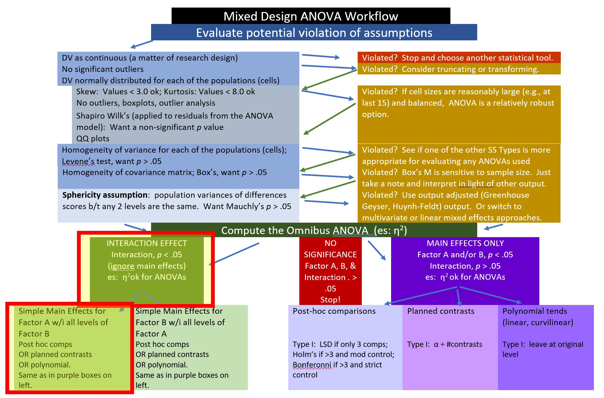

If we take this option we follow up with 3 one-way ANOVAs.  When we look at condition within wave, our ANOVAs will look like this:

* comparison of Friends and Little Mosque within the baseline wave
* comparison of Friends and Little Mosque within the post1 wave
* comparison of Friends and Little Mosque within the post2 wave

```{r }
SimpleWave <- Murrar_df %>% #crate an object to hold the output
  group_by(Wave) %>% #this group_by function is what results in three, one-way ANOVAs for each of the waves, separately
  anova_test(dv = Diff, wid = caseID, between = COND) %>% #the between = Cond means that each level of cond will be compared
  get_anova_table() %>%
  adjust_pvalue(method = "bonferroni") #we will get both the standard and adjusted p values
SimpleWave
```
In prior lectures we have adjusted the *p* vaue against which we compare the resulting *p* value.  When we specify "bonferroni" on the  *adjust_pvalue()* command, the algorithm adjusts the reported *p* value for us. We can see the unadjusted *p* value in the "p p<.05" column and the Bonferroni adjustment in the "p.adj" column.

I think that it will be easiest for us to interpret this simple main effect as the traditional *p* < .05 and then apply the restrictions to the alpha at the next level of analysis  In this particular instance, we would have statistically significant differences somewhere between the Friends and Little Mosque conditions for both the Post (*p*  = .027) and FollowUp (*p*  = .010) waves. 

F strings:

* Pre:  *F* (1, 191) = 0.012, *p* = .914, $\eta^{2}$ = 0.000 (the effect size is zero)
* Post:  *F* (1, 191) = 17.497, *p* < .001, $\eta^{2}$ = 0.084 (approaching a moderate effect size)
* FollowUp:  *F* (1, 191) = 5.994, *p* = .015, $\eta^{2}$ = 0.030 (a small effect size)

Recall, interpretation for the eta-squared are .02 ~ small, .13 ~ medium, >.26 ~ large

Because there are only two levels (Friends, Little Mosque) within each wave (baseline, post1, post2), this simple effects analysis is complete with the three pairwise comparisons.  

As always, we have several choices about how to manage Type I error.  In a circumstance when the analysis of simple main effects (condition within wave) includes only three pairwise comparisons, we can use the LSD method [@green_using_2014]. This means that we can we can leave the alpha at 0.05. If we were to use a traditional Bonferroni, we would use $\alpha$ = .017 (.05/3). Although the more restrictive Bonferonni criteria comes close, in both cases we would still have one non-significant(baseline) and two significant (post1, post2) simple main effects. 
```{r }
.05/3
```

If we were to write up this result:

We followed the significant interaction effect with an evaluation of simple main effects of condition within wave. Because there were only three comparisons following the omnibus evaluation, we used the LSD method to control for Type I error and left the alpha at .05 [@green_using_2014]. There was a non-statistically significant difference between conditions at baseline:  *F* (1, 191) = 0.012, *p* = .914, $\eta^{2}$ = 0.000.  However other were statistically significant differences at post1 (*F* [1, 191] = 17.497, *p* < .001, $\eta^{2}$ = 0.084) and post2 (*F*[1, 191] = 5.994, *p* = .015, $\eta^{2}$ = 0.030). We note that the effect size at post1 approached a moderate size; the effect size at post2 was small.

### Simple main effect of wave within condition

Alternatively, we could evaluate the simple main effect of wave within condition. The figure reflects our path along the workflow.


If we conducted this alternative we would start with three one-way ANOVAs and then follow each of those with pairwise comparisons.  First, the one-way repeated measures ANOVAs:

* comparison of baseline, post1, and post2 within the Friends condition
* comparison of baseline, post1, and post2  within the Little Mosque condition

```{r }
SimpleCond <- Murrar_df %>%
  group_by(COND) %>%
  anova_test(dv = Diff, wid = caseID, within = Wave) %>%
  get_anova_table() %>%
  adjust_pvalue(method = "bonferroni")
SimpleCond
```

Below are the *F* strings for the one-way ANOVAs the followed the omnibus, mixed design, ANOVA:

* Friends:  *F* (2, 194) = 1.759, *p* = 0.175, $\eta^{2}$ = 0.012 (effect size indicates no relationship)
* Little Mosque:  *F* (2, 188) = 3.392, *p* = 0.036, $\eta^{2}$ = 0.072 (a small-to-moderate effect size)

Because each of these one-way ANOVAs has three levels, we need to follow with pairwise comparisons. However, we only need to conduct them for the Little Mosque condition. As you can see we generally work our way down to comparing chunks to each other to find the source(s) of significant differences.

```{r }
pwcWVwiGP <- Murrar_df %>%
  group_by(COND) %>%
  pairwise_t_test(
    Diff ~ Wave, paired = TRUE, detailed = TRUE,
    p.adjust.method = "bonferroni"
    ) #%>%
  #select(-df, -statistic, -p) # Remove details
pwcWVwiGP
```

At this point, we likely need to control for Type I error.  Why?  We have already conducted two one-way ANOVAs after the omnibus. Now we will conduct three more pairwise comparisons in the Little Mosque condition.  I would divide .05/3 and interpret these pairwise comparisons with an alpha of .017.

We find a significant difference between baseline and post1 (*t*[95] = 2.447, *p* = .016), but non-significant differences between baseline and post2 (*t*[95] = 1.621, *p* = .108) and post1 and post2 (*t*[95] = -1.034, *p* = .304)

If we were to write up this result:

We followed the significant interaction effect with an evaluation of simple main effects of wave within condition. There were non-significant difference within the the Friends condition (*F* [2, 194] = 1.759, *p* = 0.175, $\eta^{2}$ = 0.012). There were significant differences with an effect size indicating a small-to-moderate effect in the Little Mosque condition (*F* [2, 188] = 3.392, *p* = 0.036, $\eta^{2}$ = 0.072). We followed up the significant simple main effect for the Little Mosque condition with pairwiwse comparisons. At this level we controlled for Type I error by dividing alpha (.05) by the number of paired comparisons (3). We found a significant difference between baseline and post1 (*t*[95] = 2.447, *p* = .016), but non-significant differences between baseline and post2 (*t*[95] = 1.621, *p* = .108) and post1 and post2 (*t*[95] = -1.034, *p* = .304).

### If we only had a main effect

When there is an interaction effect, we do not interpret main effects. This is because the solution is more complicated than a main effect could explain. It is important, though, to know how to interpret a main effect.  We would do this if we had one or more significant main effects and no interaction effect.

The figure shows our place on the workflow.

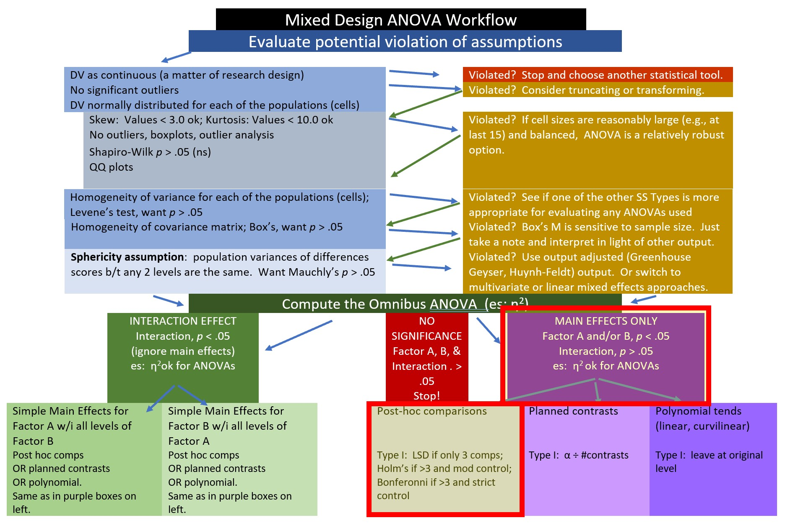

If we had not had a significant interaction, but did have a significant main effect for wave, we could have conducted pairwise comparisons for pre, post, and follow-up -- collapsing across condition.
```{r }
Murrar_df %>%
  pairwise_t_test(
    Diff ~ Wave, paired = TRUE, 
    p.adjust.method = "bonferroni"
  )
```
Ignoring condition (Friends, Little Mosque), we do not see changes across time. This is not surprising since the *F* test for the main effect was also non-significant (*F*[2, 382] = 0.273, *p* = .761, $\eta^{2}$ = 0.0014), 

If we had had a non-significant interaction effect but a significant main effect for condition, there would have been no need for further follow-up.  Why? Because there were only two levels the significant main effect already tells us there were statistically significant differences between Friends and Little Mosque (*F*[1, 191] = 13.149, *p* < .001, $\eta^{2}$ = 0.023).


### APA Style Write-up of the Results

The fancy plots below use the objects created from omnibus ANOVA and the pairwise comparisons to add results to the figure. Depending on where you are presenting your results, these may be useful. 

This first figure would pair well if you report the simple main effect of condition within wave.
```{r }

pwcWVwiGP <- pwcWVwiGP %>% add_xy_position(x = "Wave")
CNDwiWV + 
  stat_pvalue_manual(pwcWVwiGP, tip.length = 0, hide.ns = TRUE) +
  labs(
    subtitle = get_test_label(Diff_2way, detailed = TRUE),
    caption = get_pwc_label(pwcWVwiGP)
  )
```

This second figure would pair well with the results that reported the simple main effect of wave within condition.
```{r }
pwcWVwiGP <- pwcWVwiGP %>% add_xy_position(x = "Wave") #pwcWVwiGP were my pairwise comparisons for the simple effect
WVwiCND +  #WVwiCND was the boxplot before I did the ANOVA
  stat_pvalue_manual(pwcWVwiGP, tip.length = 0, hide.ns = TRUE) +
  labs(
    subtitle = get_test_label(Diff_2way, detailed = TRUE), #UE_2way was my omnibus ANOVA model
    caption = get_pwc_label(pwcWVwiGP) #and again the pairwise comparisons for the simple effect
  )
```

#### Results

We conducted a 3 X 2 mixed design ANOVA to evaluate the combined effects of condition (Friends and Little Mosque) and wave (baseline, post1, post2) a difference score that compared attitudes toward White and Arab people.  

Mixed design ANOVA has a number of assumptions related to both the within-subjects and between-subjects elements. Data are expected to be normally distributed at each level of design. Visual inspection of boxplots for each wave of the design, assisted by the *identify_outliers()* function in the *rstatix* package (which reports values above Q3 + 1.5xIQR or below Q1 - 1.5xIQR, where IQR is the interquartile range) indicated some outliers, but none at the extreme level. There was no evidence of skew (all values were at or below the absolute value of 0.32) or kurtosis (all values were below the absolute value of .57; [@kline_principles_2016]). Additionally, the Shapiro-Wilk tests applied at each level of the design were non-significant. Because of the between-subjects aspect of the design, the homogeneity of variance assumption was evaluated.  Levene's test indicated a violation of this assumption between the Friends and Little Mosque conditions at baseline *F* [1, 191] = 3.973, *p* = .047). However, there was no indication of assumption violation at post1 (*F* [1, 191] = 0.141, *p* = .708), and post2 (*F* [1, 191] = 0.107, *p* = .743) waves of the design. Further, Box's M-test (*M* = 3.209, *p* = .073) indicated no violation of the homogeneity of covariance matrices. Mauchly's test indicated no violation of the sphericity assumption for the main effect (*W* = 0.99, *p* = .369) and interaction effect  (*W* = 0.99, *p* = .369). 

Results of the omnibus ANOVA indicated a significant main effect for condition (*F*[1, 191] = 13.149, *p* < .001, $\eta^{2}$ = 0.023), a non-significant main effect for wave (*F*[2, 382] = 0.273, *p* = .761, $\eta^{2}$ = 0.001), and a significant interaction effect (*F*[2, 382] = 5.008, *p* = 0.007, $\eta^{2}$ = 0.017).

We followed the significant interaction effect with an evaluation of simple main effects of wave within condition. There were non-significant difference within the the Friends condition (*F* [2, 194] = 1.759, *p* = 0.175, $\eta^{2}$ = 0.012). There were significant differences with an effect size indicating a small-to-moderate effect in the Little Mosque condition (*F* [2, 188] = 3.392, *p* = 0.036, $\eta^{2}$ = 0.072). We followed up the significant simple main effect for the Little Mosque condition with pairwiwse comparisons. At this level we controlled for Type I error by dividing alpha (.05) by the number of paired comparisons (3). We found a significant difference between baseline and post1 (*t*[95] = 2.447, *p* = .016), but non-significant differences between baseline and post2 (*t*[95] = 1.621, *p* = .108) and post1 and post2 (*t*[95] = -1.034, *p* = .304).

As illustrated in Figure 1 difference scores were comparable at baseline. After the intervention, difference scores increased for those in the Friends condition -- indicating more favorable attitudes toward White people. In contrast, those exposed to the Little Mosque condition had difference scores that were lower. Means and standard deviations are reported in Table 1.

The following code can be used to write output to .csv files. From there it is easy(er) to manipulate them into tables for use in a write-up.
```{r }
library(MASS)
write.matrix(pwcWVwiGP, sep = ",", file = "pwcWVwiGP.csv")
#this command can also be used to export other output
write.matrix(Diff_2way$ANOVA, sep = ",", file = "Diff_2way.csv") #can get name of specific part of object by using str(object)
write.matrix(SimpleWave, sep = ",", file = "SimpleWave.csv")
write.matrix(SimpleCond, sep = ",", file = "SimpleCond.csv") 
```

#### Comparing our findings to Murrar and Brauer [-@murrar_entertainment-education_2018] 

* The authors started their primary analyses of Experiment 1 with independent *t* tests comparing the Friends and Little Mosque conditions within each of the baseline, post1, and post2 waves.  This is equivalent to our simple main effects of condition within wave that we conducted as follow-up to the significant interaction effect. It is not clear to me why they did not precede this with a mixed design ANOVA.
  - The results of the article are presented in their Table 1
  - Our results were comparable in that we found no attitude difference at baseline
  - Similar to the results in the article we found statistically significant differences (with comparable *p* values and effect sizes) at post1 and post2
* With two experiments (each with a number of associated hypotheses) in a single paper there are a large number of analyses. The tables and figures are well-chosen to represent the primary findings.
* This finding is exciting to me. Anti-racism education frequently encourages individuals to expose themselves to content authored/created by individuals from groups with marginalized identities. This finding supports that approach to prejudice reduction.

## Power in Mixed Design ANOVA

The package [*wp.rmanova*](https://webpower.psychstat.org/wiki/_media/grant/practical_statistica_interior_for_kindle.pdf) was designed for power analysis in repeated measures ANOVA.

Power analysis allows us to determine the probability of detecting an effect of a given size with a given level of confidence. Especially when we don't achieve significance, we may want to stop. 

In the *WebPower* package, we specify 6 of 7 interrelated elements; the package computes the missing element

n = sample size (number of individuals in the whole study)
ng = number of groups
nm = number of repeated measurements (i.e., waves)
f = Cohen's *f* (an effect size; we can use a conversion calculator); Cohen suggests that f values of 0.1, 0.25, and 0.4 represent small, medium, and large effect sizes, respectively.
nscor = the Greenhouse Geiser correction from our ouput; 1.0 means no correction was needed and is the package's default; < 1 means some correction was applied. 
alpha = is the probability of Type I error; we traditionally set this at .05 
power = 1 - P(Type II error) we traditionally set this at .80 (so anything less is less than what we want)
type = 0 is for between-subjects, 1 is for repeated measures, **2 is for interaction effect**. 

As in the prior lessons, we need to convert our effect size for the *interaction* to $f$ effect size (this is not the same as the *F* test). The *effectsize* package has a series of converters.  We can use the *eta2_to_f()* function. 

```{r}
library(effectsize)
eta2_to_f(0.017) #interaction effect
```

```{r  }
library(WebPower)
wp.rmanova(n=193, ng=2, nm=3, f = .1315, nscor = .99, alpha = .05, power = NULL, type = 2)
```
We are powered at .349 (we have a 35% of rejecting the null hypothesis, if it is true)

In reverse, setting *power* at .80 (the traditional value) and changing *n* to *NULL* yields a recommended sample size.    

```{r Estimate sample size}
wp.rmanova(n=NULL, ng=2, nm=3, f = .1315, nscor = .99, alpha = .05, power = .80, type = 2)
```
It thinks we need 562 participants to detect a significant interaction effect.


## Practice Problems
   
In each of these lessons I provide suggestions for practice that allow you to select one or more problems that are graded in difficulty. With each of these options I encourage you to:

* test the statistical assumptions
* conduct a two-way (minimally a 2x3), mixed design, ANOVA, including
  - omnibus test and effect size
  - report main and interaction effects
  - conduct follow-up testing of simple main effects
* write a results section to include a figure and tables


### Problem #1:  Play around with this simulation.

Copy the script for the simulation and then change (at least) one thing in the simulation to see how it impacts the results.  

* If mixed design ANOVA is new to you, perhaps you just change the number in "set.seed(210813)" from 210813 to something else. Your results should parallel those obtained in the lecture, making it easier for you to check your work as you go.
* If you are interested in power, change the sample size to something larger or smaller.
* If you are interested in variability (i.e., the homogeneity of variance assumption), perhaps you change the standard deviations in a way that violates the assumption.

Using the lecture and workflow (chart) as a guide, please work through all the steps listed in the proposed assignment/grading rubric.

|Assignment Component                    | Points Possible   | Points Earned|
|:-------------------------------------- |:----------------: |:------------:|
|1. Check and, if needed, format data |      5            |_____  |           
|2. Evaluate statistical assumptions     |      5            |_____  |
|3. Conduct omnibus ANOVA (w effect size)|      5           | _____  |  
|4. Conduct one set of follow-up tests; narrate your choice| 5 |_____  |               
|5. Describe approach for managing Type I error|    5        |_____  |   
|6. APA style results with table(s) and figure|    5        |_____  |       
|7. Explanation to grader                 |      5        |_____  |
|**Totals**                               |      35       |_____  |          


### Problem #2:  Conduct a one-way ANOVA with a different dependent variable.

The Murrar et al. [-@murrar_entertainment-education_2018] article has three dependent variables (attitudes toward people who are Arab, attitudes toward people who are White, and the difference score).  I analyzed the difference score. Select one of the other dependent variables. If you do not get a significant interaction, play around with the simulation (changing the sample size, standard deviations, or both) until you get a significant interaction effect.

|Assignment Component                    | Points Possible   | Points Earned|
|:-------------------------------------- |:----------------: |:------------:|
|1. Check and, if needed, format data |      5            |_____  |           
|2. Evaluate statistical assumptions     |      5            |_____  |
|3. Conduct omnibus ANOVA (w effect size)|      5           | _____  |  
|4. Conduct one set of follow-up tests; narrate your choice| 5 |_____  |               
|5. Describe approach for managing Type I error |    5        |_____  |   
|6. APA style results with table(s) and figure  |    5        |_____  |       
|7. Explanation to grader                 |      5        |_____  |
|8. What part of the simulation did you change? What did you have to do to get a significant interaction effect? |     5        |_____  |
|**Totals**                               |      35       |_____  | 

### Problem #3:  Try something entirely new.

Using data for which you have permission and access (e.g.,  IRB approved data you have collected or from your lab; data you simulate from a published article; data from an open science repository; data from other chapters in this OER), complete a mixed design ANOVA. Please have at least 3 levels for one predictor and at least 2 levels for the second predictor.

Using the lecture and workflow (chart) as a guide, please work through all the steps listed in the proposed assignment/grading rubric.

|Assignment Component                    | Points Possible   | Points Earned|
|:-------------------------------------- |:----------------: |:------------:|
|1. Narrate the research vignette, describing the IV and DV | 5 |_____  |
|2. Simulate (or import) and format data               |      5            |_____  |           
|3. Evaluate statistical assumptions     |      5            |_____  |
|4. Conduct omnibus ANOVA (w effect size) |      5           | _____  |  
|5. Conduct one set of follow-up tests; narrate your choice| 5 |_____  |               
|6. Describe approach for managing Type I error |    5        |_____  |   
|7. APA style results with table(s) and figure  |    5        |_____  |       
|8 Explanation to grader                 |      5        |_____  |
|**Totals**                               |      35       |_____  |          

```{r include=FALSE}
sessionInfo()
```


<!--chapter:end:07-MixedANOVA.Rmd-->

# Analysis of Covariance {#ANCOVA}

 [Screencasted Lecture Link](https://spu.hosted.panopto.com/Panopto/Pages/Viewer.aspx?pid=c0a9e50e-2e9d-4769-bd44-ad8c010143df) 
 
```{r  include=FALSE}
knitr::opts_chunk$set(echo = TRUE)
knitr::opts_chunk$set(comment = NA) #keeps out the hashtags in the knits
options(scipen=999)#eliminates scientific notation
```

The focus of this lecture is analysis of covariance. Sticking with the same research vignette, we rearrange the variables a bit to see how they work in an ANCOVA design. The results help clarify the distinction between moderator and covariate.

## Navigating this Lesson

There is about just about an hour of lecture.  If you work through the materials with me it would be plan for an additional hour or two

While the majority of R objects and data you will need are created within the R script that sources the chapter, occasionally there are some that cannot be created from within the R framework. Additionally, sometimes links fail.  All original materials are provided at the [Github site](https://github.com/lhbikos/ReCenterPsychStats) that hosts the book. More detailed guidelines for ways to access all these materials are provided in the OER's [introduction](#ReCintro)

### Learning Objectives

Focusing on this week's materials, make sure you can:

* Define a covariate and distinguish it from a moderator.
* Recognize the case where ANCOVA is a defensible statistical approach for analyzing the data.
* Name and test the assumptions underlying ANCOVA.
* Analyze, interpret, and write up results for ANCOVA.
* List the conditions that are prerequisite for the appropriate use of a covariate or control variable.

### Planning for Practice

In each of these lessons I provide suggestions for practice that allow you to select one or more problems that are graded in difficulty The least complex is to change the random seed and rework the problem demonstrated in the lesson. The results *should* map onto the ones obtained in the lecture. 

The second option comes from the research vignette. For this ANCOVA article, I take a lot of liberties with the variables and research design. You could further mix and match for a different ANCOVA constellation. 

As a third option, you are welcome to use data to which you have access and is suitable for ANCOVA. In either case, you will be expected to:

* test the statistical assumptions
* conduct an ANCOVA, including
  - omnibus test and effect size
  - report main effects and engage in any follow-up testing
  - interpret results in light of the role of the second predictor variable as a *covariate* (as opposed to the moderating role in the prior lessons)
* write a results section to include a figure and tables

### Readings & Resources

In preparing this chapter, I drew heavily from the following resource(s). Other resources are cited (when possible, linked) in the text with complete citations in the reference list.

* Green, S. B., & Salkind, N. J. (2014). One-Way Analysis of Covariance (Lesson 27). In Using SPSS for Windows and Macintosh: Analyzing and understanding data (Seventh edition., pp. 151–160). Boston: Pearson. OR
  - Excellent review with examples of APA style write-ups, but is written for use in SPSS.
* ANCOVA in R: The Ultimate Practical Guide. (n.d.). Retrieved from https://www.datanovia.com/en/lessons/ancova-in-r/
  - Is the workflow we are using for the lecture and written specifically for R.
* Bernerth, J. B., & Aguinis, H. (2016). A critical review and best‐practice recommendations for control variable usage. Personnel Psychology, 69(1), 229–283. https://doi.org/10.1111/peps.12103
  - An article from the I/O world.  For this class, focus on the flowchart on page 273 and the Discussion (pp. 270 to the end).
*  Murrar, S., & Brauer, M. (2018). Entertainment-education effectively reduces prejudice. *Group Processes & Intergroup Relations, 21*(7), 1053–1077. https://doi.org/10.1177/1368430216682350
  - This article is the source of our research vignette. I used this same article in the lesson on [mixed design ANOVA](#Mixed). Swapping variable roles can be useful in demonstrating how ANCOVA  is different than mixed design ANOVA. 

### Packages

The packages used in this lesson are embedded in this code. When the hashtags are removed, the script below will (a) check to see if the following packages are installed on your computer and, if not (b) install them.
```{r }
#if(!require(reshape2)){install.packages("reshape2")} #used to convert data from long to wide
#if(!require(data.table)){install.packages("data.table")}#used to convert data from long to wide
#if(!require(broom)){install.packages("broom")}
#if(!require(tidyverse)){install.packages("tidyverse")}
#if(!require(psych)){install.packages("psych")}
#if(!require(ggpubr)){install.packages("ggpubr")} #easy plots
#if(!require(rstatix)){install.packages("rstatix")} #pipe-friendly R functions
#if(!require(MASS)){install.packages("MASS")} #export objects for table making
#if(!require(WebPower)){install.packages("WebPower")} #power analysis for repeated measures
```

## Introducing Analysis of Covariance (ANCOVA)

Analysis of covariance (ANCOVA) evaluates the null hypothesis that

* population means on a dependent variable are equal across levels of a factor(s) adjusting for differences on a covariate(s); stated differently -
* the population adjusted means are equal across groups

This lecture introduces a distinction between **moderators** and **covariates**.  

**Moderator**: a variable that changes the strength or direction of an effect between two variables X (predictor, independent variable) and Y (criterion, dependent variable).

**Covariate**:  an observed, continuous variable, that (when used properly) has a relationship with the dependent variable.  It is included in the analysis, as a predictor, so that the predictive relationship between the independent (IV) and dependent (DV) are adjusted.

Understanding this difference may be facilitated by understanding one of the assumptions of ANCOVA -- that the slopes relating the covariate to the dependent variable are the same for all groups (i.e., the homogeneity-of-slopes assumption).  If this assumption is violated then the between-group differences in adjusted means are not interpretable and the covariate should be treated as a moderator and analyses that assess the simple main effects (i.e., follow-up to a significant interaction) should be conducted.

A one-way ANCOVA requires three variables:

* IV/factor -- categorical (2 or more)
* DV -- continuous
* Covariate -- continuous

Green and Salkind [@green_one-way_2014-1] identified common uses of ANCOVA:

* Studies with a pretest and random assignment of subjects to factor levels. Variations on this research design include: 
  - assignment to factor levels based on that pretest,
  - matching based on the pretest, and random assignment to factor levels,
  - simply using the pretest as a covariate for the posttest DV.
* Studies with a potentially confounding variable (best when there is theoretical justification and prior empirical evidence for such) over which the researcher wants "control"

Although it is possible to have multi-way (e.g., 2-way, 3-way) ANCOVA, in this lecture we will only work two, one-way ANCOVAs representing these larger questions.

ANCOVA has four primary assumptions:

**Linearity**  The covariate is linearly related to the dependent variable within all levels of the factor (IV).

**Homogeneity of regression slopes** The weights or slopes relating the covariate to the DV are equal across all levels of the factor.

**Normally distributed**  The DV is normally distributed in the population for any specific value of the covariate and for any one level of a factor.  This assumption applies to every combination of the values of the covariate and levels of the factor and requires them all to be normally distributed.  To the degree that population distributions are not normal and sample sizes are small, *p* values may not be trustworthy and power reduced. Evaluating this is frequently operationalized by inspecting the residuals and identifying outliers.  

**Homogeneity of variances** The variances of the DV for the conditional distributions (i.e., every combination of the values of the covariate and levels of the factor) are equal.

We are following the approach to analyzing ANCOVA identifed in the Datanovia lesson on ANCOVA [@noauthor_ancova_nodate].

Our analytic process will be similar to others in the ANOVA series:

1. Prepare the data
2. Evaluate potential violation of the assumptions
3. Compute the omnibus ANCOVA, and follow-up accordingly
   - Significant?  Follow-up with post-hoc comparisons, planned contrasts, and/or polynomial
   - Stopping if there is no significance
   
An ANCOVA workflow maps this in further detail.  


## Research Vignette

We will continue with the example used in the [mixed design ANOVA lesson](#Mixed) The article does not contain any ANCOVA analyses, but there is enough data that I can demonstrate the two general ways (i.e., controlling for the pretest, controlling for a potentially confounding variable) that ANCOVA is used.

Here's a quick reminder of the research vignette.

Murrar and Brauer's [-@murrar_entertainment-education_2018] article described the results of two studies designed to reduce prejudice against Arabs/Muslims. In the lesson on mixed design ANOVA, we only worked the first of two experiments reported in the study. Participants (*N* = 193), all who were White, were randomly assigned to one of two conditions where they watched six episodes of the sitcom [*Friends*](http://www.friends-tv.org/) or [*Little Mosque on the Prairie*](https://en.wikipedia.org/wiki/Little_Mosque_on_the_Prairie). The sitcoms and specific episodes were  selected after significant pilot testing. The selection was based on the tension between being as similar as possible, yet the intervention-oriented sitcom needed to invoke psychologial processes known to reduce prejudice. The authors felt that both series had characters that were likable and relatable and were engaged in activities of daily living. The Friends series featured characters who were predominantly White, cis-gendered, and straight. The Little Mosque series portrays the experience Western Muslims and Arabs as they live in a small Canadian town.  This study involved assessment across three waves:  baseline (before watching the assigned episodes), post1 (immediately after watching the episodes), and post2 (completed 4-6 weeks after watching the episodes).

The study used *feelings and liking thermometers*, rating their feelings and liking toward 10 different groups of people on a 0 to 100 sliding scale (with higher scores reflecting greater liking and positive feelings. For the purpose of this analysis, the ratings of attitudes toward White people and attitudes toward Arabs/Muslims were used.  A third metric was introduced by subtracting the attitudes towards Arabs/Muslims from the attitudes toward Whites. Higher scores indicated more positive attitudes toward Whites where as low scores indicated no difference in attitudes. To recap, there were three potential dependent variables, all continuously scaled:

* AttWhite:  attitudes toward White people; higher scores reflect greater liking
* AttArab:  attitudes toward Arab people; higher scores reflect greater liking
* Diff:  the difference between AttWhite and AttArab; higher scores reflect a greater liking for White people

With random assignment, nearly equal cell sizes, a condition with two levels (Friends, Little Mosque), and three waves (baseline, post1, post2), this is perfect for mixed design ANOVA but suitable for an ANCOVA demonstration.


### Simulating the data from the journal article

Below is the code I have used to simulate the data. The simulation includes two dependent variables (AttWhite, AttArab), Wave (baseline, post1, post2), and COND (condition; Friends, Little_Mosque).  There is also a caseID (repeated three times across the three waves) and rowID (giving each observation within each case an ID). You can use this simulation for two of the three practice suggestions.
```{r}
library(tidyverse)
set.seed(210813)#change this to any different number (and rerun the simulation) to rework the chapter problem
AttWhite<-round(c(rnorm(98,mean=76.79,sd=18.55),rnorm(95,mean=75.37,sd=18.99),rnorm(98, mean=77.47, sd=18.95), rnorm(95, mean=75.81, sd=19.29), rnorm(98, mean=77.79, sd=17.25), rnorm(95, mean=75.89, sd=19.44)),3) #sample size, M and SD for each cell; this will put it in a long file
AttWhite[AttWhite>100]<-100 #set upper bound for variable
AttWhite[AttWhite<0]<-0 #set lower bound for variable
AttArab<-round(c(rnorm(98,mean=64.11,sd=20.97),rnorm(95,mean=64.37,sd=20.03),rnorm(98, mean=64.16, sd=21.64), rnorm(95, mean=70.52, sd=18.55), rnorm(98, mean=65.29, sd=19.76), rnorm(95, mean=70.30, sd=17.98)),3)
AttArab[AttArab>100]<-100 #set upper bound for variable
AttArab[AttArab<0]<-0 #set lower bound for variable
rowID <- factor(seq(1,579))
caseID <- rep((1:193),3)
Wave <- c(rep("Baseline",193), rep("Post1", 193), rep ("Post2", 193))
COND <- c(rep("Friends", 98), rep("LittleMosque", 95), rep("Friends", 98), rep("LittleMosque", 95), rep("Friends", 98), rep("LittleMosque", 95))
Murrar_df<- data.frame(rowID, caseID, Wave, COND, AttArab, AttWhite) #groups the 3 variables into a single df:  ID#, DV, condition
#make caseID a factor
Murrar_df[,'caseID'] <- as.factor(Murrar_df[,'caseID'])
#make Wave an ordered factor
Murrar_df$Wave <- factor(Murrar_df$Wave, levels = c("Baseline", "Post1", "Post2"))
#make COND an ordered factor
Murrar_df$COND <- factor(Murrar_df$COND, levels = c("Friends", "LittleMosque"))
Murrar_df$Diff <- Murrar_df$AttWhite - Murrar_df$AttArab #creates the difference score
```

Let's check the structure. We want 

* rowID and caseID to be unordered factors,
* Wave and COND to be ordered factors,  
* AttArab, AttWhite, and Diff to be numerical

```{r}
str(Murrar_df)
```

Let's check the structure again.
```{r}
str(Murrar_df)
```

If you want to export this data as a file to your computer, remove the hashtags to save it (and re-import it) as a .csv ("Excel lite") or .rds (R object) file. This is not a necessary step.

The code for the .rds file will retain the formatting of the variables, but is not easy to view outside of R. This is what I would do.
```{r}
#to save the df as an .rds (think "R object") file on your computer; it should save in the same file as the .rmd file you are working with
#saveRDS(Murrar_df, "Murrar_RDS.rds")
#bring back the simulated dat from an .rds file
#Murrar_df <- readRDS("Murrar_RDS.rds")
```

The code for .csv will likely lose the formatting (i.e., stripping Wave and COND of their ordered factors), but it is easy to view in Excel.
```{r}
#write the simulated data  as a .csv
#write.table(Murrar_df, file="DiffCSV.csv", sep=",", col.names=TRUE, row.names=FALSE)
#bring back the simulated dat from a .csv file
#Murrar_df <- read.csv ("DiffCSV.csv", header = TRUE)
```

## Scenario #1:  Controlling for the pretest

So that we can begin to understand how the covariate operates, we are going to predict attitudes towards Arabs at post-test (AttArabP1) by condition (COND), controlling for attitudes toward Arabs at baseline (AttArabB). You may notice that in this analysis we are ignoring the second post-test. This is because I am simply demonstrating ANCOVA. To ignore the second post test would be a significant loss of information.

### Preparing the data

When the covariate in ANCOVA is a pretest, we need three variables:

* IV that has two or more levels; in our case it is the Friends and Little Mosque conditions
* DV that is continuous; in our case it is the attitudes toward Arabs at post1
* Covariate that is continuous; in our case it is the attitudes toward Arabs at baseline

The form of our data matters.  The simulation created a *long* form (formally called the *person-period* form) of data.  That is, each observation for each person is listed in its own row. In this dataset where we have 193 people with 3 observation (baseline, post1, post2) each, we have 579 rows. In ANCOVA where we use the pre-test as a covariate, we need all the data to be on a single row.This is termed the *person level* form of data. We can restructure the data with the *data.table* and *reshape2*()* packages.  

```{r }
library(reshape2)
# Create a new df (Murrar_wide)
# Identify the original df
#In the transition from long-to-wide it seems like you can only do one time-varying variable at a time
#When there are multiple time-varying and time-static variables, but all the time-static variables on the left side of the tilde
#Put the name of the single time-varying variable in the concatonated list
Murrar1 <- reshape2::dcast(data = Murrar_df, formula =caseID +COND ~ Wave, value.var = "AttArab")
#before restructuring a second variable, rename the first variable
Murrar1 <- rename(Murrar1, AttArabB = "Baseline", AttArabP1 = "Post1", AttArabP2 = "Post2")
#repeat the process for additional variables; but give the new df new names -- otherwise you'll overwrite your work
Murrar2 <- reshape2::dcast(data = Murrar_df, formula =caseID ~Wave, value.var = "AttWhite")
Murrar2 <- rename(Murrar2, AttWhiteB = "Baseline", AttWhiteP1 = "Post1", AttWhiteP2 = "Post2")
#Now we join them
Murrar_wide <- dplyr::full_join(Murrar1, Murrar2, by = c("caseID"))

str(Murrar_wide )
```
If you want to export this data as a file to your computer, remove the hashtags to save it (and re-import it) as a .csv ("Excel lite") or .rds (R object) file. This is not a necessary step.

The code for the .rds file will retain the formatting of the variables, but is not easy to view outside of R. This is what I would do.
```{r}
#to save the df as an .rds (think "R object") file on your computer; it should save in the same file as the .rmd file you are working with
#saveRDS(Murrar_wide, "MurrarW_RDS.rds")
#bring back the simulated dat from an .rds file
#Murrar_wide <- readRDS("MurrarW_RDS.rds")
```

The code for .csv will likely lose the formatting (i.e., stripping Wave and COND of their ordered factors), but it is easy to view in Excel.
```{r}
#write the simulated data  as a .csv
#write.table(Murrar_wide, file="MurrarW_CSV.csv", sep=",", col.names=TRUE, row.names=FALSE)
#bring back the simulated dat from a .csv file
#Murrar_wide <- read.csv ("MurrarW_CSV.csv", header = TRUE)
```

### Checking the assumptions

There are a number of assumptions in ANCOVA.  These include:

* random sampling and independence in the scores representing the dependent variable
* linearity of the relationship between the covariate and DV within all levels of the independent variable
* homogeneity of the regression slopes
* a normally distributed DV for any specific value of the covariate and for any one level of a factor
* homogeneity of variance

These are depicted in the flowchart, below.


#### Linearity assumption

ANCOVA assumes that there is linearity between the covariate and outcome variable at each level of the grouping variable.  In our case this means that there is linearity between the pre-test (covariate) and post-test (outcome variable) at each level of the intervention (Friends, Little Mosque).

We can create a scatterplot (with regression lines) between covariate (our pretest) and the outcome (follow-up test).

```{r }
library(ggpubr)
ggscatter (
  Murrar_wide, x = "AttArabB", y = "AttArabP1",
  color = "COND", add = "reg.line"
)+
  stat_regline_equation(
    aes(label =  paste(..eq.label.., ..rr.label.., sep = "~~~~"), color = COND)
    )

```

Yikes!  This plot looks like an interaction!

#### Homogeneity of regression slopes

This assumption requires that the slopes of the regression lines formed by the covariate and the outcome variable are the same for each group.  The assumption evaluates that there is no interaction between the outcome and covariate.  The plotted regression lines should be parallel.


```{r }
library(rstatix)
Murrar_wide %>% anova_test(AttArabP1 ~ COND*AttArabB)

```
Preliminary analysis did not support ANCOVA as a statistical option in that there was a violation of the homogeneity of regression slopes as the interaction term was statistically significant, *F* (1, 189) = 4.297, *p* = .040, $\eta^2$ = 0.022.  We should probably stop here. However, for the sake of demonstration, I will continue. One of the reasons I wanted to work this example as ANCOVA is to demonstrate that covariates and moderators each have their role. We can already see how this data is best analyzed with mixed design ANOVA.

#### Normality of residuals

Our goal here is to specify a model and extract *residuals*:  the difference between the observed value of the DV and its predicted value.  Each data point has one residual. The sum and mean of residuals are equal to 0.

Once we have the residuals, we can treat them as data and evaluate if they are normally distributed. We first compute the model with *lm()* (lm stands for "linear model").  This is a linear regression.

```{r }
AttArabB_Mod <- lm (AttArabP1 ~ AttArabB + COND, data = Murrar_wide) #Create a linear regression model predicting DV from COV & IV
AttArabB_Mod
```
From the *broom* package (with the *augment(model)* function) we can augment our *lm()* model object  to add fitted values and residuals. 
```{r }
library(broom)
AttArabB_Mod.metrics <- augment(AttArabB_Mod) #new model by augmenting the lm model
head(AttArabB_Mod.metrics,3) #shows the first three rows of the UEmodel.metrics
```

From this, we can assess the normality of the residuals using the Shapiro Wilk test

```{r }
shapiro_test(AttArabB_Mod.metrics$.resid)#apply shapiro_test to that augmented model
```
Yikes again!  The statistically significant Shapiro Wilk test indicated a violation of the normality assumption (*W* = 0.984, *p* = .026).


#### Homogeneity of variances

ANCOVA presumes that the variance of the residuals is equal for all groups.  We can check this with the Levene's test.
```{r }
AttArabB_Mod.metrics %>% levene_test(.resid ~ COND) 
```
A non-significant Levene's test indicated no violation of the homogeneity of the residual variances for all groups (*F*[1, 191] = 3.515 *p* = .062).

#### Outliers

We can identify outliers by examining the standardized (or studentized) residual.  This is the residual divided by its estimated standard error. Standardized residuals are interpreted as the number of standard errors away from the regression line.
```{r check for outliers}
AttArabB_Mod.metrics%>% #from our model metrics
  filter(abs(.std.resid)>3)%>% #show us any standardized residuals that are >3
  as.data.frame()
```
We do have one outlier with a standardized residual that has an absolute value greater than 3. At this point I am making a mental note of this.  If this were "for real" I might more closely inspect these data.  I would look at the whole response.  If any response seems invalid (e.g., random responding) I would delete it.  If the responses seem valid, I *could* truncate them to exactly 3 SEs or (more likely) ignore it.  Kline [-@kline_principles_2016] has a great section on some of these options.

As noted by the suggestion of an interaction effect, our preliminary analyses suggests that ANCOVA is not the best option. We know from the prior lesson that a mixed design ANOVA worked well. In the spirit of an example, here's a preliminary write-up so far:

#### Write-up of Assumptions

A one-way analysis of covariance (ANCOVA) was conducted. The independent variable, condition, had two levels:  Friends, Little Mosque. The dependent variable was attitudes towards Arabs expressed by the participant at post-test and covariate was the pre-test assessment of the same variable.  A preliminary analysis evaluating the homogeneity-of-slopes assumption indicated that the relationship between the covariate and the dependent variable differed significantly as a function of the independent variable,  *F* (1, 189) = 4.297, *p* = .040, $\eta^2$ = 0.022. Regarding the assumption that the dependent variable is normally distributed in the population for any specific value of the covariate and for any one level of a factor, results of the Shapiro-Wilk test of normality on the model residuals was also significant,*W* = 0.984, *p* = .026.  Only one datapoint (in the Little Mosque condition) had a standardized residual (-3.37) that exceeded an absolute value of 3.0. A non-significant Levene's test indicated no violation of the homogeneity of the residual variances for all groups, *F*(1, 191) = 3.515 *p* = .062.

### Calculating the Omnibus ANOVA

We are ready to conduct the omnibus ANOVA.


*Order of variable entry* matters in ANCOVA. Thinking of the *controlling for* language associate with covariates, we want to remove the effect of the covariate before we run the one-way ANOVA. With this ANCOVA we are asking the question, "Does the condition (Friends or Little Mosque) contribute to more positive attitudes toward Arabs, when controlling for the pre-test score.

In repeated measures projects, we expect there to be dependency in the data. That is, in most cases prior waves will have significant prediction on later waves. When ANCOVA uses a prior asssessment or wave as a covariate, that variable "claims" as much variance as possible and the subsequent variable can capture what is left over.

In the code below, we are predicting attitudes toward Arabs at post1 from the condition (Friends or Little Mosque), controlling for attitudes toward Arabs at baseline.

The *ges* column provides the effect size, $\eta^2$ where a general rule-of-thumb for interpretation is .02 (small), .13 (medium), and .26 (large) [@lakens_calculating_2013].
```{r }
MurrarB_ANCOVA <- Murrar_wide %>%
  anova_test(AttArabP1 ~ AttArabB + COND)
get_anova_table(MurrarB_ANCOVA )
```
There was a non-significant effect of the baseline covariate on the post-test (*F*[1, 190] = 0.665, *p* = .416, $\eta^2$ = 0.003). After controlling for the baseline attitudes toward Arabs, there was a statistically significant effect of condition on post-test attitudes toward Arabs, *F*(1,190) = 26.361, *p* < .001, $\eta^2$ = 0.122. This appears to be a moderately sized effect. 

### Post-hoc pairwise comparisons (controlling for the covariate)

Just like in one-way ANOVA, we follow-up the significant effect of condition.  We'll use all-possible pairwise comparisons. In our case, we only have two levels of the categorical factor, so this run wouldn't be necessary. I included it to provide the code for doing so.  If there were three or more variables, we would see all possible comparisons.

```{r }
library(emmeans)
pwc_B <- Murrar_wide %>%
  emmeans_test(
    AttArabP1 ~ COND, covariate = AttArabB,
    p.adjust.method = "none"
  )
pwc_B
```

Not surprisingly (since this single pairwise comparison is redundant with the omnibus ANCOVA), results suggest a statistically significant difference between Friends and Little Mosque at Post1.

With the script below we can obtain the covariate-adjusted marginal means.  These are termed **estimated marginal means.**  Take a look at these and compare them to what we would see in the regular descriptives. It is helpful to see the grand mean (AttArabB) and then the marginal means (emmean).

```{r }
emmeans_B <- get_emmeans(pwc_B)
emmeans_B
```

Note that the *emmeans* process produces slightly different means than the raw means from the *psych* package's *describeBy()* function. Why?  Because the *get_emmeans()* function uses the model that included the covariate.  The *estimated* means are covariate-adjusted.  
```{r }
library(psych)
descripts_P1 <- describeBy(AttArabP1 ~ COND, data = Murrar_wide, mat = TRUE)
descripts_P1
```

(*M* = 59.02, *SD* = 21.65)
(*M* = 73.92, *SD* = 18.51) 

In our case the adjustments are very minor.  Why?  The effect of the attitudes toward Arabs baseline test on the attitudes toward Arabs post test was nonsignificant.  In fact, our correlation is...

```{r }
#getting p values requires the corr.test function from the psych package; 
#because some function names appear is multiple packages, it is sometimes essential to point a function to the proper package
#use the double colon to specify package and function
MurP1_Rmat <- psych::corr.test(Murrar_wide[c("AttArabB", "AttArabP1")]) 
MurP1_Rmat
```
...almost negligible (*r* = -0.05, *p* = .47)

### Toward an APA style results section

Tables with the means, adjusted means, and correlations may be helpful. 

```{r}
apaTables::apa.cor.table(Murrar_wide[c("AttArabB", "AttArabP1")], table.number = 1 )
#You can save this as a Microsoft word document by adding this statement into the command: filename = "your_filename.doc" 
```

Additionally, writing this output to excel files helped create the two tables that follow. The *MASS* package is useful to export the model objects into .csv files. They are easily opened in Excel where they can be manipulated into tables for presentations and manuscripts.

```{r }
library(MASS)
write.matrix(pwc_B, sep = ",", file = "pwc_B.csv")
write.matrix(emmeans_B, sep = ",", file = "emmeans_B.csv")
write.matrix(descripts_P1, sep = ",", file = "descripts_P1.csv")
```
Ultimately, I would want a table that included this information. Please refer to the APA style manual for more proper formatting for a manuscript that requires APA style.

|Table 1
|:-----------------------------------------------|
|Unadjusted and Covariate-Adjusted Descriptive Statistics  

|Condition      |Unadjusted   |Covariate-Adjusted
|:--------------|:-----------:|:----------------:|

|               |*M*   |*SD*  |*EMM* |*SE* 
|:--------------|:----:|:----:|:----:|:---:|
|Friends        |59.02 |21.65 |59.01 |2.04 |
|Little Mosque  |73.92 |18.51 |73.93 |2.07 |

Unlike the figure we created when we were testing assumptions, this script creates a plot from the model (which identifies AttArabB in its role as covariate). Thus, the relationship between condition and AttArabP1 controls for the effect of the AttArabB covariate.

```{r }
pwc_B <- pwc_B %>% add_xy_position(x = "COND", fun = "mean_se")
ggline(get_emmeans(pwc_B), x = "COND", y = "emmean") +
  geom_errorbar(aes(ymin = conf.low, ymax = conf.high), width = 0.2) + 
  stat_pvalue_manual(pwc_B, hide.ns = TRUE, tip.length = FALSE) +
  labs(
    subtitle = get_test_label(MurrarB_ANCOVA, detailed = TRUE),
    caption = get_pwc_label(pwc_B)
  )
```
**Results**

A one-way analysis of covariance (ANCOVA) was conducted. The independent variable, condition, had two levels:  Friends, Little Mosque.  The dependent variable was attitudes towards Arabs expressed by the participant at post-test and covariate was the baseline assessment of the same variable. Descriptive statistics are presented in Table 1. A preliminary analysis evaluating the homogeneity-of-slopes assumption indicated that the relationship between the covariate and the dependent variable differed significantly as a function of the independent variable,  *F* (1, 189) = 4.297, *p* = .040, $\eta^2$ = 0.022. Regarding the assumption that the dependent variable is normally distributed in the population for any specific value of the covariate and for any one level of a factor, results of the Shapiro-Wilk test of normality on the model residuals was also significant,*W* = 0.984, *p* = .026.  Only one datapoint (in the Little Mosque condition) had a standardized residual (-3.37) that exceeded an absolute value of 3.0. A non-significant Levene's test indicated no violation of the homogeneity of the residual variances for all groups, *F*(1, 191) = 3.515 *p* = .062.

There was a non-significant effect of the baseline covariate on the post-test (*F*[1, 190] = 0.665, *p* = .416, $\eta^2$ = 0.003). After controlling for the baseline attitudes toward Arabs, there was a statistically significant effect of condition on post-test attitudes toward Arabs, *F*(1,190) = 26.361, *p* < .001, $\eta^2$ = 0.122. This appears to be moderate in size. Given there were only two conditions, no further follow-up was required. As illustrated in Figure 1, results suggest that those in the Little Mosque condition (*M* = 73.92, *SD* = 18.51) had more favorable attitudes toward Arabs than those in the Friends condition (*M* = 59.02, *SD* = 21.65). Means and covariate-adjusted means are presented in Table 1b.


## Scenario #2:  Controlling for a confounding or covarying variable

In the scenario below, I am simulating a one-way ANCOVA, predicting attitudes toward Arabs at post1 as a function of sitcom condition (Friends, Little Mosque), controlling for the participants' attitudes toward Whites. That is, the ANCOVA will compare the the means of the two groups (at post1, only), adjusted for level of attitudes toward Whites

TO BE CLEAR:  This is not the best way to analyze this data.  With such a strong, balanced design, the multi-way, mixed design ANOVAs were an excellent choice that provided much fuller information than this demonstration, below.  The purpose of this over-simplified demonstration is merely to give another example of using a variable as a *covariate* rather than a *moderator.*

### Preparing the data

When the covariate in ANCOVA is a potentially confounding variable, we need three variables:

* IV that has two or more levels; in our case it is the Friends and Littls Mosque sitcom conditions.
* DV that is continuous; in our case it attitudes toward Arabs at post1 (AttArabP1).
* Covariate that is continuous; in our case it attitudes toward Whites at post1 (AttWhiteP1).  *Note* We could have also chosen attitudes toward Whites at baseline.

We can continue using the Murrar_wide df.

### Checking the assumptions

There are a number of assumptions in ANCOVA.  These include:

* random sampling and independence in the scores representing the dependent variable
* linearity of the relationship between the covariate and DV within all levels of the independent variable
* homogeneity of the regression slopes
* a normally distributed DV for any specific value of the covariate and for any one level of a factor
* homogeneity of variance

These are depicted in the flowchart, below.


#### Linearity assumption

ANCOVA assumes that there is linearity between the covariate and outcome variable at each level of the grouping variable.  In our case this means that there is linearity between the attitudes toward Whites (covariate) and attitudes toward Arabs (outcome variable) at each level of the intervention (Friends, Little Mosque).

We can create a scatterplot (with regression lines) between the covariate (attitudes toward Whites) and the outcome (attitudes toward Arabs).

```{r }
library(ggpubr)
ggscatter (
  Murrar_wide, x = "AttWhiteP1", y = "AttArabP1",
  color = "COND", add = "reg.line"
)+
  stat_regline_equation(
    aes(label =  paste(..eq.label.., ..rr.label.., sep = "~~~~"), color = COND)
    )

```
As we look at this scatterplot, we are trying to determine if there is an interaction effect (rather than a covarying effect).  The linearity here, looks reasonable and not terribly "interacting" (to help us decide whether empathy should be a covariate or a moderator). More testing can help us make this distinction.

#### Homogeneity of regression slopes

This assumption requires that the slopes of the regression lines formed by the covariate and the outcome variable are the same for each group.  The assumption evaluates that there is no interaction between the outcome and covariate.  The plotted regression lines should be parallel.

```{r }
Murrar_wide %>% anova_test(AttArabP1 ~ COND*AttWhiteP1)
```
Preliminary analysis supported ANCOVA as a statistical option in that there was no violation of the homogeneity of regression slopes as the interaction term was not statistically significant, *F* (1, 189) = 1.886, *p* = .171, $\eta^2$ = 0.010.

#### Normality of residuals

Assessing the normality of residuals means running the model, capturing the unexplained portion of the model (i.e., the *residuals*), and then seeing if they are normally distributed. Proper use of ANCOVA is predicated on normally distributed residuals.

We first compute the model with *lm()*. The *lm()* function is actually testing what we want to test. However, at this early stage, we are just doing a "quick run and interpretation" to see if we are within the assumptions of ANCOVA.
```{r }
WhCov_mod <- lm (AttArabP1 ~ AttWhiteP1 + COND, data = Murrar_wide) #Create a linear regression model predicting DV from COV & IV
WhCov_mod
```
We can use the *augment(model)* function rom the *broom* package to add fitted values and residuals. 
```{r }
library(broom)
WhCov_mod.metrics <- augment(WhCov_mod)
head(WhCov_mod.metrics,3) #shows the first three rows of the UEcon_model.metrics
```
Now we assess the normality of residuals using the Shapiro Wilk test.  The script below captures the ".resid" column from the model.

```{r }
shapiro_test(WhCov_mod.metrics$.resid)
```
Yikes!  The statistically significant Shapiro Wilk test indicate a violation of the normality assumption (*W* = 0.984, *p* = .029). As I mentioned before, there are better ways to analyze this research vignette. I am only modeling this as an alternative.

#### Homogeneity of variances

ANCOVA presumes that the variance of the residuals is equal for all groups.  We can check this with the Levene's test.

```{r }
WhCov_mod.metrics %>% levene_test(.resid ~ COND)
```
Yikes again. A statistically significant Levene's test indicates a violation of the homogeneity of the residual variances (*F*[1, 191] = 4.539, *p* = .034).

#### Outliers

We can identify outliers by examining the standardized (or studentized) residual.  This is the residual divided by its estimated standard error. Standardized residuals are interpreted as the number of standard errors away from the regression line.

```{r }
WhCov_mod.metrics %>%
  filter(abs(.std.resid)>3)%>%
  as.data.frame()
```
There is one outlier with a standardized residual with an absolute value greater than 3. At this point I am making a mental note of this.  If this were "for real" I might more closely inspect these data.  I would look at the whole response.  If any response seems invalid (e.g., random responding) I would delete it.  If the responses seem valid, I *could* truncate them to exactly 3 SEs or (more likely) ignore it.  Kline [-@kline_principles_2016] has a great section on some of these options.

#### Write-up of Assumptions

A one-way analysis of covariance (ANCOVA) was conducted. The independent variable, sitcom condition, had two levels:  Friends, Little Mosque.  The dependent variable was attitudes towards Arabs at pre-test. Preliminary anlayses which tested the assumptions of ANCOVA were mixed. Results suggesting that the relationship between the covariate and the dependent variable did not differ significantly as a function of the independent variable (*F* [1, 189] = 1.886, *p* = .171, $\eta^2$ = 0.010) provided evidence that we did not violate the homogeneity-of-slopes assumption. In contrast, the Shapiro-Wilk test of normality on the model residuals was statistically significant (*W* = 0.984, *p* = .029). This means that we likely violated the assumption that the dependent variable is normally distributed in the population for any specific value of the covariate and for any one level of a factor. Regarding outliers, one datapoint (-3.38) had a standardized residual that exceeded an absolute value of 3.0. Further, a statistically significant Levene's test indicated a violation of the homogeneity of the residual variances for all groups, (*F*[1, 191] = 4.539, *p* = .034). *Because the intent of this analysis was to demonstrate how ANCOVA differs from mixed design ANOVA we proceeded with the analysis. Were this for "real research" we would have chosen a different analysis.*

### Calculating the Omnibus ANOVA

We are ready to conduct the omnibus ANOVA.


*Order of variable entry* matters in ANCOVA. Thinking of the *controlling for* language associated with covariates, we firstly want to remove the effect of the covariate.

In the code below we are predicting attitudes toward Arabs at post1 from attitudes toward Whites at post1 (the covariate) and sitcom condition (Friends, Little Mosque).

The *ges* column provides the effect size, $\eta^2$ where a general rule-of-thumb for interpretation is .01 (small), .06 (medium), and .14 (large) [@lakens_calculating_2013].

```{r }
WhCov_ANCOVA <- Murrar_wide %>%
  anova_test(AttArabP1 ~ AttWhiteP1 + COND)
get_anova_table(WhCov_ANCOVA)
```

There was a non-significant effect of the attitudes toward Whites covariate on the attitudes toward Arabs at post-test, *F* (1,190) = 0.014, *p* = .907, $\eta^2$ < .001. After controlling for attitudes toward Whites, there was a statistically significant effect in attitudes toward Arabs at post-test between the conditions, *F*(1. 190) = 26.119, *p* < .001, $\eta^2$ = 0.121. The effect size was moderate.

### Post-hoc pairwise comparisons (controlling for the covariate)

With only two levels of sitcom condition (Friends, Little Mosque), we do not need to conduct post-hoc pairwise comparisons.  However, because many research designs involve three or more levels, I will demonstrate them here.
```{r }
library(emmeans)
pwc_cond <- Murrar_wide %>%
  emmeans_test(
    AttArabP1 ~ COND, covariate = AttWhiteP1,
    p.adjust.method = "none"
  )
pwc_cond
```

Results suggest a statistically significant post-test difference between the Friends and Little Mosque sitcom conditions. 

With the script below we can obtain the covariate-adjusted marginal means.  These are termed *estimated marginal means.*

```{r }
emmeans_cond <- get_emmeans(pwc_cond)
emmeans_cond
```

As before, these means are usually different (even if only ever-so-slightly) than the raw means you would obtain from the descriptives.

```{r}
descripts_cond <- psych::describeBy(AttArabP1 ~ COND, data = Murrar_wide, mat = TRUE)
descripts_cond
```


### Toward an APA style results section

Tables with the means, adjusted means, and pairwise comparison output may be helpful. The *apa.cor.table()* function in the *apaTables* package is helpful for providing means, standarddeviations, and correlations.

```{r}
apaTables::apa.cor.table(Murrar_wide[c("AttArabP1", "AttWhiteP1")], table.number = 2 )
#You can save this as a Microsoft word document by adding this statement into the command: filename = "your_filename.doc" 
```

Writing this output to excel files helped create the two tables that follow.

```{r }
library(MASS)
write.matrix(pwc_cond, sep = ",", file = "pwc_con.csv")
write.matrix(emmeans_cond, sep = ",", file = "emmeans_con.csv")
write.matrix(descripts_cond, sep = ",", file = "descripts_con.csv")
```

Ultimately, I would want a table that included this information. Please refer to the APA style manual for more proper formatting for a manuscript that requires APA style.

|Table 1b
|:-----------------------------------------------|
|Unadjusted and Covariate-Adjusted Descriptive Statistics  

|Condition      |Unadjusted   |Covariate-Adjusted
|:--------------|:-----------:|:----------------:|

|               |*M*   |*SD*  |*EMM* |*SE* 
|:--------------|:----:|:----:|:----:|:---:|
|Friends        |59.02 |21.65 |59.03 |2.04 |
|Little Mosque  |73.92 |18.51 |73.92 |2.08 |


Unlike the figure we created when we were testing assumptions, this script creates a plot from the model (which identifies AttWhiteP1 in its role as covariate). Thus, the relationship between condition and AttArabP1 controls for the effect of the AttArabB covariate.

```{r }
pwc_cond <- pwc_cond %>% add_xy_position(x = "COND", fun = "mean_se")
ggline(get_emmeans(pwc_B), x = "COND", y = "emmean") +
  geom_errorbar(aes(ymin = conf.low, ymax = conf.high), width = 0.2) + 
  stat_pvalue_manual(pwc_B, hide.ns = TRUE, tip.length = FALSE) +
  labs(
    subtitle = get_test_label(WhCov_ANCOVA, detailed = TRUE),
    caption = get_pwc_label(pwc_cond)
  )
```
**Results**

A one-way analysis of covariance (ANCOVA) was conducted. The independent variable, sitcom condition, had two levels:  Friends, Little Mosque.  The dependent variable was attitudes towards Arabs at pre-test. Preliminary analyses which tested the assumptions of ANCOVA were mixed. Results suggesting that the relationship between the covariate and the dependent variable did not differ significantly as a function of the independent variable (*F* [1, 189] = 1.886, *p* = .171, $\eta^2$ = 0.010) provided evidence that we did not violate the homogeneity-of-slopes assumption. In contrast, the Shapiro-Wilk test of normality on the model residuals was statistically significant (*W* = 0.984, *p* = .029). This means that we likely violated the assumption that the dependent variable is normally distributed in the population for any specific value of the covariate and for any one level of a factor. Regarding outliers, one datapoint (-3.38) had a standardized residual that exceeded an absolute value of 3.0. Further, a statistically significant Levene's test indicated a violation of the homogeneity of the residual variances for all groups, (*F*[1, 191] = 4.539, *p* = .034). *Because the intent of this analysis was to demonstrate how ANCOVA differs from mixed design ANOVA we proceeded with the analysis. Were this for "real research" we would have chosen a different analysis.*

There was a non-significant effect of the attitudes toward Whites covariate on the attitudes toward Arabs post-test, *F* (1,190) = 0.014, *p* = .907, $\eta^2$ < .001. After controlling for attitudes toward Whites, there was a statistically significant effect in attitudes toward Arabs at post-test between the conditions, *F*(1. 190) = 26.119, *p* < .001, $\eta^2$ = 0.121. The effect size was moderately large. Means and covariate-adjusted means are presented in Table 1b.


## More (and a recap) on covariates

Covariates, sometimes termed *controls* are often used to gain statistical control over variables that are difficult to control in a research design. That is, it may be impractical for polychotomize an otherwise continuous variable and/or it is impractical to have multiple factors and so a covariate is a more manageable approach. Common reasons for including covariates include [@bernerth_critical_2016]:

* they mathematically remove variance associated with nonfocal variables,
* the *purification principle* -- removing unwanted or confusing variance,
* they remove the *noise* in the analysis to clear up the clear up the relationship between IV and DVs.

Perhaps it is an oversimplification, but we can think of three categories of variables:  moderators, covariates, and mediators.  Through ANOVA and ANCOVA, we distinguish between moderator and covariate.

**Moderator**: a variable that changes the strength or direction of an effect between two variables X (predictor, independent variable) and Y (criterion, dependent variable).

**Covariate**:  an observed, continuous variable, that (when used properly) has a relationship with the dependent variable.  It is included in the analysis, as a predictor, so that the predictive relationship between the independent (IV) and dependent (DV) are adjusted.

Bernerth and Aguinis [-@bernerth_critical_2016] conducted a review of how and when control variables were used in nearly 600 articles published between 2003 and 2012.  Concurrently with their analysis, they provided guidance for when to use control variables (covariates).  The flowchart that accompanies their article is quite helpful. Control variables (covariates) should only be used when:

1. Theory suggests that the potential covariate(s) relate(s) to variable(s) in the currrent study.
2. There is empirical justification for including the covariate in the study.
3. The covariate can be measured reliably.

Want more?  Instructions for calculating a two-way ANCOVA are here:  https://www.datanovia.com/en/lessons/ancova-in-r/  

## Practice Problems
   
In each of these lessons I provide suggestions for practice that allow you to select one or more problems that are graded in difficulty. With each of these options I encourage you to:

* test the statistical assumptions
* conduct an ANCOVA where the covariate is
* if the predictor variable has more three or more levels, conduct follow-up testing 
* present both means and coviarate-adjusted means
* write a results section to include a figure and tables


### Problem #1:  Play around with this simulation.

Copy the script for the simulation and then change (at least) one thing in the simulation to see how it impacts the results.  

* If ANCOVA is new to you, perhaps you just change the number in "set.seed(210813)" from 210813 to something else. Then rework Scenario#1, Scenario#2, or both. Your results should parallel those obtained in the lecture, making it easier for you to check your work as you go.
* If you are interested in power, change the sample size to something larger or smaller.
* If you are interested in variability (i.e., the homogeneity of variance assumption), perhaps you change the standard deviations in a way that violates the assumption.

Using the lecture and workflow (chart) as a guide, please work through all the steps listed in the proposed assignment/grading rubric.

|Assignment Component                    | Points Possible   | Points Earned|
|:-------------------------------------- |:----------------: |:------------:|
|1. Check and, if needed, format data |      5            |_____  |           
|2. Evaluate statistical assumptions     |      5            |_____  |
|3. Conduct omnibus ANCOVA (w effect size)|      5           | _____  |  
|4. If the IV has three or more levels, conduct follow-up tests| 5 |_____  |               
|5. Present means and covariate-adjusted means; interpret them|    5        |_____  |   
|6. APA style results with table(s) and figure|    5        |_____  |       
|7. Explanation to grader                 |      5        |_____  |
|**Totals**                               |      35       |_____  |          


### Problem #2:  Conduct a one-way ANOVA with the DV and covariate at post2.

The Murrar et al. [-@murrar_entertainment-education_2018]article has three waves:  baseline, post1, post2.  In this lesson, I focused on the post1 waves. Rerun this analysis using the post2 wave data.

|Assignment Component                    | Points Possible   | Points Earned|
|:-------------------------------------- |:----------------: |:------------:|
|1. Check and, if needed, format data |      5            |_____  |           
|2. Evaluate statistical assumptions     |      5            |_____  |
|3. Conduct omnibus ANCOVA (w effect size)|      5           | _____  |  
|4. If the IV has three or more levels, conduct follow-up tests| 5 |_____  |               
|5. Present means and covariate-adjusted means; interpret them|    5        |_____  |   
|6. APA style results with table(s) and figure|    5        |_____  |       
|7. Explanation to grader                 |      5        |_____  |
|**Totals**                               |      35       |_____  |       

### Problem #3:  Try something entirely new.

Using data for which you have permission and access (e.g.,  IRB approved data you have collected or from your lab; data you simulate from a published article; data from an open science repository; data from other chapters in this OER), complete an ANCOVA. 

Using the lecture and workflow (chart) as a guide, please work through all the steps listed in the proposed assignment/grading rubric.

|Assignment Component                    | Points Possible   | Points Earned|
|:-------------------------------------- |:----------------: |:------------:|
|1. Check and, if needed, format data |      5            |_____  |           
|2. Evaluate statistical assumptions     |      5            |_____  |
|3. Conduct omnibus ANCOVA (w effect size)|      5           | _____  |  
|4. If the IV has three or more levels, conduct follow-up tests| 5 |_____  |               
|5. Present means and covariate-adjusted means; interpret them|    5        |_____  |   
|6. APA style results with table(s) and figure|    5        |_____  |       
|7. Explanation to grader                 |      5        |_____  |
|**Totals**                               |      35       |_____  |         

```{r include=FALSE}
sessionInfo()
```


# References {-#refs}


<!--chapter:end:08-ANCOVA.Rmd-->

