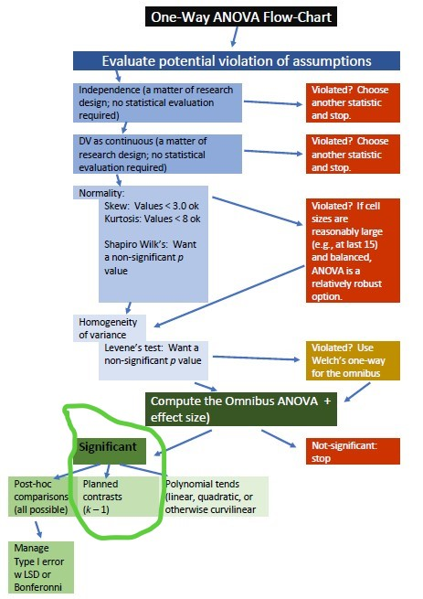

--- 
lang: "en"
title: "DRAFT: ReCentering Psych Stats"
author: "Lynette H Bikos, PhD, ABPP"
knit: "bookdown::render_book"
site:  bookdown::bookdown_site
documentclass: book
bibliography: STATSnMETH.bib
citation-style: apa-single-spaced.csl
link-citations: true

#url: 'http\://whateveritis
#github-repo: whatever it is

description: 'This is an open-access, book-in-progress. My goal in offering it is to re-center the materials used in training statistics and research methods in graduate and post-graduate psychology programs.'
#cover-image: "title of image.png"

output:
  bookdown::gitbook:
    dev: svglite
    css: css/style.css
    includes: 
        in_header: [google-analytics-otl.html]
    toc_depth: 4
    split-by: section
    split_bib: true
    number_sections: true
    #pandoc_args: [ "--csl", "apa-single-spaced.csl" ]
    config:
      toc:
        scroll_highlight: yes
        collapse: section
        before: |
          <li><a href="./"><strong>ReCentering Psych Stats</strong><br>by Lynette H Bikos, PhD, ABPP</a></li>
        after: |
          #<li><a href="https:link" target="_blank">Open access book-in-progress</br>
          <li><a rel="license" href="http://creativecommons.org/licenses/by-nc-sa/4.0/"></a></li>
            <li><a href="https://bookdown.org" target="_blank">Built with Bookdown</a></li>
      download: [pdf]
      view: https://github.com/ontheline/otl-bookdown/blob/master/%s
      search: yes
      sharing:
        facebook: yes
        github: yes
        twitter: yes

  #bookdown::pdf_book:
    #citation_package: default
    #pandoc_args: [ "--csl", "apa-single-spaced.csl" ]

  bookdown::word_document2:
    default

  bookdown::markdown_document2:
    default
---

# Preface {-}

**If you are viewing this document, you should know that this is a book-in-progress.  Early drafts of the preface,introduction, and single chapter are released for the purpose of gaining formative feedback from a host of stakeholders.  The document was last updated on `r format (Sys.Date(), '%d %b %Y')`**

To *center* a variable in regression means to set its value at zero and interpret all other values in relation to this reference point. Regarding race and gender, researchers often center male and White at zero. Further, it is typical that research vignettes in statistics textbooks are similarly seated in a White, Western (frequently U.S.), heteronormative, framework. The purpose of this project is to create a set of open educational resources (OER) appropriate for doctoral and post-doctoral training that contribute to justice, equity, diversity, inclusion (JEDI), and social responsivity. 

Statistics training in doctoral programs are frequently taught with fee-for-use programs (e.g., SPSS/AMOS, SAS, MPlus) that may not be readily available to the post-doctoral professional. In recent years, there has been an increase and improvement in R packages (e.g., *psych*, *lavaan*) used for in analyses common to psychological research. Correspondingly, many graduate programs are transitioning to statistics training in R (free and open source).  This is a challenge for post-doctoral psychologists who were trained with other software. This OER will offer statistics training with R and be, freely available on open science platforms under a Creative Commons Attribution - Non Commercial - Share Alike license [CC BY-NC-SA 4.0]. 

Training models for doctoral programs in HSP are commonly scholar-practitioner, scientist-practitioner, or clinical-scientist.  An emerging model, the *scientist-practitioner-advocacy* training model incorporates social justice advocacy so that graduates are equipped to recognize and address the sociocultural context of oppression and unjust distribution of resources and opportunities [@mallinckrodt_scientist-practitioner-advocate_2014]. In statistics textbooks, the use of research vignettes engages the learner around a tangible scenario for identifying independent variables, dependent variables, covariates, and potential mechanisms of change. Many students recall examples in Field's  [-@field_discovering_2012] popular statistics text:  Viagra to teach one-way ANOVA, beer goggles for two-way ANOVA, and bushtucker for repeated measures.  What if the research vignettes were investigations around JEDI/social responsivity and highlighted the scholarship of individuals whose identities are often marginalized?

In this OER, research vignettes will be from recently published articles where: (a) the author’s identity is from a group where scholarship is historically marginalized (e.g., BIPOC, LGBTQ+, emerging nations), (b) the research has a JEDI/social responsivity focus, (b) the lesson’s statistic is used in the article, and (c) the data is shared publicly or there is sufficient information in the article to simulate the data for the chapter example(s) and practice problem(s).  


## Copyright with Open Access {-}
<a rel="license" href="http://creativecommons.org/licenses/by-nc-sa/4.0/"></a>

This book is published under a a <a rel="license" href="http://creativecommons.org/licenses/by-nc-sa/4.0/">Creative Commons Attribution-NonCommercial-ShareAlike 4.0 International License</a>. This means that this book can be reused, remixed, retained, revised and redistributed (including commercially) as long as appropriate credit is given to the authors. If you remix, or modify the original version of this open textbook, you must redistribute all versions of this open textbook under the same license - CC BY-SA.


Our GitHub open-source repository contains all of the text and source code for the book, including data and images. 


<!--chapter:end:index.Rmd-->

# INTRODUCTION {#ReCintro}

## What to expect in each chapter

This textbook is intended as *applied,* in that a primary goal is to help the scientist-practitioner-advocate use the statistic in a research problem and *write it up* for a program evaluation, dissertation, or journal article. In support of that goal, I try to provide *just enough* conceptual information so that the researcher can select the appropriate statistic (i.e., distinguishing between when ANOVA is appropriate and when regression is appropriate) and assign variables to their proper role (e.g., covariate, moderator, mediator).

This conceptual approach does include step-by-step *hand-calculations* (only we calculate them arithmetically in R) to provide a *visceral feeling* of what is happening within the statistical algorithm that may be invisible to the researcher.  Additionally, the conceptual review includes a review of the assumptions about the characteristics of the data and research design that are required for the statistic. Statistics can be daunting, so I have worked hard to establish a *workflow* through each analysis.When possible, I include a flowchart that is referenced frequently in each chapter. The flowchart is to help the researcher keep track of their place in the many steps and choices that accompany even the simplest of analyses.

As with many statistics texts, each chapter includes a *research vignette.* Somewhat unique to this resource is that the vignettes are selected from recently published articles. Each vignette is chosen with the intent to meet as many of the following criteria as possible:

* the statistic that is the focus of the chapter was properly used in the article,
* the author’s identity is from a group where scholarship is historically marginalized (e.g., BIPOC, LGBTQ+, emerging nations),
* the research has a justice, equity, inclusion, diversity, and social responsivity focus and will contribute positively to a social justice pedagogy, and 
* the data is available in a repository or there is sufficient  information in the article to simulate the data for the chapter example(s) and practice problem(s).  

In each chapter we employ *R* packages that will efficiently calculate the statistic and the dashboard of metrics (e.g., effect sizes, confidence intervals) that are typically reported in psychological science.

## If You are New to R

In this section I will provide some orientation to using R in psychological research.  I don't intend this text to be "R from the ground up," but I will provide enough guidance that the individual can start working the problems.

I will also link to tutorials that help individuals get started in R.

### R Hygiene

Many problems in R can be resolved with good "R hygiene." I will review those practices here. I will also review the conventions I will try to consistently use throughout the text.

Everything in a folder

Although it is often considered good R etiquette to load all packages at the beginning of the script, this is not my practice.  Each chapter will include a script that lists all the packages used, but I will open each package as we use it. This will provide a greater sense of which packages are needed for what task.

## Maximizing Learning by Accessing all the Resources

In this section I will talk about the options for using and learning the materials.  Primarily these are:

1. Open a new document of R, copying the script over and running it in a fresh document.
2. Forking the entire suite of materials from GitHub and working directly in the original R markdown documents with the option to annotate the material directly.
3. Forking the materials to adopt and or adapt for teaching.
3. Listening to the accompanying lectures (I sound best when the speed is 1.75). I intend to record the lectures in Panopto which provides some closed captioning options.
4. Making use of the practice problems.

<!--chapter:end:01-Introduction.Rmd-->

# ONE-WAY ANOVA {#oneway}

*This is a pilot, sample chapter for the proposed open educational resource titled, "ReCentering Psych Stats."  There is much left to do in this chapter, especially regarding formatting. Please keep this in mind when you review it.*

This was the lecture from fall quarter 2020.  It will be replaced, shortly to match the current text. [Screencasted Lecture Link](https://spu.hosted.panopto.com/Panopto/Pages/Viewer.aspx?pid=150b68bf-c880-4348-8114-acb7000b227e) 

One-way ANOVA allows the researcher to analyze mean differences between two or more groups on a between-subjects factor.  For the one-way ANOVA, each case (i.e., individual, participant) must have scores on two variables:  a factor and a dependent variable.

The factor must be categorical in nature, dividing the cases into two or more groups or levels.  These levels could be ordered (e.g., placebo, low dose, high dose) or unordered (e.g., cognitive-behavioral, existential, psychodynamic).  The dependent variable must be assessed on a quantitative, continuous dimension.  The ANOVA F test evaluates whether population means on the dependent variable differ across the levels of the factor.

One-way ANOVA can be used in experimental, quasi-experimental, and field studies.  As we work through the chapter we will examine some some of the requirements (assumptions) of the statistic in greater detail.

## Navigating this Lesson

There is about 1 hour and 15 minutes of lecture.  Add another 2ish hours to work through and digest the materials.


### Learning Objectives

Learning objectives from this lecture include the following:

* Evaluate the statistical assumptions associated with one-way analysis of variance (ANOVA).
* Describe the relationship between model/between-subjects and residual/within-subjects variance.
* Narrate the steps in conducting a formal one-way ANOVA beginning with testing the statistical assumptions through writing up an APA style results section.
* Conduct a one-way ANOVA in R (including calculation of effect sizes and follow-up to the omnibus).
* Conduct a power analysis for a one-way ANOVA.
* Produce an APA style results section.


### Planning for Practice

The research vignette for this chapter [@tran_you_2014] has two variables where the authors have conducted one-way ANOVAs.  I will demonstrate one (*Accurate*) in this lecture; the second is suggested as homework. For additional practice, you may wish to create a different set of simulated data by disabling the code that sets the random seed in the data simulation. This will allow reworking the same problem, but with slightly different results. As part of the practice you should:

* test the statistical assumptions
* conduct a one-way ANOVA, including
  - omnibus test and effect size
  - follow-up (pairwise, planned comparisons, polynomial trends)
* write a results section to include a figure and tables

### Readings & Resources

In preparing this chapter, I drew heavily from the following resource(s) that are freely available on the internet.  Other resources are cited (when possible, linked) in the text with complete citations in the reference list.

* Chapter 14, Comparing Several Means (one-Way ANOVA) From Danielle Navarro's [Learning Statistics with R](https://learningstatisticswithr.com/) 
* Chapter 5.5.2, Simulating data for one-way between subjects design with 3 levels from Matthew J. C. Crump's [Programming for Psychologists: Data Creation and Analysis](https://crumplab.github.io/programmingforpsych/simulating-and-analyzing-data-in-r.html#single-factor-anovas-data-simulation-and-analysis)


### Packages

If hashtags are removed, the script below will (a) check to see if the following packages are installed on your computer and, if not (b) install them.

```{r package installation}
#will install the package if not already installed
#if(!require(gplots)){install.packages("gplots")} #easy plotting for simple ANOVA
#if(!require(tidyverse)){install.packages("tidyverse")} #creating new variables and other handy functions
#if(!require(psych)){install.packages("psych")} #for descriptive statistics and writing them as csv files
#if(!require(lsr)){install.packages("lsr")} #produces effect sizes
#if(!require(pwr)){install.packages("pwr")} #estimating sample sizes and power analysis
#if(!require(apaTAbles)){install.packages("apaTables")} #produces an APA style table for ANOVAs and other models
```


## Workflow for One-Way ANOVA

The following is a proposed workflow for conducting a one-way ANOVA. 

<!-- TODO: Figure out how to link this as a document that opens in a separate window For a separate document [See screenshot](images/OnewayWrkFlw.png) -->

 


1. Prepare (upload) data.
2. Explore data
     + graphs
     + descriptive statistics
3. Checking distributional assumptions
     + assessing normality via skew, kurtosis, Shapiro Wilks
     + checking for violation of homogeneity of variance assumption with Levene's test; if we violate this we can use Welch's omnibus ANOVA
4. Compute the omnibus ANOVA (remember to use Welch's if Levene's *p* < .05)
5. Compute post-hoc comparisons, planned contrasts, or polynomial trends
6. Managing Type I error
7. Sample size/power analysis (which you should think about first -- but in the context of teaching ANOVA, it's more pedagogically sensible, here)

## Research Vignette

The *exceptionalizing racial stereotype* is microaggression framed as interpersonally complimentary, but perpetuates negative stereotypical views of a racial/ethnic group. We are using data that is *simulated* from a random clinical trial (RCT) conducted by Tran and Lee [-@tran_you_2014].

The one-way ANOVA examples we are simulating represent the post-only design which investigated three levels of the exceptionalizing stereotype in a sample of Asian American participants. This experimental design involved a confederate (posing as a peer) whose parting comment fell into the low racial loading, high racial loading, or control conditions.

|COND            |Assignment  | Manipulation     |Post-test Observation|
|:---------------|:-----------|:-----------------|:--------------------|
|**Low** racial loading condition (*n* = 22)|Random | Yes: "Nice talking to you. You speak English well." |**Accurate**|
|**High** racial loading (*n* = 23) | Random | Yes: "Nice talking to you. You speak English well for an Asian." |**Accurate**|
|**Control** (*n* = 23)  |Random | No: "Nice talking to you." | **Accurate**|


Tran and Lee [-@tran_you_2014] reported results from two ANOVAs and 4 ANCOVAs, using a pre-test as a covariate. A preprint of their article is available [here](https://pdfs.semanticscholar.org/4146/b528961c041de317c6a4c699f12fc5a4bc22.pdf?_ga=2.179078439.2028716028.1610939782-1660125104.1610939782).

* **Accurate** is the DV we will be exploring in class.  Participants rated how *accurate* they believed their partner's impression of them was (0 = *very inaccurate*, 3 = *very accurate*).
*  **moreTalk** is the DV assigned for homework.  Participants rated how much longer they would continue the interaction with their partner compared to their interactions in general (-2 = *much less than average*, 0 = *average*, 2 = *much more than average*).

### Data Simulation

Here, we simulate the ANOVA data from the Tran and Lee [-@tran_you_2014] RCT. The data can be simulated for each, one-way ANOVA, separately, but because there is no correlation matrix (showing the relations between all the variables), it is impossible to recreate a single dataset with all the relations.

Simulating data for a one-way ANOVA requires the sample size (rnorm), mean (mean), and standard deviation (sd) for each of the groups [@crump_programming_2018]. In creating this simulation, I used the data from Table 1 in the Tran and Lee [-@tran_you_2014] article. Having worked the problem several times, I made one change. The group sizes in the original study were 23, 22, and 23. To ensure that we would have statistically significant results in our worked example, I increased the sample sizes to 30 for each group.  In this way we have a perfectly *balanced* (equal cell sizes) design. 

```{r simulate accurate}
set.seed(2021) #sets a random seed so that we get the same results each time
Accurate <- c(rnorm(30, mean=1.18, sd=0.80), rnorm(30, mean=1.83, sd = 0.58), rnorm(30, mean = 1.76, sd = 0.56))#sample size, M and SD for each group
Accurate[Accurate>3]<-3 #set upper bound for DV
Accurate[Accurate<0]<-0 #set lower bound for DV
ID<-factor(seq(1,90)) #IDs for participants
COND<-c(rep("High", 30), rep("Low", 30), rep("Control", 30)) #name factors and identify how many in each group; should be in same order as first row of script
Acc_sim30 <-data.frame(ID, COND, Accurate) #groups the 3 variables into a single df:  ID#, DV, condition

#to write it to an outfile
write.table(Acc_sim30, file="newAcc30.csv", sep=",", col.names=TRUE, row.names=FALSE)
```

## Working the Problem

### Preparing and Uploading Data

If you are working this problem with me, you may use either the object we created from the simulation (i.e., Acc_sim30) or the upload and use the copy we saved to a .csv file.  Because much of our data will come from an outside file, I will use that "downloaded-and-reuploaded" copy.

```{r read in df}
#for a .csv file
accSIM30 <- read.csv ("Acc_sim30_df.csv", head = TRUE, sep = ",")

# head=TRUE yields column headings;
# sep = "," tells R that we are using a .csv file (comma separated values)
```

Examining the data is important for several reasons. First, we can begin to inspect for any anomalies. Second, if we are confused about what statistic we wish to apply, understanding the characteristics of the data can provide clues.  

In R markdown we can

* look at the data by clicking on it, and
* examine its structure with the *str()* function.

Let's do both.

```{r examine structure of df}
str(accSIM30)
```
If we look at this simple dataset, we see that we see that

*  **COND** is a grouping variable) with 3 levels (high, low, control)
   - it is presently in "chr" (character) format, it needs to be changed to be a factor.
*  **Accurate** is a continuous variable
   - it is presently in "num" (numerical) format, this is satisfactory.

There are many ways to convert variables to factors; here's one of the simplest.

```{r convert variable  to factor}
accSIM30$COND <- factor(accSIM30$COND)
```

Let's recheck the structure

```{r recheck structure}
str(accSIM30)
```
By default, R orders factors alphabetically.  This means, analysis will assume that "Control" (C) is the lowest condition, then "High," then "Low."  Since these have theoretically ordered values, we want them in the order of "Control," "Low," "High."

Here is the script to create a an ordered factor.

```{r ordering the factor}
accSIM30$COND <- factor(accSIM30$COND, levels = c("Control", "Low", "High"))
```

Again, we can check our work.
```{r another structure check}
str(accSIM30)
```
Now our variables are suitable for analysis.

R will always guess the variable format when importing a .csv and, in this case, it will always guess incorrectly. We need to write our script so that we are always checking and updating the structure of variables.

### Exploring the Distributional Characteristics Numerically

Let's continue data exploration. We will do this several ways so that you will have several tools for such exploration.  In this first exploration, I will demonstrate how to grab a quick mean.

```{r peek at means}
aggregate (Accurate ~ COND, accSIM30, mean)
```


And now a standard deviation.
```{r peek at SDs}
aggregate (Accurate ~ COND, accSIM30, sd)
```

Before looking at the graphs, we can see that racially loaded *high* condition has the lowest accuracy score and the largest variability.  Let's take a look at the graphs to "see" this.

### Exploring the Distributional Characteristics Graphically

The package *gplots* produces a simple line graph and the script is fairly intuitive.  The *plotmeans()* function plots the means with error bars (95% confidence intervals) around the mean.  Regarding the confidence intervals, we can think, "How confident are we that the mean is this particular value?"  Earlier we noted that the "high racial loading condition" had the lowest mean and the widest variability.  Is this apparent from the graph?

```{r linegraph}
library(gplots)
plotmeans (formula = Accurate ~ COND, #plots DV by IV
           data = accSIM30, #identifies the data frame
           xlab = "Racial Loading Condition", #let's us specify a label for the x-axis
           ylab = "Accuracy of Confederate's Impression", #let's us specify a label for the y-axis
           n.label = TRUE  #we can even specify the sample size for each level of the group
           )

#this code could be more elegantly written in one row
#plotmeans (formula = Accurate ~ COND, data = accSIM30, xlab = "Racial Loading Condition", ylab = "Accuracy of Confederate's Impression", n.label = TRUE)
```

Boxplots, with the *boxplot2()* function provide another view of our data.  In boxplots the center value is the median.  The box spans the *interquartile range* and ranges from the 25th to the 75th percentile. The whiskers cover 1.5 times the interquartile range. When this does not capture the entire range, outliers are represented with dots.

```{r boxplot}
boxplot2 (Accurate ~ COND, data = accSIM30, xlab = "Racial Loading Condition", ylab = "Accuracy of Confederate's Impression", n.label = TRUE)
```

From both the boxplot and the linegraph with error bars, we can see that participants in the low racial loading condition have the highest accuracy ratings.  This is followed by the control and then high racial loading conditions.  Are these differences statistically significant? This is why we need the one-way ANOVA.

## Understanding ANOVA with *Hand Calculations*

ANOVA was developed by Sir Ronald Fisher in the early 20th century.  The name is a bit of a misnomer -- rather than analyzing *variances*, we are investigating differences in *means* (but the formula does take variances into consideration...stay tuned).

ANOVA falls squarely within the tradition of **null hypothesis significance testing** (NHST). As such, a formal, traditional, ANOVA begins with statements of the null and alternate hypotheses. *Note.  Tran and Lee [-@tran_you_2014] do not list such.*

In our example, we would hypothesize that the population means (i.e., Asian or Asian American individuals in the U.S.) are equal:

$$H_{O}:  \mu _{1} = \mu _{2} = \mu _{3}$$

There are an number of ways that the $H_{O}$ could be false.  Here are a few:

$$H_{a1}:  \mu _{1} \neq \mu _{2} \neq \mu _{3}$$
$$H_{a2}:  \mu _{1} =  \mu _{2} > \mu _{3}$$

$$H_{a3}:  \mu _{1} >  \mu _{2} > \mu _{3}$$
The bottom line is that if we have a statistically significant omnibus ANOVA (i.e., the test of the overall significance of the model) and the $H_{O}$ is false, somewhere between the three levels of the grouping factor, the means are statistically significantly different from each other. 

In evaluating the differences between means, one-way ANOVA compares:

* systematic variance to unsystematic variance
* explained to unexplained variation
* experimental effect to the individual differences
* model variance to residual variance
* between group variance to within group variance

The ratio of these variances is the **F-ratio**.

Navarro [-@navarro_book_2020] offers a set of useful figures to compare between- and within-group variation.


```{r anovavara, fig.cap="Graphical illustration of \"between groups\" variation", echo=FALSE}
	width <- 7
	height <- 4
	# params
	mu <- c(-4, -.25, 3.5)
	sig <- 2

	# data
	x <- seq(-3,3,.1)
	x1 <- x*sig + mu[1]
	x2 <- x*sig + mu[2]
	x3 <- x*sig + mu[3]
	y1 <- dnorm( x1, mu[1], sig )
	y2 <- dnorm( x2, mu[2], sig )
	y3 <- dnorm( x3, mu[3], sig )

	# set up window
	plot.new() # create graphics device
	plot.window(xlim = c(-10,10), ylim = c(0,.25)) # define plot area
	axis(side = 1, # axis located below
	     col = "gray20",  # coloured gray
	     at = c(-10,mu,10), # tick marks located at
	     labels = c("","group 1","group 2","group 3","")
	)  

	# plot densities
	lines(x1,y1, type = "l", col = "gray20")
	lines(x2,y2, type = "l", col = "gray20")
	lines(x3,y3, type = "l", col = "gray20")

	# arrows
	arrows(
	  mu[1],.15, # from
	  mu[2],.15, # to
	  code = 3,  # arrows on both ends
	  lwd = 2,   # thick line
	)

	arrows(
	  mu[2],.125, # from
	  mu[3],.125, # to
	  code = 3,  # arrows on both ends
	  lwd = 2,   # thick line
	)

	arrows(
	  mu[1],.1, # from
	  mu[3],.1, # to
	  code = 3,  # arrows on both ends
	  lwd = 2,   # thick line
	)

	# title 
	title(main = "Between-group variation\n(i.e., differences among group means)",
	      font.main = 1)
```

```{r anovavarb, fig.cap="Graphical illustration of  \"within groups\" variation", echo=FALSE}
width <- 7
	height <- 4

		# params
	mu <- c(-4, -.25, 3.5)
	sig <- 2

	# data
	x <- seq(-3,3,.1)
	x1 <- x*sig + mu[1]
	x2 <- x*sig + mu[2]
	x3 <- x*sig + mu[3]
	y1 <- dnorm( x1, mu[1], sig )
	y2 <- dnorm( x2, mu[2], sig )
	y3 <- dnorm( x3, mu[3], sig )

	# set up window
	plot.new() # create graphics device
	plot.window(xlim = c(-10,10), ylim = c(0,.25)) # define plot area
	axis(side = 1, # axis located below
	     col = "gray20",  # coloured gray
	     at = c(-10,mu,10), # tick marks located at
	     labels = c("","group 1","group 2","group 3","")
	)  

	# plot densities
	lines(x1,y1, type = "l", col = "gray20")
	lines(x2,y2, type = "l", col = "gray20")
	lines(x3,y3, type = "l", col = "gray20")

	# arrows
	x <- 1.5
	y <- .135
	for (i in 1:3) {
	  arrows(
	    mu[i]-x,y, # from
	    mu[i]+x,y, # to
	    code = 3,  # arrows on both ends
	    lwd = 2,   # thick line
	  )  }
```

Perhaps an oversimplification, but to the degree that between-group variance (i.e,. model variance) is greater than within-group variance (i.e., residual variance) there may be support to suggest that there are statistically significant differences between groups.

Let's examine how variance is partitioned by hand-calculating sums of squares total, model, and residual.  

### Sums of Squares Total

Sums of squares total represents the total amount of variance within our data. Examining the formula(s; there are several ways to consider it) can help us gain a conceptual understanding of this.

In this first version of the formula we can see that the grand (or overall) mean is subtracted from each individual score, squared, and then summed.  This makes sense:  *sums of squares, total*.


$$SS_{T}= \sum (x_{i}-\bar{x}_{grand})^{2}$$
In the next version of the formula we see that the sums of square total is the addition of the sums of squares model and residual.

$$SS_{T}= SS_{M} + SS_{R}$$

"Between" and "within" are another way to understand "model" and "residual."  This is reflected in the next formula.

$$SS_{T}= SS_{B} + SS_{W}$$
Finally, think of the sums of squares total as the grand variance multiplied by the overall degrees of freedom (*N* - 1).

$$SS_{T}= s_{grand}^{2}(n-1)$$
Let's take a moment to *hand-calculate* $SS_{T}$. Not to worry!  We'll get R to do the math for us.  This is just a conceptual tour of sums of squares total.

Our grand (i.e., overall) mean is 

```{r calc mean}
mean(accSIM30$Accurate)
```

Subtracting the grand mean from each Accurate score yields a mean difference.
```{r create mean deviation}
library(tidyverse)

accSIM30 <- accSIM30 %>% 
  mutate(m_dev = Accurate-mean(Accurate))
```
Pop quiz:  What's the sum of our new *m_dev* variable?  Let's check.

```{r calculate sum of mean deviations}
mean(accSIM30$m_dev)
```
R uses **scientific e notation**. The proper value is one where the base number (before the "e") is multiplied by 10, raised to the power shown: $5.421372 * 10^{17}$ Another way to think of it is to move the decimal 17 places to the left.  In any case, this number is essentially zero.

Back to the point of sums of squares total, the sum of deviations around the grand mean will always be zero.  To make them useful, we must square them:

```{r mean dev squared}
accSIM30 <- accSIM30 %>% 
  mutate(m_devSQ = m_dev^2)
```

If we sum the squared mean deviations we will obtain the total variance (sums of squares total):

```{r sum of m_devSQ}
sum(accSIM30$m_devSQ)
```
This value, the sum of squared deviations around the grand mean, is our $SS_T$; the associated *degrees of freedom* is $N - 1$; in our case this is 90-1 = 89.

In one-way ANOVA, we divide $SS_T$ into **model/between sums of squares** and **residual/within sums of squares**.

The *model* generally represents the notion that the means are different than each other.  We want the variation between our means to be greater than the variation within each of the groups from which our means are calculated.

### Sums of Squares for the Model (or Between)

We just determined that the total amount of variation within the data is 38.35 units.  From this we can estimate how much of this variation our model can explain.  $SS_M$ tells us how much of the total variation can be explained by the fact that different data points come from different groups.

We see this reflected in the formula below, where 

* the grand mean is subtracted from each group mean
* this value is squared and multiplied by the number of cases in each group
* these values are summed

$$SS_{M}= \sum n_{k}(\bar{x}_{k}-\bar{x}_{grand})^{2}$$

To calculate this, we start with the grand mean.
```{r peek mean}
mean(accSIM30$Accurate)
```
We also estimate the group means.
```{r mean by COND}
aggregate (Accurate ~ COND, accSIM30, mean)
```

This formula occurs in three chunks, representing the control, low, and high racial loading conditions.  In each of the chunks we have the $n$, group mean, and grand mean.
```{r calc SS total}
30*(1.876 - 1.799)^2 + 30*(2.046 - 1.799)^2 + 30*(1.474 - 1.799)^2
```
This value, $SS_M$ is the value accounted for by the model -- the proportion of variance accounted for by the grouping variable/factor, COND.  Degrees of freedom for $SS_M$ is always one less than the number of elements (e.g., groups) used in its calculation ($k-1$). Because we have three groups, our degrees of freedom for the model is 2.

### Sums of Squares Residual (or within)

To recap, we know there are 38.35 units of variation to be explained in our data.  Our model explains 5.18 of these units. Sums of squares residual tells us how much of the variation cannot be explained by the model.  This value is influenced by extraneous factors; some will refer to it as "noise."

Looking at the formula can assist us in with a conceptual formula. In $SS_R$ we subtract the group mean from each individual member of the group and then square it.

$$SS_{R}= \sum(x_{ik}-\bar{x}_{k})^{^{2}}$$
Here's another approach to calculating$SS_R$. In this one the variance for each group is multiplied by its respective degrees of freedom, then summed.

$$SS_{R}= s_{group1}^{2}(n-1) + s_{group2}^{2}(n-1) + s_{group3}^{2}(n-1))$$
Again, the formula is in three chunks -- but this time the calculations are *within-group*.  We need the variance (the standard deviation squared) for the calculation.
```{r SD by COND}
aggregate (Accurate ~ COND, accSIM30, sd)
```

A quick tangent -- this calculation demonstrates the relationship between standard deviation and variance.  Variance is the standard deviation, squared.
```{r SD and variance demo}
#just showing you that the variance (next) is the standard deviation, squared
.4791969^2
```

```{r var by COND}
aggregate (Accurate ~ COND, accSIM30, var)
```

We will use the second formula to calculate $SS_R$. For each of the groups, we multiply the variance by the respective degrees of freedom for the group (*n* - 1).

```{r calc SS residual}
.2296*(30-1) + .3278*(30-1) + .5857*(30-1)
```
The value for our $SS_R$ is 33.15.  Degrees of freedom for the residual is $df_T - df_M$. 

* $df_T$ was $N-1$: 90 - 1 = 89 
* $df_M$ was $k - 1$:  3 - 1 = 2
* Therefore, $df_R$: is 89 - 2 = 87

### Relationship between $SS_T$, $SS_M$, and $SS_R$.  

In case it's not clear:

$SS_T = SS_M + SS_R$

```{r SST SSM SSR}
33.15 + 5.18
```
*The difference (38.35 vs. 38.33) is likely due to rounding error. Earlier estimates had multiple decimal points.*


### Mean Squares Model & Residual

Our estimates of variation were *sums of squares* and are influenced by the number of scores that were summed.  We can correct this bias by calculating their average -- the *mean squares* or $MS$. We will use these in the calculation of the $F$ statistic -- the statistic that tests if there are significant differences between groups.

Like the constellation of sums of squares, we calculate mean squares for the model ($MS_M$) and residual($MS_R$).  Each formula simply divides the corresponding sums of squares by their respective degrees of freedom.

$$MS_M = \frac{SS_{M}}{df{_{M}}}$$

Regarding the calculation of our model mean squares: 

* $SS_M$ was 5.17689
* $df_M$ was 2
* Therefore, $MS_M=$is:

```{r MS model}
# mean squares for the model
5.17689/2
```


$$MS_R = \frac{SS_{R}}{df{_{R}}}$$
Regarding the calculation of our model residual squares:

* $SS_R$ was 33.1499
* $df_R$ was 87
* Therefore, $MS_R$ is:

```{r MS resid}
# mean squares for the residual
33.1499 / 87
```

### Calculating the *F*-Statistic

The *F*-statistic (or *F*-ratio) is the assesses the ratio (as its name implies) of variation explained by the model to  unsystematic factors (i.e., the residual). Earlier we used "between" and "within" language. Especially when we think of our example -- where the model is composed of three groups, we can think of the *F* statistic as assessing the ratio of variation explained by between-subjects differences to within-subjects differences. Navarro's [@navarro_chapter_2020] figures (earlier in the chapter) illustrate this well.

<!-- TODO: Add a hyperlink back to the Navarro figures -->

$$F = \frac{MS_{M}}{MS_{R}}$$
Regarding the calculation of our *F*-ratio:

* $MS_M$ was 2.588445
* $MS_R$ was 0.3810333
* Therefore, $F$ is:

```{r F ratio}
2.588445 / 0.3810333
```

### Source Table Games

These last few calculations are actually less complicated than this presentation makes them seem. To better understand the relation between sums of squares, degrees of freedom, and mean squares, let's play a couple of rounds of *Source Table Games*!

Rules of the game:

* In each case, mean squares are determined by dividing the sums of squares by its respective degrees of freedom.
* The F statistic is determined by dividing $MS_M$ by $MS_R$

Knowing only two of the values, challenge yourself to complete the rest of the table. Before looking at the answers (below), try to the fill in the blanks based in the table based on what we have learned so far.

<!-- TODO: Is it possible to add an interactive, game-like aspect to these? -->

| Game    |Total (df, *N* - 1) |Model (df, *k* -1) |Residual (df, $df_T - df_M$)|
|:--------|-------------------:|------------------:|---------------------------:|
|SS       |38.346(89)          |5.17689(2)         |______                      |
|MS       |NA                  |______             |______                      |

$F = MS_{M}/MS_{R}$ =  ______     


**DON'T PEEK!  TRY TO DO THE CALCULATIONS IN THE "SOURCE TABLE GAMES" EXERCISE BEFORE LOOKING AT THESE ANSWERS**

| Answers |Total (df, *N* - 1) |Model (df, *k* -1) |Residual (df, $df_T - df_M$)|
|:--------|-------------------:|------------------:|---------------------------:|
|SS       |38.346(89)          |5.17689(2)         |33.1499(87)                 |
|MS       |NA                  |2.5885             |0.38103                     |

$F = MS_{M}/MS_{R}$ = 6.973                      


To determine whether or not it is statistically significant, we can check a [table of critical values](https://www.statology.org/how-to-read-the-f-distribution-table/) [@zach_how_2019] for the *F* test.   


Our example has 2 (numerator) and 87 (denominator) degrees of freedom.  Rolling down to the table where $\alpha  = .05$, we can see that any $F$ value > 3.11 (a value somewhere between 3.07 and 3.15) will be statistically significant.  Our $F$ = 6.79, so we have clearly exceeded the threshold.  This is our *omnibus F test*.  Significance at this level lets us know that there is at least 1 statistically significant difference between our control, low, and high racially loaded conditions. While it is important to follow-up to see where these significant differences lie, we will not do these by hand.  Rather, let's rework the problem in R.

## Working the One-Way ANOVA in R

Let's rework the problem in R. We start at the top of the flowchart, evaluating the statistical assumptions.

 


### Evaluating the Statistical Assumptions

All statistical tests have some assumptions about the data. The one-way ANOVA has four assumptions:

* The dependent variable is normally distributed for each of the populations as defined by the different levels of the factor.  We will examine this by
  - evaluating skew and kurtosis
  - visually inspecting the distribution
  - conduct a Shapiro Wilks test
  - examine a QQ plot
* The variances of the dependent variable are the same for all populations.  This is often termed the *homogeneity of variance* assumption.  We will examine this with
  - Levene's Test
* The cases represent *random* samples from the populations and scores on the test variable are independent of each other. That is, comparing related cases (e.g., parent/child, manager/employee, time1/time2) must be completed by another statistic such as repeated measures ANOVA or dyadic data analysis.
  - *Independence* in observations is a research design issue. ANOVA not robust to violating this assumption. When observations are correlated/dependent there is a dramatic increase in Type I error.
* The dependent variable is measured on an interval scale.
  - This is also a research design issue.  If the dependent variable is categorical, another statistic (such as logistic regression) should be chosen.

#### Is the dependent variable normally distributed across levels of the factor?

From the *psych* package, the *describe()* function can be used to provide descriptives of continuously scaled variables (i.e., variables measured on the interval or ratio scale).  In this simple example, we can specify the specific continuous, DV.

```{r descriptives of DV}
library(psych)
#we name the function
#in parentheses we list the object that is the dataframe
#the $ sign precedes the specific variable for which we want the information
describe(accSIM30$Accurate)
```

If we want descriptives for each level of the grouping variable (factor), we can use the *describeBy()* function of the *psych* package. The order of entry within the script is the DV followed by the grouping variable (IV).

```{r descriptives by factor}
#It is unnecessary to create an object, but an object allows you to do cool stuff, like write it to a .csv file and use that as a basis for APA style tables
#In this script we can think "Accurate by COND" meaning that the descriptives for accuracy will be grouped by COND which is a categorical variable
#mat = TRUE means we will get the output in matrix (table) form
#digits = 3 means output will be rounded to 3 decimal places
#data = accSIM30 is a different (I think easier) way to identify the object that holds the dataframe
des.mat <- describeBy (Accurate ~ COND, mat=TRUE, digits=3, data=accSIM30) 

#describeBy(accSIM30$Accurate, accSIM30$COND, mat=TRUE)

des.mat #let's you see the matrix object
write.csv (des.mat, file="Table1.csv") #optional to write it to a .csv file
```

Skew and kurtosis speaks to normal distributions.  The skew and kurtosis indices in the *psych* package are reported as *z* scores.  Regarding skew, values greater than 3.0 are generally considered "severely skewed."  Regarding kurtosis, "severely kurtotic" is argued to be anywhere greater 8 to 20 [@kline_principles_2016].

The *Shapiro-Wilks* test evaluates the hypothesis that the distribution of the data as a whole deviates from a comparable normal distribution. If the test is non-significant (*p* >.05) it tells us that the distribution of the sample is not significantly different from a normal distribution. If, however, the test is significant (*p* < .05) then the distribution in question is significantly different from a normal distribution.

```{r Shapiro test}
shapiro.test(accSIM30$Accurate)
```
The $p$ value  ($p$ = 0.069) is just barely above .05. This tells us that the Accurate variable does not deviate from a statistically significant distribution.

There are limitations to the Shapiro-Wilks test. As the dataset being evaluated gets larger, the Shapiro-Wilks test becomes more sensitive to small deviations; this leads to a greater probability of rejecting the null hypothesis (null hypothesis being the values come from a normal distribution).  Green and Salkind [-@green_using_2014] advised that ANOVA is relatively robust to violations of normality if there are at least 15 cases per cell and the design is reasonably balanced (i.e., equal cell sizes).

So, is our dependent variable normally distributed at each of the levels of the factor? In statistics we generally provide cautious and tentative answers. My interpretation is that there is not evidence to suggest that we have violated this assumption.

#### Are the variances of the dependent variable similar across the levels of the grouping factor?

The Levene's test evaluates the ANOVA assumption  that variances of the dependent variable for each level of the independent variable are similarly distributed. We want this to be non-significant ($p$ > .05). If violated, we need to use an ANOVA test that is "robust to the violation of the homogeneity of variance" (e.g., Welch's oneway).

In R, Levene's test is found in the  _car_ package.

```{r Levene test}
library(car)
#Our set up is similar:  Accurate by condition, followed by the object that holds the dataframe, followed by the instruction to center the analysis around the mean
leveneTest (Accurate ~ COND, accSIM30, center=mean)
```

We write the result of the Levene's as $F$(2,87) = 2.274, $p$ = 0.109  Because $p$ > .05, we know that the result is nonsignficant -- that the variances of the three groups are not statistically significantly different than each other.

IF the results had been statistically significantly different, we would have needed to use a Welch's $F$ or robust version of ANOVA.

#### Summarizing results from the analysis of assumptions

It is common for an APA style results section to begin with a review of the evaluation of the statistical assumptions.  As we have just finished these analyses, I will document what we have learned so far:

A one-way analysis of variance was conducted to evaluate the relationship between degree of racial loading of an exceptionalizing microaggression and the perceived accuracy of a research confederate's impression of the Asian or Asian American participant.  The independent variable, COND, included three levels:  control/none, low, and high levels of racial loading.  Results of Levene's homogeneity of variance test indicated no violation of the homogeneity of variance assumption ($F$[(2,87] = 2.274, $p$ = 0.109 ). Similarly, results of the Shapiro Wilk's test indicated no violation of the normality assumption *W* = 0.97413, *p* = 0.069.

Now we can move onto computing the omnibus ANOVA. *Omnibus* is the term applied to the first *F* test that evaluates if all groups have the same mean [@chen_relationship_2018].  If this test is not significance there is no evidence in the data to reject the null; that is, there is no evidence to suggest that group means are different.  If it is significant -- and there are 3 or more groups -- follow-up testing will be needed to determine where the differences lie.

### Computing the Omnibus ANOVA

Having met all the assumptions, we are now ready to calculate the omnibus $F$ test.

 


ANOVA is a special case of the general linear model (regression is a "not so special case" of the general linear model), therefore we use the linear model function, *aov()* to run the analysis.  

In the code below, we predict Accuracy from COND (3 levels: control, low, high).

By assigning the results of the *aov()* function to an object (accBYcond) we can then use that object (think *model*) in other functions to get details about our analysis.

```{r aov}
#the script looks familiar, "Accurate by Condition"
accBYcond <- aov(Accurate ~ COND, data = accSIM30) #DV ~ IV  I say, "DV by IV"
summary (accBYcond) #ANOVA output

```

Inserting the *aov()* object (accBYcond) into the summary command produces the ANOVA Source Table that we manually created above.

The values we see map onto those we calculated by hand.  Our $SS_M$ (5.20) plus $SS_R$ (33.15) add to the $SS_T$ (38.35) we calculated by hand.

Dividing the two sums of squares by their respective degrees of freedom produces the sums of means squared.  

Then, dividing the $MS_M$ (COND) by $MS_R$ (2.598/-.381) provides the *F* value.  By using a table of *F* critical values, we already knew that our *F* value exceeded the value in the table of critical values.  Here we see that *p* = 0.00178. 

The "*F* string" for an APA style results section should be written like this: *F* (2, 87) = 6.817, *p* = 0.002.

The object we created with the *aov()* function is capable of producing much information.  Applying the *names()* function to the object can give us a list of values within it. 

```{r names function}
names(accBYcond)
```
 *summary()* is one of the most commonly used function applied to *aov()* objects, but it's not the only one.
Let's try some other options.

```{r model tables function}
model.tables (accBYcond, "means")

```
Let's graph some of the data.
```{r plot function}
plot(accBYcond) 
```

The *aov()* command has a quickplot feature.  The first of the four plots fits the residuals.  We already know from Levene's that we did not violate the homogeneity of variance test.  With its straight line, this plot shows an equal spread across the three groups.  

When the dots of the Q-Q plot map onto the diagonal, we have some indication of normality of the residuals (we want residuals to be normally distributed).

#### Effect size for the one-way ANOVA

**Eta squared** is one of the most commonly used measures of effect. It refers to the proportion of variability in the dependent variable/outcome that can be explained in terms of the independent variable/predictor.  Traditional interpretive values are similar to the Pearson's *r*:

0 = no relationship
.02 = small
.13 = medium
.26 = large
1 = a perfect (one-to-one) correspondence

A useful summary of effect sizes, guide to interpreting their magnitudes, and common usage can be found [here](https://imaging.mrc-cbu.cam.ac.uk/statswiki/FAQ/effectSize) [@watson_rules_2020].

The formula  for $\eta^2$ is straightforward.  If we think back to our hand-calculations of all the sums of squares, we can clearly see that this is the proportion of variance that is accounted for by the model.

$$\eta ^{2}=\frac{SS_{M}}{SS_{T}}$$
Hand calculation, then, is straightforward.:

```{r eta sq}
5.20 / (5.20 + 33.15)
```
The *lsr* package includes an eta-squared calculator. To use it, we simply insert the model/object we created with the *aov()* function to *lsr*'s *etaSquared()* function.  

```{r lsr eta sq}
library(lsr)
etaSquared(accBYcond)
```

Notice that there are two effect sizes.  We described eta-squared.  Partial eta-squared is the effect size reported in SPSS.  There's a long history of debate about which to use.  In certain circumstances (especially in more complicated analyses), partial-eta squared can be a bit more generous (i.e., larger than $\eta^2$). Thus, many prefer the reporting of $\eta^2$.

In our case, we see no difference between the two values. Differences begin to appear in datasets that are more complicated, such as when sample sizes across the levels of a factor differ.

#### Summarizing results from the omnibus ANOVA

Presenting the APA style results of the omnibus test is very straightforward:

Results indicated a significant effect of COND on accuracy perception $ F(2, 87) = 6.817, p = 0.002, \eta^2 = .14$. 


### Follow-up to the Omnibus *F*

The *F*-test associated with the one-way ANOVA is the *omnibus* -- giving the result for the overall test.  Looking at the workflow for the one-way ANOVA we see that if we had had we had a non-significant $F$, we would have stopped our analysis.  

However, if the omnibus $F$ is significant, we know that there is at least one pair of cells where there is a statistically significant difference.  We have several ways (each with its own strengths/limitations) to figure out where these differences lie.

We have several options for following up; a very common option is to conduct post-hoc, pairwise comparisons.

 

#### OPTION 1:  Post-hoc, pairwise, comparisons 

Post-hoc, pairwise comparisons are:

* used for exploratory work when no firm hypotheses were articulated a priori,
* used to compare the means of all combinations of pairs of an experimental condition,
* less powerful than planned comparisons b/c strict criterion for significance must be used.

Helpful information about how to conduct post-hoc pairwise comparisons in R can be found at the [UCLA Institute for Digital Research and Education site](https://stats.idre.ucla.edu/r/faq/how-can-i-do-post-hoc-pairwise-comparisons-in-r/) [@noauthor_how_nodate].

```{r posthocs}
pairwise.t.test(accSIM30$Accurate, accSIM30$COND, p.adj = "none")
#can swap "bonf" or "holm" for p.adj
```

The output only provides the $p$ values associated with the mean differences in each of the conditions. We see that $p < .05$ when control is compared to low.  An APA style reporting results of these typically involves referencing the means (often reported in a table of means and standard deviations) or mean differences (hand calculated) with their *p* values.  

**Should we be concerned about Type I error?"**

Recall that *Type I error* is the concern about false positives -- that we would incorrectly reject a true null hypothesis (that we would say that there is a statistically significant difference when there is not one).  This concern increases when we have a large number of pairwise comparisons.

Green and Salkind [-@green_using_2014] review three options for managing Type I error.

* Traditional Bonferroni: 
  - Adjusts the *p* value upward by multiplying it (the raw *p* values) by the number of comparisons being completed. This holds the *total* Type I error rate across these tests to $\alpha$ (usually .05).  The traditional Bonferroni is simple and therefore attractive, but when *p* values hover around .05, it can be too restrictive.
* Holms Sequential Bonferroni:
  - We'll describe this in more detail later. Briefly, it allows us to rank order the comparisons by their *p* value (smallest to largest). We determine the significance of each *p* value *sequentially.*  
* LSD method:
  - Permitted when there are only three pairwise comparisons among three groups, researchers can leave the *p* values as they are.  Since the Tran and Lee [-@tran_you_2014] research vignette is one of those circumstances, I not make adjustments for Type I error. I would name claim the LSD and cite Green and Salkind [-green_using_2014] as justification for that decision.
 
There is, though, an even more powerful approach...


#### OPTION 2:  Planned contrasts

Another option is to evaluate planned comparisons.

 
Planned comparisons are 

* theory-driven comparisons constructed prior to data collection,
* based on the idea of partitioning the variance created by the overall effect of group differences into gradually smaller portions of variance.
* more powerful than post-hoc tests.

Planned contrasts involve further considerations regarding the *partitioning of variance.*

* There will always be *k*-1 contrasts. 
* Each contrast must involve only two chunks of variance.

*Orthogonal* contrasts are even more sophisticated. Essential to conducting an orthogonal contrast is the requirement that if a group is singled out in one comparison it should be excluded from subsequent contrasts. The typical, orthogonal scenario with three groups has only two contrasts:

1. Control versus Low and High  (because control was excluded, it should not reappear)
2. Low versus High

Underlying the *aov()* program is the linear model.  We could have used it for the omnibus ANOVA, but it has clunky output.

We use it now to retrieve some contrast information.  The code below is a planned comparison that uses the coding in the database to compare the lowest coded group (Control was 1, Low was 2, High was 3) to the other two groups.

```{r planned contrasts}
summary.lm(accBYcond)
```

From the above, regression output, we see that there was not a statistically significant difference between COND_Control COND_Low (*p* = 0.2902). There was a statistically significant difference between COND_High and COND_Low.

Note that these tests are conducted as  *t* tests.  Why?  We are comparing only two groups and can use the *t*. distribution.

It's quite possible we want something different. 

**Step 1: ** Specify our contrasts 

* Specifying the contrasts means you know their order within the factor
* Early in the data preparation, we created an ordered factor with Control, Low, High as the order.
* We want orthogonal contrasts, this means there will be
  - *k* - 1 contrasts; we will have 2
  - once we single out a condition for comparison, we cannot use it again.
  
In *contrast1* we compare the Control condition to the combined Low and High conditions.
In *contrast2* we discard the Control condition (it was already singled out) and we compare the Low and High conditions.

This is sensible because we likely hypothesize that any degree of racially loaded stereotypes may have a deleterious outcome, so we first compare Control to the two conditions with any degree of racial loading. Subsequently, we compare the Low and High levels of the factor. 

**Step 2:**  Bind them together and check the output to ensure that we've mapped them correctly. 
```{r Specify an orthogonal contrast}
#Contrast1  compares Control against the combined effects of Low and High.
contrast1 <- c(-2,1,1)

#Contrast2 excludes Control; compares Low to High.
contrast2 <- c(0,-1,1)

#binding the contrasts together
contrasts(accSIM30$COND)<-cbind(contrast1, contrast2)
accSIM30$COND
```

Thinking back to the hand-calculations and contrast mapping, the table of weights that R just produced confirms that 

*  Contrast 1 compares the Control condition against the levels with any racial loading.  
*  Contrast 2 compares the Low and High loadings.  

**Step 3:**  Create a new _aov()_ model

```{r run contrasts}
#create a new object, the ANOVA looks the same, but it will now consider the contrasts
accPlanned <- aov(Accurate ~ COND, data = accSIM30)
summary.lm(accPlanned)
contrasts(accSIM30$COND)<-cbind(c(-2,1,1), c(0,-1,1))
```

These planned contrasts show that when the control condition is compared to the combined low and high racial loading conditions, there is not a statistically significant difference, *t*(87) = -0.846, *p* = 0.400.  However, when the low and high racial loading conditions are compared, there is a statistically significant difference, *t*(87) = -3.594, *p* = 0.001. 

#### Trend (polynomial) analysis

 

Polynomial contrasts let us see if there is a linear (or curvilinear) pattern to the data.  To detect a trend, the data must be coded in an ascending order and it needs to be a sensible, theoretically defensible, comparison.  Our data has a theoretically ordered effect (control, low racially loaded condition, high racially loaded condition).  Recall that we created an ordered factor when we imported the data.

In a polynomial analysis, the statistical analysis looks across the ordered means to see if they fit a linear or curvilinear shape that is one less than the number of levels.  Our factor has three levels, therefore the polynomial contrast can check for a linear shape (.L) or a quadratic (one change in direction) shape (.Q).  If we had four levels, the contr.poly could check for cubic change (two changes in direction). Conventionally, when more than one trend is significant, we intepret the most complex one (i.e., quadratic over linear).

```{r polynomial contrast}
contrasts(accSIM30$COND)<-contr.poly(3)
accTrend<-aov(Accurate ~ COND, data = accSIM30)
summary.lm(accTrend)
```
A quick peek back at an early plot shows illustrates the quadratic trend that was supported by the analysis.

Results of our polynomial contrast suggested statistically significant results for both linear $t(87) = -2.53, p = .013$ and quadratic $t(87) = -2.69, p = .009$ trends. 


#### Which set of follow-up tests do we report?

It depends!  What best tells the story of your data?  Here are some things to consider.

*  If the post-hoc comparisons are robustly statistically significant (and controlling Type I error is not going to change that significance), I think this provides good information and I would learn toward report those.
*  If *p* values are hovering around 0.05, an orthogonal contrast will offer more power because 
   - a *k* - 1 comparison will be more powerful
   - a priori theory is compelling
*  The polynomial can be a nice addition if there is a linear or quadratic relationship that is sensible or interesting.  

Although I would report either the post-hoc or planned contrasts, I will sometimes add a polynomial if it clarifies the result (i.e., there is a meaningful linear or curvilinear pattern essential to understanding the data.


### What if we Violated the Homogeneity of Variance test?

The *oneway.test* produces Welch's *F* -- a  test more robust to violation of the homogeneity of variance assumption. The Welch's approach to attenuating error or erroneous conclusions caused by violations of the homogeneity of variance assumption is to adjust the residual degrees of freedom used to produce the Welch's *F*-ratio.

Another common correction is the Brown and Forsythe *F*-ratio. At this time I have not located and tried an R package that produces this.

<!-- TODO: Locate and demonstrate the Brown & Forsythe F ratio -->

```{r}
oneway.test (Accurate ~ COND, data = accSIM30)

```

Note that the denominator *df* is now 56.22 (not 87) and *p* value is bigger (it was .00178). With its design intended to avoid making a Type I error, the Welch's *F* is more "conservative."  While it doesn't matter in this case, if it were a study where the *p* value was closer to .05, it could make a difference. These are some of the tradeoffs made in order to have confidence in the results.  


## Power Analysis

Power analysis allows us to determine the sample size required to detect an effect of a given size with a given degree of confidence.  Utilized another way, it allows us to determine the probability of detecting an effect of a given size with a given level of confidence.  If the probability is unacceptably low, we may want to revise or stop. A helpful overview of power as well as guidelines for how to use the *pwr* package can be found at a [Quick-R website](https://www.statmethods.net/stats/power.html) [@kabacoff_power_2017].

There are four interrelating elements of power:

1. Sample size, *N*
2. Effect size,
   - For one-way ANOVAs, Cohen suggests that f values of 0.1, 0.25, and 0.4 represent small, medium, and large effect sizes, respectively.
3. Significance level = P(Type I error),
   - Recall that Type I error is the rejection of a true null hypothesis (a false positive).
   - Stated another way, Type I error is the probability of finding an effect that is not there.
4. power = 1 - P(Type II error),
   - Recall that Type II error is the non-rejection of a false null hypothesis (a false negative).
   - Power is the probability of finding an effect that is there.
  
If we have any three of these values, we can calculate the fourth.

In Champely's *pwr* package, we can conduct a power analysis for a variety of designs, including the balanced one-way ANOVA (i.e., roughly equal cell sizes) design that we worked in this chapter.

The *pwr.anova.test()* has five parameters:

* *k* = # groups
* *n* = sample size
* *f* = effect sizes, where 0.1/small, 0.25/medium, and 0.4/large
  - In the absence from an estimate from our own data, we make a guess about the expected effect size value based on our knowledge of the literature
* *sig.level* = *p* value that you will use
* *power* = .80 is the standard value

In the script below, we simply add our values. So long as we have four values, the fifth will be calculated for us.

```{r}
library(pwr)

pwr.anova.test (k = 3, f = .25, sig.level = .05, power = .80)
```

This result suggested that we would need 52 people per group.


The effect size from our one-way ANOVA was an $\eta^2 = .13$.  Using an effect size converter such as the one hosted at [Psychometrica.de](https://www.psychometrica.de/effect_size.html), we can learn that it is  equivalent to an *f* of .386. To use the Psychometrica tool, use the option labeled, "Transformation of the effect sizes *d*, *r*, *f*, *Odds Ratio*, $\eta^2$, and *Common Language Effect Size (CLES*)."

We could actually re-run the power tool see how many fewer people we needed.

```{r}

pwr.anova.test (k = 3, f = .386, sig.level = .05, power = .80)
```

This is a little curious. When I initially simulated the data, I used the *n* values for each group (i.e.,23, 22, 23) reported in the article [@tran_you_2014] and did not obtain a (consistently) statistically significant result; statistical significance wavered based on the random seed value that I used. For the purpose of the chapter, I increased the sample size to be 30 across each group so that the significance was more consistent. This, in itself, is a useful demonstration of sample size at it relates to power. 

## APA Style Results

All that's left to do is *write it up*!  APA style results sections in empirical manuscripts are typically accompanied by tables and figures. APA style discourages repeated material and encourages reducing the cognitive load of the reader. For this example, I suggest two tables -- one with means and standard deviations of the groups and a second that reports the output from the one-way ANOVA.  In an article with multiple statistics, the authors might wish to combine or delete these.

The package *apaTables* can produce journal-ready tables by using the object produced by the *aov()* function. Deciding what to report in text and table is important.  

Here I create Table 1 with means and standard deviations (plus a 95% confidence interval around each mean).

```{r apaTables descriptives}
library(apaTables)
# table.number = 1 assigns a table number to the top of the table 
# filename = "Table1.doc" writes the table to Microsoft Word and puts it in your project folder
apa.1way.table(iv=COND, dv=Accurate, show.conf.interval = TRUE, data=accSIM30, table.number = 1, filename = "Table1.doc")
```
I will want to give the values of mean differences ($M_{diff}$) in the results.  I can quickly use R to calculate them here.
```{r handcalc of Mdiffs}
1.88 - 1.47#calculating mean difference between control and high
2.05 - 1.47#calculating mean difference between low and high
1.88 - 2.05#calculating mean difference between  control and low
```


Here I create Table 2 with results of the one-way ANOVA.  The result in Microsoft Word can be edited (e.g., I would replace the partial-eta squared with $\eta^2$) for the journal article.

```{r apaTables aov output}
apa.aov.table (accBYcond, table.number = 2, filename = "Table2.doc")
```
Regarding figures, there are a number of options. I find the *plotmeans()* function (used earlier) to be adequate for the purpose of one-way ANOVA.  As we progress through this textbook, I will demonstrate a number of options that offer more and less complexity.

```{r}
plotmeans (formula = Accurate ~ COND, data = accSIM30, xlab = "Racial Loading Condition", ylab = "Accuracy of Confederate's Impression", n.label = FALSE)
```


With table and figure at hand, here is how I would write up these results:

A one-way analysis of variance was conducted to evaluate the relationship between degree of racial loading of an exceptionalizing microaggression and the perceived accuracy of a research confederate's impression of the Asian or Asian American participant.  The independent variable, COND, included three levels:  control/none, low, and high levels of racial loading.  Results of Levene's homogeneity of variance test indicated no violation of the homogeneity of variance assumption ($F$[(2,87] = 2.274, $p$ = 0.109 ). Similarly, results of the Shapiro Wilks's test indicated no violation of the normality assumption *W* = 0.97413, *p* = 0.069.

Results indicated a significant effect of COND on accuracy perception $F$(2, 87) = 6.817, $p$ = 0.002, $\eta^2$ = .14. In a series of post-hoc comparisons, there were statistically significant differences between the control and high ($M_{diff}$ = 0.41, *p* = 0.013) and low and high ($M_{diff}$ = 0.58, *p* = 0.001) conditions, but not the control and low conditions ($M_{diff}$ = -.17, *p* = 0.290). A statistically significant polynomial contrast suggested a quadratic trend across the three, ordered, levels of the conditions ($t[87] = -2.69, p = .009$) such that perception of accuracy increased from the control to low conditions, but decreased from low to high. Consequently, it appeared that only the highest degree of racial loading (e.g., "You speak English well for an Asian") resulted in the decreased perceptions of accuracy of impressions from the confederate.   Means and standard deviations are presented in Table 1 and complete ANOVA results are presented in Table 2.  Figure 1 provides an illustration of the results.


## Practice Problems

Below are three problems with graded levels of complexity.  Worked examples, following the first two suggestions will be provided in an Appendix.

### Problem #1:  Conduct a one-way ANOVA with *moreTalk* dependent variable.

In their study, Tran and Lee [-@tran_you_2014] included an outcome variable where participants rated how much longer they would continue the interaction with their partner compared to their interactions in general. The scale ranged from -2 (*much less than average*) through 0 (*average*) to 2 (*much more than average*).

Code for simulated data with *moreTalk* as the dependent variable is below.  Using the lecture and workflow (chart) as a guide, please work through all the steps listed in the proposed assignment/grading rubric.


|Assignment Component                    | Points Possible   | Points Earned|
|:-------------------------------------- |:----------------: |:------------:|
|1. Simulate (or import) and format data |      5            |_____  |           
|2. Evaluate statistical assumptions     |      5            |_____  |
|3. Conduct omnibus ANOVA (w effect size)|      5           | _____  |  
|4. Conduct one set of follow-up tests; narrate your choice| 5 |_____  |               
|5. Describe approach for managing Type I error |    5        |_____  |   
|6. APA style results with table(s) and figure  |    5        |_____  |       
|7. Explanation to grader                 |      5        |_____  |
|**Totals**                               |      35       |_____  |             


```{r}
set.seed(2021) #sets a random seed so that we get the same results each time
moreTalk <- c(rnorm(30, mean=-.82, sd=0.91), rnorm(30, mean=-0.39, sd = 0.66), rnorm(30, mean = -0.04, sd = 0.71))#sample size, M and SD for each group
moreTalk[moreTalk>2]<-2 #set upper bound for DV
moreTalk[moreTalk<-2]<--2 #set lower bound for DV
ID<-factor(seq(1,90)) #IDs for participants
COND<-c(rep("High", 30), rep("Low", 30), rep("Control", 30)) #name factors and identify how many in each group; should be in same order as first row of script
mTalk_sim30 <-data.frame(ID, COND, moreTalk) #groups the 3 variables into a single df:  ID#, DV, condition

#to write it to an outfile
write.table(mTalk_sim30, file="newmTalk30.csv", sep=",", col.names=TRUE, row.names=FALSE)
```


### Problem #2:  Play around with this simulation.

Copy the script for the simulation and then change (at least) one thing in the simulation to see how it impacts the results.  

* If one-way ANOVA is new to you, perhaps you just change the number in "set.seed(2021)" from 2021 to something else. Your results should parallel those obtained in the lecture, making it easier for you to check your work as you go.
* If you are interested in power, change the sample size to something larger or smaller.
* If you are interested in variability (i.e., the homogeneity of variance assumption), perhaps you change the standard deviations in a way that violates the assumption.

Using the lecture and workflow (chart) as a guide, please work through all the steps listed in the proposed assignment/grading rubric.

|Assignment Component                    | Points Possible   | Points Earned|
|:-------------------------------------- |:----------------: |:------------:|
|1. Simulate (or import) and format data |      5            |_____  |           
|2. Evaluate statistical assumptions     |      5            |_____  |
|3. Conduct omnibus ANOVA (w effect size)|      5           | _____  |  
|4. Conduct one set of follow-up tests; narrate your choice| 5 |_____  |               
|5. Describe approach for managing Type I error|    5        |_____  |   
|6. APA style results with table(s) and figure|    5        |_____  |       
|7. Explanation to grader                 |      5        |_____  |
|**Totals**                               |      35       |_____  |          


### Problem #3:  Try something entirely new.

Either (a) find an article from which you can simulate data or (b) create a research vignette of your own.  Specify group *n*,  means, and standard deviations.  Simulate the data with these.  Be thinking about "what it takes" in terms of sample size, mean differences, and variability to get a statistically significant omnibus.  

Using the lecture and workflow (chart) as a guide, please work through all the steps listed in the proposed assignment/grading rubric.

|Assignment Component                    | Points Possible   | Points Earned|
|:-------------------------------------- |:----------------: |:------------:|
|1. Narrate the research vignette, describing the IV and DV | 5 |_____  |
|2. Simulate (or import) and format data               |      5            |_____  |           
|3. Evaluate statistical assumptions     |      5            |_____  |
|4. Conduct omnibus ANOVA (w effect size) |      5           | _____  |  
|5. Conduct one set of follow-up tests; narrate your choice| 5 |_____  |               
|6. Describe approach for managing Type I error |    5        |_____  |   
|7. APA style results with table(s) and figure  |    5        |_____  |       
|8 Explanation to grader                 |      5        |_____  |
|**Totals**                               |      35       |_____  |          


## Bonus Reel: 

{#id .class width=620 height=211} 

**Coming soon!**

* We're hoping to have a podcast-style conversation with Dr. Alisia Tran and/or Dr. Richard M. Lee about their study.
* Elaboration of how data can be simulated for one-way ANOVA
* Further demonstration of how sample size can effect results


```{r sessionInfo}
sessionInfo()
```


<!--chapter:end:02-OnewayANOVA.Rmd-->

