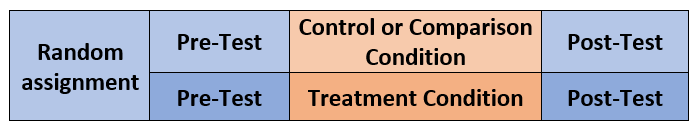
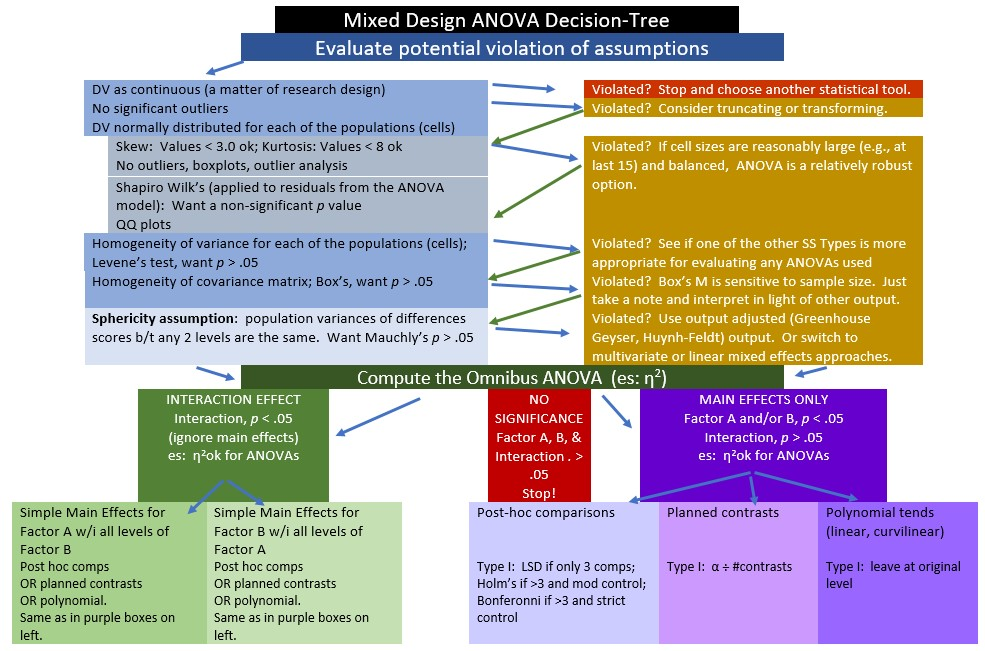
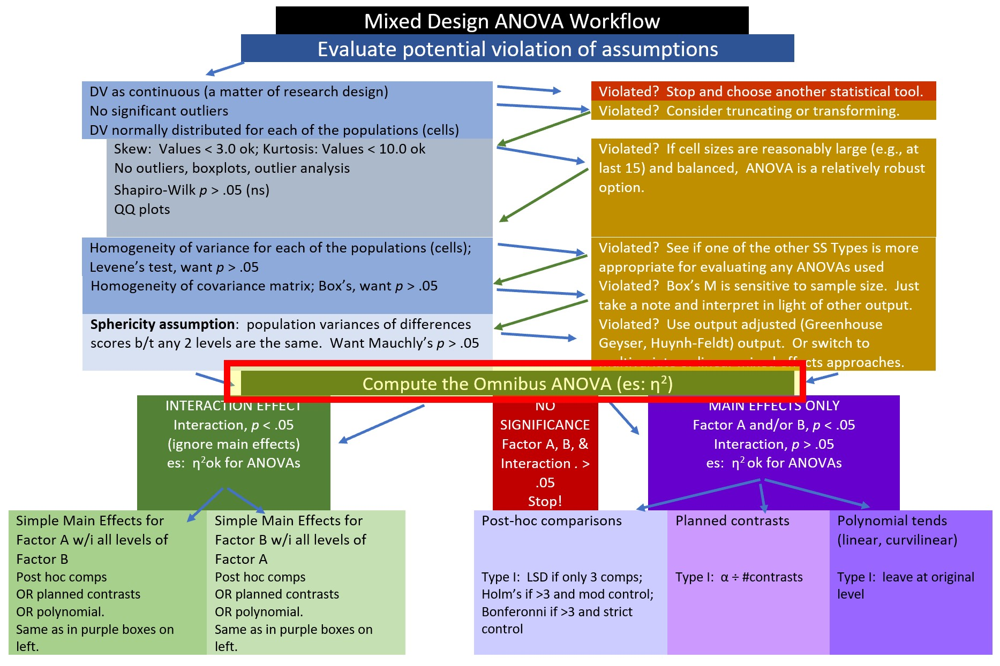
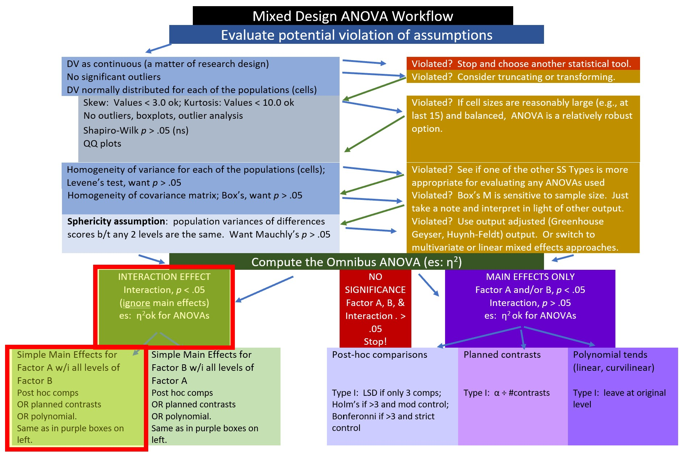
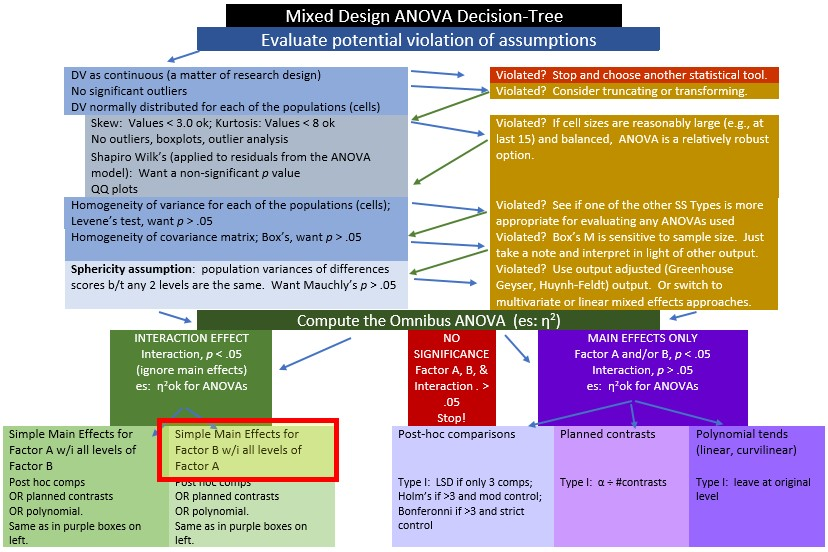
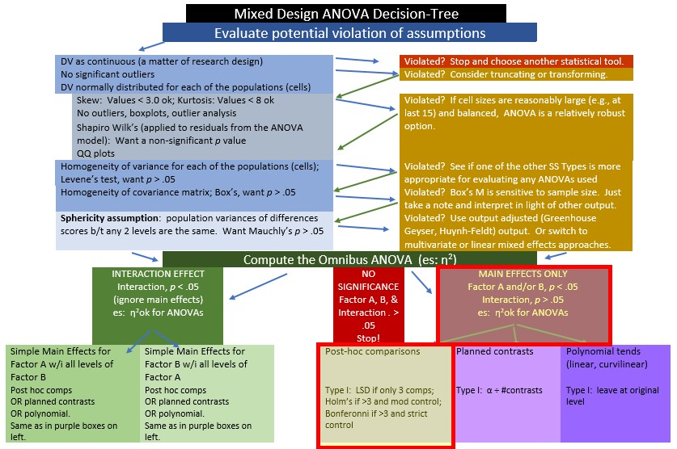

# Mixed Design ANOVA {#Mixed}

 [Screencasted Lecture Link](https://youtube.com/playlist?list=PLtz5cFLQl4KOBGvzZ9QezuAFfthNOh-3B) 
 


The focus of this lecture is mixed design ANOVA. That is, we are conducting a two-way ANOVA where one of the factors is repeated measures and one of the factors is between groups. The mixed design ANOVA is often associated with the random clinical trial (RCT) where the researcher hopes for a significant interaction effect. Specifically, the researcher hopes that the individuals who were randomly assigned to the treatment condition improve from pre-test to post-test and maintain (or continue to improve) after post-test, while the people assigned to the no-treatment control are not statistically significantly different from treatment group at pre-test, and do not improve over time.

## Navigating this Lesson

There is just over one hour of lecture. If you work through the materials with me it would be plan for an additional two hours.

While the majority of R objects and data you will need are created within the R script that sources the chapter, occasionally there are some that cannot be created from within the R framework. Additionally, sometimes links fail. All original materials are provided at the [Github site](https://github.com/lhbikos/ReCenterPsychStats) that hosts the book. More detailed guidelines for ways to access all these materials are provided in the OER's [introduction](#ReCintro)

### Learning Objectives

Learning objectives from this lecture include the following:

* Evaluate the suitability of a research design/question and dataset for conducting a mixed design ANOVA; identify alternatives if the data is not suitable.
* Test the assumptions for mixed design ANOVA.
* Conduct a mixed design ANOVA (omnibus and follow-up) in R.
* Interpret output from the mixed design ANOVA (and follow-up). 
* Prepare an APA style results section of the mixed design ANOVA output.
* Conduct a power analysis for mixed design ANOVA.

### Planning for Practice

In each of these lessons I provide suggestions for practice that allow you to select from problems that vary in degree of difficulty. The least complex is to change the random seed and rework the problem demonstrated in the lesson. The results *should* map onto the ones obtained in the lecture. 

The second option comes from the research vignette. The Murrar and Brauer [-@murrar_entertainment-education_2018] article has three variables (attitudes toward Arabs, attitudes toward Whites, and a difference score) which are suitable for mixed design ANOVAs. I will demonstrate a mixed design ANOVA with the difference score. I'll leave the other two variables for opportunities for practice.

As a third option, you are welcome to use data to which you have access and is suitable for two-way ANOVA. In either case the practice options suggest that you:

* test the statistical assumptions
* conduct a mixed design ANOVA, including
  - omnibus test and effect size
  - report main and interaction effects
  - conduct follow-up testing of simple main effects
* write a results section to include a figure and tables

### Readings & Resources

In preparing this chapter, I drew heavily from the following resource(s). Other resources are cited (when possible, linked) in the text with complete citations in the reference list.

* Mixed ANOVA in R. (n.d.). Datanovia. Retrieved October 19, 2020, from https://www.datanovia.com/en/lessons/mixed-anova-in-r/
  - This website is an excellent guide for mixed design ANOVA and providing explanatory figures of the results. It is a great resource for both the conceptual and procedural. This is the guide I have used for the basis of the lecture. Working through their example would be provide an additional, excellent, opportunity for practice.
* Murrar, S., & Brauer, M. (2018). Entertainment-education effectively reduces prejudice. *Group Processes & Intergroup Relations, 21*(7), 1053–1077. https://doi.org/10.1177/1368430216682350
  - This article is the source of our research vignette. Our vignette is simulated from the first of their two experiments. The authors did not conduct mixed design ANOVA. Instead, they ran independent-samples *t* tests to test the differences between the sitcom conditions for each of the three waves. This is comparable to conducting the simple-main effect analysis of condition within wave subsequent to a significant interaction. 
  - Full-text of the article is available at the [authors' ResearchGate](https://www.researchgate.net/publication/312177602_Entertainment-education_effectively_reduces_prejudice).

### Packages

The packages used in this lesson are embedded in this code. When the hashtags are removed, the script below will (a) check to see if the following packages are installed on your computer and, if not (b) install them.

```r
# will install the package if not already installed
# if(!require(knitr)){install.packages('knitr')}
# if(!require(tidyverse)){install.packages('tidyverse')}
# if(!require(psych)){install.packages('psych')}
# if(!require(ggpubr)){install.packages('ggpubr')}
# if(!require(rstatix)){install.packages('rstatix')}
# if(!require(MASS)){install.packages('MASS')}
# if(!require(effectsize)){install.packages('effectsize')}
# if(!require(WebPower)){install.packages('WebPower')}
```

## Introducing Mixed Design ANOVA

Mixed design ANOVA is characterized by the following:

* at least two independent variables. 
* Termed “mixed” because 
  - one is a between-subjects factor, and 
  - one is a repeated-measures (i.e., within-subjects) factor.
* In essence, we are simultaneously conducting 
  - a one-way independent ANOVA and a 
  - a one-way repeated-measures ANOVA.
  
The illustration below represents the simplest of the mixed ANOVA designs. This 2x2 ANOVA includes random assignment to the between-participants factor. In this case it represents a control (or comparison) condition to a treatment condition. The within-persons factor is pre-test and post-test. 

By increasing the number of between-persons conditions or follow-up assessments, the mixed design ANOVA can quickly become more complex.
  

 
Especially when there is a significant interaction there can be numerous ways to follow up. We will work one set of analyses: simple main effects (condition within wave; wave within condition) and, when needed, conduct posthoc pairwise comparisons as follow-up. Other good options include identifying a priori contrasts and conducting polynomials (not demonstrated in this lecture).

### Workflow for the Mixed Design ANOVA



The steps in working the mixed design generally include,

1. Exploring the data/evaluating the assumptions
2. Evaluating the omnibus test
3. Follow-up to the omnibus
   - if significant interaction effect: simple main effects and further follow-up to those
   - if significant main effect (but no significant interaction effect), identify source of significance in the main effect
   - if no significance, stop
4. Write it up with tables, figure(s)

Assumptions for the mixed design ANOVA include the following:

* The dependent variable should be continuous with no significant outliers in any cell of the design
  - Check by visualizing the data using box plots and by using the *rstatix::identify_outliers()* function
* The DV should be approximately normally distributed in each cell of the design
  - Check with Shapiro-Wilk normality test *rstatix::shapiro_test()* function and with visual inspection by creating Q-Q plots. The *ggpubr::ggqqplot()* function is a great tool.
* The variances of the differences between groups should be equal. This is termed the **sphericity assumption.** This can be checked with Mauchly's test of sphericity, which is reported automatically in the *rstatix::anova_test()* output.

The best way to address violations of these assumptions is not always clear. Possible solutions include:

* For 2- and 3- way ANOVAs, violations of the normality assumption might be addressed by removing extreme outliers or considering transformations of the data. Transformations, though, introduce their own complexities regarding interpretation. Kline's text [@kline_data_2016] provides excellent coverage of options.
* A robust ANOVA option is available in the *WRS2* package
* If there are three or more waves/conditions and the sample is large, it may be possible to run a multilevel, model.
* In the absence of alternatives, it may be necessary to run the mixed design with the violated assumptions, but report them.
* ....and more. Internet searches continue to offer new approaches and alternatives.

## Research Vignette

This lesson's research vignette is from Murrar and Brauer's [-@murrar_entertainment-education_2018] article that describes the results of two studies that evaluated interventions designed to reduce prejudice against Arabs/Muslims. We are working only a portion of the first study reported in the article. Participants (*N* = 193), all who were White, were randomly assigned to one of two conditions where they watched six episodes of the sitcom [*Friends*](http://www.friends-tv.org/) or [*Little Mosque on the Prairie*](https://en.wikipedia.org/wiki/Little_Mosque_on_the_Prairie). The sitcoms and specific episodes were selected after significant pilot testing. The researchers wanted stimuli that were as similar as possible while ensuring that the intervention-oriented sitcom would be capable of reducing prejudice. The authors felt that both series had characters that were likable and relatable and were engaged in regular activities of daily living. The Friends series featured characters who were predominantly White, cisgender, and straight. The Little Mosque series portrayed the experience of Western Muslims and Arabs as they lived in a small Canadian town. This study involved assessment across three waves: baseline (before watching the assigned episodes), post1 (immediately after watching the episodes), and post2 (completed 4-6 weeks after watching the episodes).

The study used *feelings and liking thermometers*, rating their feelings and liking toward 10 different groups of people on a 0 to 100 sliding scale (with higher scores reflecting greater liking and positive feelings). For the purpose of this analysis, the ratings of attitudes toward White people and attitudes toward Arabs/Muslims were used. A third metric was introduced by subtracting the attitudes towards Arabs/Muslims from the attitudes toward Whites. Higher scores indicated more positive attitudes toward Whites where as low scores indicated no difference in attitudes. To recap, there were three potential dependent variables, all continuously scaled:

* *AttWhite*: attitudes toward White people; higher scores reflect greater liking
* *AttArab*: attitudes toward Arab people; higher scores reflect greater liking
* *Diff*: the difference between AttWhite and AttArab; higher scores reflect a greater liking for White people

With random assignment, nearly equal cell sizes, a condition with two levels (Friends, Little Mosque), and three waves (baseline, post1, post2), this is perfect for mixed design ANOVA.


### Data Simulation

Below is the code used to simulate the data. The simulation includes two dependent variables (AttWhite, AttArab), Wave (baseline, post1, post2), and COND (condition; Friends, Little_Mosque). There is also a caseID (repeated three times across the three waves) and rowID (giving each observation within each case an ID). This creates the long-file, where each person has 3 rows of data representing baseline, post1, and post2. You can use this simulation for two of the three practice suggestions.


```r
library(tidyverse)
# change this to any different number (and rerun the simulation) to
# rework the chapter problem
set.seed(210813)
AttWhite <- round(c(rnorm(98, mean = 76.79, sd = 18.55), rnorm(95, mean = 75.37,
    sd = 18.99), rnorm(98, mean = 77.47, sd = 18.95), rnorm(95, mean = 75.81,
    sd = 19.29), rnorm(98, mean = 77.79, sd = 17.25), rnorm(95, mean = 75.89,
    sd = 19.44)), 3)  #sample size, M and SD for each cell; this will put it in a long file
# set upper bound for variable
AttWhite[AttWhite > 100] <- 100
# set lower bound for variable
AttWhite[AttWhite < 0] <- 0
AttArab <- round(c(rnorm(98, mean = 64.11, sd = 20.97), rnorm(95, mean = 64.37,
    sd = 20.03), rnorm(98, mean = 64.16, sd = 21.64), rnorm(95, mean = 70.52,
    sd = 18.55), rnorm(98, mean = 65.29, sd = 19.76), rnorm(95, mean = 70.3,
    sd = 17.98)), 3)
# set upper bound for variable
AttArab[AttArab > 100] <- 100
# set lower bound for variable
AttArab[AttArab < 0] <- 0
rowID <- factor(seq(1, 579))
caseID <- rep((1:193), 3)
Wave <- c(rep("Baseline", 193), rep("Post1", 193), rep("Post2", 193))
COND <- c(rep("Friends", 98), rep("LittleMosque", 95), rep("Friends", 98),
    rep("LittleMosque", 95), rep("Friends", 98), rep("LittleMosque", 95))
# groups the 3 variables into a single df: ID#, DV, condition
Murrar_df <- data.frame(rowID, caseID, Wave, COND, AttArab, AttWhite)
```

Let's check the structure. We want 

* rowID and caseID to be unordered factors
* Wave and COND to be ordered factors
* AttArab and AttWhite to be numerical


```r
str(Murrar_df)
```

```
'data.frame':	579 obs. of  6 variables:
 $ rowID   : Factor w/ 579 levels "1","2","3","4",..: 1 2 3 4 5 6 7 8 9 10 ...
 $ caseID  : int  1 2 3 4 5 6 7 8 9 10 ...
 $ Wave    : chr  "Baseline" "Baseline" "Baseline" "Baseline" ...
 $ COND    : chr  "Friends" "Friends" "Friends" "Friends" ...
 $ AttArab : num  74.3 55.8 33.3 66.3 71 ...
 $ AttWhite: num  100 79 75.9 68.2 100 ...
```
The script below changes

* caseID from integer to factor
* Wave and COND from factor to ordered factors
  - It makes sense to order Friends and LittleMosque, since we believe that LittleMosque contains prejudice-reducing properties

```r
# make caseID a factor
Murrar_df[, "caseID"] <- as.factor(Murrar_df[, "caseID"])
# make Wave an ordered factor
Murrar_df$Wave <- factor(Murrar_df$Wave, levels = c("Baseline", "Post1",
    "Post2"))
# make COND an ordered factor
Murrar_df$COND <- factor(Murrar_df$COND, levels = c("Friends", "LittleMosque"))
```

Let's check the structure again.

```r
str(Murrar_df)
```

```
'data.frame':	579 obs. of  6 variables:
 $ rowID   : Factor w/ 579 levels "1","2","3","4",..: 1 2 3 4 5 6 7 8 9 10 ...
 $ caseID  : Factor w/ 193 levels "1","2","3","4",..: 1 2 3 4 5 6 7 8 9 10 ...
 $ Wave    : Factor w/ 3 levels "Baseline","Post1",..: 1 1 1 1 1 1 1 1 1 1 ...
 $ COND    : Factor w/ 2 levels "Friends","LittleMosque": 1 1 1 1 1 1 1 1 1 1 ...
 $ AttArab : num  74.3 55.8 33.3 66.3 71 ...
 $ AttWhite: num  100 79 75.9 68.2 100 ...
```

A key dependent variable in the Murrar and Brauer [@murrar_entertainment-education_2018] article is *attitude difference*. Specifically, the attitudes toward Arabs score was subtracted from the attitudes toward Whites scores. Higher attitude difference indicate a greater preference for Whites. Let's create that variable, here.


```r
Murrar_df$Diff <- Murrar_df$AttWhite - Murrar_df$AttArab
head(Murrar_df)
```

```
  rowID caseID     Wave    COND AttArab AttWhite    Diff
1     1      1 Baseline Friends  74.291  100.000  25.709
2     2      2 Baseline Friends  55.796   78.977  23.181
3     3      3 Baseline Friends  33.267   75.938  42.671
4     4      4 Baseline Friends  66.315   68.232   1.917
5     5      5 Baseline Friends  70.992  100.000  29.008
6     6      6 Baseline Friends  94.297   77.961 -16.336
```

If you want to export this data as a file to your computer, remove the hashtags to save it (and re-import it) as a .csv ("Excel lite") or .rds (R object) file. This is not a necessary step.

The code for the .rds file will retain the formatting of the variables, but is not easy to view outside of R. This is what I would do.

```r
# to save the df as an .rds (think 'R object') file on your computer;
# it should save in the same file as the .rmd file you are working
# with saveRDS(Murrar_df, 'Murrar_RDS.rds') bring back the simulated
# dat from an .rds file Murrar_df <- readRDS('Murrar_RDS.rds')
```

The code for .csv will likely lose the formatting (i.e., stripping Wave and COND of their ordered factors), but it is easy to view in Excel.

```r
# write the simulated data as a .csv write.table(Murrar_df,
# file='DiffCSV.csv', sep=',', col.names=TRUE, row.names=FALSE) bring
# back the simulated dat from a .csv file Murrar_df <- read.csv
# ('DiffCSV.csv', header = TRUE)
```


### Quick peek at the data
Let's first examine the descriptive statistics (e.g., means of the variable, Negative) by group. We can use the *describeBy()* function from the *psych* package.


```r
Diff.descripts <- psych::describeBy(Diff ~ COND + Wave, mat = TRUE, data = Murrar_df,
    digits = 3)  #digits allows us to round the output
Diff.descripts
```

```
      item       group1   group2 vars  n   mean     sd median trimmed    mad
Diff1    1      Friends Baseline    1 98  9.306 23.909  8.804   8.991 24.481
Diff2    2 LittleMosque Baseline    1 95  9.733 30.519 10.797  10.554 30.905
Diff3    3      Friends    Post1    1 98 15.926 26.418 16.191  16.231 29.771
Diff4    4 LittleMosque    Post1    1 95 -0.149 26.969 -1.280  -0.940 23.932
Diff5    5      Friends    Post2    1 98 11.954 23.336 10.882  11.834 24.592
Diff6    6 LittleMosque    Post2    1 95  3.670 23.665  1.860   3.786 25.261
          min    max   range   skew kurtosis    se
Diff1 -47.342 72.565 119.907  0.176   -0.356 2.415
Diff2 -71.510 90.737 162.247 -0.201   -0.030 3.131
Diff3 -42.598 82.288 124.886 -0.046   -0.575 2.669
Diff4 -65.259 83.367 148.626  0.328    0.549 2.767
Diff5 -46.528 75.014 121.542  0.132    0.065 2.357
Diff6 -53.856 55.264 109.120 -0.065   -0.424 2.428
```

```r
# Note. Recently my students and I have been having intermittent
# struggles with the describeBy function in the psych package. We
# have noticed that it is problematic when using .rds files and when
# using data directly imported from Qualtrics. If you are having
# similar difficulties, try uploading the .csv file and making the
# appropriate formatting changes.
```
First we inspect the means. We see that the baseline scores for the Friends and Little Mosque conditions are similar. However, the post1 and post2 difference scores (i.e., difference in attitudes toward White and Arab individuals, where higher scores indicate more favorable ratings of White individuals) are higher in the Friends condition than in the Little Mosque condition.

The *write.table()* function can be a helpful way to export output to .csv files so that you can manipulate it into tables. 


```r
write.table(Diff.descripts, file = "DiffDescripts.csv", sep = ",", col.names = TRUE,
    row.names = FALSE)
```

At this stage, it would be useful to plot our data. Figures can assist in the conceptualization of the analysis. 


```r
ggpubr::ggboxplot(Murrar_df, x = "Wave", y = "Diff", color = "COND", xlab = "Study Wave",
    ylab = "Difference in Attitudes toward Arab and White People", add = "jitter",
    title = "Difference Scores: Condition within Wave")
```

<!-- -->

Narrating results is sometimes made easier if variables are switched. There is usually not a right or wrong answer. Here is another view, switching the Rater and Photo predictors.


```r
ggpubr::ggboxplot(Murrar_df, x = "COND", y = "Diff", color = "Wave", xlab = "Study Condition",
    ylab = "Difference in Attitudes toward Arab and White People", add = "jitter",
    title = "Difference Scores: Wave within Condition")
```

<!-- -->

Yet another option plots the raw data as bubbles, the means as lines, and denotes differences in the moderator with color.

```r
ggpubr::ggline(Murrar_df, x = "Wave", y = "Diff", color = "COND", xlab = "Study Wave",
    ylab = "Difference in Attitudes toward Arab and White People", add = c("mean_se",
        "dotplot"), title = "Lineplots: Condition within Wave")
```

<!-- -->

```r
# add this for a different color palette: palette = c('#00AFBB',
# '#E7B800')
```
We can reverse this to see if it assists with our conceptualization.

```r
ggpubr::ggline(Murrar_df, x = "COND", y = "Diff", color = "Wave", xlab = "Study Condition",
    ylab = "Difference in Attitudes toward Arab and White People", add = c("mean_se",
        "dotplot"), title = "Lineplots: Wave within Condition")
```

<!-- -->

## Working the Mixed Design ANOVA with R packages

### Exploring data and testing assumptions

We begin the 2x3 mixed design ANOVA with a preliminary exploration of the data and testing of the assumptions. Here's where we are on the workflow:


The are several critical assumptions in factorial ANOVA:

* Cases represent random samples from the populations 
  - This is an issue of research design
  - Although we see ANOVA used (often incorrectly) in other settings, ANOVA was really designed for the random clinical trial (RCT).
* The DV is continuously scaled (i.e., assessed on an interval or ratio scale); this is a matter of research design.
* The DV is normally distributed for each of the populations
  - that is, data for each cell (representing the combinations of each factor) is normally distributed.
* Population variances of the DV are the same for all cells (i.e., homogeneity of variance assumption)
  - When cell sizes are not equal, ANOVA not robust to this violation and we cannot trust *F* ratio.
* If the repeated measures factor has three or more levels the population variance of difference scores computed between any two levels of a within-subjects factor is the same value regardless of which two levels are chosen; termed the **sphericity assumption**. This assumption is
  - akin to compound symmetry (both variances across conditions are equal).
  - akin to the homogeneity of variance assumption in between-group designs. 
  - sometimes called the homogeneity-of-variance-of-differences assumption. 
  - statistically evaluated with *Mauchly's test.* If Mauchly's *p* < .05, there are statistically significant differences. The *anova_test()* function in the *rstatix* package reports Mauchly's and two alternatives to the traditional *F* that correct the values by the degree to which the sphericity assumption is violated. 
* The covariance matrix of the DV is the same for all levels of the between-subjects factors (i.e., homogeneity of covariance matrix).

#### Is the dependent variable normally distributed?

##### Are skew and kurtosis levels concerning? 

Our analysis will use the difference score (Diff) as the dependent variable. Let's inspect values of skew and kurtosis for this variable in its combinations of wave and condition.


```r
psych::describeBy(Diff ~ Wave + COND, data = Murrar_df, type = 1, mat = TRUE)
```

```
      item   group1       group2 vars  n       mean       sd median    trimmed
Diff1    1 Baseline      Friends    1 98  9.3064898 23.90867  8.804  8.9906625
Diff2    2    Post1      Friends    1 98 15.9261327 26.41789 16.191 16.2309375
Diff3    3    Post2      Friends    1 98 11.9540102 23.33602 10.882 11.8340000
Diff4    4 Baseline LittleMosque    1 95  9.7331158 30.51895 10.797 10.5544156
Diff5    5    Post1 LittleMosque    1 95 -0.1486632 26.96858 -1.280 -0.9402727
Diff6    6    Post2 LittleMosque    1 95  3.6704737 23.66524  1.860  3.7857403
           mad     min    max   range        skew    kurtosis       se
Diff1 24.48143 -47.342 72.565 119.907  0.17873477 -0.30140294 2.415140
Diff2 29.77135 -42.598 82.288 124.886 -0.04684904 -0.52430090 2.668609
Diff3 24.59189 -46.528 75.014 121.542  0.13445276  0.12837311 2.357294
Diff4 30.90480 -71.510 90.737 162.247 -0.20457520  0.03318234 3.131178
Diff5 23.93213 -65.259 83.367 148.626  0.33344683  0.62510747 2.766918
Diff6 25.26054 -53.856 55.264 109.120 -0.06578811 -0.36855661 2.428002
```

```r
# Note. Recently my students and I have been having intermittent
# struggles with the describeBy function in the psych package. We
# have noticed that it is problematic when using .rds files and when
# using data directly imported from Qualtrics. If you are having
# similar difficulties, try uploading the .csv file and making the
# appropriate formatting changes.
```

Our values of skew and kurtosis are well within the limits [@kline_data_2016] of a normal distribution.

* skew: < |3|; the highest skew value in our data is 0.32
* kurtosis: < |10|; the highest kurtosis value in our data is |.57|

##### Are the model residuals normally distributed?

We can formally investigate the normality assumption with the Shapiro-Wilk test. In the case of multiple factors (such as is the case in mixed design ANOVA), the assumption requires a normal distribution in each combination of these levels (e.g., difference scores at baseline for participants in the Friends condition). In this lesson's 3 x 2 ANOVA, there are six such combinations. A cell-level analysis (i.e., testing for normal distributions within each combination of factor levels) has been demonstrated in [one-way ANOVA](#oneway) and independent [t-test](#tIndSample) lessons. To the degree that there are many factorial combinations (and therefore, cells), this approach becomes unwieldy to calculate, interpret, and report. Further, the cell-level analysis of normality is only appropriate when there are a low number of levels/groupings and there are many data points per group. As designs increase in complexity, researchers turn to the model-based option for assessing normality. 

To do this, we first create an object that tests our research model. Because the model-based approach to calculating the Shapiro-Wilk test of normality requires an object created by the *aov()* function from base R, I will quickly run this. For the moment, we will only peek at the ANOVA results to make sure it ran, but will save the interpretation until later. 


```r
Mixed_diff <- aov(Diff ~ COND * Wave, Murrar_df)
summary(Mixed_diff)
```

```
             Df Sum Sq Mean Sq F value   Pr(>F)    
COND          1   9209    9209  13.723 0.000232 ***
Wave          2    320     160   0.238 0.788240    
COND:Wave     2   6574    3287   4.898 0.007774 ** 
Residuals   573 384530     671                     
---
Signif. codes:  0 '***' 0.001 '**' 0.01 '*' 0.05 '.' 0.1 ' ' 1
```
From this object we can extract the residuals.


```r
# creates object of residuals
resid_Diff <- residuals(Mixed_diff)
```

We can visually inspect the distribution of the residuals with a couple of plots.


```r
hist(resid_Diff)
```

<!-- -->
So far so good -- our distribution of *residuals* (i.e., what is leftover after the model is applied) resembles a normal distribution.

The Q-Q plot provides another view. The dots represent the residuals. When they are relatively close to the line they not only suggest good fit of the model, but we know they are small and evenly distributed around zero (i.e., normally distributed). 


```r
qqnorm(resid_Diff)
```

<!-- -->

Finally, we can formally evaluate whether or not the distribution of residuals is statistically significantly different from a normal distribution with a Shapiro test. We want the associated *p* value to be greater than 0.05.

```r
shapiro.test(resid_Diff)
```

```

	Shapiro-Wilk normality test

data:  resid_Diff
W = 0.99869, p-value = 0.9526
```
The non-significant *p* value indicates that the distribution of our model residuals are not statistically significantly different from a normal distribution ($W = 0.999, p = 0.953$).
 

##### Is there evidence of outliers?

The boxplot is one common way for identifying outliers. The boxplot uses the median and the lower (25th percentile) and upper (75th percentile) quartiles. The difference bewteen Q3 and Q1 is the *interquartile range* (IQR). Let's revisit one of our boxplots to see if there are any dots above the whiskers.


```r
ggpubr::ggboxplot(Murrar_df, x = "COND", y = "Diff", color = "Wave", xlab = "Study Condition",
    ylab = "Difference in Attitudes toward Arab and White People", add = "jitter",
    title = "Difference Scores: Wave within Condition")
```

<!-- -->

The distributions look relatively normal with the mean well-centered. Given that we simulated the data from means and standard deviations, this is somewhat expected. 

Outliers are generally identified when values fall outside these lower and upper boundaries. In the short formulas below, IQR is the *interquartile range* (i.e., the middle 50%, the distance of the box):

* Q1 - 1.5xIQR
* Q3 + 1.5xIQR

Extreme values occur when values fall outside these boundaries:

* Q1 - 3xIQR
* Q3 + 3xIQR

Using the *rstatix::identify_outliers* function we can identifier outliers, doubly grouped by our predictor variables.

```r
Murrar_df %>%
    group_by(Wave, COND) %>%
    rstatix::identify_outliers(Diff)
```

```
# A tibble: 4 × 9
  Wave     COND        rowID caseID AttArab AttWhite  Diff is.outlier is.extreme
  <fct>    <fct>       <fct> <fct>    <dbl>    <dbl> <dbl> <lgl>      <lgl>     
1 Baseline LittleMosq… 107   107      100       28.5 -71.5 TRUE       FALSE     
2 Post1    LittleMosq… 297   104       16.6    100    83.4 TRUE       FALSE     
3 Post1    LittleMosq… 315   122       26.8    100    73.2 TRUE       FALSE     
4 Post1    LittleMosq… 337   144       97.4     32.2 -65.3 TRUE       FALSE     
```
While we have some outliers (where "is.outlier" = "TRUE"), none are extreme (where "is.outlier" = "FALSE"). We'll keep these in mind as we continue to evaluate the data.

If I had extreme outliers, I would individually inspect them. Especially if something looked awry (e.g., erratic responding extreme scores across variables) I might consider deleting them. In this mixed design ANOVA, a case will only be included in the final analysis if all three waves of data are present. Therefore, if we decided to remove case at rowID = 337, we would need to remove all three cases. That is, we would need to remove it by caseID = 144. This would decrease the number of rows/observations by 3.

Let's say that, after very careful consideration, we decided to remove the caseID = 144. We could use *dplyr::filter()* to do so. In this code, the *filter()* function locates all the cases where caseID = 144. The exclamation point that precedes the equal sign indicates that the purpose is to remove the case. 


```r
# Murrar_df <- dplyr::filter (Murrar_df, caseID != '144')
```

Once executed, we can see that this case is no longer in the dataframe. Because each person had three observations, this reduces the number of observations by 3. Although I demonstrated this in the accompanying lecture, I have hashtagged out the command because I would not delete the case. If you already deleted the case, you can return the hashtag and re-run all the code up to this point.

#### Homogeneity of variance assumption

Because there is a between-subjects variable, we need need to evaluate the homogeneity of variance assumption. As before, we can use the Levene's test with the *rstatix::levene_test()* function. Considering each of the comparisons of condition within wave, there is no instance where we violate the assumption.


```r
Murrar_df %>%
    group_by(Wave) %>%
    rstatix::levene_test(Diff ~ COND)
```

```
# A tibble: 3 × 5
  Wave       df1   df2 statistic      p
  <fct>    <int> <int>     <dbl>  <dbl>
1 Baseline     1   191     3.97  0.0477
2 Post1        1   191     0.141 0.708 
3 Post2        1   191     0.107 0.744 
```
Levene's test indicated a violation of this assumption between the Friends and Little Mosque conditions at baseline ($F[1, 191] = 3.973, p = .047$). However, there was no indication of assumption violation at post1 ($F[1, 191] = 0.141, p = .708$), and post2 ($F[1, 191] = 0.107, p = .743$) waves of the design.

#### Assumption of homogeneity of covariance matrices

In this multivariate sample, the Box's M test evaluates if two or more covariance matrices are homogeneous. Like other tests of assumptions, we want a non-significant test result (i.e., where *p* > .05). Box's M has some disavantages. Box's M has low power in small sample sizes and is overly sensitive in large sample sizes. We would unlikely make a decision about our data with Box's M alone. Rather, we consider it along with our dashboard of diagnostic screeners.


```r
rstatix::box_m(Murrar_df[, "Diff", drop = FALSE], Murrar_df$COND)
```

```
# A tibble: 1 × 4
  statistic p.value parameter method                                            
      <dbl>   <dbl>     <dbl> <chr>                                             
1      3.21  0.0732         1 Box's M-test for Homogeneity of Covariance Matric…
```
Box's M indicated no violation of the homogeneity of covariance matrices assumption $(M = 3.209, p = .073)$.

#### APA style writeup of assumptions

At this stage we are ready to draft the portion of the APA style writeup that evaluates the assumptions.

>Mixed design ANOVA has a number of assumptions related to both the within-subjects and between-subjects elements. Data are expected to be normally distributed at each level of design. There was no evidence of skew (all values were at or below the absolute value of 0.32) or kurtosis (all values were below the absolute value of .55; [@kline_data_2016]). Similarly, results of the Shapiro-Wilk normality test (applied to the residuals from the factorial ANOVA model) suggested that model residuals did not differ significantly from a normal distribution ($W = 0.999, p = 0.953$). Visual inspection of boxplots for each wave of the design, assisted by the *rstatix::identify_outliers()* function (which reports values above Q3 + 1.5xIQR or below Q1 - 1.5xIQR, where IQR is the interquartile range) indicated some outliers, but none at the extreme level. Because of the between-subjects aspect of the design, the homogeneity of variance assumption was evaluated. Levene's test indicated a violation of this assumption between the Friends and Little Mosque conditions at baseline ($F[1, 191] = 3.973, p = .047$). However, there was no indication of assumption violation at post1 ($F[1, 191] = 0.141, p = .708$), and post2 ($F[1, 191] = 0.107, p = .743$) waves of the design. Further, Box's M-test (*M* = 3.209, *p* = .073) indicated no violation of the homogeneity of covariance matrices. *LATER WE WILL ADD INFORMATION ABOUT THE SPHERICITY ASSUMPTION.*


### Omnibus ANOVA

Having evaluated the assumptions (excepting sphericity) we are ready to move to the evaluation of the omnibus ANOVA. This next step produces both the omnibus test as well as testing the sphericity assumption. Conceptually, evaluating the sphericity assumption precedes the omnibus; procedurally these are evaluated simultaneously. The figure also reflects that decisions related to follow-up are dependent upon the significance of the main and omnibus effects.



The *rstatix* package is a wrapper for the *car* package. Authors of *wrappers* attempt to streamline a more complex program to simplify the input needed and maximize the output produced for the typical use-cases.

If we are ever confused about a function, we can place a question mark in front of it. It will summons information and, if the package is in our library, let us know to which package it belongs and open the instructions that are embedded in R/R Studio.


```r
#?anova_test
```

In the code below the identification of the data, DV, between, and within variables are likely to be intuitive. The within-subjects identifier (*wid*) is the person-level ID that assists the statistic in controlling for the dependency introduced by the repeated-measures factor.


```r
# Murrar_df is our df, Diff is our df, wid is the caseID between is
# the between-subjects variable, within is the within subjects
# variable
Diff_2way <- rstatix::anova_test(data = Murrar_df, dv = Diff, wid = caseID,
    between = COND, within = Wave, detailed = TRUE)
Diff_2way
```

```
ANOVA Table (type III tests)

$ANOVA
       Effect DFn DFd       SSn      SSd      F              p p<.05      ges
1 (Intercept)   1 191 40911.756 133769.4 58.415 0.000000000001     * 0.096000
2        COND   1 191  9209.127 133769.4 13.149 0.000369000000     * 0.023000
3        Wave   2 382   359.022 250761.1  0.273 0.761000000000       0.000933
4   COND:Wave   2 382  6574.365 250761.1  5.008 0.007000000000     * 0.017000

$`Mauchly's Test for Sphericity`
     Effect    W     p p<.05
1      Wave 0.99 0.369      
2 COND:Wave 0.99 0.369      

$`Sphericity Corrections`
     Effect  GGe       DF[GG] p[GG] p[GG]<.05 HFe DF[HF] p[HF] p[HF]<.05
1      Wave 0.99 1.98, 378.06 0.759             1 2, 382 0.761          
2 COND:Wave 0.99 1.98, 378.06 0.007         *   1 2, 382 0.007         *
```

#### Checking the sphericity assumption

We continue our evaluation of statistical assumptions by examining the Mauchly's test for sphericity. Fortunately, the Mauchly's is included with the results of the omnibus ANVOA. The sphericity assumption becomes important when there are three or more levels in the repeated measures factor. The assumption requires that the variance of difference scores computed between any two levels of a within-subjects factor is the same value regardless of which two levels are chosen. As with so many of our statistical tests of assumptions, we want the *p* value to be > .05.

Mauchly's test (in the middle of the output) reports the result. Because our Wave variable has three levels and appears in the main and interaction effects. The results are identical and we didn't violate the sphericity assumption. 

* main effect for Wave: $W = .99, p = .369$
* interaction effect for COND:Wave: $W = .99, p = .369$

We will be able to add this statement to our assumptions write-up: 

>Mauchly's test indicated no violation of the sphericity assumption for the main ($W = .99, p = .369$) and interaction ($W = .99, p = .369$) effects. 

If the *p* vaue associated with Mauchly's test had been less than .05, we could have used one of the two options (Greenhouse Geyser/GGe or Huynh-Feldt/HFe). In each of these an epsilon value provides an adjustment to the degrees of freedom used in the estimation of the *p* value. 

When there are concerns about sphericity violations, there is also a multivariate approach that does not require the assumption of sphericity. The *rstatix* package does include this analysis. There is also an option to use a multivariate approach when ANOVA designs include a repeated measures factor. In the [appendix](#RMmultiv), I included an example of the multivariate approach with a one-way repeated measures design using with the *car* package.

#### Interpreting the omnibus results

We are interested in the output reported in rows 2, 3, 4. These include the:

* main effect for condition: $F(1, 191) = 13.149, p < .001, \eta^{2} = 0.023$
* main effect for wave: $F(2, 382) = 0.273, p = .761, \eta^{2} = 0.001$
* condition:wave interaction effect: $F(2, 382) = 5.008, p = 0.007, \eta^{2} = 0.017$

>Results of the omnibus ANOVA indicated a significant main effect for condition $(F[1, 191] = 13.149, p < .001, \eta^{2} = 0.023)$, a non-significant main effect for wave $(F[2, 382] = 0.273, p = .761, \eta^{2} = 0.001)$, and a significant interaction effect $(F[2, 382] = 5.008, p = 0.007, \eta^{2} = 0.017)$. 

In the output, the column labeled "ges" provides the value for the effect size, $\eta^{2}$. Recall that *eta-squared* is one of the most commonly used measures of effect. It refers to the proportion of variability in the dependent variable/outcome that can be explained in terms of the independent variable/predictor. Conventionally, values of .01, .06, and .14 are considered to be small, medium, and large effect sizes, respectively. 

You may see different values (.02, .13, .26) offered as small, medium, and large -- these values are used when multiple regression is used. A useful summary of effect sizes, guide to interpreting their magnitudes, and common usage can be found [here](https://imaging.mrc-cbu.cam.ac.uk/statswiki/FAQ/effectSize) [@watson_rules_2020].

With a significant interaction effect, we would focus on interpreting one or both of the simple main effects. Let's first look at the simple main effect of condition within wave option.

### Follow-up to Omnibus Tests

#### Planning for the management of Type I error

Controlling for Type I error can depend, in part, on the design of the follow-up tests that are planned, and the number of pairwise comparisons that follow.

In the first option, the examination of the simple main effect of condition within wave results in only three pairwise comparisons. In this case, I will use the traditional Bonferroni. Why? Because there are only three post omnibus analyses and the traditional Bonferroni's more restrictive control is less likely to be problematic.

In the second option, the examination of the simple main effect of wave within condition results in the potential comparison of nine pairwise comparisons. If we used a traditional Bonferroni and divided .05/6, the *p* value for each comparison would need to be less than 0.008. Most would agree that this is too restrictive.


```r
.05/6
```

```
[1] 0.008333333
```

The Holm's sequential Bonferroni [@green_using_2017] offers a middle-of-the-road approach (not as strict as .05/6 with the traditional Bonferroni; not as lenient as "none") to managing Type I error. 

If we were to hand-calculate the Holm's, we would rank order the *p* values associated with the 6 comparisons in order from lowest (e.g., 0.016) to highest (e.g., 1.000). The first *p* value is evaluated with the most strict criterion (.05/6; the traditional Bonferroni approach). Then, each successive comparison calculates the *p* value by using the number of *remaining* comparisons as the denominator (e.g., .05/5, .05/4, .05/3). As the *p* values increase and the alpha levels relax, there will be a cut-point where remaining comparisons are not statistically significant. 

Luckily, most R packages offer the Holm's sequential Bonferroni as an option. The algorithm in the package rearranges the mathematical formula and produces a *p* value that we can interpret according to the traditional values of $p < .05, p < .01$ and $p < .001$. I will demonstrate use of Holm's in the examination of the simple main effect of ethnicity of rater within photo stimulus.

### Simple main effect of condition within wave

The figure reflects our path in the workflow. In the presence of a significant interaction effect we could choose from a variety of follow-up tests. 



If we take this option we follow up with three *t*-tests. Why? Because within each wave (the repeated measures factor), there are two conditions. Statistically, we could use one-way ANOVAs, however, using the *rstatix::t_test* function will allow us to map statistically significant differences on a subsequent figure.  Here are the comparisons:

* comparison of Friends and Little Mosque within the baseline wave
* comparison of Friends and Little Mosque within the post1 wave
* comparison of Friends and Little Mosque within the post2 wave

We will control for Type I error by requesting the traditional Bonferroni. 

Note that the function is *rstatix::t_test*. Recall that *t*-tests can be for independent samples or paired samples. The *rstatix::t_test* is for independent samples and therefore appropriate for comparing the Friends to LittleMosque conditions (from the between-groups factor, COND).

Finally, I have also specified *detailed=TRUE*. This permits me to see the means (i.e., estimate and estimate 1) for the Friends and Little Mosque conditions, the sample sizes for each (i.e., n1, n2), the confidence interval around the true difference between the means (i.e, conf.low, conf.high), and  that we used a two-sided *t*-test.


```r
SimpleWave <- Murrar_df %>%
    group_by(Wave) %>%
    rstatix::t_test(Diff ~ COND, detailed = TRUE, p.adjust.method = "bonferroni") %>%
    rstatix::add_significance()
# rstatix::adjust_pvalue(method = 'bonferroni') #this displays the
# adjusted Bonferroni values
SimpleWave
```

```
# A tibble: 3 × 17
  Wave    estimate estimate1 estimate2 .y.   group1 group2    n1    n2 statistic
  <fct>      <dbl>     <dbl>     <dbl> <chr> <chr>  <chr>  <int> <int>     <dbl>
1 Baseli…   -0.427      9.31     9.73  Diff  Frien… Littl…    98    95    -0.108
2 Post1     16.1       15.9     -0.149 Diff  Frien… Littl…    98    95     4.18 
3 Post2      8.28      12.0      3.67  Diff  Frien… Littl…    98    95     2.45 
# ℹ 7 more variables: p <dbl>, df <dbl>, conf.low <dbl>, conf.high <dbl>,
#   method <chr>, alternative <chr>, p.signif <chr>
```

We can begin to assemble the results. At each wave we are comparing the Friends and Little Mosque conditions. 

Baseline: $t(178.04) = -0.108, p = 0.914$
Post1: $t(190.49) = 4.182, p < 0.001$
Post2: $t(190.61) = 2.448, p = 0.015$

You might wonder about effect sizes. The *rstatix::pairwise_t_test* does not produce any. A commonly used effect size for *t* tests is the Cohen's *d*. This gives the degree to which means differ in the metric of standard deviations. Values of .02, .05, and .08 are interpreted as small, moderate, and large, respectively.  We can use *rstatix::cohens_d*. A helpful feature of this function is that interpretive language is provided.


```r
SimpleWave_d <- Murrar_df %>%
    group_by(Wave) %>%
    rstatix::cohens_d(Diff ~ COND)
SimpleWave_d
```

```
# A tibble: 3 × 8
  .y.   group1  group2       effsize Wave        n1    n2 magnitude 
* <chr> <chr>   <chr>          <dbl> <fct>    <int> <int> <ord>     
1 Diff  Friends LittleMosque -0.0156 Baseline    98    95 negligible
2 Diff  Friends LittleMosque  0.602  Post1       98    95 moderate  
3 Diff  Friends LittleMosque  0.352  Post2       98    95 small     
```
We can update our *t* strings with this information.

Baseline: $t(178.04) = -0.108, p = 0.914, d = -0.016$
Post1: $t(190.49) = 4.182, p < 0.001, d = 0.602$
Post2: $t(190.61) = 2.448, p = 0.015, d = 0.352$

Producing a figure can be helpful in conceptualizing what we have first done. Because we used the *rstatix* functions, we can easily integrate them into our *ggpubr::ggboxplot()*. Let's re-run the version of the boxplot where "Wave" is on the x-axis (and, is therefore our grouping variable). Because I want the data to be as true-to-scale as possible, I have added the full, potential, range of the y axis through the *ylim* argument. In order to update the ggboxplot, we will need to save it as an option. My object name represents the "Condition within Wave" simple main effect. 


```r
# Although we have used this code this before, I respecified the
# basic figure here.
CNDwiWV <- ggpubr::ggboxplot(Murrar_df, x = "Wave", y = "Diff", color = "COND",
    xlab = "Study Wave", ylab = "Difference in Attitudes toward Arab and White People",
    add = "jitter", ylim = c(-100, 100), title = "Difference Scores: Condition within Wave")

# This updates the SimpleWave object (which holds the t-tests) to
# include plotting information about the xy positions
SimpleWave <- SimpleWave %>%
    rstatix::add_xy_position(x = "Wave")
# SimpleWave #unhashtag if you want to see the plotting information

# Now we update the figure to include the significance bars and stars
# label = 'p.adj.signif' points to the values in the rstatix output
# from the pairwise_t_test tip.length is the amount of downward
# pointing on the lines that hold the p-values hide.ns=TRUE
# suppresses a bar over non-significant comparisons y.position
# adjusts the significance bars up and down, I pushed them up
CNDwiWV <- CNDwiWV + ggpubr::stat_pvalue_manual(SimpleWave, label = "p.signif",
    tip.length = 0.02, hide.ns = TRUE, y.position = c(95, 88))
CNDwiWV
```

<!-- -->

If we were to write up this simple main effect of condition within wave:

>We followed the significant interaction effect with an evaluation of simple main effects of condition within wave. A traditional Bonferroni was used to manage Type I error [@green_using_2017]. There was a non-statistically significant difference between conditions at baseline $(t[178.04] = -0.108, p = 0.914, d = -0.016)$ However there were statistically significant differences at post1 $(t[190.49] = 4.182, p < 0.001, d = 0.602)$ and post2 $t[190.61] = 2.448, p = 0.015, d = 0.352$. We note that the effect size at post1 approached a moderate size; the effect size at post2 was small.


### Simple main effect of wave within condition

Alternatively, we could evaluate the simple main effect of wave within condition. The figure reflects our path along the workflow.



Because there are three waves within each condition, would start with two one-way ANOVAs and then follow each of those with pairwise comparisons. First, the one-way repeated measures ANOVAs:

* comparison of baseline, post1, and post2 within the Friends condition
* comparison of baseline, post1, and post2 within the Little Mosque condition


```r
SimpleCond <- Murrar_df %>%
    group_by(COND) %>%
    rstatix::anova_test(dv = Diff, wid = caseID, within = Wave) %>%
    rstatix::get_anova_table() %>%
    rstatix::adjust_pvalue(method = "none")
SimpleCond
```

```
# A tibble: 2 × 9
  COND         Effect   DFn   DFd     F     p `p<.05`   ges p.adj
  <fct>        <chr>  <dbl> <dbl> <dbl> <dbl> <chr>   <dbl> <dbl>
1 Friends      Wave       2   194  1.76 0.175 ""      0.012 0.175
2 LittleMosque Wave       2   188  3.39 0.036 "*"     0.022 0.036
```

Below are the *F* strings for the one-way ANOVAs the followed the omnibus, mixed design, ANOVA:

* Friends: *F* (2, 194) = 1.759, *p* = 0.175, $\eta^{2}$ = 0.012 (effect size indicates a small effect)
* Little Mosque: *F* (2, 188) = 3.392, *p* = 0.036, $\eta^{2}$ = 0.072 (a moderate effect size)

Because each of these one-way ANOVAs has three levels, we need to follow with pairwise comparisons. However, because the oneway repeated measures ANOVA was non-significant for the Friends condition, we only need to report them for the Little Mosque condition. As you can see we generally work our way down to comparing chunks to each other to find the source(s) of significant differences.

You will notice that we are saving the results of the pairwise comparisons as an object. This allows us to update the object in combination with the boxplot we created earlier. 

Note that in this follow-up, once we have arrived at the level of paired comparisons, we are using  *rstatix::pairwise_t_test*. Because wave (within condition) is repeated measures, we including the command, *paired = TRUE*.

In order to manage Type I error, I have specified "holm." The Holm's sequential Bonferroni offers a middle-of-the-road approach (not as strict as .05/6 with the traditional Bonferroni; not as lenient as "none") to managing Type I error. 


```r
pwcWVwiGP <- Murrar_df %>%
    group_by(COND) %>%
    rstatix::pairwise_t_test(Diff ~ Wave, paired = TRUE, detailed = TRUE,
        p.adjust.method = "holm")  #%>%
# select(-df, -statistic, -p) # Remove details
pwcWVwiGP
```

```
# A tibble: 6 × 16
  COND   estimate .y.   group1 group2    n1    n2 statistic     p    df conf.low
* <fct>     <dbl> <chr> <chr>  <chr>  <int> <int>     <dbl> <dbl> <dbl>    <dbl>
1 Frien…    -6.62 Diff  Basel… Post1     98    98    -1.80  0.075    97   -13.9 
2 Frien…    -2.65 Diff  Basel… Post2     98    98    -0.793 0.43     97    -9.27
3 Frien…     3.97 Diff  Post1  Post2     98    98     1.09  0.276    97    -3.23
4 Littl…     9.88 Diff  Basel… Post1     95    95     2.45  0.016    94     1.86
5 Littl…     6.06 Diff  Basel… Post2     95    95     1.62  0.108    94    -1.36
6 Littl…    -3.82 Diff  Post1  Post2     95    95    -1.03  0.304    94   -11.2 
# ℹ 5 more variables: conf.high <dbl>, method <chr>, alternative <chr>,
#   p.adj <dbl>, p.adj.signif <chr>
```

Consistent with the non-significant one-way repeated measures ANOVA, there were non-significant pairwise comparisons for the Friends condition.

Within the Little Mosque condition, we find a significant difference between baseline and post1 (*t*[94] = 2.447, *p* = .049), but non-significant differences between baseline and post2 (*t*[94] = 1.621, *p* = .216) and post1 and post2 (*t*[94] = -1.034, *p* = .304)

We can use *rstatix::cohens_d* to calculate effect sizes. In the metric of standard deviation units, values of .02, .05, and .08 are interpreted as small, moderate, and large, respectively.  


```r
pwcWVwiGP_d <- Murrar_df %>% 
  group_by(COND) %>% 
  rstatix::cohens_d(Diff~Wave)
pwcWVwiGP_d 
```

```
# A tibble: 6 × 8
  .y.   group1   group2 effsize COND            n1    n2 magnitude 
* <chr> <chr>    <chr>    <dbl> <fct>        <int> <int> <ord>     
1 Diff  Baseline Post1   -0.263 Friends         98    98 small     
2 Diff  Baseline Post2   -0.112 Friends         98    98 negligible
3 Diff  Post1    Post2    0.159 Friends         98    98 negligible
4 Diff  Baseline Post1    0.343 LittleMosque    95    95 small     
5 Diff  Baseline Post2    0.222 LittleMosque    95    95 small     
6 Diff  Post1    Post2   -0.151 LittleMosque    95    95 negligible
```
We can update our *t* strings with this information. That is, within the Little Mosque condition: .

Baseline versus post1: *t*(94) = 2.447, *p* = .049, *d* = 0.343), 
Baseline versus post2:*t*(94) = 1.621, *p* = .216, *d* = 0.222), and 
Post1 versus post2: (*t*(94) = -1.034, *p* = .304, *d* = -0.150)

Let's create a figure to illustrate what we've just learned.


```r
# We ran this before -- grabbing again to make it clear how creating
# and updating the boxplot works
WVwiCND <- ggpubr::ggboxplot(Murrar_df, x = "COND", y = "Diff", color = "Wave",
    xlab = "Study Condition", ylim = c(-100, 100), ylab = "Difference in Attitudes toward Arab and White People",
    add = "jitter", title = "Difference Scores: Wave within Condition")
# WVwiCND

# This updates the pwcWVwiGP object (which holds the t-tests) to
# include plotting information about the xy positions
pwcWVwiGP <- pwcWVwiGP %>%
    rstatix::add_xy_position(x = "COND")
# pwcWVwiGP Diff_2way was my omnibus ANOVA object
WVwiCND <- WVwiCND + ggpubr::stat_pvalue_manual(pwcWVwiGP, label = "p.adj.signif",
    tip.length = 0.02, hide.ns = TRUE, y.position = c(100))
WVwiCND
```

<!-- -->

If we were to write up this result:

>We followed the significant interaction effect with an evaluation of simple main effects of wave within condition. There were non-significant difference within the Friends condition $(F [2, 194] = 1.759, p = 0.175, \eta^{2} = 0.012)$. There were significant differences with an effect size indicating a moderate effect in the Little Mosque condition $(F[2, 188] = 3.392, p = 0.036, \eta^{2} = 0.072)$. We followed up the significant simple main effect for with pairwiwse comparisons. At this level we controlled for Type I error with the Holm's sequential Bonferroni [@green_using_2017]. Within the Little Mosque condition, we found a significant difference between baseline and post1 $(t[94] = 2.447, p = .049, d = 0.343)$, but non-significant differences between baseline and post2 $(t[94] = 1.621, p = .216, d = 0.222)$ and post1 and post2 $(t[94] -1.034, p = .304, d = -0.150)$.


### If we only had a main effect

When there is an interaction effect, we do not interpret main effects. This is because the solution is more complicated than a main effect could explain. It is important, though, to know how to interpret a main effect. We would do this if we had one or more significant main effects and no interaction effect.

The figure shows our place on the workflow.



If we had not had a significant interaction, but did have a significant main effect for wave, we could have conducted pairwise comparisons for pre, post1, and post2 -- collapsing across condition.

```r
pwcMain <- Murrar_df %>%
    rstatix::pairwise_t_test(Diff ~ Wave, paired = TRUE, p.adjust.method = "bonferroni")
pwcMain
```

```
# A tibble: 3 × 10
  .y.   group1   group2    n1    n2 statistic    df     p p.adj p.adj.signif
* <chr> <chr>    <chr>  <int> <int>     <dbl> <dbl> <dbl> <dbl> <chr>       
1 Diff  Baseline Post1    193   193    0.539    192 0.59      1 ns          
2 Diff  Baseline Post2    193   193    0.652    192 0.515     1 ns          
3 Diff  Post1    Post2    193   193    0.0528   192 0.958     1 ns          
```
Ignoring condition (Friends, Little Mosque), we do not see changes across time. This is not surprising since the *F* test for the main effect was also non-significant $(F[2, 382] = 0.273, p = .761, \eta^{2} = 0.0014)$, 

If we had had a non-significant interaction effect but a significant main effect for condition, there would have been no need for further follow-up. Why? Because there were only two levels the significant main effect already tells us there were statistically significant differences between Friends and Little Mosque $(F[1, 191] = 13.149, p < .001, \eta^{2} = 0.023)$.

Here is a figure to represent this analysis.


```r
# We ran this before -- grabbing again to make it clear how creating
# and updating the boxplot works
WaveMain <- ggpubr::ggboxplot(Murrar_df, x = "Wave", y = "Diff", xlab = "Wave of Experiment",
    ylim = c(-100, 100), ylab = "Difference in Attitudes toward Arab and White People",
    add = "jitter", title = "Difference Scores Across Time")

# This updates the pwcWVwiGP object (which holds the t-tests) to
# include plotting information about the xy positions
pwcMain <- pwcMain %>%
    rstatix::add_xy_position(x = "Wave")
# pwcWVwiGP Diff_2way was my omnibus ANOVA object
WaveMain <- WaveMain + ggpubr::stat_pvalue_manual(pwcMain, label = "p.adj.signif",
    tip.length = 0.02, hide.ns = FALSE, y.position = c(93, 103, 87))
WaveMain
```

<!-- -->

### APA Style Write-up of the Results

As I looked across the different approaches to describing the results, I felt that the simple main effect of condition within wave best explained the findings.

#### Results

>We conducted a 2 X 3 mixed design ANOVA to evaluate the combined effects of condition (Friends and Little Mosque) and wave (baseline, post1, post2) on a difference score that compared attitudes toward White and Arab people. 

>Mixed design ANOVA has a number of assumptions related to both the within-subjects and between-subjects elements. Data are expected to be normally distributed at each level of design. There was no evidence of skew (all values were at or below the absolute value of 0.32) or kurtosis (all values were below the absolute value of .57 [@kline_data_2016]). Similarly, results of the Shapiro-Wilk normality test (applied to the residuals from the factorial ANOVA model) suggested that model residuals did not differ significantly from a normal distribution $(W = 0.999, p = 0.953)$. Visual inspection of boxplots for each wave of the design, assisted by the *rstatix::identify_outliers()* function (which reports values above Q3 + 1.5xIQR or below Q1 - 1.5xIQR, where IQR is the interquartile range) indicated some outliers, but none at the extreme level. Because of the between-subjects aspect of the design, the homogeneity of variance assumption was evaluated. Levene's test indicated a violation of this assumption between the Friends and Little Mosque conditions at baseline $(F[1, 191] = 3.973, p = .047)$. However, there was no indication of assumption violation at post1 $(F[1, 191] = 0.141, p = .708)$ and post2 $(F[1, 191] = 0.107, p = .743)$ waves of the design. Further, Box's M-test $(M = 3.21, p = .073)$ indicated no violation of the homogeneity of covariance matrices. Mauchly's test indicated no violation of the sphericity assumption for the main $(W = .99, p = .369)$ and interaction $(W = .99, p = .369)$ effects.  

>Results of the omnibus ANOVA indicated a significant main effect for condition $(F[1, 191] = 13.149, p < .001, \eta^{2} = 0.023)$, a non-significant main effect for wave $(F[2, 382] = 0.273, p = .761, \eta^{2} = 0.001)$, and a significant interaction effect $(F[2, 382] = 5.008, p = 0.007, \eta^{2} = 0.017)$. 

>We followed the significant interaction effect with an evaluation of simple main effects of wave within condition. A one-way ANOVA indicated non-significant differences within the Friends condition $(F [2, 194] = 1.759, p = 0.175, \eta^{2} = 0.012)$. In contrast, there were significant differences in the Little Mosque condition $(F[2, 188] = 3.392, p = 0.036, \eta^{2} = 0.072)$. We followed up this significant simple main effect with pairwiwse comparisons. At this level we controlled for Type I error with the Holm's sequential Bonferroni [@green_using_2017]. Within the Little Mosque condition, we found a significant difference between baseline and post1 $(t[94] = 2.447, p = .049, d = 0.343)$, but non-significant differences between baseline and post2 $(t[94] = 1.621, p = .216, d = 0.222)$ and post1 and post2 $(t[94] -1.034, p = .304, d = -0.150)$.

>As illustrated in Figure 1 difference scores were comparable at baseline. After the intervention, difference scores increased for those in the Friends condition -- indicating more favorable attitudes toward White people. In contrast, those exposed to the Little Mosque condition had difference scores that were lower from baseline to post1 and stayed at that same level at post2. Means and standard deviations are reported in Table 1.


```r
WVwiCND
```

<!-- -->

The following code can be used to write output to .csv files. From there it is easy(er) to manipulate them into tables for use in an empirical manuscript.

```r
MASS::write.matrix(pwcWVwiGP, sep = ",", file = "pwcWVwiGP.csv")
# this command can also be used to export other output
MASS::write.matrix(Diff_2way$ANOVA, sep = ",", file = "Diff_2way.csv")
MASS::write.matrix(SimpleWave, sep = ",", file = "SimpleWave.csv")
MASS::write.matrix(SimpleCond, sep = ",", file = "SimpleCond.csv")
```

#### Comparing our findings to Murrar and Brauer [-@murrar_entertainment-education_2018] 

In general, the results of our simulation mapped onto the findings. If you have access to the article I encourage you to examine it as you consider my observations. 

* The authors started their primary analyses of Experiment 1 with independent *t* tests comparing the Friends and Little Mosque conditions within each of the baseline, post1, and post2 waves. This is equivalent to our simple main effects of condition within wave that we conducted as follow-up to the significant interaction effect. It is not clear to me why they did not precede this with a mixed design ANOVA.
  - The results of the article are presented in their Table 1
  - Our results were comparable in that we found no attitude difference at baseline
  - Similar to the results in the article we found statistically significant differences (with comparable *p* values and effect sizes) at post1 and post2
* With two experiments (each with a number of associated hypotheses) in a single paper there were a large number of analyses conducted by the authors. I think they designed tables and figures that provided an efficient and clear review of the study design and their findings.
* This finding is exciting to me. Anti-racism education frequently encourages individuals to expose themselves to content authored/created by individuals from groups with marginalized identities. This finding supports that approach to prejudice reduction.

## Power in Mixed Design ANOVA

The package [*wp.rmanova*](https://webpower.psychstat.org/wiki/_media/grant/practical_statistica_interior_for_kindle.pdf) was designed for power analysis in repeated measures ANOVA.

Power analysis allows us to determine the probability of detecting an effect of a given size with a given level of confidence. Especially when we don't achieve significance, we may want to stop. 

In the *WebPower* package, we specify 6 of 7 interrelated elements; the package computes the missing element

* *n* = sample size (number of individuals in the whole study)
* *ng* = number of groups
* *nm* = number of repeated measurements (i.e., waves)
* *f* = Cohen's *f* (an effect size; we can use a conversion calculator); Cohen suggests that f values of 0.1, 0.25, and 0.4 represent small, medium, and large effect sizes, respectively
* *nscor* = the Greenhouse Geiser correction from our ouput; 1.0 means no correction was needed and is the package's default; < 1 means some correction was applied 
* *alpha* = is the probability of Type I error; we traditionally set this at .05 
* *power* = 1 - P(Type II error) we traditionally set this at .80 (so anything less is less than what we want)
* *type* = 0 is for between-subjects, 1 is for repeated measures, 2 is for interaction effect; in a mixed design ANOVA we will select "2" 

As in the prior lessons, we need to convert our effect size for the *interaction* to $f$ effect size (this is not the same as the *F* test). The *effectsize* package has a series of converters. We can use the *eta2_to_f()* function to translate the $\eta^{2}$ associated with the interaction effect to Cohen's *f*. 


```r
# interaction effect
effectsize::eta2_to_f(0.017)
```

```
[1] 0.1315066
```
We can now retrieve information from our study (including the Cohen's *f* value we just calculated) and insert it into the script for the power analysis.

```r
WebPower::wp.rmanova(n = 193, ng = 2, nm = 3, f = 0.1315, nscor = 0.99,
    alpha = 0.05, power = NULL, type = 2)
```

```
Repeated-measures ANOVA analysis

      n      f ng nm nscor alpha     power
    193 0.1315  2  3  0.99  0.05 0.3493183

NOTE: Power analysis for interaction-effect test
URL: http://psychstat.org/rmanova
```
We are powered at .349 (we have a 35% of rejecting the null hypothesis, if it is true)

In reverse, setting *power* at .80 (the traditional value) and changing *n* to *NULL* yields a recommended sample size.  


```r
WebPower::wp.rmanova(n = NULL, ng = 2, nm = 3, f = 0.1315, nscor = 0.99,
    alpha = 0.05, power = 0.8, type = 2)
```

```
Repeated-measures ANOVA analysis

          n      f ng nm nscor alpha power
    562.608 0.1315  2  3  0.99  0.05   0.8

NOTE: Power analysis for interaction-effect test
URL: http://psychstat.org/rmanova
```
Given our desire for strong power and our weak effect size, this power analysis suggests a sample size of 562 participants to detect a significant interaction effect.

## Practice Problems
  
The suggestions for homework differ in degree of complexity. I encourage you to start with a problem that feels "do-able" and then try at least one more problem that challenges you in some way.  At a minimum your data should allow for a 2 X 3 (or 3 X 2) design. At least one of the problems you work should have a statistically significant interaction effect that you work all the way through. 

Regardless, your choices should meet you where you are (e.g., in terms of your self-efficacy for statistics, your learning goals, and competing life demands). Whichever you choose, you will focus on these larger steps in one-way ANOVA, including:

* test the statistical assumptions
* conduct a two-way (minimally a 2x3), mixed design, ANOVA, including
  - omnibus test and effect size
  - report main and interaction effects
  - conduct follow-up testing of simple main effects
* write a results section to include a figure and tables

### Problem #1: Play around with this simulation.

Copy the script for the simulation and then change (at least) one thing in the simulation to see how it impacts the results. 

* If mixed design ANOVA is new to you, perhaps you just change the number in "set.seed(210813)" from 210813 to something else. Your results should parallel those obtained in the lecture, making it easier for you to check your work as you go.
* If you are interested in power, change the sample size to something larger or smaller.
* If you are interested in variability (i.e., the homogeneity of variance assumption), perhaps you change the standard deviations in a way that violates the assumption.

### Problem #2: Conduct a mixed design ANOVA with a different dependent variable.

The Murrar et al. [-@murrar_entertainment-education_2018] article has three dependent variables (attitudes toward people who are Arab, attitudes toward people who are White, and the difference score). I analyzed the difference score. Select one of the other dependent variables. If you do not get a significant interaction, play around with the simulation (changing the sample size, standard deviations, or both) until you get a significant interaction effect.
  
### Problem #3: Try something entirely new.

Using data for which you have permission and access (e.g., IRB approved data you have collected or from your lab; data you simulate from a published article; data from an open science repository; data from other chapters in this OER), complete a mixed design ANOVA. Please have at least 3 levels for one predictor and at least 2 levels for the second predictor.

### Grading Rubric

Regardless which option(s) you chose, use the elements in the grading rubric to guide you through the practice.

|Assignment Component                    | Points Possible   | Points Earned|
|:-------------------------------------- |:----------------: |:------------:|
|1. Narrate the research vignette, describing the IV and DV. Miniminally, the data should allow the analysis of a 2 x 3 (or 3 X 2) design. At least one of the problems you work should have a significant interaction effect so that follow-up is required. | 5 |_____  |
|2. Simulate (or import) and format data               |      5            |_____  |           
|3. Evaluate statistical assumptions     |      5            |_____  |
|4. Conduct omnibus ANOVA (w effect size) |      5           | _____  |  
|5. Conduct one set of follow-up tests; narrate your choice| 5 |_____  |               
|6. Describe approach for managing Type I error |    5        |_____  |   
|7. APA style results with table(s) and figure  |    5        |_____  |     
|8. Conduct power analyses to determine the power of the current study and a recommended sample size.|    5        |_____  | 
|9. Explanation to grader.                 |      5        |_____  |
|**Totals**                               |      45       |_____  |          


## Homeworked Example

[Screencast Link](https://youtu.be/6pkF-tnmNuY)

For more information about the data used in this homeworked example, please refer to the description and codebook located at the end of the [introduction](ReCintro).

### Working the Problem with R and R Packages

#### Narrate the research vignette, describing the IV and DV {-} 

**Minimally, the data should allow the analysis of a 2 x 3 (or 3 X 2) design. At least one of the problems you work should have a significant interaction effect so that follow-up is required.**

I want to ask the question, what are the effects of intentional recentering on students evaluations of socially responsive pedagogy as they progress through three doctoral courses in statistics.  My design is a 3 x 2 ANOVA:

* Within-subjects factor:  student as they progress through ANOVA, multivariate, psychometrics
* Between-subjects factor: recentering status of the class (Pre, Re)
* Continuous DV: SRPed (socially responsive pedagogy)

*If you wanted to use this example and dataset as a basis for a homework assignment, you could choose a different dependent variable. I chose the socially responsive pedagogy subscale. Two other subscales include traditional pedagogy and valued by the student.*

#### Simulate (or import) and format data {-}

First I import the larger dataset.

```r
big <- readRDS("ReC.rds")
```

The SRPed (socially responsive pedagogy) variable is an average of the items on that scale. I will first create that variable.


```r
# Creates a list of the variables that belong to that scale
SRPed_vars <- c("InclusvClassrm", "EquitableEval", "MultPerspectives",
    "DEIintegration")

# Calculates a mean if at least 75% of the items are non-missing;
# adjusts the calculating when there is missingness
big$SRPed <- sjstats::mean_n(big[, SRPed_vars], 0.75)

# if the scoring script won't run, try this one: big$SRPed <-
# sjstats::mean_n(big[, ..SRPed_vars], .75)
```

Let's trim it to just the variables of interest

```r
mixt_df <- (dplyr::select(big, deID, Course, Centering, SRPed))
```

I want the course variable to be factor that is ordered by its sequence:  ANOVA, multivariate, psychometrics.

I want the centering variable to be ordered:  Pre, Re


```r
str(mixt_df)
```

```
Classes 'data.table' and 'data.frame':	310 obs. of  4 variables:
 $ deID     : int  1 2 3 4 5 6 7 8 9 10 ...
 $ Course   : Factor w/ 3 levels "Psychometrics",..: 2 2 2 2 2 2 2 2 2 2 ...
 $ Centering: Factor w/ 2 levels "Pre","Re": 2 2 2 2 2 2 2 2 2 2 ...
 $ SRPed    : num  5 5 4.25 5 5 3.75 5 5 4.25 5 ...
 - attr(*, ".internal.selfref")=<externalptr> 
```
Because R's default is to order alphabetically, the centering variable is correct. I just need to change the course variable.


```r
mixt_df$Course <- factor(mixt_df$Course, levels = c("ANOVA", "Multivariate",
    "Psychometrics"))
str(mixt_df)
```

```
Classes 'data.table' and 'data.frame':	310 obs. of  4 variables:
 $ deID     : int  1 2 3 4 5 6 7 8 9 10 ...
 $ Course   : Factor w/ 3 levels "ANOVA","Multivariate",..: 1 1 1 1 1 1 1 1 1 1 ...
 $ Centering: Factor w/ 2 levels "Pre","Re": 2 2 2 2 2 2 2 2 2 2 ...
 $ SRPed    : num  5 5 4.25 5 5 3.75 5 5 4.25 5 ...
 - attr(*, ".internal.selfref")=<externalptr> 
```
After checking the structure again, both are correct.

I want all of my analyses (i.e., testing of assumptions, descriptives, omnibus F, follow-up) to be with the same dataset. Because each of these analyses will use listwise deletion (i.e., deleting cases, potentially differing numbers, when there is missing data), I will take care of this now.  Because this is a longitudinal analysis, I will do it in two steps.

The current dataset is is in *long* form. This means each student has up to three rows of data. I will first delete rows that have any missing data:


```r
mixt_df <- na.omit(mixt_df)
```

This took me from 310 observations to 299.

These analyses, though, require that students have completed evaluations for all three courses. In the chapter, I restructured the data from long, to wide, back to long again. While this was useful pedagogy in understanding the difference between the two datasets, there is also super quick code that will simply retain data that has at least three observations per student.


```r
library(tidyverse)
mixt_df <- mixt_df %>%
    dplyr::group_by(deID) %>%
    dplyr::filter(n() == 3)
```

This took the data to 198 observations. Since each student contributed 3 observations, we know  $N = 66$.

Let's get an a priori peek at what we're doing:


```r
mixt_box <- ggpubr::ggboxplot(mixt_df, x = "Course", y = "SRPed", color = "Centering",
    palette = "jco", xlab = "Statistics Sequence", ylab = "Socially Responsive Pedagogy",
    title = "Socially Responsive Course Evaluations as a Function of Centering and Time",
    add = "jitter")
mixt_box
```

<!-- -->

#### Evaluate statistical assumptions {-}

**Is the dependent variable normally distributed in all combinations of the factors?**

I can examine skew and kurtosis at the cell level with *psych::describeBy()*.


```r
mixt_df <- as.data.frame(mixt_df)  #my data was not reading as a df so I applied this function
psych::describeBy(SRPed ~ Course + Centering, data = mixt_df, type = 1,
    mat = TRUE, digits = 3)
```

```
       item        group1 group2 vars  n  mean    sd median trimmed   mad  min
SRPed1    1         ANOVA    Pre    1 42 4.522 0.639  4.875   4.630 0.185 2.25
SRPed2    2  Multivariate    Pre    1 42 4.387 0.648  4.585   4.468 0.615 2.33
SRPed3    3 Psychometrics    Pre    1 34 4.659 0.525  5.000   4.747 0.000 3.33
SRPed4    4         ANOVA     Re    1 24 4.427 0.524  4.500   4.475 0.741 3.25
SRPed5    5  Multivariate     Re    1 24 4.698 0.448  5.000   4.775 0.000 3.25
SRPed6    6 Psychometrics     Re    1 32 4.523 0.636  4.750   4.654 0.371 2.25
       max range   skew kurtosis    se
SRPed1   5  2.75 -1.455    2.043 0.099
SRPed2   5  2.67 -0.954    0.572 0.100
SRPed3   5  1.67 -1.319    0.255 0.090
SRPed4   5  1.75 -0.561   -0.627 0.107
SRPed5   5  1.75 -1.622    2.477 0.092
SRPed6   5  2.75 -1.909    3.680 0.112
```
Across all 6 conditions:

* No skew exceeds the threshholds of concern (>3; Kline [2016])
  - the most extreme skew is -1.909
* No kurtosis exceeds the threshholds of concern (>10; Kline [2016])
  - the most extreme kurtosis is 3.680

**Are the model residuals normally distributed?**

I can use the Shapiro-Wilk test to formally investigate the normality assumption. Examining the distribution of the model residuals is one of the most efficient ways to do this. First, I need to run the model and extract the residuals.


```r
mixt_mod <- aov(SRPed ~ Course * Centering, mixt_df)
summary(mixt_mod)
```

```
                  Df Sum Sq Mean Sq F value Pr(>F)  
Course             2   0.44  0.2216   0.639 0.5288  
Centering          1   0.02  0.0239   0.069 0.7931  
Course:Centering   2   1.90  0.9478   2.734 0.0675 .
Residuals        192  66.56  0.3466                 
---
Signif. codes:  0 '***' 0.001 '**' 0.01 '*' 0.05 '.' 0.1 ' ' 1
```
We won't look at this yet, but simply focus on testing the assumption of normality. The next step is to extract the residuals.


```r
mixt_resid <- residuals(mixt_mod)
```

The formal test of normality is the Shapiro-Wilk test:


```r
shapiro.test(mixt_resid)
```

```

	Shapiro-Wilk normality test

data:  mixt_resid
W = 0.85873, p-value = 0.000000000001378
```
Our test result is $W = 0.859, p < .001.$.  The significant *p* value indicates that we have violated the normality assumption. When cell sizes have at least 15 cases each and are roughly equivalent in size, ANOVA models are generally robust to this violation. None-the-less, we should keep it in mind.

We can plot the residuals to "see" how bad it is:

```r
hist(mixt_resid)
```

<!-- -->
Like the data itself, the residuals have a negative skew with a pile-up of scores on the "high" side.


```r
qqnorm(mixt_resid)
```

<!-- -->
Similarly, we see that the residuals sharply deviate from the diagonal at the top.

**Is there evidence of outliers?  Are they extreme?**

The *rstatix::identify_outliers()* function identifies outliers and extreme outliers.


```r
mixt_df %>%
    group_by(Course, Centering) %>%
    rstatix::identify_outliers(SRPed)
```

```
# A tibble: 9 × 6
  Course        Centering  deID SRPed is.outlier is.extreme
  <fct>         <fct>     <int> <dbl> <lgl>      <lgl>     
1 ANOVA         Pre          61  2.25 TRUE       FALSE     
2 Multivariate  Pre          61  2.33 TRUE       FALSE     
3 Multivariate  Re          116  3.25 TRUE       FALSE     
4 Psychometrics Pre          51  3.33 TRUE       FALSE     
5 Psychometrics Pre          58  3.75 TRUE       FALSE     
6 Psychometrics Pre          61  3.67 TRUE       FALSE     
7 Psychometrics Pre          64  3.5  TRUE       FALSE     
8 Psychometrics Pre          77  3.75 TRUE       FALSE     
9 Psychometrics Re           11  2.25 TRUE       FALSE     
```
There are 9 rows of outliers; none are extreme. Cross-referencing back to the boxplot, these are on the low side of evaluations. As an instructor, it seems important to retain the voices that rated socially responsive pedagogy lower than the other students. Although they contribute to non-normality, to exclude them would bias the data in a positive direction.

**Are the variances of the dependent variable equivalent across all combinations of the factors?**

I can use the Levene's test with *rstatix::levene_test()*.


```r
mixt_df %>%
    group_by(Course) %>%
    rstatix::levene_test(SRPed ~ Centering)
```

```
# A tibble: 3 × 5
  Course          df1   df2 statistic      p
  <fct>         <int> <int>     <dbl>  <dbl>
1 ANOVA             1    64     0.176 0.676 
2 Multivariate      1    64     4.79  0.0323
3 Psychometrics     1    64     0.320 0.574 
```
Levene's test indicated a violation of this assumption between the Pre and Re centering conditions in the multivariate class $(F[1, 64] = 4.787, p = 0.032)$. There was no indication of assumption violation for the ANOVA class $(F[1, 64] = 0.176, p = 0.676)$ nor the psychometrics class $(F[1, 64] = 0.320, p = 0.573)$.

Before moving on I will write up the portion of the APA results section that evaluates the assumptions:

>We conducted a 2 X 3 mixed design ANOVA to evaluate students' evaluations of social responsive pedagogy as a function of centering stage (i.e., pre-centered and re-centered) across three doctoral statistics courses in professional psychology (i.e., ANOVA, multivariate, psychometrics; taught in that order).

>Mixed design ANOVA has a numer of assumptions related to both the within-subjects and between-subjects elements. Data are expected to be normaly distributed at each level of the design. Relative to the thresholds identified by Kline [-@kline_data_2016] there was no evidence of skew (all values were at or below the absolute value of 1.909) and kurtosis (all values were below the absolute value of 3.680). The Shapiro-Wilk test applied to model residuals provided a formal test of normality. The test result was $W = 0.859, p < .001.$ and indicated a violation of the the normality assumption. Visual inspection of boxplots for each wave of the design, assisted by the rstatix::identify_outliers() function (which reports values above Q3 + 1.5xIQR or below Q1 - 1.5xIQR, where IQR is the interquartile range) indicated 9 outliers; none of these at the extreme level. All outliers were among the lowest student ratings of socially responsive pedagogy. We determined that it was important that the dataset retain these perspectives. 

> Regardin the homogeneity of variance assumption, Levene's test indicated a violation between the pre- and re- centering conditions in the multivariate class $(F[1, 64] = 4.787, p = 0.032)$. There was no indication of assumption violation for the ANOVA class $(F[1, 64] = 0.176, p = 0.676)$ nor the psychometrics class $(F[1, 64] = 0.320, p = 0.573)$. PLACEHOLDER FOR SPHERICITY ASSUMPTION.

#### Conduct omnibus ANOVA (w effect size) {-}


```r
rstatix::anova_test(data = mixt_df, dv = SRPed, wid = deID, between = Centering,
    within = Course)
```

```
Warning: The 'wid' column contains duplicate ids across between-subjects
variables. Automatic unique id will be created
```

```
ANOVA Table (type III tests)

$ANOVA
            Effect DFn DFd        F        p p<.05        ges
1        Centering   1  56 0.000219 0.988000       0.00000289
2           Course   2 112 0.550000 0.578000       0.00300000
3 Centering:Course   2 112 8.547000 0.000351     * 0.03900000

$`Mauchly's Test for Sphericity`
            Effect     W     p p<.05
1           Course 0.919 0.098      
2 Centering:Course 0.919 0.098      

$`Sphericity Corrections`
            Effect   GGe       DF[GG]    p[GG] p[GG]<.05   HFe    DF[HF]
1           Course 0.925 1.85, 103.62 0.565000           0.955 1.91, 107
2 Centering:Course 0.925 1.85, 103.62 0.000521         * 0.955 1.91, 107
     p[HF] p[HF]<.05
1 0.571000          
2 0.000444         *
```
Because Course is a repeated measures factor, we evaluate Mauchly's test for the main $(W = 0.919, p = 0.098)$ and interaction $(W = 0.919, p = 0.098)$  effects.  Neither was statistically significant, meaning we did not violate the sphericity assumption.

Let's write the F strings from the above table:

* Centering main effect: $F(1, 56) = 0.000, p = 0.988, \eta^2 = 0.000$
* Course effect: $F(2, 112) = 0.550, p = 0.578, \eta^2 = 0.003$ 
* Interaction effect: $F(2, 112) = 8.547, p = 0.001, \eta^2 = 0.039$ 

>Regarding the omnibus ANOVA, neither the main effect for centering stage $(F[1, 56] = 0.000, p = 0.988, \eta^2 = 0.000)$ nor course $(F[2, 112] = 0.550, p = 0.578, \eta^2 = 0.003)$. However there was a statistically significant centering x course interaction effect $(F[2, 112] = 8.547, p = 0.001, \eta^2 = 0.039)$.

#### Conduct one set of follow-up tests; narrate your choice {-}

With a significant interaction effect, we will want to follow-up with an analysis of simple main effects. I think I am interested in the simple main effects for centering within each of the courses. Because there are two levels of Centering (pre, re) within each of the courses, I can go straight to *t*-tests. 


```r
Simple_Course <- mixt_df %>%
    group_by(Course) %>%
    rstatix::t_test(SRPed ~ Centering, detailed = TRUE, p.adjust.method = "none") %>%
    rstatix::add_significance()
Simple_Course
```

```
# A tibble: 3 × 17
  Course  estimate estimate1 estimate2 .y.   group1 group2    n1    n2 statistic
  <fct>      <dbl>     <dbl>     <dbl> <chr> <chr>  <chr>  <int> <int>     <dbl>
1 ANOVA     0.0948      4.52      4.43 SRPed Pre    Re        42    24     0.652
2 Multiv…  -0.311       4.39      4.70 SRPed Pre    Re        42    24    -2.29 
3 Psycho…   0.136       4.66      4.52 SRPed Pre    Re        34    32     0.944
# ℹ 7 more variables: p <dbl>, df <dbl>, conf.low <dbl>, conf.high <dbl>,
#   method <chr>, alternative <chr>, p.signif <chr>
```

I also want effect sizes (Cohen's *d*):


```r
mixt_df %>%
    group_by(Course) %>%
    rstatix::cohens_d(SRPed ~ Centering)
```

```
# A tibble: 3 × 8
  .y.   group1 group2 effsize Course           n1    n2 magnitude 
* <chr> <chr>  <chr>    <dbl> <fct>         <int> <int> <ord>     
1 SRPed Pre    Re       0.162 ANOVA            42    24 negligible
2 SRPed Pre    Re      -0.558 Multivariate     42    24 moderate  
3 SRPed Pre    Re       0.233 Psychometrics    34    32 small     
```

>We followed the significant interaction effect with an evaluation of simple main effects of centering within course. Because there were only three comparisons following the omnibus evaluation, we used the LSD method (i.e., no additional control) to control for Type I error and left the alpha at .05 (Green & Salkind, 2014b). While there were non-statistically significant difference between pre- and re-centered conditions in the ANOVA $(MDiff = 0.095; t[56.04] = 0.652, p = 0.517, d = 0.162)$ and psychometrics $(MDiff = 0.136; t[60.23 = 0.944, p = 0.349, d = 0.233)$ courses, there was a statistically significant difference in the multivariate course $(MDiff = -0.311; t[61.53] = -2.294, p = 0.025, d = -0.558)$ which suggested an increase in ratings of socially responsive pedagogy. 

#### Describe approach for managing Type I error {-}  

Because there were only three comparisons following the omnibus evaluation, I used the LSD method to control for Type I error and retained the alpha at .05 (Green & Salkind, 2014b).

#### APA style results with table(s) and figure {-}

>We conducted a 2 X 3 mixed design ANOVA to evaluate students' evaluations of social responsive pedagogy as a function of centering stage (i.e., pre-centered and re-centered) across three doctoral statistics courses in professional psychology (i.e., ANOVA, multivariate, psychometrics; taught in that order).

>Mixed design ANOVA has a numer of assumptions related to both the within-subjects and between-subjects elements. Data are expected to be normaly distributed at each level of the design. Relative to the thresholds identified by Kline [-@kline_data_2016] there was no evidence of skew (all values were at or below the absolute value of 1.909) and kurtosis (all values were below the absolute value of 3.680). The Shapiro-Wilk test applied to model residuals provided a formal test of normality. The test result was $W = 0.859, p < .001.$and indicated a violation of the the normality assumption. Visual inspection of boxplots for each wave of the design, assisted by the rstatix::identify_outliers() function (which reports values above Q3 + 1.5xIQR or below Q1 - 1.5xIQR, where IQR is the interquartile range) indicated 9 outliers; none of these at the extreme level. All outliers were among the lowest student ratings of socially responsive pedagogy. We determined that it was important that the dataset retain these perspectives. 

> Regardin the homogeneity of variance assumption, Levene's test indicated a violation between the pre- and re- centering conditions in the multivariate class $(F[1, 64] = 4.787, p = 0.032)$. There was no indication of assumption violation for the ANOVA class $(F[1, 64] = 0.176, p = 0.676)$ nor the psychometrics class $(F[1, 64] = 0.320, p = 0.573)$. Mauchly's test indicated no violation of the sphericity asssumption $(W = 0.919, p = 0.098)$, therefore we proceeded normally. 

>Regarding the omnibus ANOVA, neither the main effect for centering stage $(F[1, 56] = 0.000, p = 0.988, \eta^2 = 0.000)$ nor course $(F[2, 112] = 0.550, p = 0.578, \eta^2 = 0.003)$. However there was a statistically significant centering x course interaction effect $(F[2, 112] = 8.547, p = 0.001, \eta^2 = 0.039)$.

>We followed the significant interaction effect with an evaluation of simple main effects of centering within course. Because there were only three comparisons following the omnibus evaluation, we used the LSD method (i.e., no additional control) to control for Type I error and left the alpha at .05 (Green & Salkind, 2014b). While there were non-statistically significant difference between pre- and re-centered conditions in the ANOVA $(MDiff = 0.095; t[56.04] = 0.652, p = 0.517, d = 0.162)$ and psychometrics $(MDiff = 0.136; t[60.23 = 0.944, p = 0.349, d = 0.233)$ courses, there was a statistically significant difference in the multivariate course $(MDiff = -0.311; t[61.53] = -2.294, p = 0.025, d = -0.558)$ . 

A quick way to produce a table of means and standard deviations for mixed design ANOVA is this:


```r
apaTables::apa.2way.table(iv1 = Course, iv2 = Centering, dv = SRPed, data = mixt_df,
    filename = "Mixed_Table.doc", table.number = 1)
```

```


Table 1 

Means and standard deviations for SRPed as a function of a 3(Course) X 2(Centering) design 

               Centering               
                     Pre        Re     
        Course         M   SD    M   SD
         ANOVA      4.52 0.64 4.43 0.52
  Multivariate      4.39 0.65 4.70 0.45
 Psychometrics      4.66 0.52 4.52 0.64

Note. M and SD represent mean and standard deviation, respectively. 
```

I can update my figure with star bars:


```r
library(tidyverse)
Simple_Course <- Simple_Course %>%
    rstatix::add_xy_position(x = "Course")
mixt_box <- mixt_box + ggpubr::stat_pvalue_manual(Simple_Course, label = "p.signif",
    tip.length = 0.02, hide.ns = TRUE, y.position = c(5.3))
mixt_box
```

<!-- -->

#### Conduct power analyses to determine the power of the current study and a recommended sample size {-}

In the *WebPower* package, we specify 6 of 7 interrelated elements; the package computes the missing element

* *n* = sample size (number of individuals in the whole study)
* *ng* = number of groups
* *nm* = number of repeated measurements (i.e., waves)
* *f* = Cohen's *f* (an effect size; we can use a conversion calculator); Cohen suggests that f values of 0.1, 0.25, and 0.4 represent small, medium, and large effect sizes, respectively
* *nscor* = the Greenhouse Geiser correction from our ouput; 1.0 means no correction was needed and is the package's default; < 1 means some correction was applied 
* *alpha* = is the probability of Type I error; we traditionally set this at .05 
* *power* = 1 - P(Type II error) we traditionally set this at .80 (so anything less is less than what we want)
* *type* = 0 is for between-subjects, 1 is for repeated measures, 2 is for interaction effect; in a mixed design ANOVA we will select "2" 

As in the prior lessons, we need to convert our effect size for the *interaction* to $f$ effect size (this is not the same as the *F* test). The *effectsize* package has a series of converters. We can use the *eta2_to_f()* function to translate the $\eta^{2}$ associated with the interaction effect to Cohen's *f*. 


```r
# include effect size from the interaction effect
effectsize::eta2_to_f(0.039)
```

```
[1] 0.2014515
```
We can now retrieve information from our study (including the Cohen's *f* value we just calculated) and insert it into the script for the power analysis.

```r
WebPower::wp.rmanova(n = 66, ng = 2, nm = 3, f = 0.2014515, nscor = 0.925,
    alpha = 0.05, power = NULL, type = 2)
```

```
Repeated-measures ANOVA analysis

     n         f ng nm nscor alpha     power
    66 0.2014515  2  3 0.925  0.05 0.2737866

NOTE: Power analysis for interaction-effect test
URL: http://psychstat.org/rmanova
```
We are powered at .274 (we have a 27% of rejecting the null hypothesis, if it is true)

In reverse, setting *power* at .80 (the traditional value) and changing *n* to *NULL* yields a recommended sample size.  


```r
WebPower::wp.rmanova(n = NULL, ng = 2, nm = 3, f = 0.2014515, nscor = 0.925,
    alpha = 0.05, power = 0.8, type = 2)
```

```
Repeated-measures ANOVA analysis

           n         f ng nm nscor alpha power
    252.2835 0.2014515  2  3 0.925  0.05   0.8

NOTE: Power analysis for interaction-effect test
URL: http://psychstat.org/rmanova
```
Given our desire for strong power and our weak effect size, this power analysis suggests a sample size of 252 participants is required to be adequately powered (80%) to detect a significant interaction effect.


