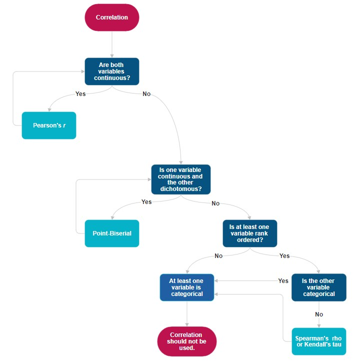

# CORRELATION & REGRESSION {-}

# Correlation {#correlation}

*Jessica Fossum, PhD*

[Screencasted Conceptual Lecture Link](https://youtu.be/u0jHGceCgZs?si=nYgTaA-4feALEpNf)


``` r
options(scipen=999)#eliminates scientific notation
```

Correlation is concept in statistics that measures the strength and direction of the linear relationship between two variables. It helps us understand how changes in one variable are associated with changes in another. Correlation is one of my favorite topics in statistics because the colloquial use of the word "correlation" is very close to how it is used in statistics, where both describe how two events/variables are related. For example, in industrial-organizational psychology, researchers might examine the relationship between employee job satisfaction and productivity. If there is a strong positive correlation, it means that for higher job satisfaction, productivity tends to higher as well. Conversely, a strong negative correlation would indicate that higher job satisfaction is associated with lower productivity.

## Navigating this Lesson

While the majority of R objects and data you will need are created within the R script that sources the chapter, occasionally there are some that cannot be created from within the R framework. Additionally, sometimes links fail. All original materials are provided at the [Github site](https://github.com/lhbikos/ReCenterPsychStats) that hosts the book.

### Learning Objectives

Learning objectives from this lecture include the following:

-   Describe the strength and direction (positive or negative) of a correlation coefficient and be able to visualize the relationship between two variables at different correlations
-   Understand when to use correlation coefficients
-   Calculate and interpret correlation coefficients (Pearson's *r*, Spearnan's $\rho$ and Kendall's $\tau$)
-   Recognize and report correlation coefficients and descriptive statistics tables in APA style

### Planning for Practice

The suggestions for homework vary in degree of complexity. The more complete descriptions at the end of the chapter follow these suggestions.

-   Rework the correlations in the lesson by changing the random seed in the code that simulates the data. This should provide minor changes to the data, but the results will likely be very similar.
-   Rework the correlations in the lesson by changing something else about the simulation. For example, if you are interested in power, consider changing the sample size.
-   Use the simulated data that is provided, but use different variables, instead.
-   Conduct an correlation test with data to which you have access and permission to use. This could include data you simulate on your own or from a published article.

### Readings & Resources

In preparing this chapter, I drew heavily from the following resource(s). Other resources are cited (when possible, linked) in the text with complete citations in the reference list.

-   McNulty, K. (2024). Chapter 3: Statistics Foundations. In [Handbook of Regression Modeling in People Analytics]<https://peopleanalytics-regression-book.org/index.html>).
-   Hayes, A. (2023).
-   Ramos, G., Ponting, C., Bocanegra, E., Chodzen, G., Delgadillo, D., Rapp, A., Escovar, E. & Chavira, D. (2022) Discrimination and Internalizing Symptoms in Rural Latinx Adolescents: The Protective Role of Family Resilience, *Journal of Clinical Child & Adolescent Psychology*, *51*(6), 997-1010. <https://doi.org/10.1080/15374416.2021.1923018>
    -   The source of our research vignette.

### Packages

The script below will (a) check to see if the following packages are installed on your computer and, if not (b) install them.


``` r
#will install the package if not already installed
#if(!require(psych)){install.packages("psych")}
#if(!require(tidyverse)){install.packages("tidyverse")}
#if(!require(ggpubr)){install.packages("ggpubr")}
#if(!require(pwr)){install.packages("pwr")}
#if(!require(apaTables)){install.packages("apaTables")}
#if(!require(knitr)){install.packages("knitr")}
#if(!require(rstatix)){install.packages("rstatix")}
#if(!require(MASS)){install.packages("MASS")}

library(MASS)
library(tidyverse)
```

```
── Attaching core tidyverse packages ──────────────────────── tidyverse 2.0.0 ──
✔ dplyr     1.1.4     ✔ readr     2.1.5
✔ forcats   1.0.0     ✔ stringr   1.5.1
✔ ggplot2   3.5.1     ✔ tibble    3.2.1
✔ lubridate 1.9.3     ✔ tidyr     1.3.1
✔ purrr     1.0.2     
── Conflicts ────────────────────────────────────────── tidyverse_conflicts() ──
✖ dplyr::filter() masks stats::filter()
✖ dplyr::lag()    masks stats::lag()
✖ dplyr::select() masks MASS::select()
ℹ Use the conflicted package (<http://conflicted.r-lib.org/>) to force all conflicts to become errors
```

## Introducing correlations

Correlation is a fundamental concept in statistics that measures the strength and direction of the linear relationship between two variables. It is essential for understanding how changes in one variable are associated with changes in another. Correlation coefficients, typically ranging from -1 to 1, quantify these relationships, with values closer to the extremes indicating stronger associations. Understanding correlation is crucial for analyzing data and making informed decisions based on statistical relationships.

<!-- -->

Correlations are defined by two main properties: **strength** and **direction**. The strength is the magnitude or absolute value of the correlation, and the direction is the sign (positive or negative). The strength determines how close the cluster of points fall on the graph, and the direction determines whether whether as one variable increases, the other variable will increase (positive) or decrease (negative).

There are several different types of correlation coefficients, and choosing which one to use depends on what type of variables are involved. The most common type of correlation reported is Pearson's *r*. This is used for two continuous variables.

To calculate Pearson's *r*, a score from each participant is needed for each variable. Notationally, here we see variable *x* and variable *y* as the two variables. The first step is to calculate the covariance between the two variables, which is is a measure of the extent to which one changes as the other changes. If $x=x_1,x_2,…,x_n$ is a variable and $y=y_1,y_2,…,y_n$ is another variable, *i* as a subscript represents the individual score of a participant, and $\bar{x}$ and $\bar{x}$ are the means of *x* and *y*, respectively, then the sample covariance of x and y is defined as

$$cov_s(x,y)=\frac{1}{1-n}\sum^{n}_{i=1}(x_i-\bar{x})(y_i-\bar{y})$$ which can be read as taking each individual score and subtracting off the mean, multiplying those values together, then adding that product up for each individual *i*. That results in the population covariance, but since we are often working with samples in psychology, the adjustment of $\frac{1}{1-n}$ is necessary.

Once the covariance is calculated, it is scaled by the product of the standard deviation of the two variables to get the correlation. This is why correlations are always between -1 and 1.

$$r_{x,y}=\frac{cov(x,y)}{\sigma_x\sigma_y}$$ This equation is for the population correlation. We will learn how to calculate the sample correlation coefficient with a similar adjustment later in this chapter. The equation for a sample correlation is the default in base R.

The other types of correlation described in this chapter are point-biserial correlation, Spearman's $\rho$, Kendall's $\tau$, and rank-biserial correlations. Pearson's *r* is limited to just continuous variables. Point-biserial correlations are used to describe the correlation between a continuous variable and a dichotomous (binary) variable. Spearman's $\rho$ and Kendall's $\tau$ are used whenever at least one of the two variables is a ranked (ordinal) variable, and a rank-biserial correlation is used when one variable is a ranked variable and the other is a dichotomous variable.

### Workflow for Choosing which Correlation

The following is a workflow for choosing the proper type of correlation test.




If the data meets the assumptions associated with the research design (e.g., continuous variables for Pearson's *r*), these are the steps for the correlation test:

1.  Prepare (upload) data.
2.  Explore data with
    -   graphs
    -   descriptive statistics (means, standard deviations)
3.  Compute the proper type of correlation
4.  Assess the statistical significance of the correlation
5.  Sample size/power analysis (which you should think about first, but in the context of teaching statistics, it's more pedagogically sensible, here).

## Assumptions of correlation

The main assumption is that the proper type of correlation is reported depending on the type of variables included. The other assumption of a correlation is that the relationship between the variables is linear, because correlations do a poor job of describing nonlinear trends. A parabolic trend could have a correlation close to 0, even though graphing the points would show a clear relationship between the two.

<!-- -->

## Research Vignette

Empirically published articles often include correlation tables along with the descriptive statistics. An example of this can be found in [@ramos_discrimination_2021], which was a study that explored the relationships between discrimination and internalizing symptoms in rural Latinx adolescents, and found that family resilience acted as a protective factor.

This article is a great example of several statistical tests, but for this chapter, we will focus on the variables and explore correlations among them. The article measured continuous, ordinal, and dichotomous variables.

-   Continuous variables: Perceived Discrimination, Self-Reported Internalizing Symptoms, Self-Reported Depressive Symptoms, Self-Reported Somatic Symptoms, Self-Reported Anxiety Symptoms, Perceived Family Resilience, Perceived Individual Resilience, Perceived Contextual Resilience, and Self-Reported Level of Acculturation.

-   Ordinal variables: Self-Reported Depressive Symptom Severity (normative, borderline, clinically significant), Self-Reported Somatic Symptom Severity (normative, borderline, clinically significant), Self-Reported Anxiety Symptom Severity (normative, borderline, clinically significant).

-   Dichotomous variable: sex

### Data Simulation

In the data below, I have simulated the continuous variables using the means, standard deviations, and correlations listed in the article. Further, I truncated them to fit within the assigned range. From there, I created the three ordinal variables by taking their corresponding continuous variable (eg., Self-Reported Depressive Symptom Severity) and creating three levels, with allocations that match those reported in the article (eg., the lowest 78% in the normative severity category, the next 12% in the borderline severity category, and the top 10% in the clinically significant severity category.). Finally, I randomly assigned sex to match the demographics of the study's sample because it was reported to not correlate with any of the other measures. I created data for 444 participants to match the sample size reported in the article.

The packages I'm using for simulating data are dplyr from the tidyverse and MASS. Creating the levels of the ordinal variables could be done in base R, but this is the kind of data manipulation where the dplyr package really shines. The MASS package has the mvrnorm() function in it, which allows us to draw from multivariate normal distributions. Instead of just using rnorm() to get data for one variable, the mvrnorm() function allows us to generate correlated variables.


``` r
set.seed(90263)

# Specify the number of observations
n <- 444

# Specify the means for the 9 variables
means <- c(14.890, 13.345, 5.581, 2.613, 5.162, 27.853, 44.188, 38.014, 39.688)

# Specify the standard deviations for the 9 variables
sds <- c(4.420, 9.395, 4.677, 2.602, 3.629, 4.900, 6.182, 6.103, 7.467)

# Create a correlation matrix for the 9 continuous variables
cor_matrix <- matrix(
  c(1, .431, .433, .299, .341, -.239, -.253, -.137, -.162,
    .431, 1, .914, .729, .878, -.404, -.470, -.295, .017,
    .433, .914, 1, .515, .698, -.453, -.485, -.340, -.018,
    .299, .729, .515, 1, .506, -.204, -.215, -.099, .015,
    .341, .878, .698, .506, 1, -.315, -.438, -.257, .058,
    -.239, -.404, -.453, -.204, -.315, 1, .6, .672, .005,
    -.253, -.470, -.485, -.215, -.438, .6, 1, .677, .011,
    -.137, -.295, -.340, -.099, -.257, .672, .677, 1, -.024,
    -.162, .017, -.018, .015, .058, .005, .011, -.024, 1),
  nrow = 9
)

# Create the covariance matrix from the correlation matrix and standard deviations
cov_matrix <- diag(sds) %*% cor_matrix %*% diag(sds)

# Generate the multivariate normal data using the MASS library
dat <- mvrnorm(n = n, mu = means, Sigma = cov_matrix)

# Create 0 as the lower bound for all scale variables
dat[dat < 0] <- 0

# Convert the data to a data frame
dat <- as.data.frame(dat)

# Assign column names
colnames(dat) <- c("PerceivedDiscrimination",
                    "InternalizingProblems",
                    "DepressiveSymptoms",
                    "SomaticSymptoms",
                    "AnxietySymptoms",
                    "FamilyResilience",
                    "IndividualResilience",
                    "ContextualResilience",
                    "Acculturation")


# Create 3 ordinal variables
dat <- dat %>%
  mutate(
    DepressiveSymptomsLevels = case_when(
      DepressiveSymptoms <= sort(dat$DepressiveSymptoms)[345] ~ "NormativeSeverity",
      DepressiveSymptoms > sort(dat$DepressiveSymptoms)[345] & DepressiveSymptoms <= sort(dat$DepressiveSymptoms)[345+55] ~ "BorderlineSeverity",
      DepressiveSymptoms > sort(dat$DepressiveSymptoms)[345+55] ~ "ClinicallySignificantSeverity"
    )
  )

dat <- dat %>%
  mutate(
    SomaticSymptomsLevels = case_when(
      SomaticSymptoms <= sort(dat$SomaticSymptoms)[359] ~ "NormativeSeverity",
      SomaticSymptoms > sort(dat$SomaticSymptoms)[359] & SomaticSymptoms <= sort(dat$SomaticSymptoms)[359+47] ~ "BorderlineSeverity",
      SomaticSymptoms > sort(dat$SomaticSymptoms)[359+47] ~ "ClinicallySignificantSeverity"
    )
  )

dat <- dat %>%
  mutate(
    AnxietySymptomsLevels = case_when(
      AnxietySymptoms <= sort(dat$AnxietySymptoms)[366] ~ "NormativeSeverity",
      AnxietySymptoms > sort(dat$AnxietySymptoms)[366] & AnxietySymptoms <= sort(dat$AnxietySymptoms)[366+39] ~ "BorderlineSeverity",
      AnxietySymptoms > sort(dat$AnxietySymptoms)[366+39] ~ "ClinicallySignificantSeverity"
    )
  )

# Create dichotomous variable (randomly assigned)
dat$sex <- sample(c("Male", "Female"), size = n, replace = TRUE, prob = c(0.51, 0.49))
```

With our data created and saved in the object "data," let's inspect its structure (i.e., the measurement scales for the variables) to see if they are appropriate.


``` r
str(dat)
```

```
'data.frame':	444 obs. of  13 variables:
 $ PerceivedDiscrimination : num  16.97 16.15 4.26 15.03 14.92 ...
 $ InternalizingProblems   : num  10.65 12.42 0 9.97 9.11 ...
 $ DepressiveSymptoms      : num  4.35 1.42 0 4.95 4.71 ...
 $ SomaticSymptoms         : num  0.815 5.338 0 3.025 0.364 ...
 $ AnxietySymptoms         : num  5.24 5.49 0 2.03 4.18 ...
 $ FamilyResilience        : num  25.7 31 39.5 31.2 31.8 ...
 $ IndividualResilience    : num  47 44.7 56.8 44.1 43.1 ...
 $ ContextualResilience    : num  38.2 40.4 48.9 40.3 39.7 ...
 $ Acculturation           : num  32 27.6 26.1 43.7 34.7 ...
 $ DepressiveSymptomsLevels: chr  "NormativeSeverity" "NormativeSeverity" "NormativeSeverity" "NormativeSeverity" ...
 $ SomaticSymptomsLevels   : chr  "NormativeSeverity" "BorderlineSeverity" "NormativeSeverity" "NormativeSeverity" ...
 $ AnxietySymptomsLevels   : chr  "NormativeSeverity" "NormativeSeverity" "NormativeSeverity" "NormativeSeverity" ...
 $ sex                     : chr  "Male" "Female" "Female" "Male" ...
```

The perceived discrimination, internalizing problems, symptoms, resilience, and acculturation variables were all continuous variable made out of Likert-scale items in the original Ramos [-@ramos_discrimination_2021] article. Therefore, the numerical scale is correctly assigned by R. In contrast, the levels of symptoms variables is ordinal and sex is categorical, and therefore should all be factors. Because R orders factors alphabetically, we will specify the levels in order for the Normative, Borderline, and Clinically Significant severity categories.


``` r
dat$DepressiveSymptomsLevels <- factor(dat$DepressiveSymptomsLevels, levels = c("NormativeSeverity", "BorderlineSeverity", "ClinicallySignificantSeverity"))

dat$SomaticSymptomsLevels <- factor(dat$SomaticSymptomsLevels, levels = c("NormativeSeverity", "BorderlineSeverity", "ClinicallySignificantSeverity"))

dat$AnxietySymptomsLevels <- factor(dat$AnxietySymptomsLevels, levels = c("NormativeSeverity", "BorderlineSeverity", "ClinicallySignificantSeverity"))

dat$sex <- factor(dat$sex, levels = c("Male", "Female"))
```

Let's again check the formatting of the variables:


``` r
str(dat)
```

```
'data.frame':	444 obs. of  13 variables:
 $ PerceivedDiscrimination : num  16.97 16.15 4.26 15.03 14.92 ...
 $ InternalizingProblems   : num  10.65 12.42 0 9.97 9.11 ...
 $ DepressiveSymptoms      : num  4.35 1.42 0 4.95 4.71 ...
 $ SomaticSymptoms         : num  0.815 5.338 0 3.025 0.364 ...
 $ AnxietySymptoms         : num  5.24 5.49 0 2.03 4.18 ...
 $ FamilyResilience        : num  25.7 31 39.5 31.2 31.8 ...
 $ IndividualResilience    : num  47 44.7 56.8 44.1 43.1 ...
 $ ContextualResilience    : num  38.2 40.4 48.9 40.3 39.7 ...
 $ Acculturation           : num  32 27.6 26.1 43.7 34.7 ...
 $ DepressiveSymptomsLevels: Factor w/ 3 levels "NormativeSeverity",..: 1 1 1 1 1 1 1 1 3 1 ...
 $ SomaticSymptomsLevels   : Factor w/ 3 levels "NormativeSeverity",..: 1 2 1 1 1 1 1 1 3 1 ...
 $ AnxietySymptomsLevels   : Factor w/ 3 levels "NormativeSeverity",..: 1 1 1 1 1 1 1 1 3 1 ...
 $ sex                     : Factor w/ 2 levels "Male","Female": 1 2 2 1 1 1 1 1 1 2 ...
```

All of our variables of interest are now correctly formatted as *num* and *factor*.

Below is code for saving (and then importing) the data in .csv or .rds files. I make choices about saving data based on what I wish to do with the data. If I want to manipulate the data outside of R, I will save it as a .csv file. It is easy to open .csv files in Excel. A limitation of the .csv format is that it does not save any restructuring or reformatting of variables. For this lesson, this is not an issue.

Here is code for saving the data as a .csv and then reading it back into R. I have hashtagged these out, so you will need to remove the hashtags if you wish to run any of these operations. If you have simulated the data (above), you do not need to save and then re-import the data.


``` r
#writing the simulated data as a .csv 
#write.table(dat, file = "RamosCorrelations.csv", sep = ',', col.names=TRUE, row.names=FALSE) 
#at this point you could clear your environment and then bring the data back in as a .csv
#reading the data back in as a .csv file
#dat<- read.csv ('RamosCorrelations.csv', header = TRUE)
```

The .rds form of saving variables preserves any formatting (e.g., creating ordered factors) of the data. A limitation is that these files are not easily opened in Excel. Here is the hashtagged code (remove hashtags if you wish to do this) for writing (and then reading) this data as an .rds file.


``` r
#saveRDS(dat, 'RamosCorrelations.rds')
#dat <- readRDS('RamosCorrelations.rds')
#str(dat)
```

### Data Visualization

Plotting the data is a helpful early step in any data analysis. Further, visualizing the data can help us with a conceptual notion of the statistic we are utilizing. The *ggplot2* package is part of the tidyverse as well, so it is automatically loaded when we ran the library(tidyverse) command. There are lots of tutorials and samples of ggplot2 code available online, and the cheatsheet is incredibly helpful. <https://ggplot2.tidyverse.org/>

If you're curious about what the plots of different correlations look like, this is a great interactive website: <https://rpsychologist.com/correlation/>

Here, we'll start with the correlation between AnxietySymptoms and FamilyResilience. From the article, it seems that family resilience is a protective factor, so we should see those that have higher family resilience scores tending to have lower anxiety symptoms. Each point in the scatterplot below represents an individual participant, with their score on the FamilyResilience variable on the x-axis (and labeled as such in the code) and AnxietySymptoms on the y-axis. For correlations, it doesn't really matter which variable is specified as *x* and which is *y*, and the coefficient will be the same either way.

While there are several lines of code, they are all connected and can only be run together. The + at the end of each line tells R that it is not done yet and needs to go on to the next line to get all the features of the plot we want. The geom_point() command gets us a scatterplot with points, the labs() is how we get a title and axis labels, and the geom_smooth() gets the line. The method is lm, and we'll learn more about linear models (lm) later in the book. Since I just wanted a basic line without a the standard error shaded in around it, se = FALSE, and the color argument makes it any color you choose. If you want a specific color, the HEX code can be provided. Otherwise, R has a few default colors available by name such as blue.


``` r
ggplot(dat, aes(x = FamilyResilience, y = AnxietySymptoms)) +
  geom_point() +
  labs(title = "Scatterplot of a Negative Correlation",
       x = "Family Resilience",
       y = "Anxiety Symptoms") +
  geom_smooth(method = "lm", se = FALSE, color = "blue") +
  theme_minimal()
```

```
`geom_smooth()` using formula = 'y ~ x'
```

<!-- -->

## Working Pearson's *r* (by hand)

### Stating the Hypothesis

To give an example of calculating a correlation by hand, we will focus on the correlation between two continuous variables, in this case FamilyResilience and AnxietySymptoms. Specifically, I hypothesize that the population level correlation between FamilyResilience and AnxietySymptoms will differ from 0. In the hypotheses below, the null hypothesis ($H_0$) states that the population correlation equals 0; the alternative hypothesis ($H_A$) states that the population correlation does not equal 0.

$$
\begin{array}{ll}
H_0: & \rho = 0  \\
H_A: & \rho \neq 0
\end{array}
$$

### Calculating Pearson's *r*

Since both FamilyResilience and AnxietySymptoms are continuous variables, Pearson's *r* is the appropriate correlation to calculate. The formulas from above involve calculating the population correlation, but since we have a sample we will use the version appropriate for calculating Pearson's *r* in a sample:

$$r = \frac{\Sigma(x_i-\bar{x})(y_i-\bar{y})}{\sqrt{\Sigma(x_i-\bar{x})^2\Sigma(y_i-\bar{y})^2}}$$

where $x_i$ represents an individual score on $x$, $\bar{x}$ represents the sample mean of $x$, $y_i$ represents an individual score on $y$, and $\bar{y}$ represents the sample mean of $y$.

We can calculate this in pieces. First, our individual $x_i$ scores are stored in the vector FamilyResilience, and we can find the mean of that variable using the mean() command. Let's call these the $x$ difference scores, or xdif (arbitrary name). We can do the same for our $y$ variable, AnxietySymptoms.


``` r
dat$FamilyResilience - mean(dat$FamilyResilience)
```

```
  [1]  -2.01715401   3.34238086  11.84288389   3.51296843   4.08711581
  [6]  -1.79632903   4.38497388  -1.60636933  -3.94013746  13.91884396
 [11]  -0.82475716   0.29736473   4.83427702  -0.29499545   1.24976368
 [16]  -3.09016954   0.84764408  -1.99488492  11.55666790   0.01155968
 [21]  -2.11628963   1.46196525  -4.91932046   0.66187801   4.50313709
 [26]   4.39359380  -0.42794353   1.80576847  -0.54664325  -0.55308250
 [31]   3.62930676   8.13915784   8.06943123   5.46481830   5.58882328
 [36]   7.57832552   0.66975329   2.36338024  -0.00658840  -1.13833678
 [41]  -0.51723377  -5.45742093  -0.43928937  -1.22657769  -5.99948602
 [46]  -4.66026310   1.17191935   3.74538358   6.90703425  -1.14507549
 [51]  -1.60499656  -2.63446155  -3.94414296   3.65485470  -1.03381995
 [56]  -0.20509307  -7.82310477   3.42084351  -1.68979632   4.61407402
 [61]  -1.41029523  -1.16131772  -1.00891795   2.31190559   3.48483168
 [66]  -3.68964575   5.73562622  -3.94004423   4.21721076   8.01858196
 [71]   5.47819302  -1.27590540   7.88021598  -5.66466324  -5.15053056
 [76]   4.33232081   0.28385093   7.54984948  -7.02327260   4.70933436
 [81]  -2.28739131   1.21029221   4.25441292  -2.24011759  11.46130470
 [86]   6.64062865   2.49750832   7.07879134  -5.05253122  -6.61690467
 [91]   2.51305253  -4.54240660   0.91399808   2.49149146   4.49813439
 [96]  -2.87654963   7.50703063  -5.80939810   0.42962027  -0.35224275
[101]  -1.39706795   5.48543960   4.57516627  -2.49998145  -8.76523762
[106]   2.34841989  -0.87010564  -4.77288540   1.14558936   1.95763510
[111]  -4.46100969   4.15625319   1.03341386  -6.20252715  -3.51452581
[116]  -0.31980945   1.76973507  -6.19898089  -0.76317891  -1.08762493
[121]   1.24844616   3.95871362  -5.11059959  -6.87266550  -2.09928028
[126]  -3.79319665  -6.12329758   3.65665539  -2.52186587  -1.55020509
[131]  -6.86168568  -3.29688935  -4.14898290   4.57311482  -3.48932492
[136]   7.47981089   4.31009153   0.07590609   6.49777255  -3.60709026
[141] -15.21693979  -8.80156833  -1.02248198  -2.90746987   2.06343932
[146]  -0.03306862   6.41304504  -3.71100983  -3.68562711   2.30720968
[151]   1.99071738   0.39845139  -2.18663866  -2.92510323  -1.57367337
[156]   0.01696974  -0.75471333  -2.42646104  -1.00317504   1.28356393
[161]   2.74594432  -1.29351503  -8.33700967  -2.65904221  -8.04702181
[166]   6.80379124   4.32748368  -3.94059692   5.53669857   2.52101102
[171]  -3.77836169  -6.75911471  -5.14347495  -6.51102284   6.50653460
[176]  -1.38858478  -3.37851240  -2.94243412   2.78217510  -1.01673871
[181]  -9.03168991   1.42420560  -3.64964835 -14.83114327  -5.04723881
[186]   2.87988254   1.16903667   4.99165335   2.30329483   2.07189538
[191]  -2.80938568   1.16743488 -10.44643148  -3.26284643   4.93971054
[196]  -3.66490242   3.37691904   1.59466049  -6.00591086  -3.58795950
[201]   8.05958216   7.35081993  -0.38286154   2.01070216  -4.38847238
[206]   0.29118386  -0.28920687   6.34679820  -1.55077495  -9.03458172
[211]   3.41483372   7.75781057  -0.10764633  -0.40890136  -1.94294496
[216]   1.20443864   1.78061031  -1.23560547  -5.94741356   5.93110444
[221]   2.67521930   8.28448922  -2.13652896   1.65157152  -6.16036035
[226]  -3.43505921  -0.67788506   1.96059007  -0.43200375  -0.04686974
[231]  10.09848409   2.59604714   1.30302408  -5.74792230   8.27844260
[236]  -2.76042138   0.51264083   4.08424041   1.58290029  -5.78017676
[241]   3.69209836  -3.71975779  -1.74008245 -13.29230621  -0.94570144
[246]   1.28854846   5.11963324   7.50143976  12.35646934   6.70946349
[251]   1.29891281 -10.34423370  -3.47141150   5.44481545  -4.58172132
[256]  -0.68262868  -3.07706807  -6.95635159   5.85377004  -6.29349565
[261]  -0.65966067  -1.58105294   5.30083153  -0.20213250  -2.39814736
[266]  -0.32957705  -5.80237925  -5.89510541   8.68885955  -4.47984556
[271]   0.18433831   2.42303710  -4.70880869   5.06781853  -0.14688672
[276]  -8.12096171  -7.88495046  10.87783924  -1.02012052   6.81802707
[281]   5.95277062  -1.42052566  -1.53560789   3.76987311   4.54255101
[286]  -3.91828611  -2.93941727  -2.40373741  -1.10834706  -5.70554189
[291]  -2.78401633  -3.72669714   9.66825226  -3.56408069  -2.62114031
[296]   5.01532733   4.77921676  -3.02471364   0.87820039   1.11566093
[301]  -1.01501842  -0.77190917  -1.68099551  11.75459085  -4.93672451
[306]  -2.81229486  -8.81756819   4.72625799   5.53497952  -4.27674195
[311]   5.78005421  -2.56565432  -1.89087499  -3.42736959   2.32992397
[316]   5.80648570  -2.42129345   4.06466769  -8.13547004   2.28431443
[321]  -0.51487064   4.06696137   3.68758922   7.90418110   3.72884319
[326]  -4.57530828   3.09795018  -2.63323995   0.90024586   3.88643758
[331]  10.64221278  -7.13637514  15.86587812  -8.40439066  -8.28948226
[336]   1.55651736   1.36689637   5.95813277   4.56118453  -7.58139148
[341]  -7.66063154  -1.63964897   6.45659153  -4.14466194  -5.68312000
[346]  -3.92432861   2.09478439   2.66530488   5.17743784  -6.16593851
[351]  -0.94523906   1.00072737  -4.15003311   0.68588622  -2.77365621
[356]   0.11965399   7.23496791   0.57473571  -2.66425920   0.49827376
[361]   0.25937989  -3.68416132   4.17721690   0.76828116  -3.58822125
[366]   7.45413016  -9.91056733  -8.83862307   1.73740593  -0.46865216
[371]   0.87564918   0.24262257   2.64663158   4.94383366   2.24002941
[376]   3.40413846  -2.23474903  -0.72073670  -5.34333339  -3.70529113
[381]   3.88698300   3.31347430  -5.31666116  -8.19765560   0.56118929
[386]  12.52268982  -1.80835914   4.27849571 -17.00346818   9.97977133
[391]  -5.19306634  -4.24084653  -5.46891889   7.57415418  11.83340882
[396]   1.18472533  -0.65159960  -8.03941452  -0.48173753  -0.75649908
[401]   4.14330852  -2.94712263   0.17135681   9.83414028  -4.34154664
[406]   4.02105659  -2.05420642  -1.67617772  -3.08108609  -2.64038072
[411]   9.22525013   6.56837882  -0.02714509   3.30876738 -11.31429739
[416]  -8.31950265   2.45382372   1.37345224  -4.03552375  -1.11601218
[421]  -7.59318575  -2.75197467  -9.30606936   7.82514987  -2.06420253
[426]  12.29456251   4.90987248   1.76654263   5.08720652   2.07623272
[431]   0.63150388  -1.97273129 -10.74909958  -0.24730095   0.85937473
[436]  -2.56110447   3.43540396  -4.61909920  -4.23668482  -5.02502746
[441]  -1.44353477   0.91861746  -6.09689147  -0.51261071
```

``` r
xdif <- dat$FamilyResilience - mean(dat$FamilyResilience)
ydif <- dat$AnxietySymptoms - mean(dat$AnxietySymptoms)
```

From there, we can calculate the numerator by taking the product of each xdif and ydif score, and then adding them all together with the sum function as indicated by the $\Sigma$ symbol.

$$\Sigma(x_i-\bar{x})(y_i-\bar{y})$$


``` r
numerator <- sum(xdif*ydif)
```

The denominator is similar, but includes squaring each difference between the individual score and mean score for the variable. This scales Pearson's *r* to remain between -1 and 1.

$$\sqrt{\Sigma(x_i-\bar{x})^2\Sigma(y_i-\bar{y})^2}$$


``` r
denominator <- sqrt(sum(xdif^2)*sum(ydif^2))
```

Finally, we divide the numerator by the denominator to get the correlation.


``` r
correlation <- numerator/denominator
correlation
```

```
[1] -0.2893842
```

The sample correlation between FamilyResilience and AnxietySymptoms is -.289. Hopefully, this hand-calculation provided an indication of how Pearson's *r* is formed and how sensitive it can be to outliers. Now we ask, "But it is statistically significant?"

#### Statistical Significance

The question of statistical significance testing invokes NHST (null hypothesis significance testing). In the case of a correlation, the null hypothesis is that the correlation equals 0; the alternative is that they do not equal 0. Our test is of the null hypothesis. When the probability (*p*) is less than the value we specify (usually .05), we have statistically significant results. Thus, we reject the null hypothesis (the one we tested) in favor of the alternative (that the means are not equal).

$$
\begin{array}{ll}
H_0: & \rho = 0  \\
H_A: & \rho \neq 0
\end{array}
$$ 

Although still used, NHST has its critiques. Among the critiques are the layers of logic and confusing language as we interpret the results.

We first need a *t* value for our correlation, and that can be calculated using this formula:

$$t = r\sqrt{\frac{n-2}{1-r^2}}$$ Here, *n* represents the sample size, and the subtraction of 2 is because we have 2 variables involved in the correlation. Let's calculate it for our sample correlation.


``` r
correlation * sqrt((n-2)/(1-correlation^2))
```

```
[1] -6.355905
```

Our *t*-value is -6.36. We compare this value to the test critical value in a table of *t* critical values. In-so-doing we must know our degrees of freedom. In the test that involves two variables, we will use $n - 2$ as the value for degrees of freedom. We must also specify the \alpha* level (in our case we want p\* \< .05) and whether-or-not our hypothesis is unidirectional or bi-directional. Our question only asked, "Does the correlation differ from 0?" In this case, the test is two-tailed, or bi-directional.

Let's return to the [table of critical values](https://www.statology.org/t-distribution-table/) for the *t* distribution to compare our *t*-value (-6.36) to the column that is appropriate for our:

-   Degrees of freedom (in this case $n-2$ or 442)
-   Alpha, as represented by $p < .05$
-   Specification as a one-tailed or two-tailed test
    -   Our alternative hypothesis made no prediction about the direction of the difference; therefore we will use a two-tailed test

In the above linked table of critical values, when the degrees of freedom reaches 30, there larger intervals. We will use the row representing degrees of freedom of 120 since our df is lower than the next value of 1000. In this case, that value is 1.98. If our *t*-test value is lower than -1.98 or greater than 1.98, then our correlation is statistically significantly different from 0. In our case, we have in fact achieved statistical significance and we can say that the correlation differs from 0. Our results would be reported as: $r(442) = -6.36, p < .05$

We can also use the *qt()* function in base R. In the script below, I have indicated an alpha of .05. The "2" that follows indicates I want a two-tailed test. The 442 represents my degrees of freedom ($n-2$). In a two-tailed test, the regions of rejection will be below the lowerbound (lower.tail=TRUE) and above the upperbound (lower.tail=FALSE).


``` r
qt(.05/2, 442, lower.tail=TRUE)
```

```
[1] -1.965346
```

``` r
qt(.05/2, 442, lower.tail=FALSE)
```

```
[1] 1.965346
```

This gives us the exact threshold for our df, insead of relying on the closest approximation in the table.

#### Confidence Intervals

How confident are we in our result? With correlations, it is common to report an interval in which we are confident that if we repeated our experiment many times, 95% of the intervals would contain the true population correlation coefficient $\rho$. However, despite the popularity of reporting these intervals, the formula for calculating them is complicated. So much, in fact, that Loftus and Loftus [-@loftus_essence_1988], authors of the textbook, Essence of Statistics, had to publish a correction to this section. Since the distribution of $r$ is skewed, the interval is not symmetrical like other CIs. The formula takes a few steps including a transformation. Below is the formula, which involves:

$$z \pm (criterion) \times SD$$

-   $z$ as a placeholder variable while we calculate transformations
-   $criterion$ was found above using the qt() function, and is around 1.96 for the normal distribution at $\alpha = .05$
-   $SD$ the standard deviation of $r$, which can be calculated $\sqrt{\frac{1}{n-3}}$

$z$ is calculated as

$$z=0.5ln \left(\frac{1+r}{1-r}\right)$$

We found earlier that $r=-.289$ for our example correlation between FamilyResilience and AnxietySymptoms. Plugging that into this transformation to calculate $z$, and noting that log() in R actually gives the natural log ln by default, we get


``` r
0.5*log((1-.289)/(1+.289))
```

```
[1] -0.2974748
```

The standard deviation, $\sqrt{\frac{1}{n-3}}$, is calculated as follows


``` r
sqrt(1/(n-3))
```

```
[1] 0.04761905
```


With this in hand, let's calculate the confidence intervals around $z$.


``` r
(-0.2974748) - (-1.965346*0.04761905)
```

```
[1] -0.2038869
```

``` r
(-0.2974748) + (-1.965346*0.04761905)
```

```
[1] -0.3910627
```

Finally, we need to put this interval around $z$ back on the Pearson's $r$ metric using a reverse of the $z$ equation, because ultimately we want the confidence interval for our correlation, $r$, and the $z$ metric is not interpretable.

$$r=\frac{e^{2z}-1}{e^{2z}+1}$$

Using our numbers, and knowing that the function for "e to the power of" is exp(), we will transform both the lower limit and upper limit we found above in the $z$ metric.

Lower limit:

``` r
(exp(2*-0.3910627)-1)/(exp(2*-0.3910627)+1)
```

```
[1] -0.372276
```

Upper limit:

``` r
(exp(2*-0.2038869)-1)/(exp(2*-0.2038869)+1)
```

```
[1] -0.2011079
```

These values indicate the range of scores in which we are 95% confident that our true population correlation ($\rho$) lies. Stated another way, we are 95% confident that the true population correlation is between -.37 and -.20. Since this interval does not cross zero, we have evidence against the null hypothesis that $\rho$ could equal 0.00. This result is consistent with our significant *p* value. For these types of statistics, the 95% confidence interval and *p* value will always yield the same conclusion.

#### Effect Size

A correlation coefficient is an effect size. The agreed upon (yet arbitrary) guidelines for interpreting the magnitude of correlations are from Cohen (1988, 1992)

-   .1 represents a small effect
-   .3 represents a medium effect
-   .5 represents a large effect

## Finding a Correlation in R

### Evaluating the Statistical Assumptions and Choosing a Test


Both FamilyResilience and AnxietySymptoms are continuous, and we expect the relationship between them to be linear. Therefore, we can use Pearson's *r*.

### Computing Pearson's *r*

We are ready to compute the correlation using Pearson's *r*. Base R has a function for this, so no extra packages are required.


``` r
cor.test(dat$FamilyResilience, dat$AnxietySymptoms)
```

```

	Pearson's product-moment correlation

data:  dat$FamilyResilience and dat$AnxietySymptoms
t = -6.3559, df = 442, p-value = 0.0000000005166
alternative hypothesis: true correlation is not equal to 0
95 percent confidence interval:
 -0.3724164 -0.2017561
sample estimates:
       cor 
-0.2893842 
```

From this output we can put together the pieces to report in APA format: $r(442) = -.29, p < .001, CI_{95} [-.37, -.20]$.

A note about reporting output: APA format specifies no leading 0 (before the decimal place) if the number cannot exceed 1. That should apply to our correlation coefficient of -.29 and our *p* value. Additionally, numbers should be rounded to two decimal places, with the exception of *p* values which can extend to three. If the *p* value is less than .001, then report it as $p < .001$.

What does this mean? Our result is statistically significant. Our estimate of the correlation  is -.29. We are 95% confident that that true population correlation is between -.37 and -.20. Because the confidence interval does not cross zero, we can claim that the true difference is not zero. This is consistent with the significant *p* value. The effect size for this correlation is around a moderate or medium correlation.

## Correlation Matrices
We can summarize correlations between many variables succinctly in a table or matrix. A correlation matrix lists all the variables in the first column, then often numbers the subsequent columns to match the same order. From there, the correlation between each pair of variables is found by finding one variable in the row and the other in the column. For example, the correlation between the first and second variable can be found in column 1, row 2. Correlation matrices are only populated in the lower triangle because it would be repetitive information in the upper triangle (for example, column 2, row 1 would have the same information as column 1, row 2). The diagonal, represented by pairs of the same variable, is often marked with a - to show that the correlation is between a variable and itself which is inherently 1.

Correlation matrices are often used as Table 1 in journal articles, including in the article our research vignette is based off of, because they convey meaningful information about the variables. Means and standard deviations are usually included as well. The APA style blog has a great example of a correlation table: https://apastyle.apa.org/style-grammar-guidelines/tables-figures/sample-tables

The apaTables package makes this easy. Given a dataset, it will produce an APA style correlation table for all of the continuous variables. It will exclude factors, but always make sure to check that all the variables included are appropriate. If you want to include a point-biserial correlation with any dichotomous variables, just turn them into a numeric variable in the dataset and it will be included.


## APA Style Results

Putting it altogether, here is an APA Style results section:

> A correlation test was conducted using Pearson's *r* to evaluate the hypothesis that there would be a correlation between Family Resilience and Anxiety Symptoms. Results of the correlation test were statistically significant, $r(442) = -.29, p < .001$. The 95% confidence interval for the correlation ranged from -.39 to -.20. Means and standard deviations along with other correlations from this study are presented in Table 1; the results are illustrated in Figure 1.


``` r
apaTables::apa.cor.table(dat)
```

```


Means, standard deviations, and correlations with confidence intervals
 

  Variable                   M     SD   1            2            3           
  1. PerceivedDiscrimination 15.00 4.06                                       
                                                                              
  2. InternalizingProblems   13.73 8.26 .37**                                 
                                        [.29, .45]                            
                                                                              
  3. DepressiveSymptoms      5.89  4.11 .38**        .89**                    
                                        [.30, .46]   [.86, .90]               
                                                                              
  4. SomaticSymptoms         2.84  2.19 .22**        .68**        .43**       
                                        [.13, .31]   [.63, .73]   [.35, .50]  
                                                                              
  5. AnxietySymptoms         5.28  3.27 .28**        .85**        .62**       
                                        [.19, .36]   [.82, .88]   [.56, .67]  
                                                                              
  6. FamilyResilience        27.69 5.03 -.27**       -.41**       -.48**      
                                        [-.35, -.18] [-.48, -.33] [-.55, -.41]
                                                                              
  7. IndividualResilience    43.72 6.23 -.18**       -.41**       -.42**      
                                        [-.27, -.09] [-.49, -.33] [-.49, -.34]
                                                                              
  8. ContextualResilience    37.46 6.29 -.12**       -.26**       -.30**      
                                        [-.21, -.03] [-.34, -.17] [-.38, -.21]
                                                                              
  9. Acculturation           39.52 7.37 -.06         .05          -.02        
                                        [-.16, .03]  [-.04, .14]  [-.11, .08] 
                                                                              
  4            5            6           7           8          
                                                               
                                                               
                                                               
                                                               
                                                               
                                                               
                                                               
                                                               
                                                               
                                                               
                                                               
  .44**                                                        
  [.37, .52]                                                   
                                                               
  -.15**       -.29**                                          
  [-.24, -.06] [-.37, -.20]                                    
                                                               
  -.14**       -.42**       .62**                              
  [-.23, -.04] [-.49, -.34] [.56, .67]                         
                                                               
  -.06         -.23**       .68**       .70**                  
  [-.15, .04]  [-.32, -.14] [.62, .72]  [.65, .74]             
                                                               
  .09          .09          -.02        -.03        -.06       
  [-.00, .18]  [-.01, .18]  [-.11, .07] [-.12, .06] [-.15, .04]
                                                               

Note. M and SD are used to represent mean and standard deviation, respectively.
Values in square brackets indicate the 95% confidence interval.
The confidence interval is a plausible range of population correlations 
that could have caused the sample correlation (Cumming, 2014).
 * indicates p < .05. ** indicates p < .01.
 
```

If we want to include our dichotomous variable `sex` and have it report point-biserial correlations, we can make it numeric and then recreate the table. 


``` r
dat$Sex <- as.numeric(dat$sex)
apaTables::apa.cor.table(dat)
```

```


Means, standard deviations, and correlations with confidence intervals
 

  Variable                   M     SD   1            2            3           
  1. PerceivedDiscrimination 15.00 4.06                                       
                                                                              
  2. InternalizingProblems   13.73 8.26 .37**                                 
                                        [.29, .45]                            
                                                                              
  3. DepressiveSymptoms      5.89  4.11 .38**        .89**                    
                                        [.30, .46]   [.86, .90]               
                                                                              
  4. SomaticSymptoms         2.84  2.19 .22**        .68**        .43**       
                                        [.13, .31]   [.63, .73]   [.35, .50]  
                                                                              
  5. AnxietySymptoms         5.28  3.27 .28**        .85**        .62**       
                                        [.19, .36]   [.82, .88]   [.56, .67]  
                                                                              
  6. FamilyResilience        27.69 5.03 -.27**       -.41**       -.48**      
                                        [-.35, -.18] [-.48, -.33] [-.55, -.41]
                                                                              
  7. IndividualResilience    43.72 6.23 -.18**       -.41**       -.42**      
                                        [-.27, -.09] [-.49, -.33] [-.49, -.34]
                                                                              
  8. ContextualResilience    37.46 6.29 -.12**       -.26**       -.30**      
                                        [-.21, -.03] [-.34, -.17] [-.38, -.21]
                                                                              
  9. Acculturation           39.52 7.37 -.06         .05          -.02        
                                        [-.16, .03]  [-.04, .14]  [-.11, .08] 
                                                                              
  10. Sex                    1.51  0.50 -.01         .05          .01         
                                        [-.10, .08]  [-.05, .14]  [-.08, .11] 
                                                                              
  4            5            6           7            8           9          
                                                                            
                                                                            
                                                                            
                                                                            
                                                                            
                                                                            
                                                                            
                                                                            
                                                                            
                                                                            
                                                                            
  .44**                                                                     
  [.37, .52]                                                                
                                                                            
  -.15**       -.29**                                                       
  [-.24, -.06] [-.37, -.20]                                                 
                                                                            
  -.14**       -.42**       .62**                                           
  [-.23, -.04] [-.49, -.34] [.56, .67]                                      
                                                                            
  -.06         -.23**       .68**       .70**                               
  [-.15, .04]  [-.32, -.14] [.62, .72]  [.65, .74]                          
                                                                            
  .09          .09          -.02        -.03         -.06                   
  [-.00, .18]  [-.01, .18]  [-.11, .07] [-.12, .06]  [-.15, .04]            
                                                                            
  .08          .07          -.06        -.12**       -.04        -.05       
  [-.02, .17]  [-.03, .16]  [-.15, .03] [-.21, -.03] [-.13, .05] [-.14, .04]
                                                                            

Note. M and SD are used to represent mean and standard deviation, respectively.
Values in square brackets indicate the 95% confidence interval.
The confidence interval is a plausible range of population correlations 
that could have caused the sample correlation (Cumming, 2014).
 * indicates p < .05. ** indicates p < .01.
 
```

The figure we created earlier in the lesson would be sufficient for a journal article, and modifications can be made using the ggplot2 package to format it appropriately based on specific journal requirements. Often, color figures have a fee, so I'll adjust the line from blue to grey here.


``` r
ggplot(dat, aes(x = FamilyResilience, y = AnxietySymptoms)) +
  geom_point() +
  labs(title = "Scatterplot of a Negative Correlation",
       x = "Family Resilience",
       y = "Anxiety Symptoms") +
  geom_smooth(method = "lm", se = FALSE, color = "grey") +
  theme_minimal()
```

```
`geom_smooth()` using formula = 'y ~ x'
```

<!-- -->


## Power for Pearson's $r$ correlations

Researchers often use power analysis packages to estimate the sample size needed to detect a statistically significant effect, if, in fact, there is one. Used another way, these tools allows us to determine the probability of detecting an effect of a given sample size with a given level of confidence, or allows us to determine the minimum effect size that could be detected for a given sample size at a given power value. If the power is unacceptably low, we may want to revise or stop. A helpful overview of power as well as guidelines for how to use the *WebPower* package can be found at a [WebPower](https://cran.r-project.org/web/packages/WebPower/WebPower.pdf).

In Zhang's *WebPower* package, we can conduct a power analysis for a variety of designs, including Pearson's $r$ correlation we worked in this lesson. There are a number of interrelating elements of power:

-   Sample size, *n* refers to the number of observations; our vignette had 444
-   *r* refers to the effect size or Pearson's correlation between the two continuous variables
-   *power* refers to the power of a statistical test; conventionally it is set at .80
-   *alpha* refers to our desired alpha level; conventionally it is set at .05

In this script, we must specify *all-but-one* parameter; the remaining parameter must be defined as NULL. R will calculate the value for the missing parameter.

Imagine we wanted to run a replication study to verify the results found by Ramos and colleagues [@ramos_discrimination_2021]. I want to know what sample size $n$ we need to collect to have 80\% power to detect an effect similar to the one found in the original paper. The effect size was -.289, but I would be interested in an effect as small as -.20, so that is the value I will input for *r*. This is considered my "smallest effect size of interest", which is a typical approach to sample size planning and power analysis (Lakens, 2014).


``` r
WebPower::wp.correlation(n=NULL,power=.8,r=0.2, alternative="two.sided")
```

```
Power for correlation

           n   r alpha power
    192.9771 0.2  0.05   0.8

URL: http://psychstat.org/correlation
```
The sample size recommendation is 192.9771, but since it is impossible to have a partial person, we need to round. Unlike usual rounding rules, we always round up for power analyses, because we want to claim that we have at least 80% power. Rounding down, even if the calculated sample size has a decimal of .0001, would make that untrue.

## Other Types of Correlations

### Spearman and Kendall
Spearman's $\rho$ and Kendall's $\tau$ are used whenever at least one of the two variables is a ranked (ordinal) variable. Both can be used interchangeably, but Kendall's is more robust and generally the preferred method of the two. Both are implemented in the same correlation function we had used above, cor(). The additional argument is method, and the options are "kendall" or "spearman".

There were a few ordinal variables in our example dataset. Let's examine the correlation between FamilyResilience and DepressiveSymptomsLevels (ordinal with three levels). First, we need to get the levels to be numeric instead of the labels ()


``` r
dat$DepressiveSymptomsLevelsNumeric <- recode(dat$DepressiveSymptomsLevels, NormativeSeverity = 1, 
                                       BorderlineSeverity = 2,
                                       ClinicallySignificantSeverity = 3)
```

Then, we can choose the method we wan to use. It defaults to Pearson, but if you include method="pearson" for two continuous variables you should get the same result as omitting the method argument.


Spearman's $\rho$

``` r
cor.test(dat$FamilyResilience, dat$DepressiveSymptomsLevelsNumeric, method="spearman")
```

```
Warning in cor.test.default(dat$FamilyResilience,
dat$DepressiveSymptomsLevelsNumeric, : Cannot compute exact p-value with ties
```

```

	Spearman's rank correlation rho

data:  dat$FamilyResilience and dat$DepressiveSymptomsLevelsNumeric
S = 18699497, p-value = 0.000000001494
alternative hypothesis: true rho is not equal to 0
sample estimates:
       rho 
-0.2818419 
```

Kendall's $\tau$

``` r
cor.test(dat$FamilyResilience, dat$DepressiveSymptomsLevelsNumeric, method="kendall")
```

```

	Kendall's rank correlation tau

data:  dat$FamilyResilience and dat$DepressiveSymptomsLevelsNumeric
z = -5.9466, p-value = 0.000000002738
alternative hypothesis: true tau is not equal to 0
sample estimates:
       tau 
-0.2249436 
```


For more detailed information, including the formula for Kendall's $\tau$, this R-bloggers article is a great resource: https://www.r-bloggers.com/2021/06/kendalls-rank-correlation-in-r-correlation-test/

## Practice Problems

The suggestions for homework differ in degree of complexity. I encourage you to start with a problem that feels "do-able" and then try at least one more problem that challenges you in some way. Regardless, your choices should meet you where you are (e.g., in terms of your self-efficacy for statistics, your learning goals, and competing life demands).

Additionally, please complete at least one set of *hand calculations*, that is using the code demonstrated in the chapter to work through the formulas that compute a Pearson's $r$ correlation coefficient. At this stage in your learning, you may ignore any missingness in your dataset by excluding all rows with missing data in your variables of interest.

### Problem #1: Rework the research vignette as demonstrated, but change the random seed

If this topic feels a bit overwhelming, simply change the random seed in the data simulation of the research vignette, then rework the problem. This should provide minor changes to the data (maybe even in the second or third decimal point), but the results will likely be very similar.

### Problem #2: Rework the research vignette, but change something about the simulation

Rework the Pearson's $r$ correlation test in the lesson by changing something else about the simulation. You may wish to pick a different sample size for this option. Alternatively, you could specify different means and/or standard deviations where the data are generated.

### Problem #3: Rework the research vignette, but swap one or more variables

Use the simulated data, but select an alternate pair of continuous variables to focus on for the correlation calculations. The APA style correlation matrices will be the same, since those are all the variables included in the dataset.

### Problem #4: Use other data that is available to you

Using data for which you have permission and access (e.g., IRB approved data you have collected or from your lab; data you simulate from a published article; data from an open science repository; data from other chapters in this OER), complete a correlation test.

### Grading Rubric

Regardless which option(s) you chose, use the elements in the grading rubric to guide you through the practice.

| Assignment Component                                                                                 | Points Possible | Points Earned |
|:-------------------------------------|:---------------:|:---------------:|
| 1\. Narrate the research vignette, describing the variables and their role in the analysis           |        5        |  \_\_\_\_\_   |
| 2\. Simulate (or import) and format data                                                             |        5        |  \_\_\_\_\_   |
| 3\. Evaluate statistical assumptions                                                                 |        5        |  \_\_\_\_\_   |
| 4\. Conduct a Pearson's $r$ correlation test (with an effect size and 95%CIs)                         |        5        |  \_\_\_\_\_   |
| 5\. APA style results with table and figure                                                       |        5        |  \_\_\_\_\_   |
| 6\. Conduct power analyses to determine the sample size recommended to replicate the study and have 80% power |        5        |  \_\_\_\_\_   |
| 7\. Explanation to grader                                                                            |        5        |  \_\_\_\_\_   |
| **Totals**                                                                                           |       35        |  \_\_\_\_\_   |

| Hand Calculations                                                                                                                    | Points Possible | Points Earned |
|:--------------------------------------|:---------------:|:----------------|
| 1\. Using traditional NHST (null hypothesis testing language), state your null and alternative hypotheses                            |        2        | \_\_\_\_\_    |
| 2\. Using an R package or functions in base R, calculate the difference between each individual score and the mean for both continuous variables. |        4        | \_\_\_\_\_    |
| 3\. Find the sum of the product of those difference scores, creating the numerator of Pearson's $r$                                                                         |        4        | \_\_\_\_\_    |
| 4\. Find the square root of the product of the sum of the difference scores squared, creating the denominator of Pearson's $r$                                                                                   |        4        | \_\_\_\_\_    |
| 5\. Divide the numerator by the denominator to get the correlation coefficient                                                                    |        2        | \_\_\_\_\_    |
| 6\. Identify the degrees of freedom associated with your test for the *t*-distribution                                                                                    |        2        | \_\_\_\_\_    |
| 7\. Locate the test critical value for your test                                                                     |        2        | \_\_\_\_\_    |
| 8\. Is the correlation statistically significant? Why or why not?                                                           | 4        | \_\_\_\_\_    |
| 9\. Assemble results into a statistical string                                                                            |        4        |  \_\_\_\_\_   |
| **Totals**                                                                                           |       28        |  \_\_\_\_\_   |


